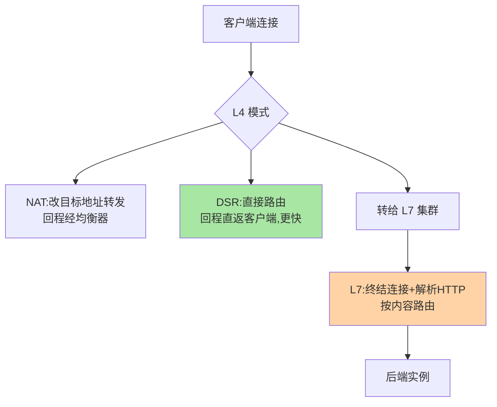
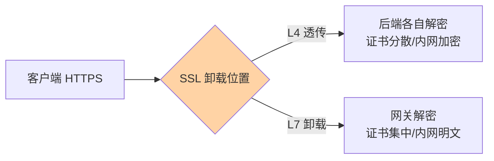

# 四层与七层负载均衡：L4 转发与 L7 内容路由

> 「四层」与「七层」是最容易混淆的一对：一个看 IP 端口转发数据包，一个解析 HTTP 按内容路由。这篇把两者的机制差异、性能差异与协作模式一次讲透。

> **本文核心**：L4 与 L7 的分野是「信息可见性」——L4 只见传输层（IP/端口/连接），L7 可见应用语义（URL/Header/Body）。**机制链**：请求到达 → L4：连接级/包级转发（NAT/DSR），极快 → L7：终结连接、解析内容、按语义路由 → 各自的会话保持与失败语义不同 → 生产架构 L4 在前扛量 + L7 在后路由。

## 一句话摘要

**L4 负载均衡**工作在传输层：只做「连接到哪台后端」的转发决策（NAT 改地址或 DSR 直接路由），不解析应用内容——性能极高（内核态、可硬件加速），适合 TCP 长连接与超大流量入口。**L7 负载均衡**工作在应用层：终结客户端连接、解析 HTTP、按 URL/Header/Cookie 路由——能力丰富（内容路由、会话保持、重写、压缩），代价是应用层解析开销。**两者是协作不是竞争**：L4 在最外层扛洪峰、L7 集群在后做智能分发，是大型入口的标准分层。

## 一、为什么分四层七层

「层」来自 OSI 模型，但工程含义只有一条：**转发决策能看到什么信息**。L4 的决策输入只有「连接五元组」——信息少所以快；L7 能看到完整应用报文——信息多所以能「按内容办事」。**这层差异决定了两者的分工边界**：需要「看得懂」才能做的分发（按路径、按用户、按业务头）只能 L7；只需要「转发得快」的场景（TCP 直通、大流量入口）L4 更优。

## 5W 速记卡

| 维度 | 一句话 |
|---|---|
| What | 传输层转发（L4）与应用层路由（L7）两类均衡 |
| Why | 信息可见性差异决定两者能力与性能的分野 |
| When | 入口架构分层设计、长连接与 HTTP 场景选型 |
| Where | LVS/云 NLB（L4）、Nginx/网关（L7） |
| How | L4 NAT/DSR 转发；L7 终结连接解析内容；生产分层协作 |

## 二、机制对比与协作架构

| 维度 | L4 | L7 |
|---|---|---|
| 决策信息 | 五元组 | 应用报文全量 |
| 性能 | 极高（包级/连接级） | 高（解析开销） |
| 内容路由 | 不可 | ✅ |
| 会话保持 | 连接粘滞 | Cookie/Header 粘滞 |
| 后端可见性 | 看不到客户端真实 IP（NAT 需透传） | 可透传 X-Forwarded-For |
| 典型代表 | LVS/云 NLB/F5 | Nginx/HAProxy/网关 |

**DSR 与 NAT 的取舍**值得记住：NAT 改写地址（回程走均衡器，简单但均衡器是带宽瓶颈）；DSR 只改 MAC（回程直返客户端，均衡器省带宽但后端配置复杂）——大流量入口的 L4 多选 DSR 类模式。

## 三、生产分层的流量路径：

大型入口的通用骨架（篇 2 已画分层图）：公网流量先进 L4 集群（SYN 洪峰、长连接都由它扛），L4 把连接分发给后端 L7 集群，L7 按 URL/业务头路由到服务集群。**分层的本质是把「快」与「智能」解耦**——L4 扩容便宜（无状态转发）、L7 扩容按解析容量规划；任何一层出问题另一层仍能提供基础能力（L7 挂了 L4 直通降级、L4 挂了多 L7 入口兜底）。

## 四、与网关的区别：能力重叠的边界

L7 负载均衡器（Nginx）与 API 网关的能力高度重叠（路由/会话/限流都能做）——**边界在治理定位**：Nginx 类是「流量转发优先」（转发做得极致、治理靠模块），网关是「治理优先」（限流鉴权可观测是一等公民，转发是基础）；大型体系两者并用（Nginx 做接入层、网关做治理层），小体系合二为一（互指 gateway 系列）。

## 五、典型场景与误区

**典型场景**：WebSocket/长连接入口（L4 直通避免 L7 反复解析）、 HTTPS 入口（SSL 卸载位置的取舍——L4 透传加密流 vs L7 卸载后明文内网）、多租户按域名路由（L7 Server Name 分发）。

SSL 卸载的位置取舍（安全评审项）：

**误区与不适用**：① L4 看不到真实客户端 IP 是机制必然——需要真实 IP 时选 L7 或Proxy Protocol 透传；② L7 性能不足就全换 L4——L7 的解析开销是「智能」的成本，正确解法是横向扩 L7 集群；③ SSL 卸载位置随意——L4 透传则后端各自管理证书（加密内网传输），L7 卸载则内网明文（安全域要评估），是安全与性能的权衡不是技术优劣。

## 六、💡 实战提示

- 💡 入口分层口诀：洪峰给 L4、语义给 L7、内部直连走客户端
- 💡 L4 的 DSR/NAT 模式决定回程拓扑，部署前画清流量路径
- 💡 SSL 卸载位置是安全评审项，不是运维随手配置

## 七、你们可能会问

**Q1：K8s 里 L4/L7 分别是什么？**
Service（kube-proxy，L4 转发）与 Ingress/Gateway API（L7 路由）——平台把两层位置做成了两种资源类型，选资源即选层。

**Q2：长连接场景为什么 L4 更合适？**
L4 只在连接建立时做一次转发决策，连接存续期零解析开销；L7 对每个请求都要解析——长连接高频小包场景 L4 的效率优势被放大。

**Q3：L4 能做健康检查吗？**
能做连接级探测（TCP 端口通），但探不出「端口通业务死」——L4 的健康语义天然浅，深度健康要 L7 或应用层补（互指 service-discovery 篇 5）。

## 八、开放问题

- QUIC/HTTP3 把传输层搬到 UDP 之上，「L4/L7 的边界」在 QUIC 网关场景被重新定义（连接迁移、0-RTT），均衡器的分层适配是活跃演进区。

## 九、自测三问

1. L4 与 L7 的决策信息差异是什么？各自的性能与能力代价？
2. NAT 与 DSR 的取舍是什么？
3. 「L4 扛量 + L7 智能」分层为什么能解耦扩容？

下一篇讲「负载均衡策略选型」：全系列策略的位置-策略联合决策。

## 📎 核心带走

- **核心一句话**：L4 看五元组转发（极快），L7 解析内容路由（智能），生产分层协作
- **机制链**：请求 → L4（NAT/DSR 转发/转给 L7）→ L7（终结+解析+内容路由）→ 后端实例
- **失效点/边界**：L4 健康语义浅、看不到真实 IP；L7 解析有开销——按需分层不硬扛

## 📌 数据与事实声明

- 写于 2026-09-08，L4 转发模式（NAT/DSR）为 LVS/云 LB 公开口径
- QUIC 影响为演进观察口径
- 免责：以各实现官方文档为准

## 📚 参考资料

| 类型 | 标题 | 来源 |
|---|---|---|
| 官方文档 | LVS / Nginx / K8s Service 文档 | 各官方站点 |
| 关联系列 | 本仓库 gateway 系列 / K8s 系列 | docs/ |
| 社区沉淀 | 四层七层均衡公开对比文章 | 技术社区公开文章 |
