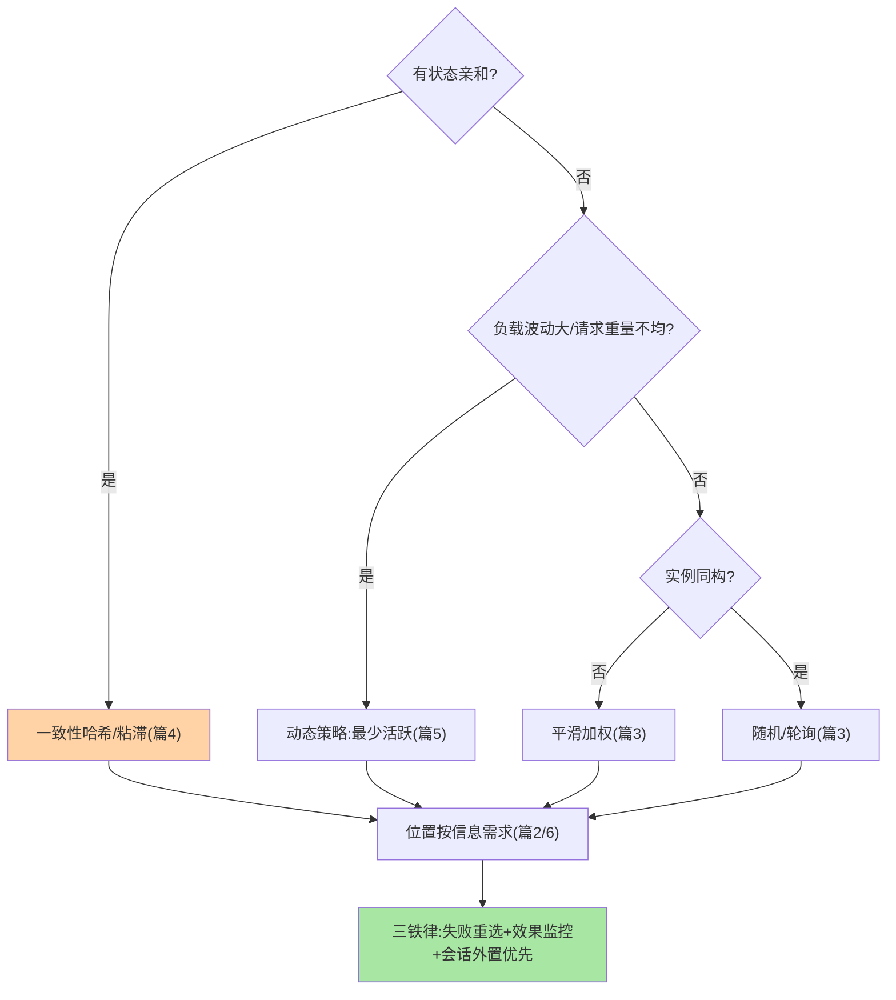
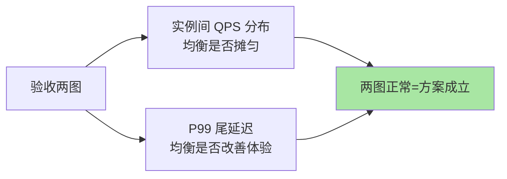

# 负载均衡策略选型：位置、策略与会话的联合决策

> 全系列收束篇：负载均衡的选型不是「挑一个策略」，是**位置 × 策略 × 会话语义 × 失败处理**的联合决策。这篇给一棵可走的决策树与一张对照清单。

> **本文核心**：选型四问定方案——**① 有状态亲和吗**（哈希族 vs 静态/动态）、**② 负载波动大吗**（动态 vs 静态）、**③ 要看内容吗**（L7 vs L4）、**④ 失败怎么兜**（重选/重试/熔断联动）。**机制链**：业务语义问答 → 位置与策略候选集 → 会话保持方案 → 失败兜底闭环 → 监控验收（流量分布 + P99）。

## 一句话摘要

决策树主干：**有状态亲和？** → 是：一致性哈希/粘滞（篇 4）；否 → **负载波动大或请求重量不均？** → 是：动态策略（最少活跃，篇 5）；否 → **实例同构吗？** → 否：平滑加权；是：随机/轮询（篇 3）。**位置**按信息需求定（篇 2/6）。三条铁律贯穿：**均衡必配失败重选**、**效果必须监控**（实例间流量分布 + 尾延迟）、**会话优先外置**（无状态化治本，粘滞治标）。

## 一、为什么选型要「联合决策」

单看策略表的选型事故：选了最少活跃却没关客户端缓存（旧列表喂动态策略）、配了哈希粘滞却忘了扩容重映射告警、随机策略没有失败重选（选中挂实例直接报错）——**策略只是方案的一角**，位置、会话、失败兜底、监控验收是完整的四件套。选型会的正确产出是「方案表」不是「策略名」。

## 5W 速记卡

| 维度 | 一句话 |
|---|---|
| What | 位置 × 策略 × 会话 × 失败兜底的联合选型框架 |
| Why | 单看策略表的选型必然漏配 |
| When | 新服务流量入口设计、均衡策略治理评审 |
| Where | 架构评审 + 均衡配置 |
| How | 决策树四问 + 三铁律 + 监控验收 |

## 二、决策树与三铁律

**三铁律**展开：① **失败重选**——任何策略选中的实例失败后要有「换一个重试」的兜底（与容错系列的超时重试联动，互指 cluster-fault-tolerance）；② **效果监控**——实例间 QPS 分布（均衡是否摊匀）+ P99（均衡是否改善尾延迟）两张图进大盘；③ **会话外置优先**——会话进 Redis 使实例无状态化（治本），粘滞策略只做过渡（治标）。

## 三、常见场景的推荐组合

| 场景 | 推荐组合 | 一句话理由 |
|---|---|---|
| 无状态 HTTP 服务 | L7 网关 + 随机/轮询 + 失败重选 | 最简有效 |
| 异构机器混合 | 客户端/网关 + 平滑加权 | 权重表达能力差 |
| AI 推理/长请求 | 客户端 + 最少活跃 | 慢请求自适应 |
| 本地缓存命中敏感 | 客户端 + 一致性哈希 | 亲和最大化 |
| 大流量公网入口 | L4 + L7 分层 + 后端多策略 | 分层扛量加智能 |
| 会话强依赖（过渡期） | L7 + Cookie 粘滞 | 过渡方案，规划外置 |

## 四、与网关策略配置的区别：网关对照

| 维度 | 客户端均衡选型 | 网关均衡选型 |
|---|---|---|
| 策略集 | 框架内置（Dubbo/Ribbon 族） | 网关模块（Nginx/Envoy 族） |
| 生效范围 | 单应用 | 全局入口 |
| 变更方式 | 发版 | 配置热更 |

**同策略不同生效面**——客户端策略随应用发版演进（版本碎片化），网关策略集中热更（一致性快）；混合体系的策略治理要明确「哪类流量归谁管」。

方案验收靠两张图闭环：

## 五、典型场景与误区

**典型场景**：新服务上线（按决策树五分钟出方案）、均衡问题排查（两张监控图定位「摊不匀」还是「尾延迟高」）、大促前策略评审（动态策略 + 摘除联动 + 限流配合的全链路核对）。

**误区与不适用**：① 策略选型追求「最先进」——动态策略的采集开销与震荡风险在平稳场景是负资产；② 粘滞当长期方案——会话外置才是终局，粘滞只买迁移时间；③ 选完不管监控——没有流量分布图的均衡策略等于闭眼分发。

## 六、💡 实战提示

- 💡 决策树五分钟走完，三铁律配置半天——方案完整度差在这半天
- 💡 换策略前先看两张图（流量分布 + P99），换后再看——有对比才有结论
- 💡 均衡策略进服务治理规范：默认项 + 升级条件写清楚，避免每个团队拍脑袋

## 七、你们可能会问

**Q1：多种流量形态混合（长短请求都有）怎么选？**
按主流量形态定主策略、辅策略兜底：长请求占比高选最少活跃为主；再按接口维度拆分策略（网关按路由配置不同 upstream 策略）——「一服务一策略」不必教条。

**Q2：策略能不能自动切换？**
「静态起步 + 波动检测升级动态」的自适应形态在演进（本系列篇 3 的开放问题）——当前生产仍以人工评审切换为主，自动化作为观察项。

**Q3：选型和容错、限流怎么联动？**
调用链三层串联：路由筛候选（若有）→ 均衡选实例 → 失败走容错（重试换实例）→ 实例级过载走限流熔断（互指 cluster-fault-tolerance 与 stability）——选型评审要把四者放一张图上看。

## 八、开放问题

- 策略选型本身的 Trade-off 值得显式记录：动态策略的实时收益与采集代价、哈希亲和的收益与倾斜代价——选型文档把「正反两面」写全，后人复用时才有判断依据。

- 策略配置的「意图化」（声明 SLO 由系统反推策略）是均衡治理的下一步形态，当前「策略名 + 参数」仍需专家经验。
- 多集群/多云的跨集群均衡（流量全局最优分配）方案碎片化，跨厂商标准尚未形成。

## 九、自测三问

1. 决策树四问是什么？三铁律是什么？
2. 六个场景的推荐组合能复述几个？
3. 「选型的输出是方案表不是策略名」包含哪四件？

## 📎 核心带走

- **核心一句话**：均衡选型 = 位置 × 策略 × 会话 × 失败兜底的联合决策，决策树四问 + 三铁律输出完整方案
- **机制链**：业务语义问答 → 策略候选 → 位置匹配 → 会话与失败兜底 → 监控验收闭环
- **失效点/边界**：决策树给起点不给终点——最终方案按监控数据迭代；会话外置是终局，粘滞是过渡

## 📌 数据与事实声明

- 写于 2026-09-08，决策框架为业界选型实践的归纳
- 推荐组合为经验口径，按负载实测校准
- 免责：具体决策按组织现状评审

## 📚 参考资料

| 类型 | 标题 | 来源 |
|---|---|---|
| 关联系列 | 本系列篇 2-6 / cluster-fault-tolerance / stability 系列 | docs/architecture/service-governance/ |
| 实战书 | 《高性能 MySQL》等体系化选型方法参照 | 公开出版 |
| 社区沉淀 | 负载均衡选型公开实践 | 技术社区公开文章 |
