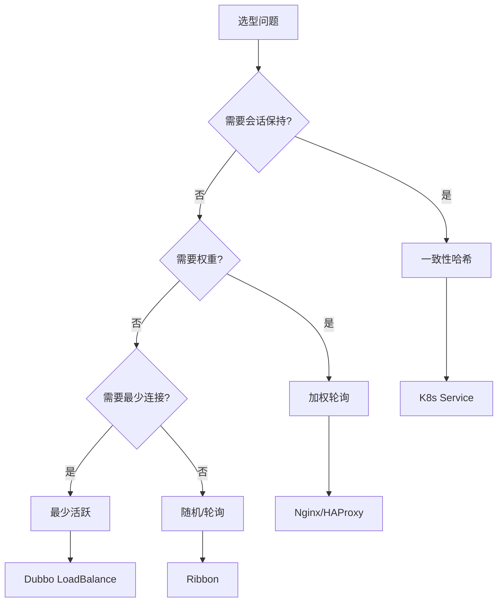
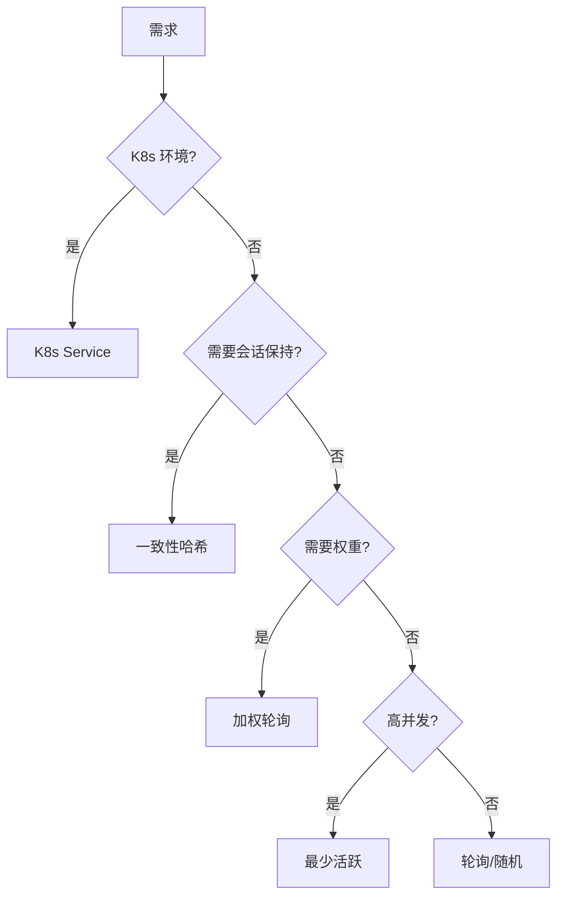

# 负载均衡选型全景与决策

## 一句话摘要

负载均衡选型 = **场景 × 量级 × 治理需求**。本文给出选型全景图 + 决策树。

## 全景图

## 选型矩阵

| 维度 | 轮询 | 加权轮询 | 最少活跃 | 一致性哈希 |
|---|---|---|---|---|
| 均匀度 | 中 | 高 | 高 | 中 |
| 性能 | 高 | 高 | 中 | 中 |
| 会话保持 | 无 | 无 | 无 | 有 |
| 权重支持 | 无 | 有 | 无 | 无 |
| 适用场景 | 无状态 | 异构 | 高并发 | 有状态 |

## 架构选型

### Nginx
- 场景：反向代理 + 负载均衡
- 优势：性能强，配置灵活
- 劣势：不支持会话保持

### HAProxy
- 场景：高可用负载均衡
- 优势：健康检查强
- 劣势：配置复杂

### K8s Service
- 场景：K8s 内服务发现
- 优势：自动发现
- 劣势：不支持会话保持

### Dubbo LoadBalance
- 场景：Dubbo 生态
- 优势：与 Dubbo 集成
- 劣势：Dubbo 绑定

## 决策树

## 踩坑记录

1. **Nginx 无会话保持**：需要一致性哈希
2. **HAProxy 配置复杂**：学习曲线陡峭
3. **K8s Service 不支持会话保持**：需要 Sidecar
4. **Dubbo 绑定**：切换成本高

## 量级考量

| 量级 | 负载均衡方案 |
|---|---|
| < 10 实例 | 轮询/随机 |
| 10-100 实例 | 一致性哈希 |
| > 100 实例 | 加权 + 一致性哈希 |

## 📌 数据与事实声明

- 选型矩阵基于负载均衡算法特性
- 踩坑来自生产环境经验
