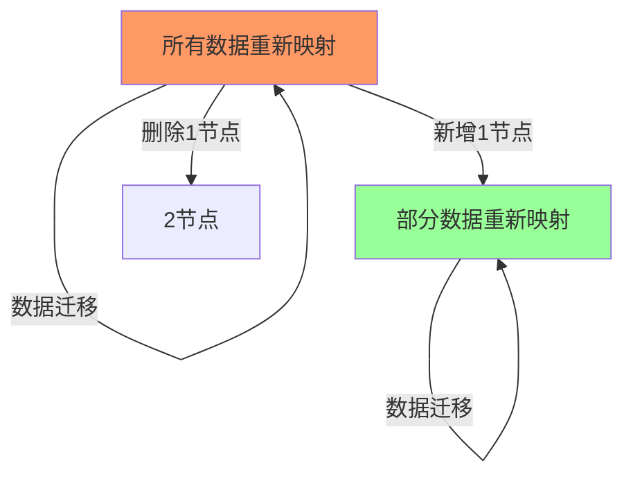
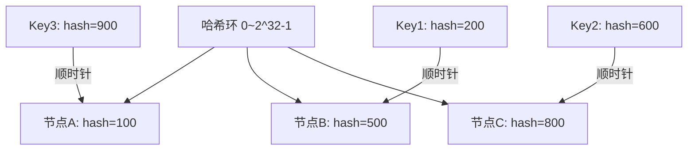
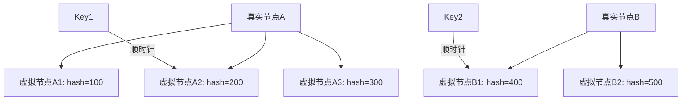

# 一致性哈希算法深度解析

> **一句话摘要**：一致性哈希 = 哈希环 + 虚拟节点——解决传统哈希的扩容问题，节点增减只影响部分数据。
> **本文核心**：**一致性哈希 = 环形结构 + 虚拟节点映射**。

前置阅读：[负载均衡策略](../入门层/从零开始认识负载均衡系列/3_随机轮询与加权-入门.md)。本篇深入一致性哈希的实现。

## 1. 背景：为什么需要一致性哈希

传统哈希的问题：节点增减时大量数据重新映射：



一致性哈希解决：**节点增减只影响相邻的少量数据**。

## 2. 核心机制：哈希环

### 2.1 哈希环结构



**哈希环规则**：
- 节点和 Key 都映射到环上
- Key 顺时针找到第一个节点
- 节点增减只影响相邻区间

### 2.2 虚拟节点

真实节点太少会导致数据倾斜——引入虚拟节点：



**虚拟节点的作用**：
- 均衡数据分布
- 解决节点倾斜
- 每个真实节点有多个虚拟节点

## 3. 落地实践：算法实现

### 3.1 Java 实现

```java
// 一致性哈希实现
public class ConsistentHash<T> {
    private final TreeMap<Long, T> circle = new TreeMap<>();
    private final int virtualNodes;
    private final HashFunction hashFunction;
    
    public ConsistentHash(int virtualNodes, HashFunction hashFunction) {
        this.virtualNodes = virtualNodes;
        this.hashFunction = hashFunction;
    }
    
    public void add(T node) {
        for (int i = 0; i < virtualNodes; i++) {
            long hash = hashFunction.hash(node + "#" + i);
            circle.put(hash, node);
        }
    }
    
    public T get(String key) {
        if (circle.isEmpty()) return null;
        
        long hash = hashFunction.hash(key);
        Long nodeHash = circle.ceilingKey(hash);
        if (nodeHash == null) {
            nodeHash = circle.firstKey(); // 环形回到起点
        }
        return circle.get(nodeHash);
    }
    
    public void remove(T node) {
        for (int i = 0; i < virtualNodes; i++) {
            circle.remove(hashFunction.hash(node + "#" + i));
        }
    }
}
```

### 3.2 虚拟节点数选择

| 虚拟节点数 | 均衡度 | 内存 | 适用场景 |
|---|---|---|---|
| 100 | 低 | 低 | 小规模 |
| 1000 | 中 | 中 | 中规模 |
| 10000 | 高 | 高 | 大规模 |

## 4. 落地实践：负载均衡应用

### 4.1 Dubbo 一致性哈希

```java
// Dubbo 一致性哈希负载均衡
@LoadBalance(group = "consistentHash")
public class ConsistentHashLoadBalance extends AbstractLoadBalance {
    @Override
    protected String doSelect(List<Invoker> invokers, URL url, Invocation invocation) {
        // 基于参数做一致性哈希
        String key = invocation.getArguments()[0].toString();
        return selectByKey(invokers, key);
    }
}
```

### 4.2 缓存一致性哈希

```java
// 缓存一致性哈希
ConsistentHash<CacheNode> hash = new ConsistentHash<>(1000, md5Hash);
hash.add(cacheNode1);
hash.add(cacheNode2);
hash.add(cacheNode3);

// 获取缓存节点
CacheNode node = hash.get(key);
```

## 5. 生产视角：一致性哈希踩坑

- **踩坑 1**：虚拟节点太少——数据倾斜
- **踩坑 2**：哈希函数选择不当——分布不均匀
- **踩坑 3**：节点变更未平滑——大量数据迁移
- **踩坑 4**：哈希环过大——内存溢出

**生产最佳实践**：

1. 虚拟节点数 = 100-10000
2. 选择好的哈希函数（MurmurHash）
3. 节点变更时平滑迁移
4. 监控数据分布
5. 定期调整虚拟节点数

## 6. 典型场景

| 场景 | 方案 | 理由 |
|---|---|---|
| 缓存 | 一致性哈希 | 节点增减只影响部分缓存 |
| 数据库分库 | 一致性哈希 | 均衡数据分布 |
| 消息队列 | 一致性哈希 | 均衡消息分布 |
| 负载均衡 | 一致性哈希 | 均衡请求 |
| 分布式存储 | 一致性哈希 | 均衡存储 |

## 7. 与相邻概念的区别

- **一致性哈希 vs 传统哈希**：一致性哈希只影响相邻区间
- **一致性哈希 vs 随机**：一致性哈希有状态，随机无状态
- **一致性哈希 vs 轮询**：一致性哈希考虑节点权重
- **一致性哈希 vs 最少活跃**：一致性哈希基于哈希，最少活跃基于实时状态

## 8. 你们可能会问

- **一致性哈希能保证绝对均衡吗？** 不能——虚拟节点越多越均衡
- **哈希函数怎么选？** MurmurHash/MD5
- **虚拟节点数多少合适？** 100-10000，根据场景调整
- **一致性哈希和轮询能结合吗？** 能——轮询选节点，一致性哈希定具体实例

## 9. 一句话总结 + 5W 速记卡 + 自测三问

**一句话总结**：一致性哈希 = 哈希环 + 虚拟节点——节点增减只影响相邻数据。

**5W 速记卡**：

| 维度 | 内容 |
|---|---|
| What | 哈希环 + 虚拟节点 |
| Why | 解决传统哈希的扩容问题 |
| When | 负载均衡/缓存分片 |
| Where | 所有分布式系统 |
| How | 哈希环 + 虚拟节点映射 |

**自测三问**：

1. 你的虚拟节点数是多少？为什么？
2. 节点增减时数据迁移多少？
3. 哈希函数选择是什么？

---

**特性层完结**：一致性哈希算法深度解析已建立。

**🎯 核心带走**：

- **核心一句话**：一致性哈希 = 哈希环 + 虚拟节点——节点增减只影响相邻数据
- **链条复述**：哈希环 → 虚拟节点 → 顺时针查找 → 定位节点
- **失效点与边界**：虚拟节点太少导致倾斜

💡 **实战提示**：虚拟节点 1000-10000 个 = 均衡且不过多内存开销。

**开放问题**：一致性哈希能用于数据库分片吗？答案是：能——MySQL 分库分表常用一致性哈希。

**决策（何时用）**：缓存/分布式存储用一致性哈希；简单场景用轮询/随机。
