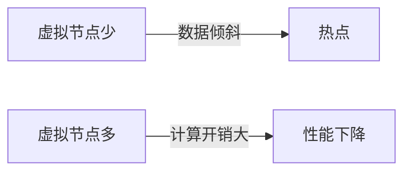
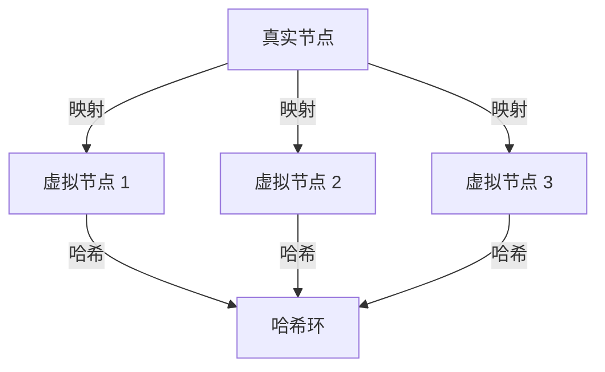
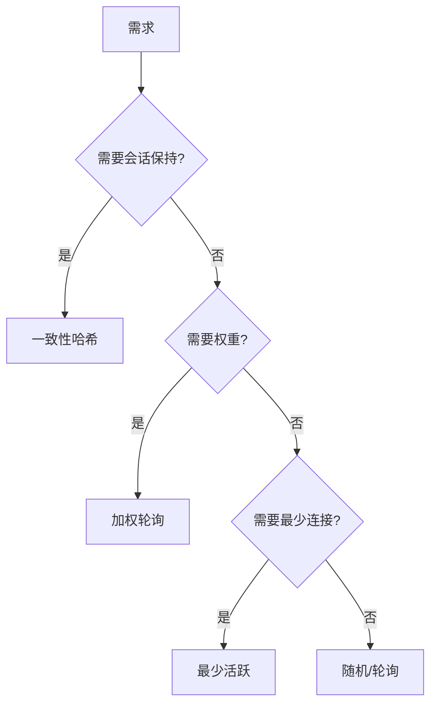

# 一致性哈希进阶：虚拟节点优化 + 负载均衡选型决策树

## 一句话摘要

一致性哈希的虚拟节点数是关键参数——太少数据倾斜，太多计算开销。本篇讲透虚拟节点优化 + 负载均衡选型决策树。

## 虚拟节点优化

### 问题

虚拟节点数 = 数据均匀度 vs 计算开销

### 优化策略

| 虚拟节点数 | 数据倾斜 | 计算开销 | 适用场景 |
|---|---|---|---|
| 10-50 | 高 | 低 | 小规模集群 |
| 50-100 | 中 | 中 | 中规模集群 |
| 100-500 | 低 | 高 | 大规模集群 |
| 500+ | 极低 | 极高 | 超大规模 |

### 虚拟节点映射

## 负载均衡选型决策树

## 各场景推荐

| 场景 | 负载均衡策略 | 理由 |
|---|---|---|
| 无状态服务 | 轮询 | 简单公平 |
| 有状态服务 | 一致性哈希 | 会话保持 |
| 异构服务 | 加权轮询 | 按能力分配 |
| 高并发服务 | 最少活跃 | 避免热点 |

## 一致性哈希生产踩坑

1. **虚拟节点数不当**：太少数据倾斜，太多计算开销
2. **哈希函数选择**：MD5/SHA1 性能差，MurmurHash 性能好
3. **节点失效**：节点宕机，流量集中到相邻节点
4. **扩容迁移**：扩容时数据迁移量大

## 负载均衡算法对比

| 算法 | 均匀度 | 性能 | 会话保持 | 适用场景 |
|---|---|---|---|---|
| 轮询 | 中 | 高 | 无 | 无状态服务 |
| 加权轮询 | 高 | 高 | 无 | 异构服务 |
| 最少活跃 | 高 | 中 | 无 | 高并发服务 |
| 一致性哈希 | 中 | 中 | 有 | 有状态服务 |
| 随机 | 低 | 高 | 无 | 小规模集群 |

## 量级考量

| 量级 | 负载均衡方案 |
|---|---|
| < 10 实例 | 轮询/随机 |
| 10-100 实例 | 一致性哈希 |
| > 100 实例 | 加权 + 一致性哈希 |

## 📌 数据与事实声明

- 虚拟节点数基于一致性哈希理论
- 踩坑来自生产环境经验
