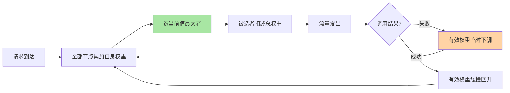
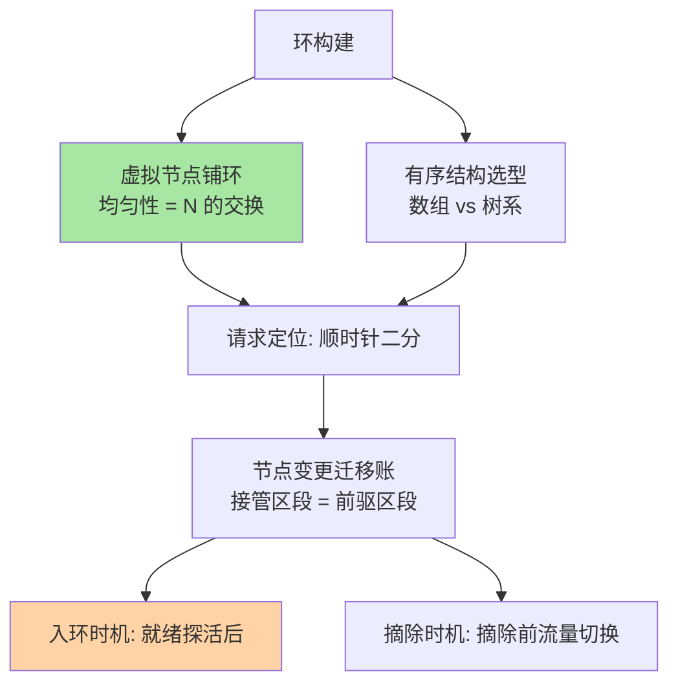
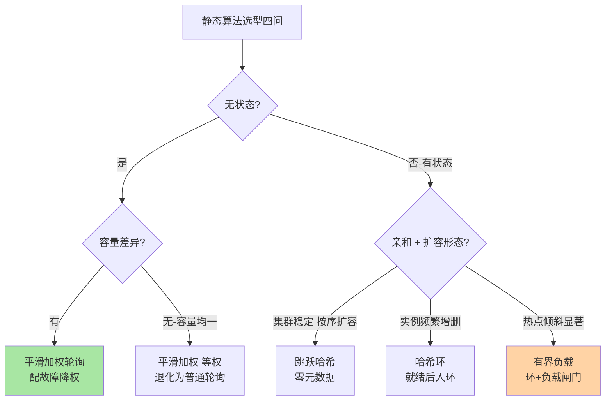

# 平滑加权与一致性哈希实现深读：从算法公式到工程账本

> **本文核心**：静态负载均衡算法的原理一页纸就讲完，**实现级的账要厚得多**——本文把两大主力算法拆到工程账本层：**平滑加权轮询**（总权重守恒的调度序列生成：每轮给所有节点累加自身权重、选当前最大者、再减去总权重，关键路径是「累加-比较-回扣」三步，它的平滑性来自总权重回扣的守恒设计）与**一致性哈希的工程形态**（哈希环从理论到生产要付的三笔账：环的存储与查找复杂度、虚拟节点的数量与哈希质量、节点变更时的迁移语义——以及两条重要的工程变体：跳跃哈希的无环实现、有界负载对环的均匀性修正）。**机制链**：权重语义定义 → 平滑序列生成（累加/选择/回扣）→ 变更时的序列扰动 → 哈希环构建（虚拟节点铺环）→ 请求定位（有序查找）→ 迁移账核算 → 工程变体选型（跳跃哈希/有界负载）。

## 一句话摘要

「会用算法」与「会算算法的账」之间隔着一层工程纸：平滑加权轮询的平滑性不是直觉而是**总权重守恒的数学性质**——不守恒的加权实现（如朴素比例轮询）会在小权重节点上产生周期性集中，实例数一多波动就被放大；一致性哈希的「少迁移」也不是免费的——**环的均匀性靠虚拟节点数量堆出来，查找的效率靠有序结构买出来，两者都是随实例数线性增长的资源账**。本文的立场：静态算法的选型争议不大（平滑加权覆盖绝大多数无状态场景、一致性哈希覆盖有状态路由场景），真正的工程分歧在**实现细节与参数**——本文把这些细节摊开到可核算的层面。

## 前置阅读

- 入门层篇 3《随机轮询与加权》、篇 4《一致性哈希》（算法族的直觉底盘）
- 本仓库一致性哈希系列《一致性哈希算法深度解析》《虚拟节点优化与选型决策》（环与虚拟节点的原理级解析——本文在其上补实现账本，两篇角度互补不重复）
- RPC 入门层篇 7《负载均衡策略》（客户端负载均衡在调用链里的位置）

## 目标导向

本文是什么：平滑加权与一致性哈希从算法公式到工程实现的机制深读。功能：实现或评审负载均衡策略代码、核算虚拟节点与内存账、定位调度不均类问题。收益：从「背公式」到「能算实现账、能从现象反推实现缺陷」的工程判断力。必看场景：RPC 框架策略选型实现、网关 upstream 策略评审、有状态服务（缓存/分片）路由实现、调度不均问题排查。

## 一、权重语义：一切加权算法的定义起点

谈实现前先把「权重」的语义钉死——三种常见语义混用是调度不均问题的第一来源：**容量语义**（权重=实例处理能力比，8C16M 机器对 4C8M 机器配 2:1）、**流量语义**（权重=期望分到的流量比，灰度场景新实例配小权重）、**相位语义**（权重=启动阶段的临时值，预热期从零爬坡到目标值）。同一个实现里三种语义经常同时在场（生产实践常态：新发布实例的预热权重叠加在容量权重上），实现的职责是把它们解耦——**基础权重（容量）与动态修正（预热/灰度）分层，调度时合成有效权重**。语义不分层是实现里最常见的坏味道：预热逻辑直接改写基础权重，发布回滚后权重回不到原值，流量比从此漂移——这类「权重漂移」问题的根源都在实现分层，不在算法本身。

## 5W 速记卡

| 维度 | 一句话 |
|---|---|
| What | 平滑加权轮询的序列生成机制、一致性哈希的工程实现账与变体 |
| Why | 静态算法选型分歧小，工程分歧在实现细节——平滑性来源、环的均匀性与查找成本、迁移语义 |
| When | 策略代码实现/评审、调度不均排查、有状态路由与缓存分片实现 |
| Where | 客户端负载均衡器与网关 upstream 的策略模块 |
| How | 权重分层 → 累加/选择/回扣 → 铺环与定位 → 迁移核算 → 变体选型 |

## 二、平滑加权轮询：守恒性是平滑的来源

朴素加权轮询（按权重比例生成静态序列，如 5:1:1 重复展开成 aaaabbc）的问题在**序列周期内调度集中**——权重大的节点连续吃流量，瞬时压力形态是脉冲而不是均匀流。平滑加权的解法是**把「总量按比例」推迟到「每轮局部公平」来实现**：

```text
平滑加权轮询关键路径(每来一个请求执行一次):
  1. 累加: 所有节点 current_weight += effective_weight
  2. 选择: 取 current_weight 最大的节点承接本次请求
  3. 回扣: 被选节点 current_weight -= total_weight
  不变量: 任意时刻所有节点 current_weight 之和恒为 0(守恒)
```

守恒不变量是整套算法的魂：每轮累加注入的权重总量等于总权重，回扣又抽走总权重——**总和守恒意味着没有节点的当前值可以无界增长，权重大者先被选中、选后立刻回落，调度序列在宏观上精确按权重比例分布、在微观上被最大值竞争自动打散**。源码级看（以网关与 RPC 框架的通用实现为参照，公开口径），关键路径只有三次遍历（累加、找最大、回扣可合并为两次），复杂度与节点数线性——**百级实例时这笔 O(N) 每请求开销可忽略；实现优化点不在复杂度而在故障降权**：调用失败时把 effective_weight 临时下调（成功后缓慢恢复），让权重语义与实例健康度联动——这是静态算法获得动态能力的最小切口，也是本系列篇 2 自适应策略的入门形态。



**变更时的扰动**是平滑加权少被讨论的半页：节点上下线瞬间，总权重变化使回扣量变化，调度序列整体重排——扩容后头几个请求的落点与直觉不符（新节点未必立即被选中），这不是 bug 而是守恒系统重寻秩的过渡态。治理口径：**发布窗口的「首请求落点」不作为正确性判据**，判据是窗口期后（若干个调度周期）的流量比是否回归权重比。

## 三、一致性哈希的工程账本：均匀性、查找与迁移

一致性哈希的原理（环+顺时针定位）在本仓库一致性哈希系列已有完整解析，这里只算**实现的三笔账**：

**账一：均匀性是买来的**。裸环的哈希分布天然不均（节点在环上的位置随机，负载倾斜系数可达数倍，公开论文口径），工程上靠虚拟节点摊平——每个物理节点铺 N 个虚拟点。N 是**均匀性与元数据体积的交换变量**：N 越大分布越平、环上的点越多（内存与查找成本同步上涨）；业内惯例的量级是每物理节点百到千级虚拟点（各实现参数不一，行业认知），且 N 应随集群规模反比调整（集群越大、单节点摊的环占比越小，N 可适当收小）。

**账二：查找是排序结构的成本**。请求定位=在环上找第一个 ≥ 请求哈希的虚拟点——有序结构的二分查找，复杂度对数级。实现选型在**有序数组（查找快、增删要搬移）与跳表/平衡树（增删快、常数大）之间**：实例集合频繁变更（发布常态）选树系，实例集合稳定且读极热选数组+惰性重建。**客户端负载均衡实现里环的副本常驻每个调用方进程**——实例数千级时每进程一份环的内存账（数千虚拟点 × 指针与元数据）要计入客户端内存预算，这是「服务端 LB vs 客户端 LB」之争中客户端路线的真实成本项。

**账三：迁移语义决定故障面**。节点加入时它顺时针接管前驱的区段（这是少迁移的来源），但**实现里「接管」的完成不是原子的**：新节点的数据/状态就绪、上游环的更新、各调用方视图收敛——三者在时间上不同步，窗口内会出现「请求落到新节点但其状态未就绪」。有状态场景（缓存路由）的对策是预热期双读（新旧节点都试）、无状态路由场景的对策是节点就绪探活后才入环——**「入环时机」是比「环算法」更高频的实现事故源**。



## 四、两条工程变体：跳跃哈希与有界负载

环不是一致性哈希的唯一实现。**跳跃哈希（jump consistent hash，公开论文）**用数论方法直接由「key+桶数」算出落点——零元数据（不需要存环）、内存 O(1)、迁移语义与环一致（加桶只移动 1/N 的 key）；代价是**只能按序号增删节点**（桶 0..n-1，不能摘中间节点再复用编号），且不支持带权。它的适用面因此清晰：**分片数稳定、纯按序扩容的存储分片场景**（缓存分片/数据库分库路由），RPC 的实例频繁上下线路由场景不适配。**有界负载一致性哈希（公开论文）**在环定位之上加一道负载闸门：目标桶负载超过「平均值 × 有界系数」时顺延下一个桶——用「迁移量略增」换「负载上界保证」，解决环的固有倾斜残差。它适合**实例容量不均或请求开销不均的场景**（热 key 显著的缓存路由）；代价是需要实时负载统计，从纯静态算法滑向负载感知——**这条滑梯的尽头就是本系列篇 2 的自适应负载均衡**，两个算法域在工程上本是连续谱。



四条路线的演进脉络也值得一记：从随机/轮询（无状态、无参数）到加权（引入容量语义）到平滑加权（守恒性修复脉冲）到一致性哈希（引入亲和语义）到有界负载（引入负载反馈）——**每一步演进都在为上一代补一个语义缺口**，选型时沿这条谱系按需取用即可，不必追新。

## 与「随机加权」的区别

| 维度 | 平滑加权轮询 | 随机加权（按权重概率直选） |
|---|---|---|
| 序列形态 | 确定性打散，宏观精确比例 | 统计意义上比例正确，小样本波动 |
| 小集群表现 | 序列平滑，瞬时压力均匀 | 样本少时倾斜肉眼可见 |
| 实现状态 | 需维护 current_weight 状态 | 无状态，实现最简 |
| 会话亲和 | 无（两轮同一请求可落不同节点） | 无 |

随机加权的无状态是它的工程美德（水平扩展的负载均衡器免共享状态），但在**低 QPS 场景它的统计波动暴露无遗**——样本量不足时比例语义失效，「为什么小流量系统总有人被集中打」的答案常在这里。低流量选平滑加权，是静态算法里最省钱的一条治理决策。

## 不同量级的思考：架构约束驱动解法

- **十万级 QPS、百级实例（常规微服务）**：约束来源是「每请求决策开销必须可忽略」——O(N) 的平滑加权每请求遍历在百级实例时纳秒到微秒级（量级估算，行业认知），不是瓶颈；思考方式是「监控驱动」——各实例流量比与权重比的两条曲线对齐即可，不漂移就不动实现。这一档的核心问题是「流量比和权重比对齐没有」，而不是「算法够不够高级」
- **百万级 QPS、千级实例（大流量入口）**：约束来源是每请求决策的常数项被放大——O(N) 遍历在千级实例叠加高 QPS 的 CPU 账变厚，客户端环的内存账同步显形；思考方式是「公式驱动」——决策开销 = QPS × 每请求成本，内存账 = 实例数 × 虚拟点数 × 元数据体积，两笔公式进容量评审。这一档的核心问题是「两笔公式算进容量评审没有」，而不是「换个更炫的算法」
- **千万级 QPS、万级实例（平台级入口）**：约束来源是「全量视图在每个决策点不可维护」——万级实例的全量列表与环在单进程里既占内存又拖变更收敛，决策必须分层（区域级/单元级先收敛、本地再细化）；思考方式是「节奏驱动」——视图变更的分批推送、环的惰性重建、发布错峰，变更节奏决定决策面稳不稳。这一档的核心问题是「变更节奏和视图分层对不对」，而不是「单点优化抠常数」
- **亿级 QPS、有状态分片（存储路由）**：约束来源是「迁移本身成为风险事件」——任何策略的变更都会触发数据/状态迁移，迁移速度受物理限制，策略设计从「怎么分」升级为「怎么迁移得平稳」；思考方式是「架构驱动」——分层路由（路由层与存储层解耦）+ 有界负载保证倾斜上界 + 迁移限速与双写窗口，策略退居其次、迁移工程成为主体。这一档的核心问题是「迁移工程的设计到位没有」，而不是「哈希函数选哪个」

思考方式总结：十万级靠「两条曲线对齐」，百万级靠「两笔公式入评审」，千万级靠「分层与节奏」，亿级靠「迁移架构」——约束来源从「单请求开销」逐档迁移到「变更收敛、视图分层、迁移物理限制」，思考方式必须跟着约束走。解法是思考的产物，不是数字的排列。

**自下而上与触发升级**：先测档位再选思考——实例数、QPS、虚拟点内存占用三个实测值决定你实际站在哪一档，不预支上一档的分层复杂度，也不滞留在下一档的侥幸里。触发升级的信号：决策 CPU 占比进入火焰图可见区间、实例变更收敛时间拖长发布节奏、出现热点倾斜且有界系数压不住——任一信号出现，思考方式必须随档升级（监控驱动→公式驱动→节奏驱动→架构驱动）。锚点始终是约束来源：决策开销与迁移限制这些物理层变了，解法才跟着变——业务翻倍只是信号，约束迁移才是升级的依据。

## 反方案：为什么不「按权重静态展开序列」？

有实现主张「平滑加权是过度设计——按权重比例静态展开成固定序列（aaab c aaab c）循环即可」——看似等效，实际三处塌方：**周期内脉冲**：序列头部的重负载节点连续承接，瞬时并发形态脉冲化，下游按瞬时容量配的线程池与连接池被脉冲打毛刺；**变更重排**：节点增删使静态序列整体重排，等价于一次全量流量重分布，比平滑加权的局部扰动剧烈；**与动态修正耦合差**：预热降权要重排静态序列，而平滑加权只需调 effective_weight，变更成本一个量级。静态展开唯一胜过平滑加权的点是无状态——把状态收敛到一个整数数组，正是它工程上划算的形态。

## 五、典型场景与误区

**典型场景**：RPC 客户端负载均衡策略实现（平滑加权+故障降权为默认底盘）；网关 upstream 策略（对外入口多配随机加权或平滑加权，按低流量波动风险定）；缓存/分片路由（一致性哈希环或跳跃哈希，按扩容形态定）；灰度流量切分（流量语义权重叠加在容量语义上，分层合成有效权重）。

**常见误区**：① **「权重配完就完事」**——权重语义不分层（容量/流量/相位混写一个字段），发布回滚后权重漂移；② **「虚拟节点越多越均匀越好」**——N 是内存与均匀性的交换变量，无脑调大吃的是每个调用方进程的内存；③ **「一致性哈希保证不迁移」**——它保证的是「少迁移」（1/N），节点就绪前入环照样把请求打到未就绪状态，入环时机比环算法更常出事故；④ **「随机算法最简单所以最稳」**——无状态的代价是低 QPS 下的统计波动，小流量系统集中打现象多半是它；⑤ **「算法正确=调度正确」**——守恒与均匀是数学性质，权重脏数据（配错/漂移/未更新）与节点状态不同步是工程事故的主要来源，算法审计之外必须有权重配置的审计链。

## 六、事故与实践叙事

**事故一：预热权重写穿了基础权重**。某团队的预热实现直接修改注册中心的实例权重（从 1 爬坡到目标值），一次发布中途回滚——爬坡线程被打断后权重停在中间值，实例恢复旧版本后流量比长期漂移，部分实例长期过载而另一些常年空闲，直到容量巡检报表异常才被发现（行业通病原型，数字为叙事设定量级）。复盘把权重实现重构为分层：基础权重随注册元数据静态下发，预热修正仅存在于客户端调度器的内存态（进程重启即归零），两层合成有效权重参与调度。**教训**：静态算法的实现事故九成在「状态的归属」——哪些权重是事实（静态下发）、哪些是临时态（内存修正），归属混乱则漂移必然发生。

**事故二：新节点未就绪先入环**。某缓存平台扩容，新节点进程一起就加入了哈希环（注册即入环），而本地缓存的预热加载需要分钟级——环上落向新节点的请求大量击穿到后端存储，存储层负载瞬间翻倍引发连锁超时（击穿传导，量级为行业认知）。整改引入「两段入环」：注册与入环分离，节点完成预热探活后才被路由视图收录，配合预热期双读。**教训**：有状态路由的入环时机必须与节点就绪语义绑定，「注册成功」不等于「可承接流量」。

**实践叙事：从流量比曲线反推实现缺陷**。某平台排查「部分实例持续过载」：权重配置完全一致但流量比长期偏离——把各实例被选中次数按时间窗展开成曲线，发现偏离呈周期性、周期恰好等于实例集合的变更频率。定位结论：实现里 current_weight 在实例列表变更时未做守恒重置，每次变更引入一次总量偏移，偏移累积表现为周期性倾斜。修复为变更时按守恒不变量重置调度状态后，流量比回归。**这个案例的方法论价值大于结论本身：调度不均的排查路径是「曲线展开→找周期→对齐实现状态机的变更点」，而不是调参试错**。

## 七、设计思想：确定性是负载均衡的隐形契约

把平滑加权与一致性哈希放在一起看，浮现一条共同的设计思想：**负载均衡不只是「分均匀」，还是在「不确定性流量」之上建立一份确定性契约**——平滑加权的确定性是「调度序列可复算」（给定权重与请求序，序列完全确定，故障可复现），一致性哈希的确定性是「同 key 同落点」（亲和性即确定性的业务表达）。确定性带来的工程红利贯穿运维全周期：可复现的调度让「这个请求为什么打到这台机器」永远有答案，灰度与回滚因此可控，缓存亲和因此可依赖。反过来，**破坏确定性的实现（并发下调度状态不加锁、遍历顺序依赖哈希桶序）破坏的不是均匀性而是这份契约**——「偶发打不均且不可复现」类问题的根源多在此。设计负载均衡实现时，先问「我的调度过程给定输入可复算吗」，再谈均匀性优化。

## 八、追问链

**质疑者第一层**：平滑加权每请求遍历所有节点，为什么不用优先队列/堆把「选最大」降到对数级？——堆把查询降到对数但把「批量累加」变成了批量更新（每轮所有节点的 current 都变，堆要批量 sift），总复杂度反升；真正省遍历的思路是惰性化（异步累加+近似选最大），但引入调度滞后与并发状态复杂度。**O(N) 的线性遍历在决策开销预算内是更简单且更快的选择**——先算账再优化，这是「关键路径上先量化再动手」的一例。

**质疑者第二层**：虚拟节点的哈希函数随便选吗——哈希质量差会怎样？——哈希质量差（分布偏斜/相关性）直接换算成环上点位聚集，均匀性投入的 N 个虚拟点被聚集吃掉大半；工程判据是虚拟点在环上的间距方差（公开论文给过通用哈希函数的分布参考），实现选型用标准字符串哈希并做位混淆即可，自研哈希的收益趋零而风险为正。**均匀性问题的优先级排序：哈希质量 > 虚拟点数量 > 环结构本身**。

**质疑者第三层**：QUIC/HTTP3 与服务网格时代，负载均衡会整体下沉到基础设施层吗——策略实现的这些账还有意义吗？——位置会迁移，账本会保留：网格把策略从 SDK 挪到 sidecar，决策面仍在每请求路径上，决策开销/视图收敛/迁移语义三笔账原样存在；新形态改变的只是账记在哪个进程里。**策略知识跨周期沉淀在机制层，实现载体三年一换**——这正是把账算透而不绑定框架的理由。

## 你们可能会问

**Q1：平滑加权的实现里，并发怎么处理？**
current_weight 数组是共享可变状态：单线程事件循环内天然串行（多数网关形态）；多线程调用方（SDK 形态）要对「累加-选择-回扣」整体加锁或改为原子分段——锁粒度到实例集合级即可，决策频度下锁开销可忽略；不要用「每线程独立调度器」绕锁，那会破坏全局比例语义。

**Q2：虚拟节点数怎么定一个初值？**
按「环上点位总数 = 实例数 × N，点位间距要足够细」反推：以千级实例、百级 N 为常见起点（行业认知），用实际实例名在目标哈希函数下跑一次间距方差验证；集群扩到万级实例时 N 可下调——点位总数维持在同一量级即可。

**Q3：怎么从现象判断该查算法还是该查权重数据？**
分叉判据：偏离**有周期/与变更事件对齐**→查实现状态机（变更时的守恒重置）；偏离**与实例清单稳定相关（固定几台倾斜）**→查权重数据与标签（配错/脏数据）；偏离**随机无规律**→查并发状态（调度状态竞争）。

**Q4：一致性哈希用在无状态服务上有什么坑？**
亲和性语义把无状态服务「有状态化」：实例摘除时其亲和流量整体重分布（1/N 的突增落在存活节点上），叠加发布窗口就是双倍抖动；无状态服务除非有会话/本地缓存亲和的明确收益，默认用平滑加权——**一致性哈希不是高级装饰，是亲和需求的代价兑现**。

## 💡 实战提示

- 💡 权重分层是第一实现纪律：基础权重（容量）静态下发、修正权重（预热/灰度）进程内存态，合成有效权重调度——归属混乱=漂移必然
- 💡 决策口径：无状态默认平滑加权（低流量避开随机加权的统计波动）；有状态亲和选环（就绪探活后才入环）；分片稳定扩容选跳跃哈希（零元数据）；热点倾斜选有界负载
- 💡 选型推荐：一致性哈希的均匀性投入优先级=哈希质量>虚拟点数量>环结构；虚拟点数以「点位总数恒定」随集群规模反比调节
- 💡 排查路径：调度不均先展开流量比曲线——有周期查变更状态机、固定倾斜查权重数据、无规律查并发状态；调参试错是最后手段

## 自测三问

1. 平滑加权轮询的关键路径与守恒不变量？（答：累加（全部节点加自身权重）→选择（取最大）→回扣（被选者减总权重）；不变量是所有节点当前值之和恒为零——守恒性即平滑性的数学来源）
2. 一致性哈希实现的三笔账？（答：均匀性账（虚拟点数量与哈希质量，分布靠 N 买）、查找账（有序结构二分+客户端内存副本）、迁移账（接管前驱区段非原子完成，入环时机要绑节点就绪））
3. 跳跃哈希与环各自适用面？（答：跳跃哈希零元数据但只能按序增删、不带权——适合分片稳定的存储路由；环支持任意增删与带权、需元数据——适合实例频繁变更的服务路由；有界负载在环上加负载闸门解决倾斜残差）

## 开放问题

- 有界负载的「有界系数」如何自适应：固定系数在负载形态漂移时要么过松要么过抖，与负载信号的自动联调尚无标准答案。
- 确定性调度的可验证性：给定权重与变更历史的调度序列复算工具（类似「调度回放」）在各实现中缺位，排障仍靠日志考古。

## 📎 核心带走

- **核心一句话**：静态负载均衡的工程分歧不在算法选型而在实现账本——平滑加权的平滑性来自守恒不变量、一致性哈希的均匀性靠虚拟点购买、迁移风险藏在入环时机里；权重分层与确定性契约是实现的两大纪律
- **机制链**：权重语义分层 → 累加/选择/回扣（守恒）→ 变更扰动过渡态 → 铺环（N 的交换）→ 有序定位 → 入环/摘除时机治理 → 变体选型（跳跃哈希/有界负载）→ 账本进容量评审
- **失效点/边界**：权重脏数据让任何算法失效；低 QPS 下随机加权统计波动失效；虚拟点哈希质量差吃掉均匀性投入；有状态路由未就绪入环引发击穿传导；确定性被并发状态竞争破坏后不可复现

## 📌 数据与事实声明

- 写于 2026-09-23，算法机制以平滑加权通用实现（公开网关文档口径）、一致性哈希与跳跃哈希公开论文为基准；复杂度与量级数字为估算（行业认知），以实测为准
- 免责：各框架/网关的默认策略实现细节以所用版本源码为准；事故叙事为行业通用模式的原型化脱敏重述，不指向任何真实公司

## 📚 参考资料

| 类型 | 标题 | 来源 |
|---|---|---|
| 原理论文 | Consistent Hashing and Random Trees（1997）/ A Fast Minimal Memory Consistent Hash Algorithm（jump hash） | 公开论文 |
| 官方文档 | 通用网关 upstream 与加权轮询文档（平滑加权公开口径） | nginx.org 等 |
| 关联文章 | 一致性哈希系列两篇（原理与选型）、入门层篇 3/4、本系列篇 2 自适应负载均衡 | 本仓库 |
