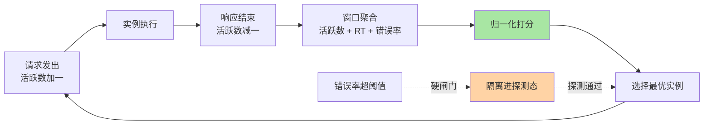
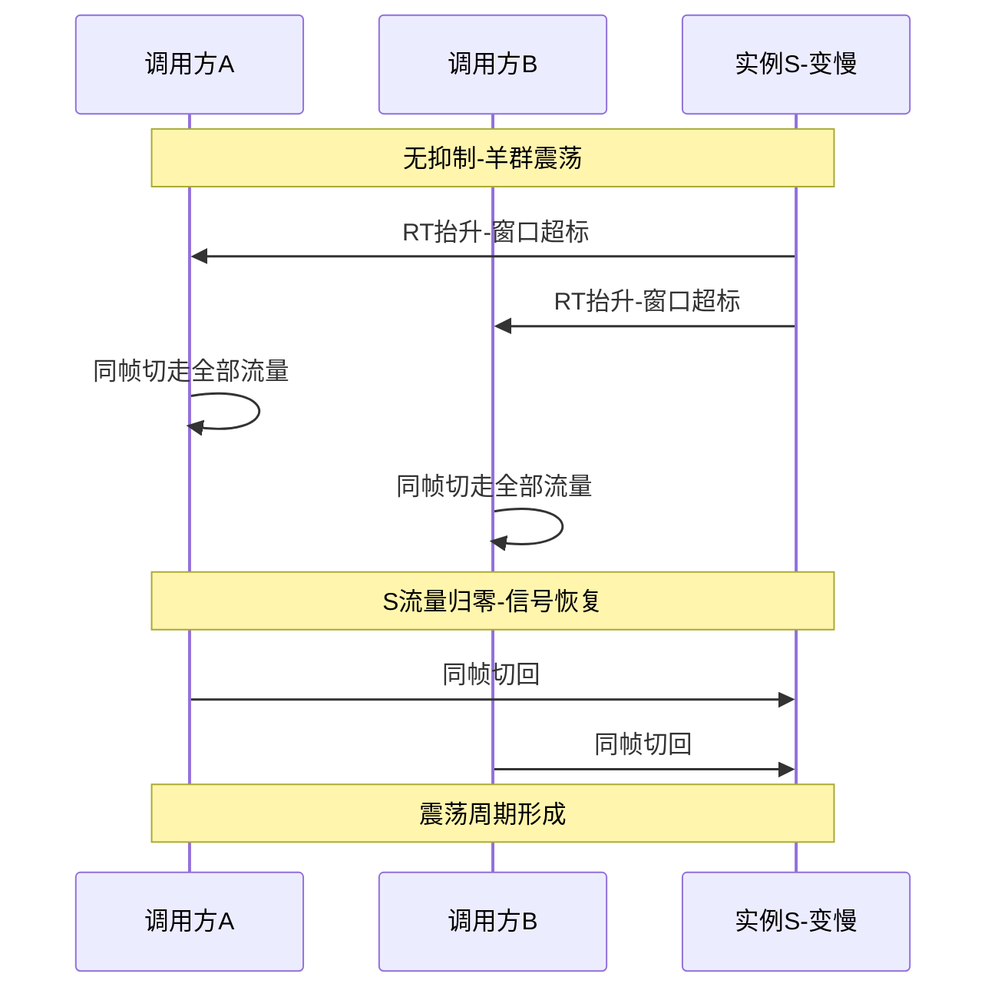
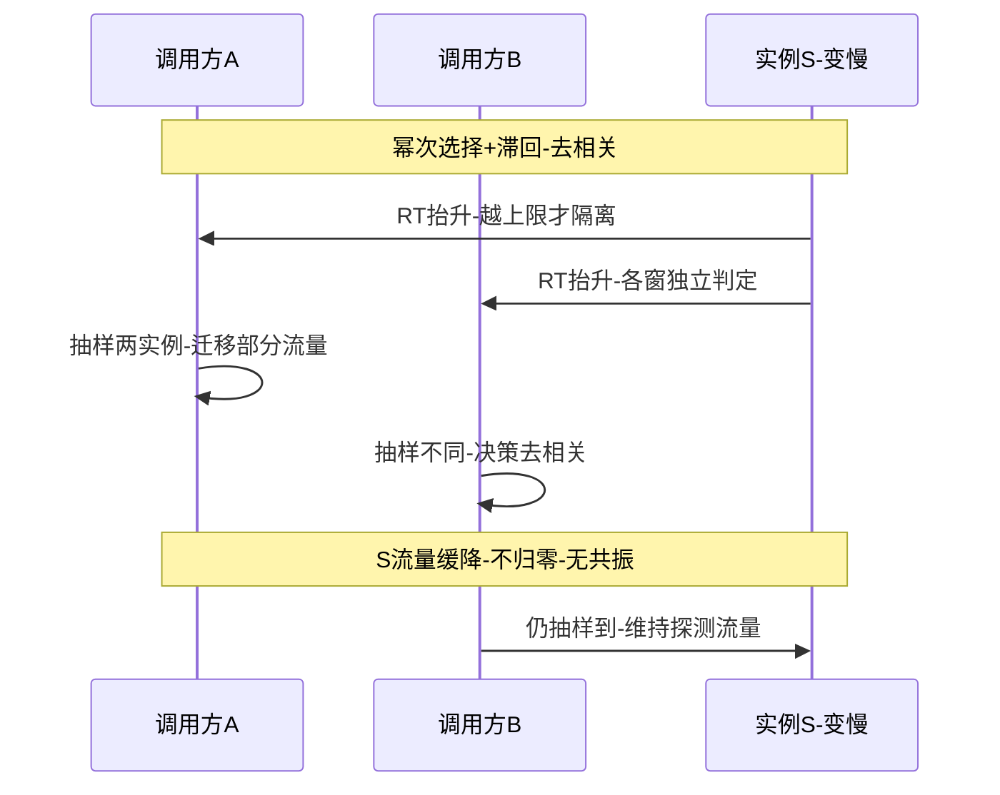
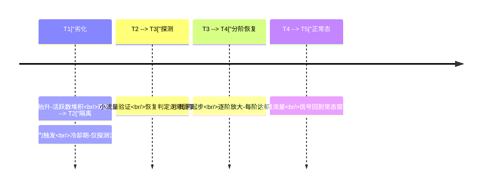

# 自适应负载均衡与负载感知深读：把调度做成负反馈回路

> **本文核心**：自适应负载均衡的本质是把静态调度升级为**负反馈控制系统**——实例的真实负载（活跃请求数、响应时间、错误率）作为信号回流到调度决策，流量自动避开高压实例、回流恢复实例。本文拆解它的三个机制层：**信号层**（最少活跃数的计数时机与含义——发出加一、结束减一，慢实例的活跃数自然堆积形成负反馈；响应时间信号的代表性与滞后性）、**决策层**（信号归一化与打分组合、统计窗口与衰减的参数账）、**稳定性层**（羊群效应的成因与抑制——所有调用方同频切换引发流量震荡，幂次选择与探测流量是业内惯例的两味药）。**机制链**：负载信号采集（关键路径埋点：请求发出/结束两侧计数）→ 窗口聚合与衰减 → 归一化打分 → 选择决策 → 执行结果回流 → 回路稳定性治理（抖动抑制/探测灰度/恢复限速）。

## 一句话摘要

静态权重回答「这台机器**应该**接多少流量」，自适应回答「这台机器**现在还能**接多少流量」——两者的差距在实例性能漂移、请求开销不均、故障中间态三个真实场景里被拉开。本文的核心判断：自适应的难点不在算法（打分公式一页纸）而在**信号质量与回路稳定性**——信号滞后一拍，调度就放大波动而非抑制波动；所有调用方同频反应，负反馈就共振成正反馈（羊群效应）。**评估一个自适应实现，先看它的信号从哪来、窗口多长、恢复怎么限速——这三处比打分公式更能预测生产行为**。

## 前置阅读

- 入门层篇 5《最少活跃与最小响应》（负载感知策略的直觉底盘）
- 本系列篇 1《平滑加权与一致性哈希实现》（静态底盘与权重分层——自适应是有效权重动态化的延伸）
- stability 系列熔断与限流篇（隔离与准入的邻接机制，本文与它衔接而不重叠）

## 目标导向

本文是什么：负载感知与自适应调度机制的深读。功能：设计/评审自适应策略、定位流量震荡类问题、核算信号窗口与恢复参数。收益：从「开个最少活跃策略」到「能算回路稳定性、能从震荡现象反推信号缺陷」的治理判断力。必看场景：长尾延迟治理、慢实例问题排查、发布预热联动、大促容量下的调度策略评审。

## 一、静态权重的三个盲区

自适应不是对静态的否定而是补盲区。**盲区一：实例性能漂移**——同规格实例的实测性能随宿主机噪声、邻居干扰、GC 形态、缓存热度漂移（生产实践里同权重实例的吞吐分化达数倍是常态，行业认知），静态权重把「出厂容量」当「实时容量」，漂移无人响应。**盲区二：请求开销不均**——同一服务的接口开销可能差出一个量级（读一行配置与跑一次聚合查询），按请求数均衡不等于按负载均衡，权重语义在请求粒度上失真。**盲区三：故障中间态**——实例挂了注册中心会摘除，但「半死」（超时拉长/错误率抬升/容量腰斩）的实例列表里一切正常，静态调度对它一视同仁，健康实例被动陪葬。三个盲区的共同点：**都是「实例真实状态偏离其元数据」的偏差**——自适应的全部工作就是把偏差测出来、反馈回调度。

```text
自适应回路的信号谱系(按采集成本递增):
  1. 活跃数 inflight: 请求发出+1 / 结束-1 -- 零网络成本, 隐含负载与时长
  2. 响应时间 RT: 窗口内平均/P99 -- 一拍滞后, 需衰减平滑
  3. 错误率: 窗口内失败占比 -- 最强信号, 但触发时伤害已发生
  4. 服务端自报负载: 队列长度/线程池水位/CPU -- 最实时, 需私有通道
```

## 5W 速记卡

| 维度 | 一句话 |
|---|---|
| What | 活跃数/响应时间/错误率信号的采集、打分与回路稳定性设计 |
| Why | 实例真实负载偏离静态元数据的三个盲区需要负反馈修正 |
| When | 长尾治理、慢实例排查、发布预热、大容量场景策略评审 |
| Where | 客户端调度器的信号采集与打分模块 + 服务端负载上报通道 |
| How | 信号采集 → 窗口聚合 → 归一化打分 → 选择 → 结果回流 → 稳定性抑制 |

## 二、活跃数信号：负反馈的最小实现

最少活跃（least active calls）是自适应的入门形态，它的机制优雅在于**信号与调度共用一条关键路径，零额外采集成本**：调用方在请求发出时对目标实例计数加一、响应结束时减一——活跃数即「该实例正在处理的请求数」。它的负反馈机制是自动的：**慢实例的请求结束得慢，活跃数自然堆积；活跃数高的实例在新一轮选择中被排后；排后使它的活跃数有机会回落**——不需要任何「识别慢实例」的显式逻辑，时序本身完成了反馈。这也是它优于「最少连接」直觉的地方：活跃数度量的是调用方视角的在途负载，与调用超时语义天然对齐。

但单一活跃数有两个失真场景。**失真一：同步长请求 vs 异步短请求混跑**——活跃数对「慢但轻」与「快但重」不可分辨，两个活跃数相同的实例真实负载可能差数倍。**失真二：突发同发**——新实例上线瞬间活跃数为零，调度把流量洪峰齐射过去，新实例冷启动（连接池/JIT/本地缓存空）被打出尖刺——**活跃数的冷启动盲区是预热机制存在的直接原因**（权重从零爬坡，本系列篇 1 的相位语义在此接线）。因此生产级实现几乎都是**组合信号**：活跃数为主排序、响应时间做归一化修正、错误率做硬闸门（超阈值直接隔离进探测态）——业内惯例的组合权重是「错误率一票隔离、活跃数定序、RT 微调」（各框架参数不一，行业认知）。



## 三、回路稳定性：羊群效应与两味药

负反馈回路有自己的失稳模式。**羊群效应**：实例变慢 → 所有调用方几乎同时观测到 → 同时把流量切走 → 该实例（或它所在批次）流量骤降到零 → 信号恢复 → 大家又同时切回——**同频的负反馈在时间上对齐后变成流量震荡**，震荡的振幅还随调用方数量放大：百个调用方各带独立统计窗口，信号噪声叠加后决策方差更大。震荡的次生伤害常比慢实例本身重：切换瞬间的连接重建、缓存冷启动、下游突刺，一轮震荡全踩一遍。

业内惯例的两味抑制药，作用点不同：**药一：幂次选择（power of two choices）**——不全局打分选最优，而是随机抽两个实例选较优者。全局排序让所有调用方的决策高度相关（大家都选同一个「最优」），随机抽样让决策**去相关化**——每次抽中的候选不同，流量自然分散。这是公开论文反复验证的机制：两条信息的随机性换来决策的相关性断根，代价是放弃「最优」选择「随机次优」——**在震荡风险面前，次优且稳定优于最优且震荡**。**药二：信号平滑与滞回**——统计窗口加长+指数衰减（信号进出不对称：劣化判定快、恢复判定慢），决策加入滞回带（信号越过上限才切走、回到下限才切回），从时间维度打断同频性。两味药可以叠加：去相关解决「决策相关性」，滞回解决「信号抖动」。





## 四、慢实例隔离与恢复限速

错误率与超时信号的硬闸门输出是**隔离态**：实例从正常调度中摘出，仅接收小比例探测流量。隔离的完整生命周期是一张状态机，**恢复限速是其中最容易被实现省略的一段**：

```mermaid
stateDiagram-v2
    [*] --> 正常态: 信号全部在阈内
    正常态 --> 观察态: RT或错误率越上限
    观察态 --> 正常态: 信号回落在滞回带内
    观察态 --> 隔离态: 持续越限或错误率超标
    隔离态 --> 探测态: 冷却期结束
    探测态 --> 隔离态: 探测流量失败
    探测态 --> 正常态: 探测达标-流量分阶恢复
    style 正常态 fill:#a8e6a3
    style 隔离态 fill:#ffd3a5
```

恢复为什么要限速：**实例「变慢的原因」解除后，它的「恢复容量」是爬坡的**——GC 后缓存全冷、重启后连接池空、宿主机迁移后本地状态未热，此时把全量流量一次性还给它，等于让恢复中的实例重演一次冷启动击穿。分阶恢复（探测通过后按小比例起步、逐阶放大、每阶达标才进阶）是把「预热」思想复用到恢复路径——发布预热与故障恢复共用同一条爬坡曲线，两套机制合成一套。



## 与「静态加权」的区别

| 维度 | 静态加权（本系列篇 1） | 自适应负载感知 |
|---|---|---|
| 权重来源 | 元数据（配置/容量规划） | 实时信号（活跃数/RT/错误率） |
| 响应对象 | 计划内差异（容量/灰度） | 计划外偏差（漂移/半死/冷启动） |
| 主要风险 | 权重脏数据与漂移 | 回路震荡与信号滞后 |
| 实现成本 | 无状态或轻状态 | 窗口统计+状态机+参数账 |
| 适用底盘 | 常态流量的默认底盘 | 长尾敏感与大流量场景的增强层 |

两者是叠加关系不是替代关系：自适应输出的动态修正叠加在静态有效权重之上（篇 1 的分层合成结构），**静态层管「计划的差异」，自适应层管「计划外的偏差」**——试图用自适应替代静态权重的实现（无基线纯动态）会在信号缺失时失去任何兜底排序。

## 不同量级的思考：架构约束驱动解法

- **十万级 QPS、百级实例（常规集群）**：约束来源是「信号在调用方本地就够用」——百级实例的活跃数与 RT 窗口在每个调用方进程内维护，内存与计算可忽略；思考方式是「监控驱动」——各实例流量分布的基尼程度与长尾 P99 两条曲线盯住即可，分布不恶化就不动参数。这一档的核心问题是「流量分布有没有在监控」，而不是「要不要上自适应」
- **百万级 QPS、千级实例（大流量集群）**：约束来源是「统计与决策的常数项进账本」——千级实例每请求的信号聚合、窗口更新的 CPU 占比开始可见，羊群效应的振幅随调用方数量放大；思考方式是「公式驱动」——窗口账 = 实例数 × 更新频率，震荡账 = 切换比例 × 切换成本 × 频率，两笔公式定窗口长度与滞回带宽度。这一档的核心问题是「窗口与滞回的公式算对没有」，而不是「策略换更激进的」
- **千万级 QPS、万级实例（平台级）**：约束来源是「全量视图的信号聚合在单点不可维护」——万级实例的负载信号流如果汇到任何集中点（全局调度器/统一打分），带宽与延迟都不可接受，决策必须分层去中心；思考方式是「节奏驱动」——信号分层聚合（机房内细粒度、跨机房粗粒度）、决策就近、参数灰度变更分批推进。这一档的核心问题是「信号分层与决策就近的节奏对不对」，而不是「打分公式再精调」
- **亿级 QPS、多层调用面（全域调度）**：约束来源是「调度面本身成为故障面」——自适应逻辑分布在不同层（网关/RPC/网格），层间策略冲突（上层刚切走下层又切回）与信号风暴成为新风险；思考方式是「架构驱动」——负载信号与调度决策做成独立控制面（策略即配置、面间契约化），数据面只执行轻量规则，回路稳定性从参数问题升级为架构契约问题。这一档的核心问题是「调度面的架构契约立住了没有」，而不是「哪一层的参数没调好」

思考方式总结：十万级靠「两条曲线」，百万级靠「两笔公式」，千万级靠「分层就近」，亿级靠「控制面契约」——约束来源从「本地统计够用」逐档迁移到「统计成本、去中心化、调度面自身稳定」，思考方式跟着约束迁移。

**自下而上与触发升级**：先测档位再选思考——实例数、长尾 P99 与均值的偏离度、流量分布的倾斜系数三个实测值决定你实际站在哪一档，不预支上一档的分层复杂度，也不滞留在下一档的侥幸里。触发升级的信号：P99 长尾进入业务可感区间、同权重实例吞吐分化超过数倍、出现过一次可归因的流量震荡——任一信号出现，思考方式必须随档升级（监控驱动→公式驱动→节奏驱动→架构驱动）。锚点始终是约束来源：统计成本与去中心化这些物理层变了，解法才跟着变——业务翻倍只是信号，约束迁移才是升级的依据。

## 反方案：为什么不用「集中式全局最优调度」？

有方案主张「各调用方局部决策天然次优——做一个全局调度器，汇总全部负载信号、线性规划算出全局最优分配」——数学上成立，工程上三处不可行：**信号时效**：全局信号汇聚的传输与计算延迟让「最优解」到达执行点时已是旧闻，按旧闻调度恰是震荡之源；**故障面**：调度器成为新的单点与瓶颈，它的故障半径大于任何单个实例抖动；**代价错位**：全局最优相对分布式次优的收益通常是个位数百分比（公开论文口径），而为此支付的信号带宽、时延与复杂度是数量级——**分布式负反馈的「次优但稳定、无单点、信号本地化」正是工程上的正解**，幂次选择进一步证明：去相关化的随机次优，常常比确定性最优更接近全局均衡。

## 五、典型场景与误区

**典型场景**：长尾延迟治理（活跃数+RT 组合信号压制慢实例拖尾）；慢实例问题（宿主机噪声/GC 抖动）的自动隔离与分阶恢复；发布预热联动（新实例相位权重与活跃数信号叠加，冷启动免击穿）；大促容量场景（高水位下负载信号的负反馈兜住局部热点）。

**常见误区**：① **「开了自适应就稳了」**——信号窗口与滞回参数默认值不适合任何具体业务，未做回路稳定性核算的自适应是震荡的候选源；② **「信号越实时越好」**——窗口过短等于放大噪声，秒级以内的窗口在常规 RT 量级下全是抖动（行业认知），平滑与滞后是必要的恶；③ **「隔离就是拉黑」**——隔离不带探测与分阶恢复，实例恢复后永远回不了场，可用性被永久性削掉一份；④ **「多层各自自适应」**——网关、RPC、网格各调各的，层间策略对冲让流量来回搬家，调度面要有唯一的决策层次约定；⑤ **「用错误率做主排序」**——错误率是最强信号也是最滞后信号（伤害已发生才出现），它的正确位置是硬闸门而不是排序键。

## 六、事故与实践叙事

**事故一：统计窗口调短引发全站流量震荡**。某平台为「更快感知慢实例」把信号窗口从分钟级调到秒级——随后数天内出现周期性流量抖动：一批实例被同时切走又同时切回，切换成本（连接重建+下游突刺）让 P99 反而恶化，且抖动周期与窗口长度严格相关（行业通病原型，量级为叙事设定）。复盘结论：窗口长度的本质是「信噪比参数」——秒级窗口里信号被噪声淹没，负反馈变成正反馈。整改恢复分钟级窗口+指数衰减+滞回带，并对「窗口/滞回/冷却期」三个参数建立变更审批与演练验证。**教训**：自适应的参数是控制回路参数，调参前先问「回路在我的流量形态下稳定吗」，而不是「感知够不够快」。

**事故二：恢复实例被探测流量打回隔离态**。某服务实例 GC 调优后恢复，探测流量刚放进来恰好赶上缓存全冷——首波探测请求 RT 超标，隔离判定再次触发，实例被打回冷却期；循环三轮后才偶然恢复（叙事量级）。期间该实例容量白白空转，其余实例多扛了一个小时的超配流量。整改把「探测态」细分为「热身探测」（只发轻量健康请求）与「流量探测」（业务流量按小比例起步），冷启动缓存预热纳入恢复流程。**教训**：恢复判定要用「恢复中实例」的真实容量曲线做标尺，拿常态容量标尺量恢复中实例，恢复就永远不达标。

**实践叙事：组合信号上线后的长尾收敛**。某中台把默认策略从平滑加权切换为「错误率闸门+活跃数定序+RT 微调」的组合，切换前后各观察两周：P99 长尾显著收敛、同权重实例的负载分化同步收窄；但真正的收益出现在一次宿主机故障中——半死实例在错误率抬升的数秒内被自动隔离进探测态，调用方几乎无感，事后工单量为零（量为团队内部观测，行业认知口径）。**这次实践沉淀的方法论：自适应的价值兑现点在日常是长尾收敛，在故障时是「半死实例的自动处置」——后者才是它不可替代的理由**。

## 七、设计思想：调度即控制，参数即整定

自适应负载均衡的深层心智是**控制论**的：实例负载是被控对象，调度流量是控制量，负载信号是反馈，窗口/滞回/冷却期是整定参数——整定不当，负反馈震荡；整定得当，扰动被自动抑制。这套心智的可迁移性极强：限流系统的令牌桶节奏、熔断器的半开探测、数据库连接池的回收策略，全是同构的反馈回路与整定问题。**理解了「回路稳定性优先于响应速度」，这批机制就共享同一条设计纪律**——这也解释了为什么成熟实现都把恢复做得比隔离更保守：控制系统的第一原则是不要自己制造新的扰动。

## 八、追问链

**质疑者第一层**：活跃数信号在异步/响应式调用下还准吗——一个请求挂起等回调，活跃数一直占着算负载吗？——要按「占用执行资源」重定义计数时机：等待外部 IO 的挂起段不计活跃（它不占线程），执行段才计；实现上把计数点从「请求生命周期」下沉到「资源占用周期」。计数口径错位的实现会出现「活跃数虚高但 CPU 空闲」的假慢信号——**信号的正确性来自它与「想保护的资源」对齐**，这是信号设计的第一性检查。

**质疑者第二层**：幂次选择放弃了全局最优，小集群下损失可感吗？——小集群（个位数实例）下随机抽二的方差确实大于全局排序，但小集群同时是羊群振幅最小、信号最干净的档位——可以用全局排序而震荡风险低；幂次选择的价值随集群规模与调用方数量增长。**策略的档位匹配比策略的先进性重要**：小集群全局排序、大集群幂次化，一条演进线而不是二选一。

**质疑者第三层**：服务网格把负载感知下沉到 sidecar 数据面后，调用方本地统计还有意义吗？——网格改变的是统计逻辑的宿主进程，回路结构原样保留（sidecar 间同样要面对信号滞后与决策相关性）；真正的新变量是控制面下发策略与数据面本地反馈的双层结构——策略归控制面（变更慢、全局一致），参数整定归数据面（响应快、本地适应）。**两层契约的清晰度决定网格调度稳不稳**，这把本节的整定问题升级成了契约问题，机制本身跨形态复用。

## 你们可能会问

**Q1：信号窗口设多长合适？**
从响应时间量级反推：窗口至少覆盖几十到上百个请求样本（噪声收敛需要的样本量，统计常识），常规 RT 毫秒级、QPS 千级的服务窗口在秒到十秒级起步，再按滞回与衰减实测整定——没有普适值，有普适算法：从长窗口起步逐步收短，出现抖动即回退。

**Q2：怎么观测「回路震荡」这件事本身？**
盯三个关联指标：各实例流量占比的时序方差（震荡=方差周期性放大）、切换事件计数（隔离/恢复的频度）、切换成本指标（连接重建数/下游突刺）。三者在时间上对齐出现周期性，就是震荡实锤——单独看任何一个都可能误判。

**Q3：错误率闸门的阈值怎么定？**
按服务的错误预算反推而不是拍一个百分比：正常错误率的数十倍（信号显著）且持续超过观察窗口才触发，阈值要高于网络抖动的噪声带——阈值过低把抖动当故障，频繁隔离反而制造容量缺口。

**Q4：自适应策略的参数要不要动态调？**
参数变更按发布管理（灰度+审批+可回滚），运行时自动调参要极为克制——自动调参等于回路里再套一层回路，稳定性分析复杂度陡增；确有需要时只对窄参数（探测比例）开小幅自适应，核心参数（窗口/滞回）保持人工整定。

## 💡 实战提示

- 💡 自适应的评估入口是信号与回路，不是打分公式：信号从哪来（计数口径是否对齐想保护的资源）、窗口多长（信噪比）、恢复怎么限速（分阶爬坡）——三处定生死
- 💡 决策口径：常态流量静态加权为底盘、自适应为增强层（计划内差异归静态、计划外偏差归动态）；错误率只做硬闸门不做排序键；大集群用幂次选择去相关化
- 💡 选型推荐：组合信号「错误率闸门+活跃数定序+RT 微调」作为默认起点；慢实例高发场景加服务端负载自报通道；参数（窗口/滞回/冷却期）纳入变更管理与演练验证
- 💡 排查路径：流量震荡三指标对齐（流量方差周期性+切换频度+切换成本）→ 先查窗口与滞回、再查多层策略对冲、最后查信号口径错位

## 自测三问

1. 活跃数信号的负反馈机制是怎么自动工作的？（答：慢实例请求结束慢→活跃数自然堆积→选择排序被排后→流量减少活跃数回落——计数（发出+1/结束-1）与调度共用一条关键路径，无显式识别逻辑）
2. 羊群效应的成因与两味药？（答：所有调用方信号同频、决策同帧、流量同切同回形成共振震荡；幂次选择随机抽样让决策去相关，信号平滑+滞回带让判定进出不对称——一个断决策相关性、一个断信号抖动）
3. 为什么恢复要比隔离更保守？（答：恢复中实例容量是爬坡曲线（缓存冷/连接池空），全量回流等于二次冷启动击穿——探测热身+小比例起步+分阶放大把预热思想复用到恢复路径；控制系统的第一原则是不自己制造新扰动）

## 开放问题

- 信号口径的标准化：活跃数/负载自报的语义在各框架与网格间不统一，跨层调度时同一实例的「负载」定义歧义仍在。
- 多层调度面的策略仲裁：网关、RPC、网格各自自适应的层间对冲检测与自动仲裁，尚无成熟的行业方案。

## 📎 核心带走

- **核心一句话**：自适应负载均衡=把调度做成负反馈回路——活跃数/RT/错误率回流为信号，组合打分驱动选择；它的工程难点在回路稳定性（窗口信噪比、羊群去相关、恢复限速），不在打分公式
- **机制链**：信号采集（计数口径对齐资源）→ 窗口聚合与衰减 → 归一化打分（闸门+定序+微调）→ 幂次去相关选择 → 隔离状态机 → 探测与分阶恢复 → 回路稳定性观测（方差/切换频度/切换成本）
- **失效点/边界**：窗口过短负反馈变正反馈；信号口径错位产生假慢/假快；无探测恢复的隔离永久削容量；多层策略对冲让流量来回搬家；错误率做排序键会把处置变成追悼

## 📌 数据与事实声明

- 写于 2026-09-23，机制以幂次选择公开论文、主流 RPC 框架与网格的负载均衡公开文档为基准（公开口径）；窗口与阈值参数均为量级与经验参考（行业认知），以实测整定为准
- 免责：各实现的信号口径与默认参数以所用版本源码与官方文档为准；事故叙事为行业通用模式的原型化脱敏重述，不指向任何真实公司

## 📚 参考资料

| 类型 | 标题 | 来源 |
|---|---|---|
| 原理论文 | The Power of Two Choices in Randomized Load Balancing | 公开论文 |
| 官方文档 | 主流 RPC 框架负载均衡策略章节 / Envoy 负载均衡与异常点驱逐 | 各官方站点 |
| 关联文章 | 本系列篇 1、入门层篇 5、stability 系列熔断限流篇 | 本仓库 |
