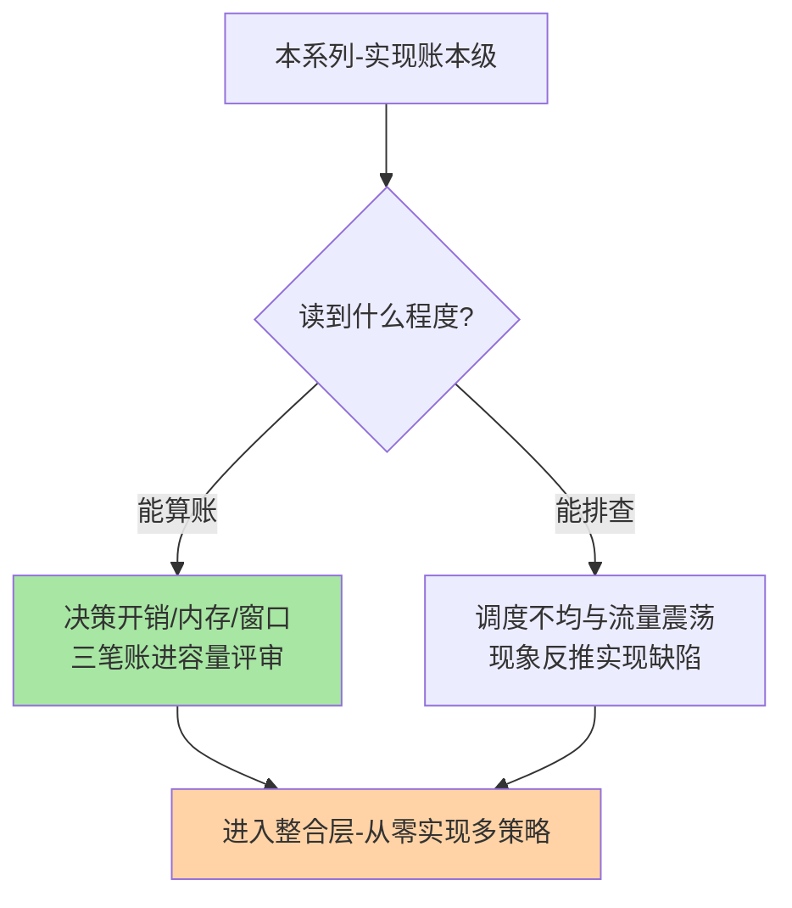
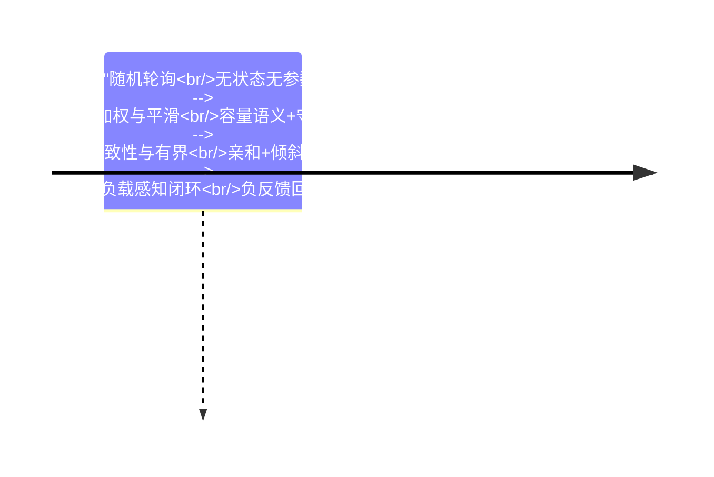

# 负载均衡算法系列总览：从算法公式到工程账本

> **本文核心**：负载均衡的选型争议小、工程分歧大——本系列把两大算法域拆到实现账本层：**静态底盘**（平滑加权的守恒性来源、一致性哈希的均匀性/查找/迁移三笔账、跳跃哈希与有界负载两条工程变体）、**动态增强**（活跃数/响应时间/错误率信号闭环、羊群效应抑制、慢实例隔离与分阶恢复）。两篇共同的立场：**算法公式一页纸，账本才是生产行为的预测器**。

## 一句话摘要

入门层建立「把请求分发到多实例」的策略谱系心智，本系列把其中主力算法拆到工程级：静态算法的关键在权重分层与确定性契约（调度可复算、同 key 同落点），动态算法的关键在信号质量与回路稳定性（负反馈不震荡、恢复不击穿）——**静态管计划内差异，动态管计划外偏差，两者叠加而非替代**。

## 系列导航

| 篇目 | 深挖点 | 核心交付 |
|---|---|---|
| 1_平滑加权与一致性哈希实现-深度 | 静态算法的实现账 | 守恒不变量、虚拟节点交换、入环时机、变体选型 |
| 2_自适应负载均衡与负载感知-深度 | 动态信号的反馈回路 | 信号谱系、羊群抑制、隔离状态机、恢复限速 |

## 与相邻层的关系

入门层给策略谱系与选型直觉，本系列给实现账本与回路设计；一致性哈希系列（同层姊妹系列）讲环与虚拟节点的原理与选型，本系列篇 1 补其实现账本——两系列角度互补不重复。服务路由系列管「按条件定向分发」，本系列管「在候选集内分均匀」，网关系列的 upstream 策略消费本系列的机制结论。

## 层内的取舍与演进

算法谱系的演进脉络三十年清晰可循：随机轮询→加权→平滑加权→一致性哈希→有界负载→负载感知闭环——**每一步都在为上一代补语义缺口（容量、平滑、亲和、倾斜、漂移）**，新形态（网格 sidecar、QUIC）只改决策的宿主进程，不改账本本身——决策开销、视图收敛、迁移语义三笔账跨周期成立。代价面如实说：参数账（窗口/滞回/虚拟点数）强依赖各自流量形态，文中量级只是锚点，实测整定才是唯一可信口径。

## 📌 数据与事实声明

- 写于 2026-09-23，机制口径以公开论文与主流框架文档为基准（公开口径）
- 免责：以各篇参考资料为准

## 📚 参考资料

| 类型 | 标题 | 来源 |
|---|---|---|
| 系列入口 | 负载均衡入门层系列 | 本仓库 service-governance/load-balancing/入门层 |
