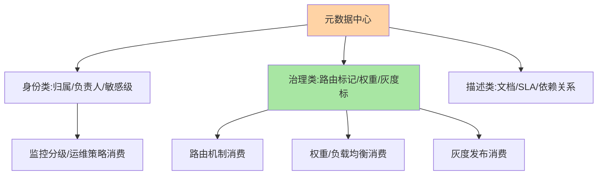
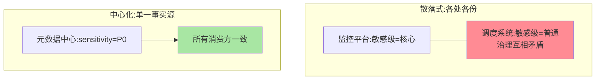

# 元数据中心是什么：治理依据的集中地

> 一句话：元数据中心是**治理决策依据的集中管理与分发点**——服务的标签、权重、路由标记、负责人、敏感等级，这些「关于服务的数据」集中存放、统一下发，是路由/灰度/权重等治理机制的「依据层」。

> **本文核心**：元数据的定位——**「治理依据」与「治理执行」分离**：路由机制（执行）消费路由标记（依据），权重机制（执行）消费权重值（依据）——依据集中管理，执行各处分布。**机制链**：治理需求（要灰度/要切流量）→ 依据变更（改元数据）→ 集中存储与校验 → 下发到消费点（框架/网关）→ 治理行为生效。为什么需要中心化：元数据散落在各服务的配置里 = 依据不一致（同一服务在不同地方的身份不同）——**一致性是元数据的生命**。

## 一句话摘要

元数据的三类内容：**身份类**（服务归属团队、负责人、敏感等级——「这个服务是谁的、多重要」）、**治理类**（路由标记、灰度标记、权重值——「治理机制怎么对待它」）、**描述类**（接口文档、SLA 承诺、依赖关系——「它的说明书」）。与注册中心实例元数据的差异：实例元数据是「实例级、易失」（随实例生灭），元数据中心的元数据是「服务级、持久」（服务级契约与治理属性）——**两者互补不互替**（互指注册中心核心模型）。

## 一、为什么治理依据要中心化

散落式元数据的三重失效：**不一致**（服务 A 的敏感等级在监控平台标「核心」、在调度系统标「普通」——治理动作互相矛盾）、**难变更**（改一个路由标记要登 N 个服务改配置）、**无审计**（谁改的依据无从追溯）。中心化的价值：**单一事实源**（一处修改处处一致）+ **变更治理**（评审/审计/灰度下发）+ **消费解耦**（新增治理机制只需消费元数据，不用给服务加配置）。

## 5W 速记卡

| 维度 | 一句话 |
|---|---|
| What | 治理依据（标签/权重/标记/归属）的集中管理与分发点 |
| Why | 散落元数据不一致、难变更、无审计——一致性是生命 |
| When | 路由/灰度/权重的依据管理、服务资产盘点 |
| Where | 治理平台元数据层 + 配置中心/注册中心承载 |
| How | 依据集中存储校验 → 下发消费点 → 治理行为生效 |

## 二、元数据的分类与消费全景

**消费点的「读模式」**：元数据的下发走配置中心/注册中心通道（互指两者的推送机制）——变更秒级到达消费点；消费点本地缓存 + 快照（元数据中心故障时依据不丢）——**元数据中心本身可以轻**（数据量小），重的是「变更治理流程」。

## 三、与配置中心的区别：语义对照

| 维度 | 元数据中心 | 配置中心（互指 config-center） |
|---|---|---|
| 数据内容 | 治理依据（结构化标签/数值） | 应用参数（文本/文件配置） |
| 消费方 | 治理机制（路由/灰度/调度） | 业务代码 |
| 变更语义 | 治理行为变更 | 业务行为变更 |
| 关系 | 常由配置中心承载存储与下发 | 承载元数据的平台 |

元数据「是配置的一种」但语义特殊（消费方是治理机制不是业务代码）——**小组织用配置中心承载元数据够用，规模化后治理平台内置元数据模型**。

散落与集中的一致性对比：

## 四、典型场景与误区

**典型场景**：服务资产盘点（全公司服务的归属/负责人/敏感级一张表——治理的起点）、灰度标记管理（灰度标记的集中下发，互指泳道）、权重运营（多机房流量比例的集中调整）、依赖关系图（描述类元数据构建的服务拓扑）。

**误区与不适用**：① 元数据定义无规范（同键异义泛滥，互指标签路由的标签规范）——元数据规范先行于平台建设；② 元数据当业务数据存——元数据是治理维度，业务属性回业务库；③ 只建设不运营——元数据的时效性靠运营（负责人变更同步、服务下线清理），过期元数据比没有更危险（误导治理决策）。

## 五、💡 实战提示

- 💡 元数据键规范先行：保留键清单（敏感级/归属/路由标记）+ 命名规范，发文后建平台
- 💡 元数据时效监控：「超过 N 天未校准」的元数据打标——过期依据是治理毒药
- 💡 治理机制新消费元数据时走「消费登记」——谁知道这些依据要留名
- 💡 决策口径：何时用什么形态——小团队配置中心挂元数据键即可，治理机制 ≥3 个再谈独立元数据模型；中心化与散落的取舍由治理规模定

## 六、你们可能会问

**Q1：元数据中心是独立组件吗？**
多数组织不需要独立组件——配置中心/注册中心承载存储与下发，治理平台提供模型与界面；「中心」是逻辑概念（单一事实源），物理形态可轻。

**Q2：实例元数据和服务元数据的边界？**
实例级（易失、随生灭：IP/临时状态）在注册中心；服务级（持久、契约性：归属/敏感级/SLA）在元数据中心——「实例死了元数据还在吗」是分界测试题。

**Q3：元数据的变更为什么要灰度？**
元数据是治理依据——依据变更直接触发治理行为变更（路由标记改了流量就改道），灰度下发与观察（互指 config-center 篇 5）同理适用。

## 七、开放问题

- 元数据与资产管理的融合（CMDB 演进）：服务元数据、资源元数据、成本元数据的统一治理面是中大型组织的平台化方向，「元数据中心」与 CMDB 的边界在融合中重画。

## 八、自测三问

1. 「治理依据与治理执行分离」怎么理解？
2. 元数据三分类各自的消费方？
3. 「过期元数据比没有更危险」为什么？

下一篇讲「元数据定义与管理机制」。

## 📎 核心带走

- **核心一句话**：元数据中心 = 治理依据的单一事实源，身份/治理/描述三分类，一致性是生命
- **机制链**：治理需求 → 依据变更 → 集中存储校验 → 下发消费点 → 治理生效；变更走灰度与审计
- **失效点/边界**：散落即不一致；业务数据不进元数据；时效性靠运营，过期依据是毒药

## 📌 数据与事实声明

- 写于 2026-09-08，定位为治理平台实践的归纳
- 免责：以各治理平台文档为准

## 📚 参考资料

| 类型 | 标题 | 来源 |
|---|---|---|
| 关联系列 | 本仓库 config-center / service-routing 系列 | docs/architecture/service-governance/ |
| 公开参考 | CMDB 与服务目录公开实践 | 技术社区公开文章 |
| 社区沉淀 | 元数据治理公开文章 | 技术社区公开文章 |
