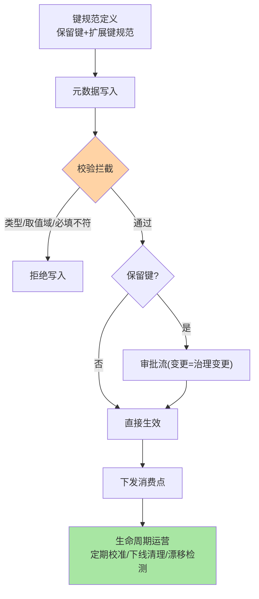
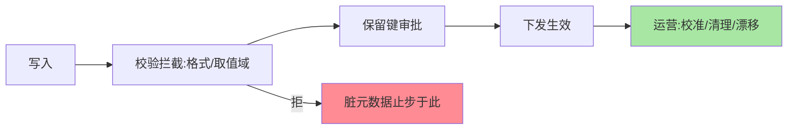

# 元数据定义与管理：模型、校验与生命周期

> 篇 1 立了定位，这篇讲机制：元数据的**模型定义**（键结构/类型/必填约束）、**变更管理**（校验/审批/下发）、**生命周期**（创建到失效的全程运营）。

> **本文核心**：元数据模型三件——**键定义**（保留键：敏感级/归属/路由标记，含类型与取值域）、**约束校验**（必填项/枚举值/格式校验——脏元数据在入口拦截）、**版本与审计**（变更留痕可回滚）。**机制链**：键规范定义 → 元数据写入（校验拦截） → 审批（保留键变更） → 下发消费 → 时效运营（定期校准）。管理机制的目标：**入口拦脏、变更受控、过期可见**。

## 一句话摘要

模型定义的核心是**保留键清单**：治理保留键（`owner`/`sensitivity`/`route-tag`/`weight`）由平台定义与校验（类型、取值域、必填性），业务扩展键自由但走命名规范——保留键强治理 + 扩展键弱规范的分层（互指 service-versioning 篇 5 的双层设计）。**变更管理**分级：扩展键随意改、保留键变更走审批（路由标记变更 = 流量变更，与配置变更同级安全网，互指 config-center 篇 5）。**生命周期运营**：元数据的「保鲜机制」——定期校准提醒（负责人确认）、服务下线联动清理、漂移检测（实际与声明比对）。

## 一、为什么「脏元数据」是治理的天敌

治理机制消费元数据做决策——脏元数据 = 错误决策的输入：敏感级标错 → 核心服务没进重点保障名单；负责人失效 → 故障时找不到人；路由标记残留 → 流量被错误定向。**「垃圾进垃圾出」在治理域的代价是事故**——管理机制的第一目标就是「入口拦脏」（校验）、「存量保鲜」（运营）。

## 5W 速记卡

| 维度 | 一句话 |
|---|---|
| What | 键模型（保留键/扩展键）+ 变更管理（校验/审批） + 生命周期（保鲜/清理） |
| Why | 脏元数据直接导致治理误决策 |
| When | 元数据建模、保留键变更、元数据审计 |
| Where | 治理平台的元数据层 |
| How | 入口校验拦截 → 保留键审批 → 下发 → 定期校准 |

## 二、元数据管理机制全景

**漂移检测**是运营的核心手段：**声明 vs 实际**的比对——声明的负责人 vs 系统实际归属（代码仓库 owner）、声明的敏感级 vs 数据分级平台、声明的实例 vs 注册中心实际——**漂移即告警**，让元数据与现实的偏离早于治理事故被发现。

## 三、与数据库 Schema 管理的区别：对照

| 维度 | 元数据管理 | 数据库 Schema 管理 |
|---|---|---|
| 约束执行 | 平台校验层 | 数据库引擎 |
| 变更影响 | 治理行为 | 数据完整性 |
| 演进 | 键扩展频繁 | 表结构变更审慎 |

两者同构（模型 + 约束 + 变更管理）——元数据管理可类比为「治理域的 Schema 工程」，Schema 管理的纪律（迁移脚本、兼容性）同样适用。

管理机制的漏斗全景：

## 四、典型场景与误区

**典型场景**：保留键清单发布（sensitivity 三级、route-tag 命名、owner 必填）、元数据审计（保留键变更记录回顾、漂移报告）、服务下线联动（下线工单触发元数据清理——防「僵尸服务条目」）。

**误区与不适用**：① 保留键无限扩张——每加一个保留键都是全组织的治理约束，加键走评审（与分组开组评审同理，互指 service-versioning 篇 3）；② 校验只做格式不做语义——「sensitivity=P0 但依赖它的全是 P2 服务」这类语义矛盾格式校验抓不住（依赖图校验是进阶）；③ 元数据变更无灰度——路由标记全量瞬变的风险（互指 config-center 篇 5 灰度下发同理）。

## 五、💡 实战提示

- 💡 保留键清单 + 变更审批 + 漂移检测三件套起步——管理机制的 MVP
- 💡 校准提醒按敏感级分频：P0 元数据月校准、P2 季度校准
- 💡 服务下线流程强制勾选「元数据已清理」——生命周期闭环用工单锁死

## 六、你们可能会问

**Q1：保留键和扩展键冲突了怎么办？**
保留键优先且受保护（扩展键禁用保留键名——命名空间隔离或前缀约定），冲突在写入校验层直接拒绝。

**Q2：元数据修复（纠错）走什么流程？**
与变更同流程（校验 + 保留键审批）——纠错也是变更（治理依据的变化同等受控），「改错了悄悄修」会破坏审计链。

**Q3：多平台消费同一元数据，口径不一怎么办？**
消费登记制（篇 1）：消费方声明消费的键与语义，平台维护「键-消费方」映射——语义歧义在登记时暴露，而不是在治理事故时。

## 七、开放问题

- 元数据模型的形式化（键结构用 Schema 语言声明、校验规则可编程）正在工具化（OPA/JSON Schema 类），「元数据即代码」是管理机制的平台化方向。

## 八、自测三问

1. 保留键与扩展键的双层治理怎么分工？
2. 漂移检测比对哪两类数据？发现什么？
3. 「纠错也是变更」为什么？

## 📎 核心带走

- **核心一句话**：元数据管理 = 键模型（保留/扩展双层）+ 入口校验 + 保留键审批 + 生命周期保鲜
- **机制链**：键规范 → 写入校验拦截 → 保留键审批 → 下发消费 → 校准/清理/漂移检测运营
- **失效点/边界**：保留键扩张走评审；语义矛盾格式校验抓不住；变更灰度同理适用

## 📌 数据与事实声明

- 写于 2026-09-08，管理机制为治理平台实践的归纳
- 免责：以各治理平台文档为准

## 📚 参考资料

| 类型 | 标题 | 来源 |
|---|---|---|
| 关联系列 | 本仓库 service-versioning / config-center 系列 | docs/architecture/service-governance/ |
| 公开参考 | OPA 策略引擎 / JSON Schema | openpolicyagent.org |
| 社区沉淀 | 元数据管理公开实践 | 技术社区公开文章 |
