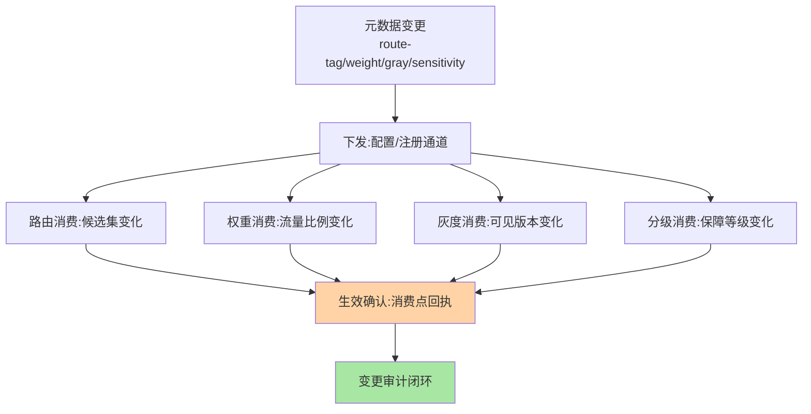
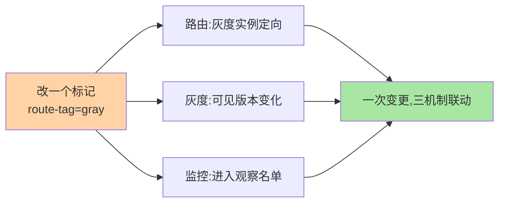

# 元数据应用机制：治理机制如何消费依据

> 元数据的价值在「被消费」：路由机制消费路由标记、均衡消费权重、灰度消费灰度标记——这篇从**消费方视角**看元数据的应用机制，以及消费设计的纪律。

> **本文核心**：三大消费场景——**路由依据**（route-tag 定向分流，互指 service-routing）、**权重依据**（多机房流量比例的集中运营）、**灰度依据**（灰度标记控制版本流量）；加上**运维分级消费**（敏感级决定监控/保障等级）。**机制链**：治理平台改元数据 → 下发到消费点（框架/网关/发布系统） → 消费点刷新本地依据 → 治理行为变化。**消费设计三纪律**：依据变更可观测（消费点生效确认）、消费降级安全（元数据不可用时的行为定义）、语义单源（同一键只有一处定义）。

## 一句话摘要

逐场景看：**路由消费**——框架路由器读 `route-tag` 决定候选集（标记变更秒级生效）；**权重消费**——多机房流量的「机房权重」集中运营（异地多活的流量调配核心手段），权重调整不发布不发版；**灰度消费**——灰度标记控制「谁能看到新版本」（互指泳道）；**分级消费**——`sensitivity=P0` 的服务自动进入重点监控与保障名单（元数据驱动运维策略）。**消费纪律的深意**：元数据是「治理的输入接口」——消费设计的质量决定治理机制的可靠性。

## 一、为什么消费视角重要

元数据管理（篇 2）保证「依据是对的」，消费机制保证「依据被正确使用」——两者错位的事故形态：依据已改、消费点没刷新（治理不生效）；消费点缓存了旧依据（治理延迟生效）；多个消费点对同一键理解不同（语义分裂）。**消费设计 = 生效确认 + 降级定义 + 语义单源**三件，缺一件就有一个事故形态。

## 5W 速记卡

| 维度 | 一句话 |
|---|---|
| What | 路由/权重/灰度/分级四类消费场景与消费三纪律 |
| Why | 元数据的价值在消费，消费质量决定治理可靠性 |
| When | 治理机制接入元数据、消费失效排查 |
| Where | 框架/网关/发布系统的消费点 |
| How | 下发 → 消费点刷新生效确认 → 降级行为预定义 |

## 二、消费场景与生效链路全景

**生效确认的实现**：消费点收到下发后回执（版本号 ACK），平台比对「已生效实例数 vs 目标实例数」——灰度下发的闭环（互指 config-center 篇 5 的版本指纹核对同构）。**权重消费的实例**：异地多活场景「机房 A 权重 70 / 机房 B 权重 30」的调整——集中在元数据中心改两个数字，全站流量比例分钟级到位——**权重运营是多活架构的日常操作**，这正是元数据集中化的价值兑现。

## 三、与直接配置修改的区别：消费对照

| 维度 | 元数据消费（集中依据） | 直接配置修改（散落执行） |
|---|---|---|
| 一致性 | 单源处处一致 | 各处漂移 |
| 审计 | 集中留痕 | 分散难溯 |
| 跨机制联动 | 一处依据多机制联动消费 | 各机制各改各的 |

直接改配置在单机制场景可用，**跨机制联动（改一个标记同时影响路由+灰度+监控）只有集中元数据能做到**——这是元数据中心区别于配置文件的本质价值。

四大消费场景的联动示例：

## 四、典型场景与误区

**典型场景**：多机房流量调拨（权重元数据运营，机房故障时一键切流）、灰度标记运营（发布平台消费灰度标记控制可见性）、服务保障分级（sensitivity 驱动监控告警策略自动配置）。

**误区与不适用**：① 消费点各自缓存无生效确认——「改了但没生效」的静默失败；② 权重调整无上限校验——权重改错（如 A 机房 0%）的爆炸性，保留键变更审批+权重取值域校验兜底（互指篇 2）；③ 分级元数据与实际保障脱节——P0 标记了但监控策略没自动联动（分级消费的「最后一公里」断裂）。

## 五、💡 实战提示

- 💡 消费三纪律进接入规范：生效确认回执 + 降级行为文档 + 语义登记
- 💡 权重类元数据加取值域校验与「变更影响预览」（改前显示流量将如何倾斜）
- 💡 分级消费做「自动联动」：P0 标记自动套监控模板，不靠人工配置
- 💡 消费选型决策口径：何时用什么——路由与灰度先接（高频价值），权重运营随多活建设上，分级消费在监控体系成熟后联动
- 💡 自动联动范围与安全的权衡：联动越自动效率越高，影响面声明与预览就越不可缺少

## 六、你们可能会问

**Q1：消费点不回执（老版本 SDK）怎么办？**
回执是演进能力——存量消费点用「旁路验证」替代（探测实际治理行为是否变化，如探测路由结果）；新接入强制回执。

**Q2：一个请求受多个元数据影响，冲突怎么办？**
消费点的合并语义要定义（路由标记与灰度标记同时命中时的优先级）——与路由多规则叠加同理（互指 service-routing 篇 6），冲突规则进平台显式管理。

**Q3：元数据驱动的「自动联动」会不会失控（改一个值引发连锁）？**
会——联动范围要在键定义时声明（该键影响哪些消费方），变更预览展示连锁影响——「影响面可见」是自动化联动的安全前提。

## 七、开放问题

- 元数据驱动的自治治理（依据变更自动触发治理动作编排，如敏感级提升自动加固安全策略）是治理平台的远期形态，从「人消费依据」到「系统消费依据自动执行」的跃迁在头部分布式平台已现雏形。

## 八、自测三问

1. 消费三纪律（生效确认/降级安全/语义单源）各防什么事故？
2. 权重消费在多活架构中的运营价值？
3. 「影响面可见」为什么是自动联动的安全前提？

## 📎 核心带走

- **核心一句话**：元数据应用 = 治理机制消费依据——路由/权重/灰度/分级四场景，消费三纪律保可靠
- **机制链**：依据变更 → 下发 → 消费点刷新 → 生效确认回执 → 审计闭环
- **失效点/边界**：无回执有旁路验证；多键冲突要显式裁决；联动范围声明先于自动化

## 📌 数据与事实声明

- 写于 2026-09-08，消费机制为治理平台实践的归纳
- 免责：以各治理平台文档为准

## 📚 参考资料

| 类型 | 标题 | 来源 |
|---|---|---|
| 关联系列 | 本仓库 service-routing / config-center 系列 | docs/architecture/service-governance/ |
| 社区沉淀 | 元数据驱动治理公开实践 | 技术社区公开文章 |
