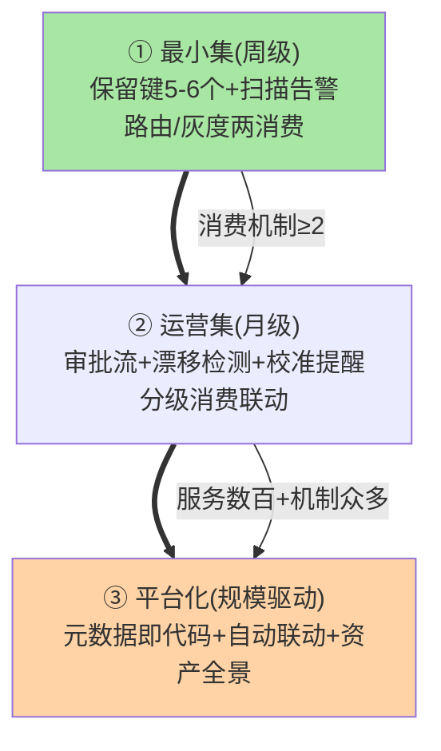
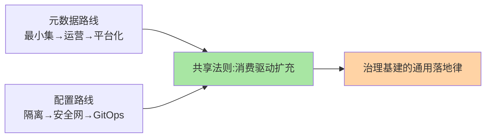

# 元数据最佳实践：从规范到平台化的路线

> 全系列收束篇：把元数据的定位、管理、消费沉淀为**落地路线**——起步最小集、进阶运营集、平台化终局，以及每一步的工具承载。

> **本文核心**：三阶段路线——**① 最小集**（保留键清单 + 注册扫描告警 + 治理消费起步：路由/灰度两机制先接）、**② 运营集**（变更审批流 + 漂移检测 + 校准提醒 + 分级消费联动）、**③ 平台化**（元数据即代码 + 自动联动 + 资产全景）。**机制链**：规范（篇 2）→ 消费（篇 3）→ 本篇的「落地节奏」——元数据治理的失败模式多为「一步登天」（平台大而全但无人录入），**从小集起步、随消费增长扩充**是存活路线。

## 一句话摘要

三阶段的取舍：**最小集**的性价比最高（保留键五六个 + 两个治理消费，覆盖八成价值，成本一周级）；**运营集**解决「保鲜」问题（漂移检测让元数据不过期——元数据的最大敌人是过期）；**平台化**是规模产物（服务数百、治理机制众多时，元数据的自动联动与资产全景才划算）。**判断自己的阶段**：看「元数据被多少治理机制消费」——消费机制少于两个停在最小集，消费驱动扩充而非规划驱动。

## 一、为什么「起步最小集」是存活关键

元数据治理的常见死法：平台大而全立项 → 录入成本高 → 服务负责人应付填 → 数据半年过期 → 治理决策被错误依据误导 → 信任崩塌弃用。**存活的关键是「录入成本极低 + 消费价值立现」**——保留键五六个（必填两三个）+ 立刻被两个机制消费（路由灰度立刻用起来），录入者看到价值才会持续维护——**价值闭环先于完备性**。

## 5W 速记卡

| 维度 | 一句话 |
|---|---|
| What | 三阶段落地路线（最小集/运营集/平台化）与阶段判断 |
| Why | 元数据治理死于大而全，活于小步与消费驱动 |
| When | 元数据治理立项、阶段升级决策 |
| Where | 治理平台 + 工具链 |
| How | 最小集起步 → 消费驱动扩充 → 平台化收束 |

## 二、三阶段路线全景（与配置治理路线模板同构）

**最小集的保留键建议**：`owner`（负责人，必填）、`sensitivity`（敏感级 P0-P2）、`route-tag`（路由标记，可选）、`sla`（SLA 承诺，可选）——四个键覆盖「找人/分级/定向/承诺」四个最基础治理动作；扫描告警挂注册中心（新实例无键即报）——**一周能上线的元数据治理才是活的起点**。

## 三、与配置治理的区别：路线对照

| 维度 | 元数据治理（本篇） | 配置治理（互指 config-center） |
|---|---|---|
| 起步重点 | 保留键 + 消费闭环 | 环境隔离 + 变更安全网 |
| 运营焦点 | 保鲜（漂移检测） | 变更安全（灰度回滚） |
| 平台化方向 | 资产全景 + 自动联动 | GitOps + 意图化 |

两者的路线模板同构（小集 → 运营 → 平台），**「消费驱动扩充」是共同的存活法则**——治理基建的通用落地律。

与配置治理的路线对照：

## 四、典型场景与误区

**典型场景**：治理体系立项（元数据最小集是第一批落地项——它是路由/灰度等机制的数据前提）、年度治理评审（元数据覆盖率/保鲜率/消费机制数三指标）、平台化立项（消费机制 ≥4 个、服务 ≥300 时成立项依据）。

**误区与不适用**：① 保留键照抄别家（人家的键不匹配自己的治理机制）——保留键由「自己的消费机制」倒推定义；② 元数据平台先于治理机制建设——平台建好了没有消费方（空转）；③ 指标只有覆盖率没有保鲜率——覆盖率 100% 但全过期的元数据是治理的假象。

## 五、💡 实战提示

- 💡 最小集一周上线法：保留键 4 个 + 扫描告警 + 路由灰度接消费——不做多余事
- 💡 三指标治理看板：覆盖率（有元数据的服务占比）/ 保鲜率（校准期内占比）/ 消费数
- 💡 阶段升级的判断口径：何时进什么——消费机制新增时扩消费，服务过百加漂移检测，数百服务再谈平台化

## 六、你们可能会问

**Q1：元数据治理和 CMDB 建设是一回事吗？**
高度重叠——CMDB 是「资源与配置项管理」的传统形态，服务元数据治理是其微服务化子集；区别在 CMDB 传统上重资产记录、元数据治理重「消费闭环」——以消费闭环为核心的 CMDB 演进是两者融合的正确姿势。

**Q2：元数据的录入者应该是谁？**
服务负责人（归属键自动从代码仓库同步，敏感级由负责人声明 + 安全团队审核）——「自动能取的不让人填」是录入成本的底线设计。

**Q3：怎么向管理层证明元数据治理的价值？**
用消费价值讲故事：一次机房切流（权重元数据）省了多少恢复时间、一次灰度（标记元数据）避免了多少故障面——**价值叙事用已发生的消费案例**，不用理论覆盖率。

## 七、开放问题

- 服务元数据与数据资产元数据、成本元数据（FinOps）的统一治理面——「全域元数据」的融合是平台化的远期方向，统一模型尚无行业标准。

## 八、自测三问

1. 三阶段路线各自的重点与升级判断？
2. 「消费驱动扩充」为什么是存活法则？
3. 价值叙事为什么用消费案例而不是覆盖率？

## 📎 核心带走

- **核心一句话**：元数据落地 = 最小集一周起步 + 消费驱动扩充 + 规模化平台化——价值闭环先于完备性
- **机制链**：保留键 4 个 + 扫描告警 + 两个消费机制 → 漂移检测运营 → 资产全景平台化
- **失效点/边界**：大而全立项必死；过期元数据是毒药；价值叙事用案例不用理论

## 📌 数据与事实声明

- 写于 2026-09-08，路线框架为治理落地实践的归纳
- 免责：阶段划分按组织规模与治理机制数调整

## 📚 参考资料

| 类型 | 标题 | 来源 |
|---|---|---|
| 关联系列 | 本系列篇 1-3 / config-center 系列 | docs/architecture/service-governance/ |
| 公开参考 | CMDB 演进与 FinOps 公开实践 | 技术社区公开文章 |
| 社区沉淀 | 元数据治理立项公开案例 | 技术社区公开文章 |
