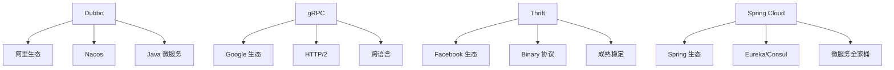
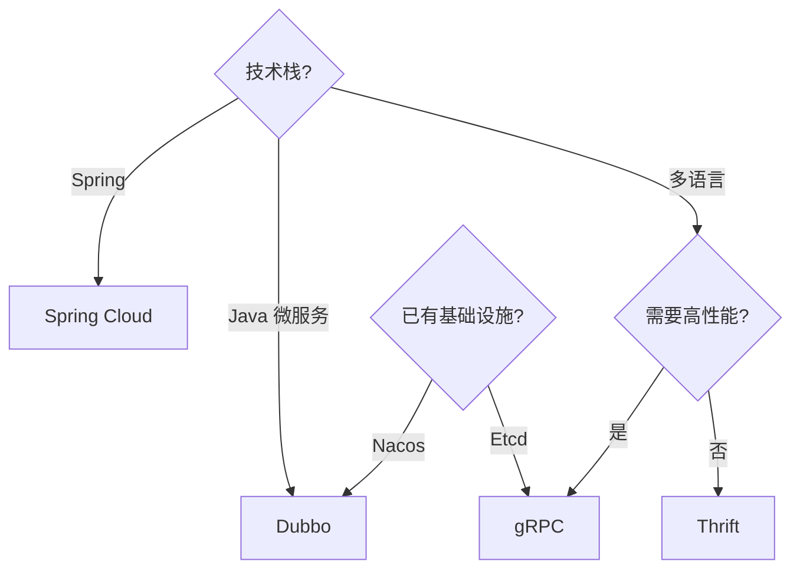

# RPC 框架选型决策

> **一句话摘要**：选型 = 业务需求 × 技术栈 × 团队能力——Dubbo/gRPC/Thrift/Spring Cloud 各有优劣。
> **本文核心**：**选型 = 一致性协议 + 生态 + 运维**。

前置阅读：[序列化协议深度解析](./特性层/深入理解序列化与协议系列/1_序列化协议深度解析-特性.md)。选型是在理解 RPC 核心机制后，根据业务需求做出决策。

## 1. 背景：为什么需要选型

主流 RPC 框架各有侧重：

- Dubbo：Java 微服务生态
- gRPC：跨语言 + HTTP/2
- Thrift：Facebook 出品，成熟
- Spring Cloud：Spring 生态

选型决策是 RPC 落地的关键一步。

## 2. 核心机制：框架对比

### 2.1 核心对比

| 维度 | Dubbo | gRPC | Thrift | Spring Cloud |
|---|---|---|---|---|
| 语言 | Java | 多语言 | 多语言 | Java |
| 协议 | Dubbo/HTTP2 | HTTP2 | Binary | HTTP |
| 序列化 | Hessian/Protobuf | Protobuf | Binary | JSON |
| 注册中心 | Nacos/ZooKeeper | Etcd | - | Eureka/Consul |
| 治理 | 限流/熔断/灰度 | 基础 | 基础 | 丰富 |
| 生态 | 阿里开源 | Google | Facebook | Spring |
| 性能 | 高 | 高 | 高 | 中 |
| 学习曲线 | 中 | 中 | 中 | 低 |

### 2.2 架构对比



## 3. 落地实践：选型决策

### 3.1 选型决策树



### 3.2 金融场景选型

| 场景 | 框架 | 理由 |
|---|---|---|
| 银行核心 | Dubbo | 阿里金融级保障 |
| 跨语言服务 | gRPC | HTTP/2 + 跨语言 |
| 遗留系统 | Thrift | 成熟稳定 |
| Spring 生态 | Spring Cloud | Spring 原生 |
| 高性能内部 | Dubbo | 高吞吐 |

## 4. 落地实践：配置清单

### 4.1 Dubbo 最小配置

```yaml
# Dubbo 配置
dubbo:
  application:
    name: order-service
  registry:
    address: nacos://nacos1:8848
  protocol:
    name: dubbo
    port: 20880
  serialization: hessian2
```

### 4.2 gRPC 最小配置

```yaml
# gRPC 配置
grpc:
  server:
    port: 8080
  client:
    target: dns:///order-service:8080
```

## 5. 生产视角：选型踩坑

- **踩坑 1**：选型不考虑团队能力——团队不熟悉 gRPC
- **踩坑 2**：选型不考虑现有生态——已有 Nacos 不用
- **踩坑 3**：选型追求新技术——gRPC 运维复杂
- **踩坑 4**：选型不考虑扩展——未来需要多语言

**生产最佳实践**：

1. 优先现有技术栈
2. 评估团队能力
3. 考虑未来扩展
4. 文档记录选型理由
5. 定期 review 选型

## 6. 典型场景

| 场景 | 框架 | 理由 |
|---|---|---|
| Java 微服务 | Dubbo | 阿里生态 |
| 跨语言 | gRPC | HTTP/2 + 多语言 |
| Spring 项目 | Spring Cloud | Spring 原生 |
| 遗留系统 | Thrift | 成熟 |
| 金融核心 | Dubbo | 金融级保障 |

## 7. 与相邻概念的区别

- **选型 vs 实现**：选型是决策，实现是编码
- **Dubbo vs Spring Cloud**：Dubbo 专注 RPC，Spring Cloud 全家桶
- **gRPC vs Dubbo**：gRPC 跨语言强，Dubbo Java 生态强
- **选型 vs 协议**：选型包含协议选择

## 8. 常见误区与不适用

- **「gRPC 一定更好」**：gRPC 运维复杂，Java 生态用 Dubbo 更合适
- **「Dubbo 只能 Java」**：Dubbo 3.0 支持多语言
- **「选型一次定终身」**：业务变化后需要重新选型
- **不适用场景**：单体系统不需要 RPC

## 9. 你们可能会问

- **Dubbo 和 Spring Cloud 能混用吗？** 能——但增加复杂度
- **gRPC 比 Dubbo 快吗？** 性能接近，gRPC 略快
- **选型考虑哪些因素？** 生态、性能、运维、团队
- **能自己实现 RPC 吗？** 能——但生产不建议

## 10. 一句话总结 + 5W 速记卡 + 自测三问

**一句话总结**：选型 = 生态 × 性能 × 运维——Dubbo 适合 Java 微服务，gRPC 适合跨语言。

**5W 速记卡**：

| 维度 | 内容 |
|---|---|
| What | Dubbo/gRPC/Thrift/Spring Cloud |
| Why | 各框架各有优劣 |
| When | 系统设计阶段 |
| Where | 所有 RPC 系统 |
| How | 需求 → 对比 → 选型 → 验证 |

**自测三问**：

1. 你的技术栈是什么？
2. 你的团队熟悉哪个框架？
3. 你的选型理由是什么？

---

**专题层完结**：RPC 框架选型决策已建立。

**🎯 核心带走**：

- **核心一句话**：Dubbo 适合 Java 微服务，gRPC 适合跨语言——选型看技术栈
- **链条复述**：技术栈 → 框架对比 → 选型 → 配置 → 验证
- **失效点与边界**：选型不考虑团队能力；选型不考虑现有生态

💡 **实战提示**：已有 Nacos 用 Dubbo；多语言用 gRPC；Spring 生态用 Spring Cloud。

**开放问题**：RPC 框架能混用吗？答案是：能——但增加复杂度，需要统一治理。

**决策（何时用）**：Java 微服务用 Dubbo；跨语言用 gRPC；Spring 生态用 Spring Cloud。
