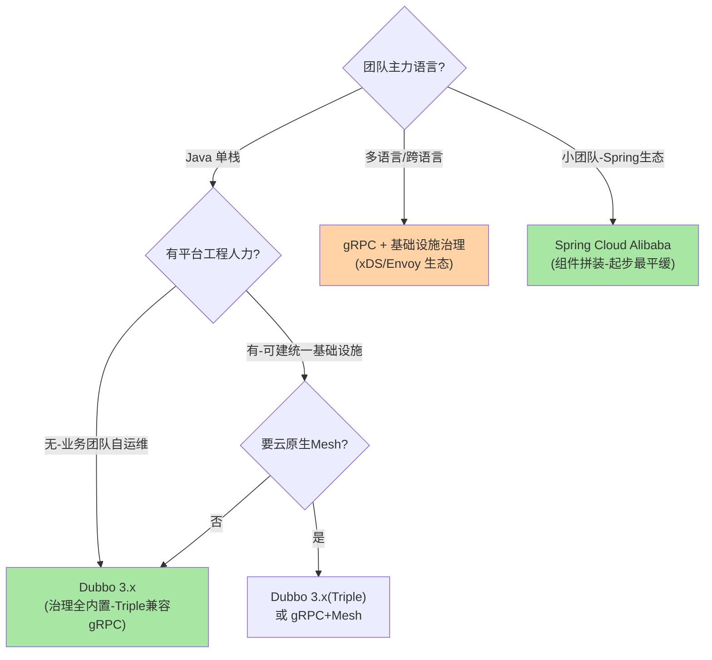
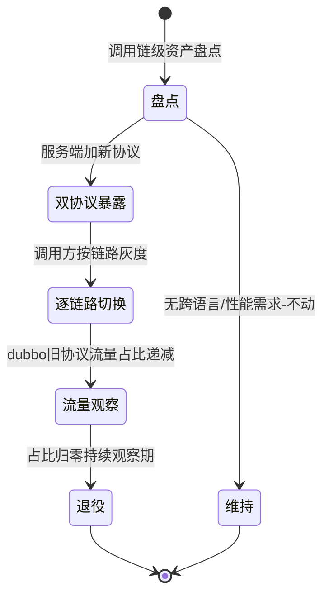
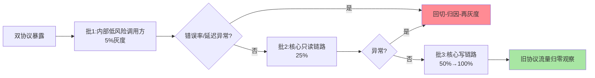
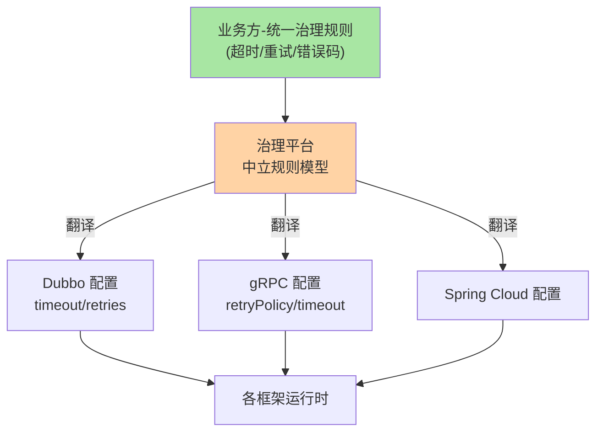

# RPC 框架选型决策与迁移路径：从对比表到落地节奏

> **本文核心**：框架选型的失败模式不是「选错了组件」，而是「用对比表代替决策过程」——本篇把选型还原为四步：**定约束**（语言栈/基础设施人力/存量资产三问）、**画决策树**（Java 单栈→Dubbo、多语言云原生→gRPC、小团队 Spring 生态→Spring Cloud Alibaba、存量异构→分区策略）、**算迁移账**（按调用链盘点而非按服务盘点，双协议暴露过渡，流量占比定义完成态）、**留退路**（协议标准化层隔离框架锁定）。**机制链**：约束输入 → 决策树分派 → POC 三场景验证（正常/故障/扩缩容）→ 迁移节奏（双跑对照→灰度切换→退役）→ 治理口径统一（超时/重试/错误码的平台化翻译）。

## 一句话摘要

四框架的真实差异在「治理放在哪」：Dubbo 放 SDK（治理全内置，Java 单栈最优）、gRPC 放基础设施（薄 SDK+生态补齐，多语言云原生最优）、Spring Cloud 放组件拼装（生态粘性换灵活性）、Thrift 放业务代码（极致性能自接管，治理裸奔）。**决策树的第一分叉是团队语言栈，第二分叉是基础设施人力，第三分叉才是性能**——性能差异（微秒级）在毫秒级业务延迟里占比不足 5%，而迁移成本（人年级）与治理自建成本被普遍低估。迁移的正确单位是「调用链」不是「服务」，完成态用流量占比定义而非配置状态。

## 一、为什么选型决策总在重演：三个被忽略的约束

每家公司都重演过同一场选型会：几轮对比表、一次 benchmark、一个「跟大厂对齐」的结论——半年后发现踩坑。重演的根源是三个约束从未进评审：

**约束一：团队语言栈的结构**。单语言 Java 团队与多语言团队的正确答案完全不同——这不是技术判断是组织事实：全功能 SDK（Dubbo）的多语言支持再好，也不如「各语言原生薄 SDK+统一协议」对多语言团队的摩擦小。**康威定律的选型版：框架边界镜像团队边界**。

**约束二：基础设施人力**。gRPC 路线的隐藏成本是治理生态（xDS/Envoy/服务发现集成）需要基础设施团队维护——没有这层人力，薄 SDK 就是裸奔（限流熔断路由全要自建）；Dubbo 的 SDK 内置治理正好相反：框架升级=全业务发版，但不需要平台团队。**「治理放 SDK 还是放基础设施」的本质是「组织有没有平台工程职能」**。

**约束三：存量资产的引力**。已有接口资产（IDL/注解/运维工具链/团队技能）构成迁移的成本底座——「更现代」的框架值得换的唯一场景是存量资产即将生命周期终结。**选型评审的输出必须包含「从现状到目标的迁移账」**，没有迁移账的选型是纸面结论。

## 5W 速记卡

| 维度 | 一句话 |
|---|---|
| What | 四框架选型的约束-决策-迁移-退路四步决策框架 |
| Why | 选型失败的模式是对比表代替决策、忽略组织约束 |
| When | 技术栈立项、混合体系治理、框架迁移评估 |
| Where | 架构评审 + POC 验证 + 迁移执行 |
| How | 三问定约束 → 决策树分派 → POC 三场景 → 调用链级迁移 |

## 二、决策树：三分叉定框架

决策树的阅读要点：**Java 单栈的默认答案是 Dubbo 3.x**（治理内置省自建、Triple 协议兼容 gRPC 留跨语言口、国内生态活跃）；多语言团队的第一候选是 gRPC，但前提确认「基础设施人力存在」，否则退回「gRPC 协议+各语言全家桶 SDK」的折中形态；Spring Cloud Alibaba 适合「Spring 深度使用的小中型团队」——组件拼装的灵活性收益最大，规模上来后再切 Dubbo 是常见路径（Nacos/Sentinel 组件无缝衔接，迁移摩擦小）。Thrift 在新项目决策树里基本出局（治理面缺失+社区活跃度走低），它出现在存量资产清单里而非未来架构里。

**量级演进视角**：十万级 QPS 以下——四框架的吞吐差异不构成决策因子，决策因子全在组织侧；十万级 QPS 以上——序列化与传输效率进入容量账（Protobuf 系的 CPU 优势实测可观），gRPC/Triple 的权重上升；百万级 QPS 或多机房大流量——连接规模与 Mesh 形态成为硬约束，协议标准化（HTTP/2 系）几乎是必选项——**性能因子随量级从「可以忽略」滑向「一票定音」**，选型评审要明确自己处在哪一档。

## 三、POC 验证：三个场景压出真实差异

对比表给不出「用起来的样子」，POC 的价值在三个必测场景：

**场景一：正常流量基线**——目标接口在真实数据结构下的吞吐与延迟分位（P50/P99），别用 benchmark 实验室的字符串回显——**真实业务对象（嵌套/大字段）的序列化差异才可信**。

**场景二：下游故障注入**——杀掉一半实例+注入延迟，看框架的容错行为（重试语义/熔断联动/摘除速度）与运维工具的定位效率——**故障场景的运维体验是框架成熟度的真正试金石**。

**场景三：扩缩容联动**——瞬时扩容 2 倍实例，测新实例接流量速度（服务发现推送→负载均衡生效）与缩容时的流量衰减——**弹性行为直接决定发布与故障自愈的体验**。

POC 输出的不是「谁快」而是三张表：性能分位表、故障运维表、弹性行为表——三张表进选型评审，结论才立得住。

## 四、迁移路径：按调用链推进的三个阶段

**阶段一：盘点（决策单位是调用链）**。迁移的颗粒度是「调用链」不是「服务」：服务端换协议前，先盘点全部调用方的协议能力与发版节奏——调用方都可控（同团队/同节奏）走「双协议暴露→调用方切换」；调用方不可控（跨团队/外部）走「网关协议转换」或长期双协议。**盘点的产出物是调用链清单**：每条链标注协议、发版归属、切换风险评估。

**阶段二：双协议暴露与灰度切换**。服务端同时暴露新旧协议（Dubbo 的多协议暴露原生支持），调用方按链路逐个切——每条链切换后观察错误率与延迟分位，异常即回切（配置级回滚）。**序列化兼容是这一阶段的头号风险**：Hessian2 换 Protobuf 的泛型透传接口要先改造为强类型 IDL（互指序列化系列篇 2 的事故）。

**阶段三：流量占比定义完成态**。旧协议流量占比归零、持续一个观察周期（如两周）才算退役——「配置改了」不等于「流量走了」，残留流量来自缓存调用方、脚本、未知消费者。**退役的验收标准是流量指标不是配置状态**。

**步骤级操作清单**（以 Dubbo2→Dubbo3 Triple 为例）：前置条件（双方框架版本支持、注册中心支持应用级服务发现）→ 第 1 步服务端加 triple 暴露（双协议并存）→ 第 2 步调用方逐链路切换（配置 protocol=triple，灰度比例控制）→ 第 3 步观察旧协议流量归零 → 第 4 步移除 dubbo 协议暴露 → 回退方案（调用方配置回切，服务端保留旧协议直到退役）。**参数级配置要点**：切换期超时口径按新协议实测重校（协议栈变化 RTT 有偏移）、连接数上限按新协议连接模型重算（HTTP/2 单连接多路复用 vs 私有协议多连接）。

### 迁移期的参数级配置清单

| 参数名 | 默认值 | 分档推荐值 | 为什么 |
|---|---|---|---|
| 协议暴露 | 单协议 | 过渡期双协议并存 | 回切退路：调用方可随时回旧协议 |
| 切换灰度比例 | 全量 | 5%→25%→50%→100% | 每档观察一个完整业务周期再进位 |
| 连接数上限（HTTP/2 单实例） | 1 连接 | 按并发分档 2-4 连接 | 单连接多路复用头部排队，高并发分连接 |
| 超时口径 | 沿用旧协议值 | 迁移后重校（±20%） | 协议栈变化 RTT 偏移，超时预算要重测 |
| 重试次数 | 框架默认 2 | 幂等读 1-2/写 0 | 与容错纪律一致，迁移期更保守 |
| 流量观察周期 | 无 | 退役前 2 周归零观察 | 残留流量来自脚本与缓存调用方 |

### 迁移切换的分批推进

分批推进的批设计把「写链路」放最后——写接口的兼容风险（序列化语义）高于读接口，出问题时它的影响面也最大，放在验证最充分的位置切换。

### 治理口径统一的翻译层

## 五、与数据库选型的区别：锁定成本的结构差异

| 维度 | RPC 框架选型 | 数据库选型 |
|---|---|---|
| 锁定载体 | 接口契约+SDK+运维链 | 数据格式+SQL 方言+运维链 |
| 迁移单位 | 调用链（可逐条） | 数据集（整体或分片） |
| 可逆性 | 双协议并存可回切 | 双写同步成本高 |
| 渐进路径 | 链路级灰度天然支持 | 分库分表级演进 |

RPC 迁移的可逆性显著好于数据库——双协议并存提供了「随时回切」的退路，这让「渐进迁移」成为标准打法；数据库的双写同步代价让它的迁移更像「断腕」。**选型评审把锁定成本的结构讲清楚（锁定什么、迁移单位、可逆性），比论证「哪个更好」更有价值**。

## 六、典型场景与误区

**典型场景**：新业务线技术栈立项（决策树全流程）；Java 单栈团队的跨语言口预留（Dubbo 3 Triple 一步到位）；存量 Dubbo2 体系升级（Triple 迁移三阶段）；混合体系治理（Java 系 Dubbo+Go 系 gRPC 并存，治理口径平台化统一）。

**常见误区**：① **用 benchmark 选框架**——实验室数字与真实业务对象的行为差异前面已拆；② **「一步到位上最新」**——跳过存量评估的激进切换，迁移账没算就开工；③ **迁移按服务推进**——服务端先切、调用方没跟，协议不兼容报错「随机」出现（其实是「随机」的调用方组合）；④ **退役不看流量**——配置下线即宣告完成，残留流量在深夜脚本里继续打旧协议；⑤ **双框架并存不统一治理口径**——超时/重试/错误码语义各说各话，排障在两套体系间对表成本翻倍。

## 七、事故与实践叙事

**事故一：按服务推进的迁移踩中调用方盲区**。某团队把订单服务从 Feign 切 Dubbo，按「服务」粒度两周完成——上线后库存服务（未在盘点清单里的调用方）持续报协议解析异常：它通过一个被遗忘的内部工具间接调订单。修复期间该工具的功能静默失败数天。复盘立规：**迁移盘点以「注册中心的调用关系数据」为准而非「文档接口清单」**——调用拓扑从注册中心的订阅关系导出，人写的清单必有盲区。

**事故二：迁移期超时口径未重校的延迟毛刺**。某平台切换 Triple 后 P99 抬升 40ms——协议本身更快，抬升来自连接模型变化：旧协议每实例多连接分散压力，新协议单连接多路复用后单连接并发度上升，头部排队延迟显现。重新校准连接数与超时预算（单连接上限+客户端连接池多实例分散）后回落。**教训**：协议迁移连着连接模型与超时预算，参数必须重测重配——「协议等价」不等于「参数等价」。

**实践叙事：混合体系的治理口径统一**。某电商 Java 系（Dubbo）与算法系（gRPC/Python）并存的治理实践：治理平台把「超时/重试/错误码语义」定义为一套中立规则模型，发布时翻译成各框架的原生配置（Dubbo 的 retries/timeout、gRPC 的 retryPolicy）——业务方面向统一口径配置，框架差异被平台吸收。错误码语义的统一（框架异常→统一错误模型→业务码映射）让跨栈排障的「对表」成本降到接近零。**多框架并存的终局不是消灭差异，是让差异只在平台层存在一次**。

## 八、设计思想：选型是「约束求解」不是「择优」

框架选型的方法论可以收成一个思想转换：**把「哪个框架最好」（无解的择优题）转换为「在我的约束下哪个代价结构可承受」（可解的约束题）**。约束清单（语言栈/人力/存量/量级）一旦显式化，答案空间通常收敛到一两个候选——择优题的争论（性能党 vs 生态党）在约束题里自动消解。这个转换的普适性超出框架选型：存储选型、消息队列选型、部署形态选型都是同一套「显式约束→代价结构→收敛解」的求解过程。**架构评审的质量取决于约束清单的诚实度**——隐藏的约束（比如「其实没有平台团队」）是选型事故的第一来源。

## 九、追问链

**质疑者第一层**：决策树把性能放第三位，万一业务就是延迟敏感（交易链路）呢？——延迟敏感的正确解法是「链路预算分解」：先测四框架在同一真实对象上的 P99 基线（差异通常在百微秒级），再对比业务延迟预算（毫秒级）的占比——**占比超过预算 10% 才值得为性能改决策**；更大的延迟收益通常在业务逻辑与数据访问层（缓存/索引），框架层优化是最后手段不是第一杠杆。

**质疑者第二层**：决策树没有「自研框架」选项，什么情况下自研是对的？——自研的成立条件极苛刻：有专职框架团队（至少数人年投入）、业务约束行业无解（超特殊协议/超规模）、且接受长期演进负担。多数「想自研」的真实诉求是「现有框架的可观测/治理不满足」——正确解法是扩展点定制（SPI 插件）而非造轮子。**自研决策的试金石：愿不愿意为它养五年团队**。

**质疑者第三层**：Mesh 普及后这套决策树还成立吗？——决策树的「基础设施人力」分支会越来越关键（Mesh=基础设施路线的极致形态），框架层的治理差异会被拉平，决策收敛到「协议与开发体验」两轴——决策树不是失效而是简化：**未来选框架越来越像「选协议+选 SDK 手感」，治理交给基础设施**。但那一天的前提是 Mesh 的运维成熟度普及——当前阶段决策树仍然完整成立。

## 十、你们可能会问

**Q1：POC 要投入多少人力与周期？**
两人两周是常见档：真实接口一条链、三场景脚本化、三框架各跑一遍——POC 的产出是三张表不是代码资产，别把 POC 做成预研项目。超过一个月的 POC 通常说明约束没定（在两个本不该比较的候选间纠结）。

**Q2：存量 Hessian2 接口要不要在框架升级时顺手迁 Protobuf？**
顺手迁是反模式——框架升级与序列化迁移是两个风险源，叠加灰度期的故障归因会互相污染。正确节奏：框架升级完成稳定一个周期后，按序列化系列的分区治理节奏单独立项。

**Q3：多注册中心/多框架并存的过渡期怎么治理？**
三个统一：注册数据统一（双注册/同步方案，保证调用拓扑全景可见）、监控口径统一（指标模型统一翻译）、治理口径统一（前文的平台翻译层）——**过渡期治理的预算通常被低估为「迁移的附属品」，实际是独立工程**。

**Q4：怎么向管理层汇报选型结论？**
一页纸结构：约束清单（三问答案）→ 决策树落点 → 三张 POC 表 → 迁移路线与预算（人日/风险/回退）——结论放最后，约束放最前，让评审者挑战约束而不是挑战结论。

## 💡 实战提示

- 💡 迁移盘点以注册中心调用拓扑导出为准——人写的接口清单必有盲区
- 💡 框架升级与序列化迁移分开立项——两个风险源叠加会让灰度期故障无法归因
- 💡 决策口径：Java 单栈默认 Dubbo 3、多语言+有平台人力选 gRPC、小团队 Spring Cloud Alibaba 起步、Thrift 只在存量清单
- 💡 选型推荐：评审输出四件套——约束清单、决策树落点、POC 三表、迁移预算与回退方案

## 十一、自测三问

1. 决策树的前三分叉按什么排序？（答：团队语言栈→基础设施人力→性能——组织约束优先于技术指标）
2. POC 三个必测场景？（答：真实对象性能基线、故障注入运维体验、扩缩容弹性行为——三张表进评审）
3. 迁移的决策单位与完成态标准？（答：调用链（不是服务）；旧协议流量占比归零+观察期（不是配置下线））

## 十二、开放问题

- 治理口径的中立规则模型——跨框架配置翻译的语义覆盖度（重试预算/熔断参数的语义对齐）尚无标准，平台自建是现状。
- Mesh 成熟度的时间表——「治理下沉基础设施」到什么程度决策树可以简化为两轴，取决于 Mesh 运维自动化的普及速度。

## 📎 核心带走

- **核心一句话**：框架选型 = 约束求解不是择优——三问定约束（语言栈/人力/存量）、决策树分派、POC 三场景验证、调用链级迁移、协议层留退路
- **机制链**：约束输入 → 决策树分派 → POC（性能/故障/弹性三表）→ 盘点调用链 → 双协议暴露 → 逐链灰度切换 → 流量占比退役 → 治理口径平台化统一
- **失效点/边界**：性能因子在十万级 QPS 以下不构成决策依据；迁移盘点以注册中心调用拓扑为准；协议迁移连着连接模型与超时预算重校；多框架并存必须平台层统一治理口径

## 📌 数据与事实声明

- 写于 2026-09-15，框架能力以各官方文档为基准（Dubbo 3.x/gRPC 1.x/Spring Cloud 现行版，公开口径）
- 性能占比与提升数字为方法论量级，具体以 POC 实测为准
- 免责：选型结论按组织架构评审

## 📚 参考资料

| 类型 | 标题 | 来源 |
|---|---|---|
| 官方文档 | Dubbo 3 迁移指南 / gRPC 概念 | dubbo.apache.org、grpc.io |
| 关联文章 | 入门层篇 12（框架对比）、篇 13（协议选型）、特性层序列化系列 | 本仓库 |
| 原理书 | 《数据密集型应用系统设计》DDIA | 公开出版 |
