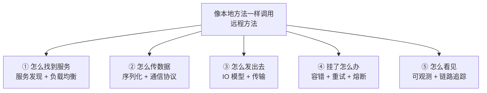
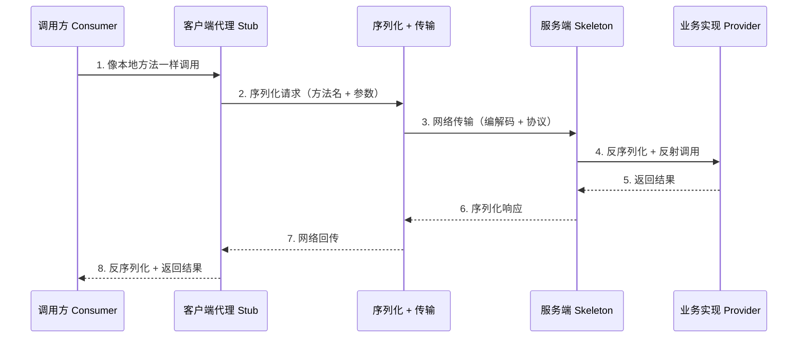
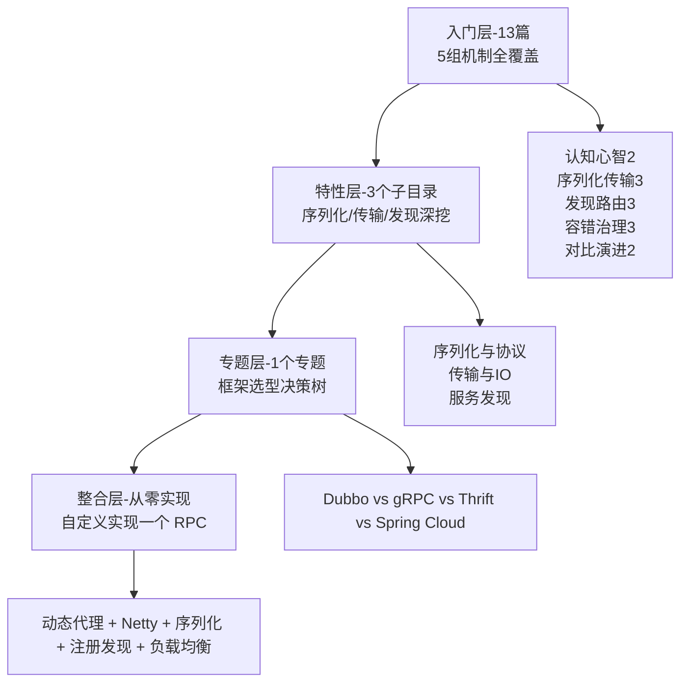

# RPC 系列导读 · 一次调用的一生

> 📖 本系列共 14 篇（0_导读 + 13 正文），覆盖 RPC 机制整个知识面：认知心智、序列化传输、发现路由、容错治理、对比演进。
> 本篇是第 0 篇导读：先建立「一次调用的一生」心智模型，再决定读哪条路。

## 一、为什么需要这套系列

RPC（Remote Procedure Call，远程过程调用）是分布式系统的「通信底座」：微服务之间、跨进程、跨机器调用，都靠它。但学 RPC 常见两种极端：

- **只背概念**：知道「RPC = 远程过程调用」，但不清楚一次调用背后发生了什么，出了问题不知道从哪查
- **只会用框架**：会用 Dubbo、Spring Cloud 的注解把服务调通，但不理解底层机制，调参、排障、选型全靠猜

这套系列的设计思路：**先建立「一次调用的一生」心智模型，再逐个拆解机制**。主线是「一次远程调用要解决哪些问题」，支线是每个机制（序列化 / 传输 / 发现 / 容错）的具体方案。先会「看清调用链路」，再会「理解每个环节」，最后会「从零实现一个 RPC」。

## 二、全局心智模型：一次调用的一生

一次远程调用，对使用者来说就是「调了个方法」，但背后要解决 5 类问题：

一次调用的完整链路（从代理到返回）：

> tips：(知识地图) 这 5 类问题就是本系列 5 组篇目的主干：「找得到 → 传得动 → 发得出 → 扛得住 → 看得见」这条主线贯穿 5 组篇目。

## 三、系列导航表（13 篇）

| 序号 | 篇目 | 深度 | 一句话定位 | 对标参考 |
|---|---|---|---|---|
| 0 | 系列导读 | 全景 | 一次调用的一生心智模型 + 阅读路径 | - |
| 1 | RPC 是什么与为什么需要 | 入门 | 本地 vs 远程 / 演进 / 与 HTTP 关系 | 官方文档 |
| 2 | 一个 RPC 调用的一生 | 入门 | 代理→序列化→传输→反序列化→执行→返回 | 华钟明《深入理解 RPC》 |
| 3 | 序列化协议全景 | 入门 | JSON/Hessian2/Protobuf/Java 原生 | 官方文档 |
| 4 | 通信协议与传输 | 入门 | TCP/HTTP2/长连接/粘包拆包 | 官方文档 |
| 5 | IO 模型与 Netty | 入门 | BIO/NIO/Epoll/Reactor/线程模型 | Netty 权威指南 |
| 6 | 服务发现与注册中心 | 入门 | 注册/订阅/健康检查/一致性 | 官方文档 |
| 7 | 负载均衡策略 | 入门 | 随机/轮询/加权/一致性哈希/最少活跃 | 官方文档 |
| 8 | 服务路由与灰度 | 入门 | 条件路由/标签路由/泳道 | 官方文档 |
| 9 | 集群容错与重试 | 入门 | failover/failfast/failsafe/超时/幂等 | 华钟明《深入理解 RPC》 |
| 10 | 限流熔断降级 | 入门 | RPC 场景的稳定性三件套 | 官方文档 |
| 11 | 可观测与链路追踪 | 入门 | 指标/日志/调用链/trace | 官方文档 |
| 12 | 主流 RPC 框架对比 | 入门 | Dubbo/gRPC/Thrift/Spring Cloud | 官方文档 |
| 13 | RPC 协议与选型 | 入门 | dubbo:// / triple:// / HTTP2 / thrift | 官方文档 |

## 四、从点到面：四层进阶路径

入门层 13 篇把 RPC 机制铺全之后，真正的深度在后面三层——这也是本系列「从点到面」的设计：

| 层级 | 定位 | 规模 | 适合 |
|---|---|---|---|
| 入门层 | 点：每个机制一篇，建立完整认知 | 13 篇 | 所有读者必读 |
| 特性层 | 点 × 深：重点机制源码级挖透 | 3 个子目录 × 2-4 篇 | 按兴趣挑重点 |
| 专题层 | 面：框架对比 + 选型决策 | 1 个专题 | 选型时读 |
| 整合层 | 体系：从零实现，理解机制本质 | 1 篇 | 想真正吃透时读 |

## 五、入门读者最容易踩的 3 个认知误区

### 误区 1：以为 RPC = HTTP 封装

「RPC 不就是用 HTTP 传个 JSON 嘛」是常见误解。RPC 是**一个思想**（像本地调用一样调远程方法），HTTP 只是**一种传输实现**。真正的 RPC 框架有序列化、协议、服务发现、负载均衡、容错等一整套机制，HTTP + JSON 只是最简化的一种组合。gRPC（基于 HTTP/2）和 Dubbo（默认自有协议）都是 RPC，但协议和序列化完全不同。

### 误区 2：以为会用框架 = 懂 RPC

「会写 Dubbo 注解、能调通服务」不等于「懂 RPC」。框架帮你屏蔽了序列化、传输、注册发现、容错等机制，但也屏蔽了你对这些机制的理解。出了问题（超时、丢包、负载不均、雪崩）时，不懂底层机制就只能猜。本系列的价值就在于把框架屏蔽的那层「掀开」看。

### 误区 3：以为 RPC 就是「快一点的 HTTP 调用」

「RPC 比 HTTP 快」这种说法太粗糙。RPC 的价值不在「快」，而在**「像本地方法一样调用」的抽象**：类型安全、接口契约、服务治理、容错策略，这些都是「裸 HTTP 调用」不具备的。而且快不快取决于协议和序列化选型，不是「RPC」这个标签本身。

> tips：(三点区分) RPC 是「思想」不是「HTTP 封装」；会「用框架」不等于懂「机制」；价值在「抽象 + 治理」不是单纯「更快」。这三个误区是新手最容易栽的，正文里每个都对应多篇讲透。

## 六、怎么读这套系列

- **零基础 / 刚入行**：从 0 按顺序读到 13，每天 2-3 篇，一周建立完整 RPC 机制认知
- **有 1-3 年经验**：先读 1-2（认知心智），再重点读 3 序列化、5 Netty、6 注册发现、9 容错（工作里最常接触的 4 个），然后进特性层看源码级实现
- **要选型 / 对比**：直接读 12-13 + 专题层决策树
- **想彻底吃透**：读完入门层后进整合层，从零动手实现一个 RPC

---

下一篇将讲 **1_RPC 是什么与为什么需要**：本地调用和远程调用差在哪、RPC 怎么演进、它和 HTTP 到底是什么关系——待正文落盘后补链接。
