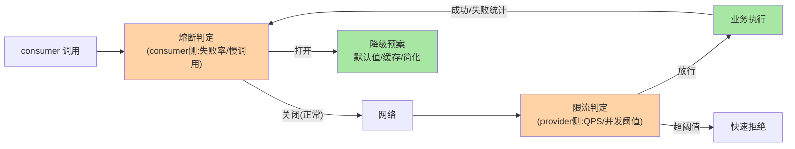
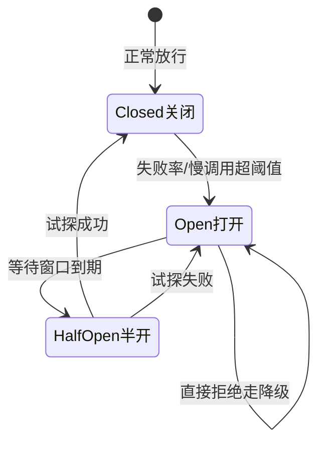

# RPC 的限流熔断降级：调用链上的稳定性三件套

> **本文核心**：RPC 调用链上的三道稳定性防线——**限流**（provider 视角：进来的流量扛不住就快速拒绝，保护自身容量）、**熔断**（consumer 视角：下游持续失败时停止调用直接走降级，防止被故障下游拖死）、**降级**（用户视角：返回默认值/缓存/简化逻辑，兜底体验不降为零）。**机制链**：consumer 调用 → 限流判定（provider 保护自身）→ 业务执行 → 失败率统计（consumer 熔断判定）→ 熔断打开 → 走降级 → 半开试探恢复。三件套视角正交、各管一段，组合起来才是完整韧性。

## 一句话摘要

**限流**管「我能服务多少」（容量边界，provider 侧自保）、**熔断**管「下游还靠不靠谱」（依赖健康，consumer 侧自保）、**降级**管「拒绝之后给什么」（体验兜底，业务侧预案）——三者的触发条件、执行位置、动作完全不同却常被混为一谈。一句话判断：**流量太大找限流、下游坏了找熔断、拒绝之后给什么找降级**。算法与参数级细节深挖互指 stability 系列的限流算法/熔断器/降级策略篇。

## 5W 速记卡

| 维度 | 一句话 |
|---|---|
| What | 调用链上的三道稳定性防线：限流/熔断/降级 |
| Why | 故障会顺调用链传播，防线决定爆炸半径 |
| When | 过载（限流）、下游故障（熔断）、拒绝后兜底（降级） |
| Where | 限流在 provider、熔断在 consumer、降级在业务层 |
| How | 限流判定 → 执行 → 失败统计 → 熔断开闭 → 降级预案 |

## 二、三道防线的位置与协作

**位置决定视角**：限流必须在 provider（只有服务自己知道自己扛多少）；熔断必须在 consumer（只有调用方知道下游失败率）；降级横跨两层（熔断打开走降级、限流拒绝走兜底）。**一次完整故障演练的时间线**：下游过载变慢 → consumer 统计慢调用比例超阈值 → 熔断打开 → 流量走降级预案 → 下游压力下降恢复 → 半开试探 → 熔断关闭——三件套联动就是「故障自愈」的机制骨架。

**量级演进视角**：千级 QPS 单依赖链——框架默认熔断参数即可（甚至裸跑也行）；万级 QPS 多依赖链——限流阈值按压测分档（P99 容量的 80% 设限）、熔断按依赖分级（核心依赖只降级不熔断）；十万级 QPS——三件套全链路联动治理（限流阈值联动容量水印、熔断联动路由摘除、降级预案分级启用）——**稳定性机制的档位随调用链深度与流量增长而升级**。

## 三、熔断器的三态转换

三态一句话：**关闭时正常放行并统计，打开时快速拒绝走降级，半开时放少量请求试探恢复**。工程细节三则：① 触发指标双轨——失败率（快速失败型故障）与慢调用比例（性能退化型故障，响应慢不算失败但拖死线程池）都要统计；② 统计窗口与最小请求数——窗口太短抖动误熔断，请求数太少小流量误触发（「10 个请求错 5 个」在 QPS 20 时毫无意义）；③ 半开试探的并发要限制（如 3 个请求），试探成功才全量恢复——**熔断参数没有万能默认值，但「窗口+最小请求数+双指标」是参数设计的固定骨架**。

**Trade-off 视角**：熔断灵敏度与稳定性的取舍——阈值设得灵敏（失败率 30% 就打开）止损快但误熔断多（下游抖一下就切换降级，成功率反而被降级预案拉低）；阈值迟钝（失败率 80% 才打开）误伤少但止损慢（故障期间把调用方线程池也拖垮）。生产口径：**按下游重要性分级**——核心依赖（支付/库存）阈值宽松+降级预案重（缓存兜底），非核心依赖（推荐/营销）阈值灵敏+降级预案轻（返回空列表）——**没有全局最优灵敏度，只有按依赖分级的配置**。

## 四、与集群容错的区别：三层防线对照

| 维度 | 集群容错（互指篇 9） | 熔断 | 限流 |
|---|---|---|---|
| 视角 | 单次失败的处置 | 连续失败的止损 | 总量超载的自保 |
| 触发 | 单次调用异常 | 失败率/慢调用比例 | QPS/并发超阈值 |
| 动作 | 换节点重试/报错 | 打开断路器走降级 | 快速拒绝 |
| 位置 | consumer 集群层 | consumer 统计层 | provider 入口层 |

**易混点辨析**：容错与熔断都在 consumer，但容错管「这一次失败了怎么办」（单次语义），熔断管「连续失败要不要停」（统计语义）——下游偶发超时是容错的事（failover 换节点），下游持续报错是熔断的事（别再打了）；下游真故障时 failover 的重试反而给故障实例所在集群加压——**熔断打开后应停止重试**，两者必须联动。

## 五、典型场景与误区

**典型场景**：大促流量洪峰（网关层限流保护后端容量）；下游服务 GC 抖动（consumer 熔断切换降级读缓存）；核心接口保护（provider 对非核心来源限流，保障核心调用方配额）；雪崩预防（每个 consumer 都配熔断，故障不沿链路级联传播）。

**常见误区**：① **限流阈值拍脑袋**——「配 1000 QPS 吧」没有压测依据，阈值必须来自容量评估（压测 P99 达标时的最大 QPS × 安全系数 0.8）；② 熔断打开后没有降级预案——熔断只是「不调了」，降级才是「给什么」，两者必须成对设计（熔断无降级 = 用户体验直接断崖）；③ 降级预案从未演练——线上启用降级时才发现预案代码抛 NPE（默认值分支三年没人走过）——**降级路径要用故障演练定期激活**；④ 限流只看 QPS 不看并发——慢接口（单次 2 秒）按 QPS 限流时线程池照样被打满，慢接口应按并发数限流；⑤ 熔断恢复立即全量——半开试探失败直接回打开，试探成功也要渐进恢复。

## 设计思想：从「尽力而为」到「失败前置」

三件套的共同哲学：**让失败发生在最便宜的位置**。限流让超额请求在入口就被拒（成本：一次判断）；熔断让故障依赖的调用在出门前就被拦（成本：一次统计查询）；不设防线的系统，失败发生在最深的位置——线程池耗尽、连接堆积、内存溢出，修复成本是重启集群。**分布式系统的韧性 = 把失败前置的能力**，这与「快速失败优于慢速失败」的通用设计原则同源。另一层设计思想是「预案即代码」：降级逻辑与主逻辑同等对待（有测试、有监控、有演练）——**预案不是文档里的 if-else 描述，是可执行可验证的代码路径**。

## 追问思考

**质疑者视角**：熔断会不会「误伤」——下游只是慢了 10%，熔断器却把调用全切了？会，这正是双指标设计的原因：慢调用比例阈值要远高于失败率阈值（失败 50% 才叫故障，慢 50% 可能只是高峰）。更尖锐的追问：**降级预案本身会不会成为新的故障源**——百万 QPS 切到缓存兜底，缓存被打爆怎么办？预案设计必须做「降级路径的容量评估」：降级流量有多大、兜底组件扛不扛得住、要不要再叠一层限流——**降级是把流量从 A 通道切到 B 通道，B 通道的容量问题不因切换而消失**。

**事故视角**：某服务依赖的推荐服务变慢（P99 从 50ms 涨到 3s），未配熔断——调用方线程池 200 线程全部阻塞在推荐调用上，该服务自身所有接口（包括不依赖推荐的健康检查）全部超时——上游连锁熔断，故障从推荐服务扩散到整个交易链路。修复：所有 RPC 依赖默认配熔断 + 线程池隔离（推荐调用走独立线程池，故障不传染）——**「未熔断的依赖」是链路里的公共炸弹，任何一个都能引爆全局**。

**追问链**：为什么限流在 provider 而不是让 consumer 自觉？——consumer 的调用总量不受单个 consumer 控制（数百个调用方的总量只有 provider 自己看得见），且「自觉限流」缺乏公平性仲裁（谁该被拒）——**配额仲裁权必须在资源拥有方**。追问：限流被拒的请求怎么办？——分级处理：能重试的进队列延迟重试（削峰填谷）、能降级的走兜底、不能损失的快速失败返回明确错误码——**拒绝不是终点，拒绝后的处置设计才是限流方案的完整形态**。

## 💡 实战提示

- 💡 限流在 provider 侧、熔断在 consumer 侧——两层各自独立配置，别指望单侧防护
- 💡 降级预案必须提前编写并演练（故障演练定期激活降级路径）——线上现写降级为时已晚
- 💡 熔断阈值按依赖分级：核心依赖宽松+重预案，非核心依赖灵敏+轻预案
- 💡 决策口径：流量太大找限流、下游坏了找熔断、拒绝之后给什么找降级——先判断问题属于哪一层

## 你们可能会问

**Q1：限流算法选哪种？**
计数器（简单但临界突刺）、滑动窗口（平滑统计）、漏桶（恒定速率，削峰）、令牌桶（允许突发，最常用）——RPC 场景默认令牌桶（正常流量有天然突发性）；强平滑要求（对接外部系统）用漏桶。算法细节与参数推导互指 stability 系列限流算法篇。

**Q2：熔断的统计是单机还是全集群的？**
单机——每个 consumer 实例独立统计自己视角的失败率并独立熔断，**无需中心协调**（这也是熔断能毫秒级生效的原因）。代价是各实例熔断状态可能不一致（有的开了有的没开），但统计意义上的保护目标已达成。

**Q3：核心链路不敢熔断怎么办（如支付）？**
分级：核心依赖「只降级不熔断」——异常时直接走降级（老数据兜底/异步补偿），但保持调用不断路（后续恢复自动接上）；或熔断窗口设短（10 秒级）快速试探恢复——**不是所有依赖都适合同一种熔断策略，风险偏好按业务定**。

## 八、自测三问

1. 三件套各自的视角、位置与动作？（答：限流 provider 自保（快速拒绝）、熔断 consumer 止损（断路走降级）、降级业务兜底（默认值/缓存）；「流量太大找限流、下游坏了找熔断」）
2. 熔断三态是什么？恢复怎么设计？（答：Closed→Open→HalfOpen；半开限流试探、成功渐进恢复、失败回 Open）
3. 限流阈值怎么定才科学？（答：压测容量（P99 达标最大 QPS）× 安全系数 0.8，按调用方来源分级配额）

## 开放问题

- 自适应限流（按实时负载水位动态调阈值，如 BBR 思路/联动 CPU 与 RT 水印）替代静态阈值——Sentinel/Envoy 都在推进，参数更少但要防振荡。
- 熔断与路由的联动自动化（熔断打开自动降低实例权重）——止损机制从「拒绝」向「避让」演进。

## 📎 核心带走

- **核心一句话**：RPC 稳定性三件套 = 限流（provider 容量自保）+ 熔断（consumer 依赖止损）+ 降级（业务体验兜底）——三层正交组合
- **机制链**：限流判定 → 业务执行 → 失败/慢调用统计 → 熔断开闭 → 降级预案 → 半开试探恢复
- **失效点/边界**：限流不防下游故障（熔断的活）；熔断不解决容量不足（限流/扩容的活）；降级预案必须演练否则是纸面防线

## 📌 数据与事实声明

- 写于 2026-09-10，机制为 Sentinel/Resilience4j/Envoy 的共识口径；阈值参数为方法论建议非统计数据
- 免责：以各框架官方文档为准

## 📚 参考资料

| 类型 | 标题 | 来源 |
|---|---|---|
| 官方文档 | Sentinel / Resilience4j CircuitBreaker | sentinelguard.github.io、resilience4j.readme.io |
| 官方文档 | Envoy 熔断与 outlier 检测 | envoy.io |
| 关联系列 | 本仓库 stability 系列（限流算法/熔断器深度互指）、cluster-fault-tolerance 系列 | docs/architecture/ |
