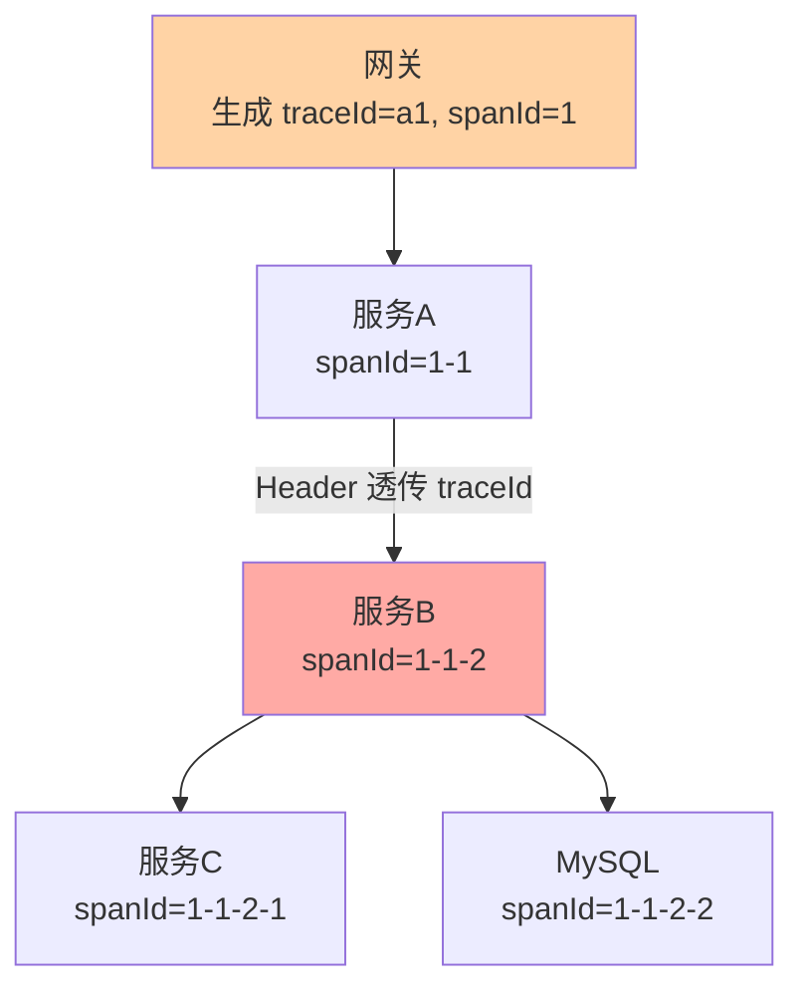
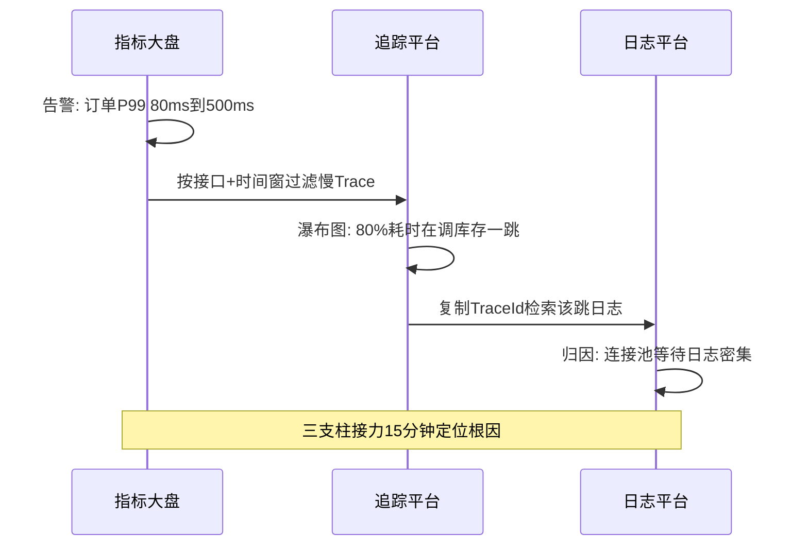

# RPC 的可观测与链路追踪：调用链的透明化

> **本文核心**：RPC 调用跨进程跨机器，故障定位不能再靠「单机看日志」——可观测三支柱把调用链透明化：**指标**（QPS/RT/错误率的 Red 三元组，发现异常）、**日志**（traceId 串联跨服务日志，归因细节）、**链路追踪**（Span 树形结构，定位慢在哪一跳）。**机制链**：traceId 入口生成 → MDC/ThreadLocal 注入 → 跨服务 Header 透传 → 每跳 Span 记录（开始/结束/标签）→ 追踪平台聚合瀑布图。三根支柱正交互补：**指标发现异常、日志归因细节、追踪定位路径**。

## 一句话摘要

一次跨三级服务的调用变慢，排障问题依次是「慢了吗（指标）→ 慢在哪一跳（追踪）→ 那一跳为什么慢（日志）」——三支柱分别回答三个问题，缺一根都会卡住排障链条。追踪的机制核心是 **traceId（全局唯一，一次调用一个）+ spanId（每跳一个，构成父子树）+ 透传（Header 跨服务携带）**——观测体系机制深挖互指 stability 系列的监控/告警/追踪篇。

## 5W 速记卡

| 维度 | 一句话 |
|---|---|
| What | 指标/日志/追踪三支柱对 RPC 调用链的透明化 |
| Why | 跨服务故障无法靠单机信息定位，需要全链路视角 |
| When | 排障（定位慢与错）、容量评估（看流量分布）、依赖治理（看拓扑） |
| Where | 框架拦截器埋点 + 追踪平台聚合 |
| How | traceId 生成 → 上下文注入 → Header 透传 → Span 上报 → 瀑布图 |

## 二、链路追踪的机制拆解

**Span 的三个要素**：名称（方法/资源标识）、时间对（开始/结束时间戳，算出本跳耗时）、标签（服务名/实例/状态码/自定义业务标记）。**父子关系构成调用树**——瀑布图里能看到总耗时 100ms 中，服务 A 自身 20ms、调 B 耗时 70ms、B 内部调 C 耗时 60ms——**层层展开就找到耗时大头**。透传的工程载体是协议扩展头（W3C Trace Context 的 `traceparent` 头、Dubbo 的 attachments、gRPC 的 metadata）——**上下文跨线程（异步调用）与跨进程（远程调用）的传递是追踪实现的两大难点**：跨线程靠装饰线程池（复制上下文），跨进程靠协议头（互指 RPC 篇 2 请求 ID 与链路锚点）。

**量级演进视角**：千级 QPS——全量采样无压力，追踪平台随便上；万级 QPS——Span 上报的带宽与存储成本显现，头部采样（100% 保留异常+慢调用，正常调用按 1%~10% 采样）；十万级 QPS——采样策略精细化（按接口分级：核心接口高采样率、边缘接口低采样，错误全量保留）+ 客户端聚合降耗——**观测数据的成本与价值的平衡，靠采样策略解决**。

## 三、三支柱的分工与联合

| 支柱 | 回答什么 | 数据形态 | 典型工具 |
|---|---|---|---|
| 指标 Metrics | 系统健康吗（趋势） | 时序聚合数字 | Prometheus/Micrometer |
| 追踪 Tracing | 慢/错在哪一跳（定位） | Span 树/瀑布图 | OTel/Jaeger/SkyWalking |
| 日志 Logging | 那一跳的细节为什么（归因） | 事件文本 | ELK/Loki |

**联合排障的标准动作**：指标大盘告警（订单服务 P99 从 80ms 涨到 500ms）→ 追踪平台按接口+时间过滤慢 Trace（80% 的慢调用耗在调库存服务这一跳）→ 复制 TraceId 检索该跳日志（库存服务在 14:00 后数据库连接等待日志密集）→ 三根支柱接力，15 分钟定位「库存服务连接池耗尽」。这套动作值得写成团队的排障 SOP 固化下来——告警里的接口名与时间窗是追踪平台的检索键，TraceId 是日志平台的检索键，**每个平台的输出正好是下一个平台的输入**，接口顺畅则排障是流水线，接口断裂（比如日志里没打 traceId）则退回人肉时代。**只有指标的排障**：知道慢了但不知道哪一跳；**只有日志的排障**：海里捞针；**只有追踪**：知道哪跳慢但看不到业务上下文——三支柱是排障链条的三环，断任何一环都退化为猜。

**Trade-off 视角**：观测精度与性能开销的取舍——全量追踪的埋点/序列化/上报开销约 1%~3% 性能损耗（同步上报更高），低延迟场景不可忽略；完全不开观测则是排障裸奔。生产口径：**埋点常开 + 上报异步 + 采样控制**——埋点本身开销微小（纳秒级打时间戳），大头在上报，异步批量上报+采样后综合开销可压到 0.5% 以内——**用异步化把观测成本从「性能问题」降为「背景噪音」**。

## 四、与日志排障的区别：从大海捞针到按图索骥

传统日志排障：拿到报障时间点 → 逐台机器 grep 时间窗日志 → 人肉拼接跨服务调用顺序——三级链路的排障起点是「先找出这次请求走了哪些机器」。追踪体系把这个过程结构化：TraceId 一次检索拉齐全链路日志、瀑布图直接可视化调用拓扑与耗时分解——**追踪没有替代日志，是把日志的组织方式从「按机器+时间」重构为「按调用链」**。这也是为什么 traceId 必须打进每一行业务日志（MDC 自动注入）——日志因 TraceId 而获得链路视角。

## 五、典型场景与误区

**典型场景**：延迟毛刺排查（瀑布图定位到 GC 停顿或慢 SQL 跳）；依赖拓扑梳理（追踪平台自动生成服务调用关系图，替代人工维护的架构图）；容量规划（按接口的流量分布数据决定扩容对象）；灰度验证（对比新旧版本的 Trace 耗时分解，互指路由灰度篇）。

**常见误区**：① **traceId 不透传就断链**——某一级服务没接框架拦截器，Trace 到这里断掉，后续全部变孤儿段；新服务接入时「透传自测」应是上线检查项；② 异步调用丢上下文——自建线程池没包装，异步段拿不到 traceId（MDC 是 ThreadLocal 实现，线程切换即丢）；③ 只看平均延迟——P99 才暴露长尾，追踪平台要按分位数过滤慢 Trace；④ 采样把错误也采没了——低采样率下「成功调用稀疏正常」，但错误 Trace 必须全量保留（排障最需要的就是它们）；⑤ 指标粒度太粗——只看服务级指标看不出接口级退化，Red 指标要按「服务×方法」两级打。

## 设计思想：观测是治理的前提

回看治理域各机制：熔断需要失败率统计（观测）、负载均衡需要响应时间数据（观测）、路由灰度需要效果验证（观测）、容量规划需要流量分布（观测）——**几乎所有治理决策的输入都来自观测数据**。这就是「可观测性优先」的架构含义：没有观测的治理是盲调，观测数据的质量决定治理能力的上限。OpenTelemetry 把指标/日志/追踪统一为一套协议（三个信号共享 trace 上下文）正是这一思想的标准化——**三支柱不是三个工具，是同一事实的三个投影**。

## 追问思考

**质疑者视角**：全链路追踪的「全」是个幻觉——采样决定了你看到的是调用链的抽样切片而非全貌；异步/批量/流式调用的 Span 语义至今没有完美建模；跨公司边界（第三方调用）的 Trace 无法打通。**观测的工程现实是「有偏采样下的近似还原」**——排障时「采样恰好没采到那次失败调用」是常态而非例外，所以错误必须全采、日志必须兜底——三支柱互为冗余的设计正是对「观测必然有缺口」的工程补偿。

**事故视角**：某团队上线新服务后偶发超时，追踪平台显示慢调用都停在「新服务调缓存」一跳，但缓存侧监控显示一切正常——排查两天无果，最终发现新服务的追踪 SDK 版本有 bug，Span 结束时间重复上报导致耗时被夸大。教训：**观测系统自身也需要被观测**（SDK 版本管理、上报链路监控、数据合理性校验）——观测基础设施出 bug 比没有观测更误导排障。

**追问链**：为什么 W3C 要为 traceparent 定标准头？——没有标准时各家追踪 SDK 头格式互不相认（B3/ Jaeger/自研头并存），跨系统透传即断链；标准头让「厂商中立」的透传成为可能，追踪数据的所有权从工具回归业务。追问：什么数据不该放进 Span 标签？——高基数值（userId/订单号做标签会让存储索引爆炸）与敏感数据（手机号/证件号进追踪平台=隐私出域，必须脱敏）——**Span 标签是索引进而影响存储成本，标签设计要按查询场景倒推**。

## 💡 实战提示

- 💡 traceId 用 W3C Trace Context 标准头（traceparent）——与 OTel 生态兼容，跨厂商不断链
- 💡 Red 三指标（Rate/Errors/Duration）按「服务×方法」两维进基础大盘——RPC 健康的心电图
- 💡 自建线程池必须包装（上下文复制）——异步丢 traceId 是断链头号原因
- 💡 决策口径：有观测平台走 OTel 统一接入，无平台先手工 traceId+MDC——先有链路再谈体系

## 你们可能会问

**Q1：采样率怎么定？**
按流量与成本倒推：平台能扛的 Span 速率 ÷ 总调用速率 = 基础采样率；再叠加策略（错误全采、慢调用全采、核心接口提升采样率）。QPS 1 万的服务基础采样 1% + 错误全采，通常已够排障。

**Q2：TraceId 和 RPC 的请求 ID 什么关系？**
请求 ID 是**协议层**概念（关联一次请求-响应帧，互指篇 4），生命周期是单次调用；TraceId 是**链路层**概念，贯穿一次业务请求的全部服务跳数。一次业务调用 = 1 个 TraceId + N 个请求 ID——两者在 Span 标签里互相关联。

**Q3：没有基础设施的小团队怎么起步？**
三步：① 框架层统一 MDC 打 traceId 进日志（一天工作量）；② 日志平台按 TraceId 聚合检索（ELK 现成能力）；③ 上 SkyWalking/OTel 的社区版拿瀑布图——**先日志后追踪，逐级演进，不要一步到位买全家桶**。

## 八、自测三问

1. 三支柱各自回答什么问题？（答：指标「健康吗」（趋势发现）、追踪「慢/错在哪一跳」（定位）、日志「为什么」（归因）——联合排障三环接力）
2. TraceId 的机制三要素？（答：全局唯一生成 + 上下文注入（MDC/ThreadLocal）+ Header 透传（W3C traceparent）；跨线程要包装线程池）
3. 采样策略的底线是什么？（答：错误与慢调用全量保留，正常调用低采样——排障最需要的是异常样本）

## 开放问题

- eBPF 无侵入观测（内核层抓取网络调用生成 Span，应用零改造）——与 SDK 埋点的精度/成本权衡是观测技术的下一个分水岭。
- 连续剖面（Continuous Profiling）与追踪的联动——从「哪一跳慢」到「那一跳的 CPU 在哪个函数」的下钻打通。

## 📎 核心带走

- **核心一句话**：RPC 可观测 = 指标（发现）+ 追踪（定位）+ 日志（归因）三支柱接力——traceId 是贯穿三者的主线
- **机制链**：入口生成 traceId → MDC 注入 → Header 透传 → 每跳 Span 上报 → 平台聚合瀑布图
- **失效点/边界**：不透传即断链；异步必须包装上下文；采样必有盲区（错误全采兜底）

## 📌 数据与事实声明

- 写于 2026-09-10，Red 方法/OTel/W3C Trace Context 为公开标准口径；性能开销为方法论量级非实测
- 免责：以 OTel 与各框架官方文档为准

## 📚 参考资料

| 类型 | 标题 | 来源 |
|---|---|---|
| 公开标准 | W3C Trace Context | w3.org |
| 官方文档 | OpenTelemetry / SkyWalking | opentelemetry.io、skywalking.apache.org |
| 关联系列 | 本仓库 stability 系列（监控/追踪深度互指）、RPC 篇 2（请求 ID 与超时预算） | docs/architecture/ |
