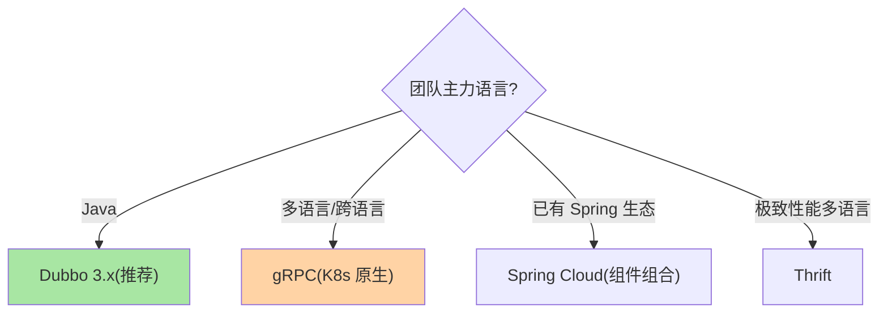
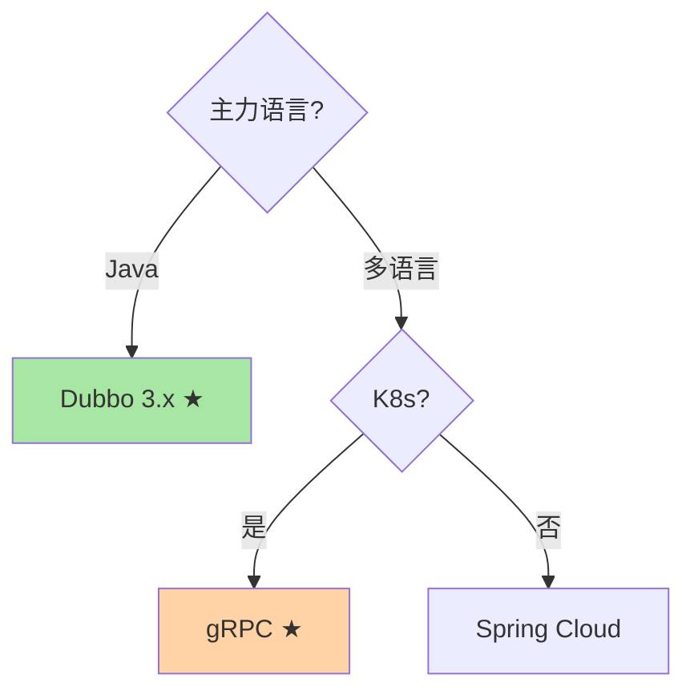

# 主流 RPC 框架对比：Dubbo、gRPC、Thrift、Spring Cloud

> **本文核心**：四大框架按「语言生态 × 协议 × 治理面」三轴区分：**Dubbo**——Java 生态/多协议(Triple)/治理面最完善/国内微服务标配；**gRPC**——跨语言标杆/HTTP2+Protobuf/CNCF 生态/K8s 原生；**Thrift**——Facebook 出品/多语言代码生成/性能极致/治理面弱；**Spring Cloud**——HTTP+JSON/组件丰富/社区庞大/性能不如二进制 RPC。**机制链**：团队语言栈 → 协议性能需求 → 治理面要求 → 组件选型。

## 一句话摘要

四框架的哲学差异：Dubbo 是「Java 微服务全家桶」（服务发现/负载均衡/容错/路由全内置），gRPC 是「跨语言高性能标杆」（Protobuf IDL + HTTP/2 + CNCF 生态），Thrift 是「Facebook 的多语言代码生成器」（极致性能但治理弱），Spring Cloud 是「Spring 生态的组件集」（非单一 RPC 而是 RPC + 配置 + 网关 + 熔断的组合）。选型 = **团队语言栈 × 性能需求 × 治理面需求 × 已有生态**的四维权衡。

## 5W 速记卡

| 维度 | 一句话 |
|---|---|
| What | Dubbo/gRPC/Thrift/Spring Cloud 四框架三轴对比 |
| Why | 框架选型影响团队效率与系统性能的长期投入 |
| When | 微服务技术栈选型、RPC 框架迁移评估 |
| Where | 架构评审 |
| How | 语言栈 → 性能 → 治理 → 生态四维打分 |

## 二、对比矩阵

| 维度 | Dubbo 3.x | gRPC | Thrift | Spring Cloud |
|---|---|---|---|---|
| 语言 | Java 为主 | 多语言 | 多语言 | Java |
| 协议 | Triple(H2)/Dubbo | HTTP/2+Protobuf | TCP 二进制 | HTTP+JSON |
| 服务发现 | Nacos/ZK/直连 | 需外部(xDS/DNS) | 需外部 | Eureka/Consul |
| 负载均衡 | 内置(多策略) | 需外部或内置 | 需外部 | Ribbon/LoadBalancer |
| 容错 | 内置(failover等) | 需外部 | 需外部 | Hystrix/Resilience4j |
| 治理面 | ★★★ 完善内置 | ★★ 需生态补齐 | ★ 需自建 | ★★ 组件丰富 |
| 序列化 | Hessian2/Protobuf/JSON | Protobuf | Thrift 二进制 | JSON |
| 适用 | Java 微服务/国内 | 跨语言/K8s/云原生 | 高性能多语言 | Spring 生态 |

**三句话解读**：① Java 团队首选 Dubbo（治理全内置 + 国内生态最活跃）；② K8s 云原生团队选 gRPC（CNCF 原生 + 跨语言标准）；③ Spring Cloud 是「组件集」不是「单一框架」——按需组合 Ribbon/Resilience4j/Sleuth 等，灵活但组装成本高。

### 框架选型决策树

## 三、与中间件选型的区别：方法论对照

| 维度 | RPC 框架选型（本篇） | MQ 选型（互指 MQ 系列） |
|---|---|---|
| 第一权重 | 团队语言栈 | 消息语义（顺序/事务/延迟） |
| 性能关注 | RTT 与序列化效率 | 吞吐与堆积能力 |
| 生态锁定度 | 高（迁移成本大） | 高 |

方法论同构（画像→轴心→组件），RPC 的轴心在「语言与治理」，MQ 的轴心在「消息语义」。

## 四、典型场景与误区

**典型场景**：新建 Java 微服务（Dubbo 3.x + Nacos）、K8s 云原生（gRPC + xDS 服务发现）、混合多语言（gRPC 统一 + 按语言选客户端库）、Spring 全家桶团队（Spring Cloud Alibaba/Nacos/Sentinel 组合）。

**误区与不适用**：① benchmark 排名决定选型——框架的日常维护成本与生态成熟度比微秒级性能差更影响长期；② Dubbo 迁 gRPC 因为「gRPC 更现代」——迁移成本（IDL 重写/服务发现重建/灰度兼容）巨大，除非有跨语言刚需；③ Spring Cloud 和 Dubbo 二选一——Spring Cloud Alibaba 可以同时使用 Dubbo RPC + Spring Cloud 组件（Nacos/Sentinel/Gateway），两者互补而非互斥。

## 五、💡 实战提示

- 💡 选型评审先答「团队什么语言、有多少运维人力」——比「哪个性能好」重要十倍
- 💡 Dubbo 3.x 的 Triple 协议兼容 gRPC——同时获得 Dubbo 治理 + gRPC 跨语言
- 💡 决策口径：Dubbo 生态 + Java → Dubbo；K8s + 多语言 → gRPC；Spring 小团队 → Spring Cloud Alibaba

## 六、你们可能会问

**Q1：Spring Cloud 和 Dubbo 能同时用吗？**
能——Spring Cloud Alibaba 的组合方案中，RPC 用 Dubbo（Triple 协议），注册/配置用 Nacos，限流用 Sentinel，网关用 Spring Cloud Gateway——组件按需组合。

**Q2：gRPC 的负载均衡怎么做？**
gRPC 原生支持客户端负载均衡（resolver + balancer 插件机制），也支持 proxy 模式（走 Envoy 等 L7 代理）——按 K8s/非 K8s 环境选。

**Q3：从 Feign 迁移到 Dubbo 的路径？**
接口层抽象（Feign 接口 → Dubbo 接口声明）→ 双跑对照 → 逐服务切换 → Feign 下线——与所有中间件迁移纪律同源。

## 七、自测三问

1. 四框架的三轴差异（语言/协议/治理面）？
2. 选型决策树的第一个分叉是什么？
3. Spring Cloud 和 Dubbo 3.x 能共存吗？怎么组合？

## 开放问题

- RPC 框架与 Service Mesh 的边界持续模糊——Dubbo Mesh/gRPC + xDS 的路线让「框架治理」向「基础设施治理」下沉，框架选型的权重可能在 Mesh 普及后重新分配。

**Trade-off 视角**：性能与治理能力的权衡——治理面越完善框架越重，性能极致则治理面弱。团队需按实际需求对齐，不为用不到的能力买单。

## 📎 核心带走

- **核心一句话**：四大框架 = 四种哲学——Dubbo 全家桶、gRPC 跨语言标杆、Thrift 极致性能、Spring Cloud 组件组合，选型按团队与需求对号
- **机制链**：语言栈 → 协议需求 → 治理面 → 生态匹配 → POC 验证
- **失效点/边界**：benchmark 不决定选型；治理面缺失需自建；Mesh 普及可能重画框架边界

**量级演进视角**：千级 QPS 的服务 RPC 配置默认够用；万级需要全链路参数调优（超时/重试/限流/序列化协议全配）；十万级必须关注序列化效率与连接池容量——治理强度随调用量级升级。

## 💡 实战提示

- 💡 新项目 Java → Dubbo 3.x、K8s 多语言 → gRPC——两个默认不会错
- 💡 选型 POC 必测三个场景：正常调用、下游故障、扩缩容——基线压测不够
- 💡 决策口径：框架选型输出三件——结论 + 迁移路径 + 运维计划，不只定组件名

## 📌 数据与事实声明

- 写于 2026-09-10，框架能力以各官方文档为准（Dubbo 3.x / gRPC 1.x / Thrift 0.2x / Spring Cloud 2023.x）
- 免责：选型建议按组织架构评审

## 📚 参考资料

| 类型 | 标题 | 来源 |
|---|---|---|
| 官方文档 | Dubbo / gRPC / Thrift / Spring Cloud | 各官方站点 |
| 关联系列 | 本仓库治理域全系列（机制互指） | docs/architecture/service-governance/ |
| 社区沉淀 | RPC 框架选型公开实践 | 技术社区公开文章 |
