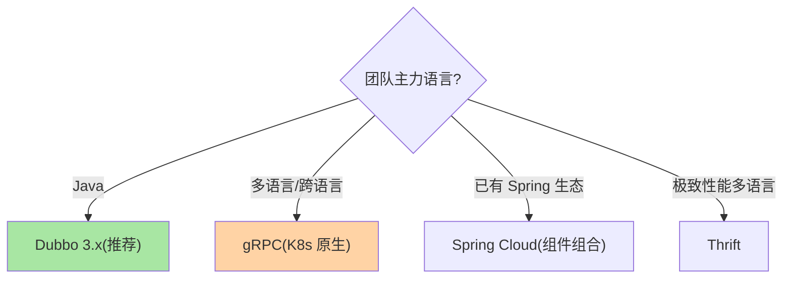
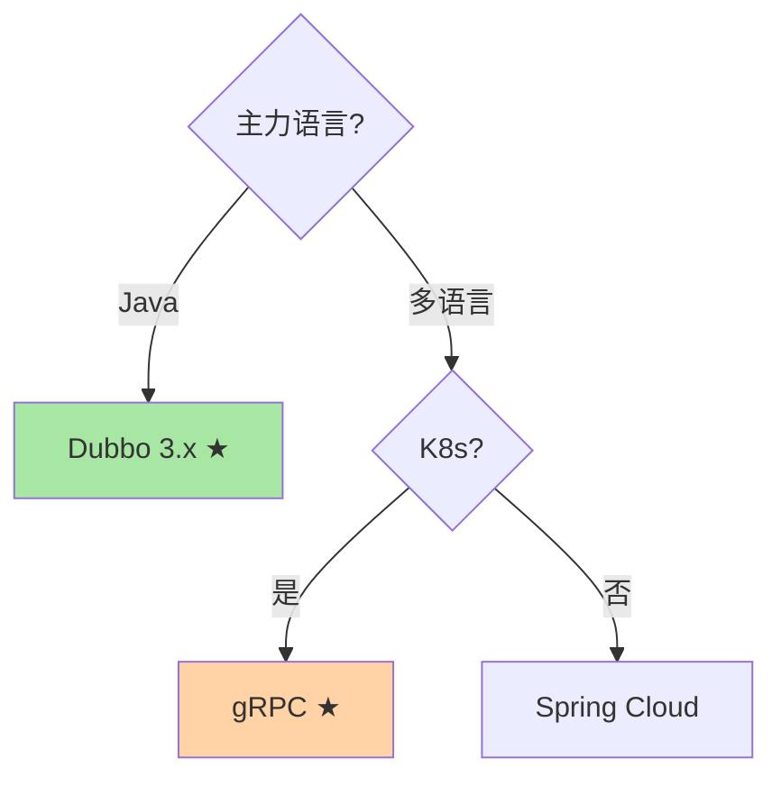

# 主流 RPC 框架对比：Dubbo、gRPC、Thrift、Spring Cloud

> **本文核心**：四大框架按「语言生态 × 协议 × 治理面」三轴区分：**Dubbo**——Java 生态/多协议(Triple)/治理面最完善/国内微服务标配；**gRPC**——跨语言标杆/HTTP2+Protobuf/CNCF 生态/K8s 原生；**Thrift**——Facebook 出品/多语言代码生成/性能极致/治理面弱；**Spring Cloud**——HTTP+JSON/组件丰富/社区庞大/性能不如二进制 RPC。**机制链**：团队语言栈 → 协议性能需求 → 治理面要求 → 组件选型。

## 一句话摘要

四框架的哲学差异：Dubbo 是「Java 微服务全家桶」（服务发现/负载均衡/容错/路由全内置），gRPC 是「跨语言高性能标杆」（Protobuf IDL + HTTP/2 + CNCF 生态），Thrift 是「Facebook 的多语言代码生成器」（极致性能但治理弱），Spring Cloud 是「Spring 生态的组件集」（非单一 RPC 而是 RPC + 配置 + 网关 + 熔断的组合）。选型 = **团队语言栈 × 性能需求 × 治理面需求 × 已有生态**的四维权衡。

## 5W 速记卡

| 维度 | 一句话 |
|---|---|
| What | Dubbo/gRPC/Thrift/Spring Cloud 四框架三轴对比 |
| Why | 框架选型影响团队效率与系统性能的长期投入 |
| When | 微服务技术栈选型、RPC 框架迁移评估 |
| Where | 架构评审 |
| How | 语言栈 → 性能 → 治理 → 生态四维打分 |

## 二、对比矩阵

| 维度 | Dubbo 3.x | gRPC | Thrift | Spring Cloud |
|---|---|---|---|---|
| 语言 | Java 为主 | 多语言 | 多语言 | Java |
| 协议 | Triple(H2)/Dubbo | HTTP/2+Protobuf | TCP 二进制 | HTTP+JSON |
| 服务发现 | Nacos/ZK/直连 | 需外部(xDS/DNS) | 需外部 | Eureka/Consul |
| 负载均衡 | 内置(多策略) | 需外部或内置 | 需外部 | Ribbon/LoadBalancer |
| 容错 | 内置(failover等) | 需外部 | 需外部 | Hystrix/Resilience4j |
| 治理面 | ★★★ 完善内置 | ★★ 需生态补齐 | ★ 需自建 | ★★ 组件丰富 |
| 序列化 | Hessian2/Protobuf/JSON | Protobuf | Thrift 二进制 | JSON |
| 适用 | Java 微服务/国内 | 跨语言/K8s/云原生 | 高性能多语言 | Spring 生态 |

读表提示：**「服务发现/负载均衡/容错需外部」三行是本质差异**——治理能力放 SDK 内（Dubbo/Spring Cloud）还是放基础设施（gRPC/Thrift），决定了运维形态：前者升级框架=全业务发版，后者升级治理=只动基础设施——这一行的选择比性能行的微秒级差异重要两个数量级。

**三句话解读**：① Java 团队首选 Dubbo（治理全内置 + 国内生态最活跃）；② K8s 云原生团队选 gRPC（CNCF 原生 + 跨语言标准）；③ Spring Cloud 是「组件集」不是「单一框架」——按需组合 Ribbon/Resilience4j/Sleuth 等，灵活但组装成本高。

**表格里最容易被低估的一行是「服务发现/容错需外部」**：gRPC 和 Thrift 的「需外部」不是缺点而是哲学——它们把治理交给基础设施（xDS/Envoy/Istio），SDK 保持语言中立与轻量；Dubbo 的「内置」也不是免费午餐——SDK 重、升级牵动全业务。**「内置还是外置」是所有框架设计的第一性取舍**，与数据库的「一体化 vs 分离式」架构之争同构（互指分布式系统设计系列）。

**设计思想**：四框架其实是四种「治理放置位置」的回答——Dubbo 放 SDK（Java 单栈最优解）、gRPC 放基础设施（多语言云原生最优解）、Thrift 放业务代码（极致性能自己接管）、Spring Cloud 放组件组合（生态粘性换灵活性）。**理解「治理放在哪」，比记住对比表更能预测框架的演进方向**——例如 gRPC 加 retry/circuit breaking 是 SDK 治理能力的补位，Dubbo 做 Mesh 化是 SDK 治理的下沉，两者相向而行。

### 框架选型决策树

## 三、与中间件选型的区别：方法论对照

| 维度 | RPC 框架选型（本篇） | MQ 选型（互指 MQ 系列） |
|---|---|---|
| 第一权重 | 团队语言栈 | 消息语义（顺序/事务/延迟） |
| 性能关注 | RTT 与序列化效率 | 吞吐与堆积能力 |
| 生态锁定度 | 高（迁移成本大） | 高 |

方法论同构（画像→轴心→组件），RPC 的轴心在「语言与治理」，MQ 的轴心在「消息语义」。两者共同的纪律是：**先定第一权重轴，再谈组件对比**——跳过轴心直接看功能表格的选型，会在细节比较里迷失（表格里永远有各有优劣的行）。

## 四、典型场景与误区

**典型场景**：新建 Java 微服务（Dubbo 3.x + Nacos）、K8s 云原生（gRPC + xDS 服务发现）、混合多语言（gRPC 统一 + 按语言选客户端库）、Spring 全家桶团队（Spring Cloud Alibaba/Nacos/Sentinel 组合）。场景判断的关键差异是「治理由谁提供」：Dubbo 框架自带治理（SDK 重但开箱即用），gRPC 把治理留给基础设施（SDK 薄但需要 xDS/Envoy 生态）——**团队有没有基础设施人力，是这条分叉的隐藏判定条件**。

**事故视角**：某公司选型时以 benchmark 为据选了 Thrift（性能榜第一），两年后为补治理能力自建了路由/熔断/追踪三套 SDK，维护团队 5 人；最终因跨语言需求与新业务团队 gRPC 并存——两套 RPC 并行、治理口径分裂，排障时要在两套体系间对表。复盘：**性能差距（微秒级）在真实业务延迟（毫秒级）里占比不足 5%，而自建治理的投入（人年级）与双框架并存的复杂度被完全低估**——选型评审判据的权重排序错了。

**实践视角**：一个更健康的路径供参照：Java 团队起步用 Spring Cloud（组件按需、学习平缓）→ 规模上来后 RPC 层切 Dubbo（治理内置、性能上台阶），注册配置仍用 Nacos 无缝衔接 → 部分新业务上 K8s 用 gRPC——三阶段演进每步都有明确的触发条件（团队规模/流量规模/语言多样性），而不是一步到位「选最先进的」。

**误区与不适用**：① benchmark 排名决定选型——框架的日常维护成本与生态成熟度比微秒级性能差更影响长期；② Dubbo 迁 gRPC 因为「gRPC 更现代」——迁移成本（IDL 重写/服务发现重建/灰度兼容）巨大，除非有跨语言刚需；③ Spring Cloud 和 Dubbo 二选一——Spring Cloud Alibaba 可以同时使用 Dubbo RPC + Spring Cloud 组件（Nacos/Sentinel/Gateway），两者互补而非互斥；④ 「选型一次管十年」——框架生命周期内至少经历 2-3 次大版本演进（Spring Cloud 的版本断代/Dubbo 2→3 的协议换代），选型评审必须包含「升级策略」议题。

## 五、💡 实战提示

- 💡 选型评审先答「团队什么语言、有多少运维人力」——比「哪个性能好」重要十倍
- 💡 Dubbo 3.x 的 Triple 协议兼容 gRPC——同时获得 Dubbo 治理 + gRPC 跨语言
- 💡 决策口径：Dubbo 生态 + Java → Dubbo；K8s + 多语言 → gRPC；Spring 小团队 → Spring Cloud Alibaba
- 💡 双框架并存的团队必须统一治理口径（超时/重试/错误码语义在治理平台翻译）——否则排障在两套体系间对表，成本翻倍

**与序列化选型的联动**：框架选型隐含序列化选型（gRPC 绑 Protobuf、Spring Cloud 绑 JSON）——IDL 契约的跨语言能力、演进规范（field tag 纪律，互指篇 3）、代码生成工具链都在框架生态内成型——**选框架也是在选接口治理体系，IDL 规范要进选型评审**。

**与团队结构的联动**：框架选型约束与被约束于团队结构——单语言团队用全功能 SDK（Dubbo）效率最高；多语言团队只能选协议标准化的薄 SDK（gRPC）+ 统一基础设施；平台团队存在时，治理能力从业务框架剥离（Mesh 化）成为可能——**康威定律在技术选型上的体现：系统架构镜像组织架构**。

## 六、你们可能会问

**Q1：Spring Cloud 和 Dubbo 能同时用吗？**
能——Spring Cloud Alibaba 的组合方案中，RPC 用 Dubbo（Triple 协议），注册/配置用 Nacos，限流用 Sentinel，网关用 Spring Cloud Gateway——组件按需组合。

**Q2：gRPC 的负载均衡怎么做？**
gRPC 原生支持客户端负载均衡（resolver + balancer 插件机制），也支持 proxy 模式（走 Envoy 等 L7 代理）——按 K8s/非 K8s 环境选。

**Q3：从 Feign 迁移到 Dubbo 的路径？**
接口层抽象（Feign 接口 → Dubbo 接口声明）→ 双跑对照 → 逐服务切换 → Feign 下线——与所有中间件迁移纪律同源。

**Q4：选型评审的输出应该长什么样？**
三件套：结论（选什么+为什么）、迁移路径（从现状到目标的阶段与触发条件）、运维计划（谁运维/升级策略/退路）。只有组件名的选型结论无法执行也无法复盘——**选型是一个项目，不是一个名词**。

**Q5：小团队要不要直接上 gRPC 追新？**
慎——gRPC 的治理生态（xDS/Envoy）需要基础设施投入，小团队拿不到这层就只剩裸 RPC（限流熔断路由全要自建）。**「新」不等于「适合」，治理能力的获取成本与团队能力匹配才是判断标准**。

## 七、自测三问

1. 四框架的三轴差异（语言/协议/治理面）？（答：Dubbo Java+多协议+治理最全、gRPC 多语言+HTTP2+CNCF、Thrift 多语言+TCP 二进制+治理弱、Spring Cloud Java+HTTP+组件集）
2. 选型决策树的第一个分叉是什么？（答：团队主力语言——语言栈决定 SDK 生态与团队技能匹配度，权重高于性能）
3. Spring Cloud 和 Dubbo 3.x 能共存吗？怎么组合？（答：能，Spring Cloud Alibaba 组合——RPC 用 Dubbo、注册配置用 Nacos、限流用 Sentinel、网关用 Gateway）

## 七·五、追问思考

**质疑者视角**：框架对比表给人「选型是一次性决策」的错觉——真实世界里框架是被锁定的：IDL 资产、运维工具链、团队技能、周边组件全部绑死在框架上，五年后的迁移成本远超当年选型收益。**所以选型问题的正确问法不是「哪个框架好」，而是「哪个框架的锁定代价我们承担得起」**——Thrift 治理面缺失意味着自建（长期人力投入），Spring Cloud 组件拼装意味着升级矩阵管理（版本兼容地狱），Dubbo/gRPC 的强势生态意味着被社区路线绑定。质疑的落点：把「迁移成本」当作选型的一等输入，而不是「以后再说」。

**追问链**：为什么 Dubbo 3 要做 Triple 协议（兼容 gRPC/HTTP/2）？——因为跨语言与云原生生态在向 gRPC 标准收敛，Dubbo 用「治理面优势 + 协议标准化」的复合策略应战——框架竞争的终局不是谁消灭谁，而是**协议层标准化（gRPC/HTTP2）、治理层平台化（Mesh 或治理中心）、语言层多极化**。追问：Mesh 普及后框架还有价值吗？——有，但价值重心转移：序列化与开发体验留在框架（SDK），流量治理下沉基础设施（Sidecar）——**「薄 SDK + 厚基础设施」是十年尺度的演进方向**（互指 servicemesh 系列）。

**量级演进视角**：千级 QPS 小团队——Spring Cloud 组件拼装的灵活性收益最大（学习曲线平缓）；万级 QPS 多团队——Dubbo 类「治理全内置」的框架节省重复建设（每团队自建熔断/路由是浪费）；十万级 QPS + 多语言——gRPC/Triple 的跨语言与高性能成为硬约束——**团队规模与流量规模同步升级时，框架也要换档**。

**Trade-off 视角**：性能与治理能力的权衡——治理面越完善框架越重（依赖多/拦截链长），性能极致则治理面弱（Thrift 纯净但裸奔）；团队需按实际需求对齐，不为用不到的能力买单。

## 开放问题

- RPC 框架与 Service Mesh 的边界持续模糊——Dubbo Mesh/gRPC + xDS 的路线让「框架治理」向「基础设施治理」下沉，框架选型的权重可能在 Mesh 普及后重新分配。
- Thrift 的社区活跃度持续走低（Apache 项目年更节奏）——极致性能路线在新框架（Kitex 等云原生 Rust/Go 框架）中延续，选型评估要把「社区生命力」纳入长期风险。
- 多框架并存的统一治理——Java 系 Dubbo 与 Go 系 gRPC 混布的公司，治理口径（超时/重试/路由语义）如何平台化统一。

## 📎 核心带走

- **核心一句话**：四大框架 = 四种哲学——Dubbo 全家桶、gRPC 跨语言标杆、Thrift 极致性能、Spring Cloud 组件组合，选型按团队与需求对号
- **机制链**：语言栈 → 协议需求 → 治理面 → 生态匹配 → POC 验证
- **失效点/边界**：benchmark 不决定选型；治理面缺失需自建；Mesh 普及可能重画框架边界

## 📌 数据与事实声明

- 写于 2026-09-10，框架能力以各官方文档为准（Dubbo 3.x / gRPC 1.x / Thrift 0.2x / Spring Cloud 2023.x）
- 免责：选型建议按组织架构评审

## 📚 参考资料

| 类型 | 标题 | 来源 |
|---|---|---|
| 官方文档 | Dubbo / gRPC / Thrift / Spring Cloud | 各官方站点 |
| 关联系列 | 本仓库治理域全系列（机制互指） | docs/architecture/service-governance/ |
| 社区沉淀 | RPC 框架选型公开实践 | 技术社区公开文章 |
| 原理书 | 《数据密集型应用系统设计》DDIA | 公开出版 |
