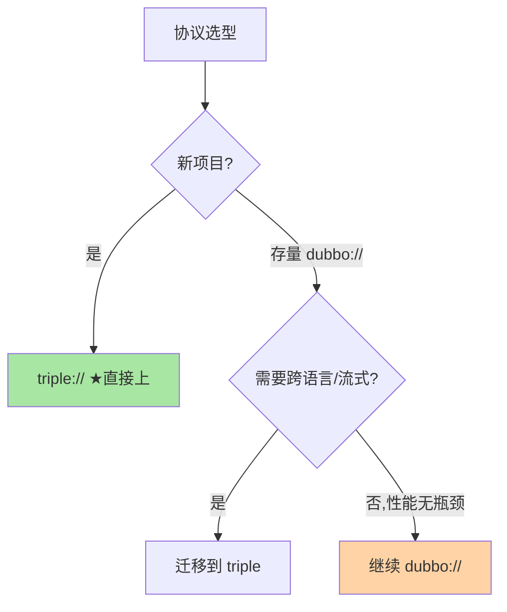
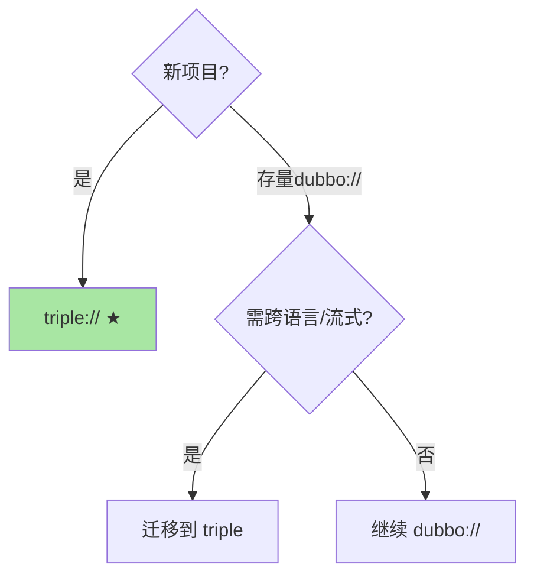

# RPC 协议与选型：dubbo://、triple:// 与技术决策

> 全系列收束篇：RPC 协议（`dubbo://`/`triple://`/`grpc://`）是 Dubbo 3.x 的协议矩阵——从私有 TCP 到 Triple（HTTP/2 gRPC 兼容）的演进。这篇讲协议选型与技术决策的收束框架。

> **本文核心**：Dubbo 3.x 的协议矩阵——**dubbo://**（私有 TCP 二进制协议，性能极致但跨语言弱）、**triple://**（基于 HTTP/2 的 gRPC 兼容协议，跨语言 + 流式 + 云原生）、**rest://**（HTTP/1.1 JSON，通用兼容）。**机制链**：业务场景 → 协议需求（性能/跨语言/流式/云原生） → 协议选择 → 迁移路径 → POC 验证。

## 一句话摘要

Dubbo 协议演进与选型：**dubbo://** 是 Dubbo 1.x/2.x 的私有 TCP 协议——极致性能但跨语言弱；**triple://** 是 Dubbo 3.x 的新一代协议——基于 HTTP/2、兼容 gRPC、支持流式（unary/server/client/bidi streaming）——是 Dubbo 的未来方向。**选型口径**：新项目直接 triple://（云原生 + 跨语言），存量 dubbo:// 按需迁移（性能无瓶颈不急迁），跨语言对接必须 triple 或 gRPC。

## 5W 速记卡

| 维度 | 一句话 |
|---|---|
| What | Dubbo 3.x 协议矩阵（dubbo/triple/rest）与技术选型 |
| Why | 协议决定性能天花板、跨语言能力与云原生兼容性 |
| When | 新服务协议选择、存量协议迁移评估 |
| Where | Dubbo 3.x 框架的协议配置层 |
| How | 按场景选协议 → triple 优先 → dubbo 存量过渡 → POC 验证 |

## 二、协议矩阵与选型决策

| 协议 | 传输 | 序列化 | 性能 | 跨语言 | 流式 | 云原生 |
|---|---|---|---|---|---|---|
| dubbo:// | TCP 长连接 | Hessian2 | ★★★ | ❌ | ❌ | ❌ |
| **triple://** | **HTTP/2 长连接** | **Protobuf** | **★★★** | **✅** | **✅** | **✅** |
| rest:// | HTTP/1.1 | JSON | ★ | ✅ | ❌ | ✅ |

**Triple 的设计亮点**：兼容 gRPC 协议（第三方 gRPC 客户端可直接调 Triple 服务）+ 原生支持流式（unary/server-stream/client-stream/bidi）+ 基于 HTTP/2（多路复用/头压缩/流控）——**「Dubbo 治理能力 + gRPC 协议标准」的组合是 Dubbo 3.x 的核心竞争力**。

### 协议矩阵选型

## 三、与 gRPC 的区别：协议兼容与治理差异

| 维度 | Dubbo Triple | 原生 gRPC |
|---|---|---|
| 协议兼容 | ✅ 兼容 gRPC 协议 | 原生 gRPC |
| 服务发现 | Nacos/ZK 内置 | 需外部(xDS/DNS) |
| 治理面 | Dubbo 全套(路由/容错/限流) | 需生态补齐(xDS/Envoy) |
| IDL | Java 接口 + Protobuf 双模式 | Protobuf only |
| 适用 | Java 微服务 + 云原生 | 纯云原生/多语言 |

## 四、典型场景与误区

**典型场景**：新建 Java 微服务（Dubbo 3.x + Triple 协议起步）、跨团队对接（Triple 兼容 gRPC——第三方 gRPC 客户端直接调）、跨语言微服务（Triple + Protobuf IDL 多语言生成）。

**误区与不适用**：① triple 和 dubbo 协议混用同一服务——一个服务只绑一种协议（混用增加运维心智）；② dubbo:// 直接换 triple 不做兼容验证——序列化格式不同（Hessian2 vs Protobuf）需要数据兼容检查；③ Triple 流式滥用——流式适合推送/日志场景，请求-响应场景 unary 就够。

## 五、💡 实战提示

- 💡 新项目 Dubbo 3.x 直接用 triple:// 协议——兼容 gRPC 且是未来方向
- 💡 协议选型进团队规范——新服务统一协议降低运维心智
- 💡 决策口径：新服务 triple、存量 dubbo:// 按需迁、跨语言必 triple/gRPC

## 六、你们可能会问

**Q1：triple 协议和 gRPC 有什么区别？**
协议兼容（triple 兼容 gRPC 客户端），但 triple 额外提供 Dubbo 治理面（服务发现/路由/容错/限流内置）+ Java 接口级编程（不强制 IDL）——「gRPC 协议 + Dubbo 治理」的组合。

**Q2：dubbo:// 和 triple:// 能互通吗？**
不能直接互通（序列化与传输不同）——需通过 triple 或 rest 作为桥接，或在服务端同时暴露两种协议——**过渡期双协议暴露是常见做法**。

**Q3：Triple 的流式传输适合什么场景？**
服务端推送（实时行情/配置推送）、客户端上传（大文件分片/日志流）、双向交互（聊天/协作编辑）——请求-响应场景 unary 即可，不追求流式。

## 七、自测三问

1. Dubbo 3.x 三种协议的性能与能力差异？
2. Triple 协议的设计亮点（gRPC 兼容 + Dubbo 治理）？
3. 协议迁移的兼容性风险在哪里？

## 开放问题

- Triple 与 Service Mesh（Envoy/Istio）的治理边界——Triple 内置治理与 Mesh 治理的重叠需要明确分工。
- HTTP/3(QUIC) 传输在 Triple 中的支持是 Dubbo 的远期演进方向。

**Trade-off 视角**：性能与治理能力的权衡——治理面越完善框架越重，性能极致则治理面弱。团队需按实际需求对齐，不为用不到的能力买单。

## 📎 核心带走

- **核心一句话**：Dubbo 3.x 协议矩阵——triple:// 是未来方向（gRPC 兼容+Dubbo 治理），dubbo:// 是存量过渡，rest:// 是通用兼容
- **机制链**：场景需求 → 协议需求 → 协议选择 → 兼容验证 → POC → 上线
- **失效点/边界**：协议混用需桥接；序列化差异需兼容检查；流式按需使用

**量级演进视角**：千级 QPS 的服务 RPC 配置默认够用；万级需要全链路参数调优（超时/重试/限流/序列化协议全配）；十万级必须关注序列化效率与连接池容量——治理强度随调用量级升级。

## 💡 实战提示

- 💡 新服务统一 triple 协议——面向未来的正确选择
- 💡 存量 dubbo:// 迁移用双协议暴露过渡——先加 triple 再去 dubbo
- 💡 决策口径：跨语言需求决定协议方向——无跨语言需求不必急迁 triple

## 📌 数据与事实声明

- 写于 2026-09-10，协议机制以 Dubbo 3.x 官方文档为准；Triple 为 Dubbo 3 的新一代协议
- 免责：协议细节以 dubbo.apache.org 为准

## 📚 参考资料

| 类型 | 标题 | 来源 |
|---|---|---|
| 官方文档 | Dubbo Triple Protocol | dubbo.apache.org |
| 关联系列 | 本仓库治理域全系列（机制互指） | docs/architecture/service-governance/ |
| 公开提案 | Dubbo Triple 设计（gRPC 兼容） | dubbo.apache.org |
