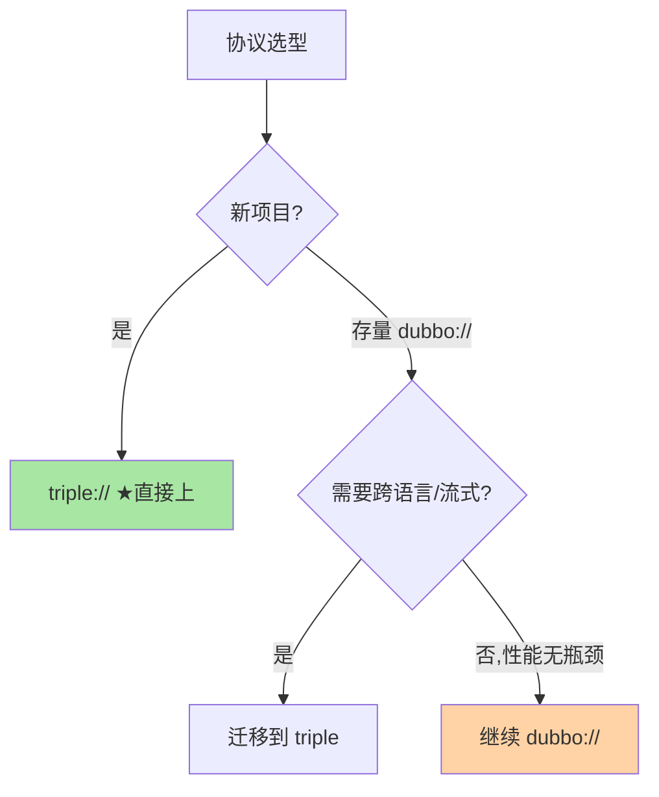
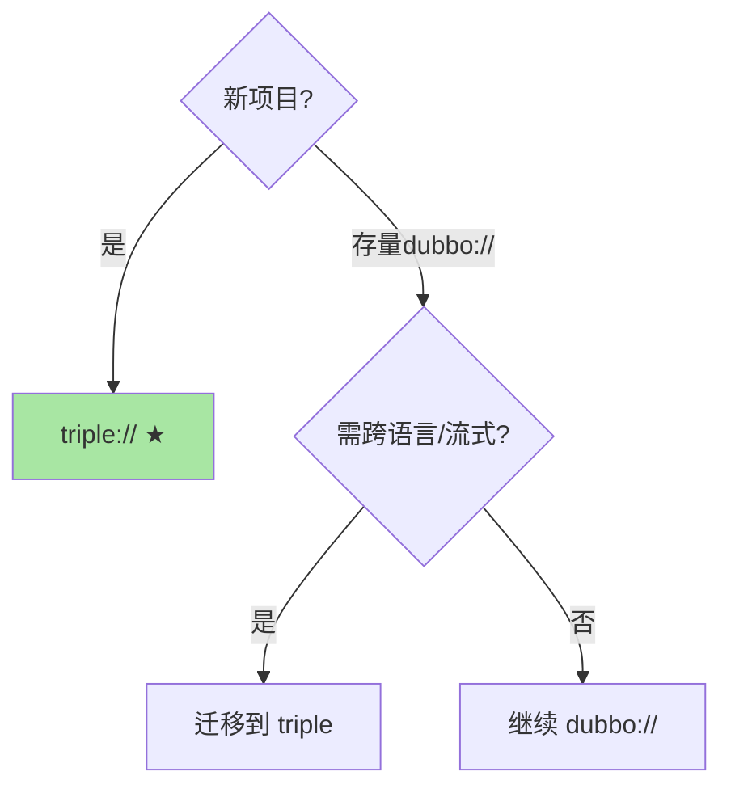

# RPC 协议与选型：dubbo://、triple:// 与技术决策

> 全系列收束篇：RPC 协议（`dubbo://`/`triple://`/`grpc://`）是 Dubbo 3.x 的协议矩阵——从私有 TCP 到 Triple（HTTP/2 gRPC 兼容）的演进。这篇讲协议选型与技术决策的收束框架，并把前 12 篇的机制串成一条可执行的选型决策线。

> **本文核心**：Dubbo 3.x 的协议矩阵——**dubbo://**（私有 TCP 二进制协议，性能极致但跨语言弱）、**triple://**（基于 HTTP/2 的 gRPC 兼容协议，跨语言 + 流式 + 云原生）、**rest://**（HTTP/1.1 JSON，通用兼容）。**机制链**：业务场景 → 协议需求（性能/跨语言/流式/云原生） → 协议选择 → 迁移路径 → POC 验证。

## 一句话摘要

全系列收束：协议是 RPC 的「门面契约」，前 12 篇拆的机制（序列化/传输/发现/均衡/容错/路由/稳定/观测）最终都要在一条协议链路上跑起来。

Dubbo 协议演进与选型：**dubbo://** 是 Dubbo 1.x/2.x 的私有 TCP 协议——极致性能但跨语言弱；**triple://** 是 Dubbo 3.x 的新一代协议——基于 HTTP/2、兼容 gRPC、支持流式（unary/server/client/bidi streaming）——是 Dubbo 的未来方向。**选型口径**：新项目直接 triple://（云原生 + 跨语言），存量 dubbo:// 按需迁移（性能无瓶颈不急迁），跨语言对接必须 triple 或 gRPC。这条口径的潜台词：协议是长周期资产（十年尺度），迁移是高成本动作（调用链级盘点）——所以「选协议」宁可一步到位面向未来，「迁协议」宁可按兵不动直到触发条件明确。作为全系列收束篇，这里把前 12 篇的机制收敛成一句决策框架：**协议选性能上限、IDL 选协作规范、治理选组织形态**——三个选择彼此独立，不必绑死在同一个框架品牌上。

## 5W 速记卡

| 维度 | 一句话 |
|---|---|
| What | Dubbo 3.x 协议矩阵（dubbo/triple/rest）与技术选型 |
| Why | 协议决定性能天花板、跨语言能力与云原生兼容性 |
| When | 新服务协议选择、存量协议迁移评估 |
| Where | Dubbo 3.x 框架的协议配置层 |
| How | 按场景选协议 → triple 优先 → dubbo 存量过渡 → POC 验证 |

## 二、协议矩阵与选型决策

| 协议 | 传输 | 序列化 | 性能 | 跨语言 | 流式 | 云原生 |
|---|---|---|---|---|---|---|
| dubbo:// | TCP 长连接 | Hessian2 | ★★★ | ❌ | ❌ | ❌（Mesh 需协议插件） |
| **triple://** | **HTTP/2 长连接** | **Protobuf** | **★★★** | **✅** | **✅** | **✅（Envoy 原生可治理）** |
| rest:// | HTTP/1.1 | JSON | ★ | ✅ | ❌ | ✅ |

**Triple 的设计亮点**：兼容 gRPC 协议（第三方 gRPC 客户端可直接调 Triple 服务）+ 原生支持流式（unary/server-stream/client-stream/bidi）+ 基于 HTTP/2（多路复用/头压缩/流控）——**「Dubbo 治理能力 + gRPC 协议标准」的组合是 Dubbo 3.x 的核心竞争力**。

**从演进视角看这次协议换代的必然性**：Dubbo 2 时代私有 TCP 协议的性能优势真实存在（免 HTTP 解析开销），但代价是生态孤岛——跨语言要自写协议库、网关要装协议插件、Mesh 时代更是无法被 Envoy 直接治理。HTTP/2 多路复用成熟后，私有协议的性能优势收窄到个位数百分比，而标准化的生态红利（网关/可观测/Mesh 全链路现成支持）持续放大——**当标准化成本低于私有协议的生态维护成本时，迁移就从「可选项」变成「必答题」**。这与数据库领域「私有存储格式让位于开放格式」的演进逻辑一致：性能优势会被硬件与协议演进追平，生态位置的优势只会随时间复利。

**rest:// 的定位**：不是给内部微服务用的（性能与治理都弱），是给「非 Dubbo 生态的边缘调用」留的口子——脚本工具、第三方 webhook 回调、临时调试——协议矩阵的价值在于**给不同信任距离的调用方各留一扇门**。

### 协议矩阵选型

## 三、与 gRPC 的区别：协议兼容与治理差异

| 维度 | Dubbo Triple | 原生 gRPC |
|---|---|---|
| 协议兼容 | ✅ 兼容 gRPC 协议 | 原生 gRPC |
| 服务发现 | Nacos/ZK 内置 | 需外部(xDS/DNS) |
| 治理面 | Dubbo 全套(路由/容错/限流) | 需生态补齐(xDS/Envoy) |
| IDL | Java 接口 + Protobuf 双模式 | Protobuf only |
| 适用 | Java 微服务 + 云原生 | 纯云原生/多语言 |

表的读法：协议层两者已经「兼容」，差异全在**协议之上**（谁管服务发现、谁管治理、IDL 强不强制）——这就是「协议标准化、治理差异化」的行业格局：传输与编码趋同（HTTP/2 + Protobuf 成为事实标准），竞争转移到治理面与开发体验。**做技术选型时把「协议」与「治理」两层分开评估**，结论会清晰得多——协议层按兼容性选（都是 HTTP/2 系），治理层按组织形态选（有平台团队→gRPC+基础设施，纯业务团队→Dubbo 全家桶）。

## 四、典型场景与误区

**典型场景**：新建 Java 微服务（Dubbo 3.x + Triple 协议起步）、跨团队对接（Triple 兼容 gRPC——第三方 gRPC 客户端直接调）、跨语言微服务（Triple + Protobuf IDL 多语言生成）、Mesh 接入（triple 服务经 Envoy 代理治理，无需协议插件）。场景选择的锚点是**调用方的协议能力分布**：全 Dubbo 生态则协议随框架走、有外部 gRPC 调用方则 triple 是桥、有 HTTP 边缘调用则补 rest 门。

**误区与不适用**：① triple 和 dubbo 协议混用同一服务——一个服务只绑一种协议（混用增加运维心智；过渡期双暴露是例外的例外，且要有下线计划）；② dubbo:// 直接换 triple 不做兼容验证——序列化格式不同（Hessian2 vs Protobuf）需要数据兼容检查；③ Triple 流式滥用——流式适合推送/日志场景，请求-响应场景 unary 就够，流式的背压/断线重连语义比 unary 复杂一档；④ 把 rest:// 当内部协议用——它的定位是边缘兼容门，内部高频调用走 rest 等于放弃治理与性能；⑤ 忽略网关与中间设备的协议支持——公司统一网关/防火墙对 HTTP/2 的支持版本要提前确认，私有 TCP 协议反而绕过这些约束。

## 五、💡 实战提示

- 💡 新项目 Dubbo 3.x 直接用 triple:// 协议——兼容 gRPC 且是未来方向
- 💡 协议选型进团队规范——新服务统一协议降低运维心智
- 💡 决策口径：新服务 triple、存量 dubbo:// 按需迁、跨语言必 triple/gRPC

## 六、你们可能会问

**Q1：triple 协议和 gRPC 有什么区别？**
协议兼容（triple 兼容 gRPC 客户端），但 triple 额外提供 Dubbo 治理面（服务发现/路由/容错/限流内置）+ Java 接口级编程（不强制 IDL）——「gRPC 协议 + Dubbo 治理」的组合。

**Q2：dubbo:// 和 triple:// 能互通吗？**
不能直接互通（序列化与传输不同）——需通过 triple 或 rest 作为桥接，或在服务端同时暴露两种协议——**过渡期双协议暴露是常见做法**。

**Q3：Triple 的流式传输适合什么场景？**
服务端推送（实时行情/配置推送）、客户端上传（大文件分片/日志流）、双向交互（聊天/协作编辑）——请求-响应场景 unary 即可，不追求流式。

**Q4：双协议暴露过渡期的监控怎么不混乱？**
协议维度独立打标（指标按 protocol 分组）+ 迁移看板（dubbo:// 流量占比随时间递减曲线）——迁移完成的判定标准是 dubbo:// 流量归零持续一个观察周期，而不是「配置改了」。**迁移的完成态要用流量数据定义，不用配置状态定义**。

**Q5：协议选型要不要考虑团队学习成本？**
要——triple 的流式接口、Protobuf IDL 工具链对纯 Java 团队是新概念，培训与规范成本要进选型评估；「功能全但对团队陌生」与「功能少但人人会用」的权衡，在内部系统场景后者常常赢。

## 七、自测三问

1. Dubbo 3.x 三种协议的性能与能力差异？（答：dubbo:// TCP+Hessian2 性能极致但无跨语言/流式；triple HTTP/2+Protobuf 三者全占；rest 通用但性能垫底）
2. Triple 协议的设计亮点？（答：「gRPC 协议兼容 + Dubbo 治理内置」的组合——第三方 gRPC 客户端可直接调用，同时保有 Dubbo 路由/容错/限流全套）
3. 协议迁移的兼容性风险在哪里？（答：序列化格式变更（Hessian2→Protobuf）的数据兼容 + 泛型透传接口无 schema 表达 + 调用方协议能力盘点遗漏）

## 五·五、追问思考

**质疑者视角**：「新项目直接 triple」听起来顺理成章——但协议选型的真实约束是**存量生态的引力**：调用方全是 dubbo:// 老客户端时，新服务绑 triple 就要为每个调用方做协议适配；「双协议暴露」过渡期的运维心智（两套监控/两套连接管理）也常被低估。**协议迁移的决策单位是「调用链」不是「服务」**——服务端换协议前，先盘点全部调用方的协议能力，再决定是「双暴露过渡」还是「调用方先升级」——这与灰度发布的用户盘点同构（互指篇 8）。

**事故视角**：某团队把核心交易服务从 dubbo:// 直接切到 triple://，认为「都是 RPC 差异不大」——上线后偶发反序列化失败：存量调用方发的 Hessian2 请求在 triple 端（只认 Protobuf）解析异常；更隐蔽的是性能回退——Protobuf 对该服务的非 IDL 数据结构（Map<String,Object> 泛型透传）编码效率反而低于 Hessian2，P99 上涨 15%。复盘：**协议切换是序列化+传输+IDL 三层的同时变更**，必须做接口资产盘点（是否有泛型透传接口）与双跑对照，泛型透传接口要先改造为强类型 IDL。

**追问链**：为什么 Dubbo 坚持「Java 接口 + Protobuf 双模式」而不强制 IDL？——Java 生态的存量资产是接口定义（interface + POJO），强制 IDL 意味着重写全部接口资产，迁移摩擦会劝退整个社区；双模式让「渐进迁移」成为可能（Java 接口起步、需要跨语言时再补 proto 文件）——**兼容存量与拥抱标准的平衡，是所有主流框架演进的共同课题**。追问：泛型透传（Map 传参）为什么是协议迁移的毒瘤？——无 schema 的数据结构在 Protobuf 里没有对应表达，且类型信息丢失让跨语言无法消费——**接口设计纪律（强类型 IDL）比协议选型更早决定迁移自由度**。

**量级演进视角**：千级 QPS 内部调用——dubbo:// 与 triple 差异无感，存量不动；万级 QPS + 多语言团队初现——新服务 triple 起步、老服务按调用链迁移；十万级 QPS + 云原生 Mesh——triple 的 HTTP/2 标准化让 Envoy/xDS 治理可接管（私有 TCP 协议在 Mesh 里只能靠协议插件）——**协议的标准 openness 决定基础设施的接管能力**。

**Trade-off 视角**：性能与治理能力的权衡——治理面越完善框架越重，性能极致则治理面弱；协议选型同理——私有协议的性能余量 vs 标准协议的生态红利，团队需按实际需求对齐。

## 开放问题

- Triple 与 Service Mesh（Envoy/Istio）的治理边界——Triple 内置治理与 Mesh 治理的重叠需要明确分工。
- HTTP/3(QUIC) 传输在 Triple 中的支持是 Dubbo 的远期演进方向。

## 📎 核心带走

- **核心一句话**：Dubbo 3.x 协议矩阵——triple:// 是未来方向（gRPC 兼容+Dubbo 治理），dubbo:// 是存量过渡，rest:// 是通用兼容
- **机制链**：场景需求 → 协议需求 → 协议选择 → 兼容验证（含序列化与 IDL 盘点） → 双跑对照 → 灰度切换
- **失效点/边界**：协议混用需桥接；序列化差异需兼容检查（泛型透传是重灾区）；流式按需使用

## 💡 实战提示

- 💡 新服务统一 triple 协议——面向未来的正确选择
- 💡 存量 dubbo:// 迁移用双协议暴露过渡——先加 triple 再去 dubbo，且按调用链盘点后决策
- 💡 协议迁移前先盘接口资产——泛型透传接口先改强类型 IDL，再谈协议
- 💡 决策口径：跨语言需求决定协议方向——无跨语言需求不必急迁 triple
- 💡 协议升级纳入版本治理（协议配置随服务元数据进注册中心）——协议分布可见才能管迁移进度

## 📌 数据与事实声明

- 写于 2026-09-10，协议机制以 Dubbo 3.x 官方文档为准；Triple 为 Dubbo 3 的新一代协议
- 免责：协议细节以 dubbo.apache.org 为准

## 📚 参考资料

| 类型 | 标题 | 来源 |
|---|---|---|
| 官方文档 | Dubbo Triple Protocol | dubbo.apache.org |
| 关联系列 | 本仓库治理域全系列（机制互指） | docs/architecture/service-governance/ |
| 公开提案 | Dubbo Triple 设计（gRPC 兼容） | dubbo.apache.org |
| 关联系列 | 本仓库 servicemesh 系列（Mesh 治理互指） | docs/devops/servicemesh/ |
