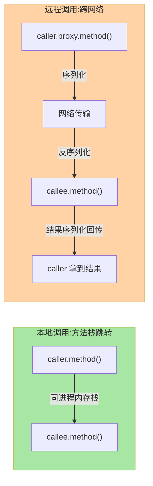
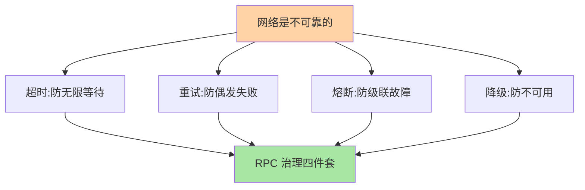

# RPC 是什么：从本地调用到远程调用的抽象

> **本文核心**：RPC 的本质是**把远程调用伪装成本地调用**——屏蔽网络通信/序列化/寻址的复杂度，让开发者像调本地方法一样调远程服务。**机制链**：本地调用（进程内方法栈）→ 远程调用需要（寻址+连接+序列化+网络传输+反序列化+执行）→ RPC 框架将以上封装为透明代理。

## 一句话摘要

RPC（Remote Procedure Call）解决的核心问题：**进程间边界**——本地调用是同一进程内存栈上的方法跳转，远程调用要跨网络到另一台机器的进程。RPC 框架把「寻址、建连、序列化、传输、反序列化、异常映射」封装为透明层，让开发者只需要写接口+实现，调用感受与本地一致。从演进看：RMI（Java 原生，1997）→ Thrift（Facebook，跨语言）→ gRPC（Google，HTTP/2+Protobuf）→ Dubbo（阿里，微服务生态）——**每一代都在解决上一代的跨语言性、性能或生态瓶颈**。

## 一、为什么不能只用 HTTP + JSON

裸 HTTP 调用的问题不在「能不能」，在**治理能力**：① 手动解析 URL 与 JSON——没有接口契约（IDL）约束；② 没有负载均衡（每次直连固定地址）；③ 没有服务发现（实例变更需人工干预）；④ 没有超时/重试/容错的统一治理——**RPC 框架 = 通信协议 + 服务治理的全家桶**，HTTP+JSON 只是它的传输底座之一。

## 5W 速记卡

| 维度 | 一句话 |
|---|---|
| What | 把远程调用封装为本地调用体验的框架 |
| Why | 跨进程调用需要治理（寻址/序列化/容错/负载均衡），裸 HTTP 无此能力 |
| When | 微服务间同步调用（需要返回值的场景） |
| Where | 服务调用方与提供方之间 |
| How | 代理拦截 → 序列化 → 网络传输 → 反序列化 → 执行 → 返回 |

## 二、RPC 调用与本地调用的区别

**远比本地的代价**：序列化/反序列化 CPU 开销 + 网络 RTT + 对端处理时间 + 失败概率从零变为非零——RPC 的设计目标就是**最小化这些代价、最大化治理能力**。

## 三、与 HTTP API 的区别：语义与治理对照

| 维度 | RPC 框架 | HTTP REST API |
|---|---|---|
| 契约 | IDL 强类型（Protobuf/Thrift IDL） | OpenAPI（弱约束） |
| 序列化 | Protobuf/Hessian（二进制高效） | JSON（文本可读但低效） |
| 服务发现 | 框架内置（注册中心联动） | 需外部 DNS/网关 |
| 负载均衡 | 客户端内置策略 | 需 LB 设备/网关 |
| 容错 | failover/failfast 内置 | 应用层自行处理 |
| 适用 | 内部服务间高频调用 | 对外 API/跨语言轻量场景 |

**选型直觉**：内部高频调用用 RPC（性能+治理），对外或跨语言轻量场景用 HTTP——**两者不是竞争关系**，同一家公司内部 RPC + 对外 REST 是常态。

## 四、典型场景与误区

**典型场景**：订单服务调库存服务扣减（同步 RPC，需要返回值）、用户服务查询（读多写少，RPC + 负载均衡）、微服务内部链路（全链路 RPC 编排）。

**误区与不适用**（**量级演进视角**：千级 QPS 单服务 HTTP+JSON 够用；万级 QPS 微服务集群 RPC 的性能优势显现（Protobuf 体积小+长连接复用）；十万级 QPS+多机房 RPC 的连接复用与服务发现成为刚需——**RPC 的治理价值随服务数量与调用量增长而放大**。）：① 什么场景都用 RPC——异步消息（不需要返回值）用 MQ 更合适（互指 MQ 系列）；② RPC 调用不做超时——默认无超时等于调用方线程可能永远阻塞；③ RPC 当作数据库直连——跨服务调用本质是「跨数据所有权边界」，不是绕过服务直接查别人的表。

### 网络不可靠性带来的分层治理

## 五、💡 实战提示

- 💡 RPC 调用必配超时（默认值不是安全值——按下游 P99 × 2 设定）
- 💡 接口先行（IDL）优于代码先行——IDL 是跨团队契约的载体
- 💡 决策口径：同步需返回值 → RPC；异步无需返回值 → MQ；对外跨语言 → REST

## 六、你们可能会问

**Q1：RPC 和微服务什么关系？**
RPC 是微服务间通信的**技术手段**，微服务是**架构理念**——没有 RPC 微服务无法互调，但 RPC 也可以用于非微服务场景（单体内部的模块通信）。

**Q2：为什么不用消息队列代替 RPC？**
消息队列是异步解耦（发送方不需要立刻知道结果），RPC 是同步调用（调用方需要立刻拿到返回值）——语义不同，不可互替；两者在微服务架构中互补共存。

**Q3：RPC 框架和 HTTP 客户端（如 Feign）什么关系？**
Feign 是「声明式 HTTP 客户端」（HTTP 协议 + 声明式接口），本质仍是 HTTP 调用——RPC 框架通常自带更高效的二进制协议 + 更完整的治理能力。边界在模糊化（gRPC 也是 HTTP/2）。

## 七、反思与追问

**质疑者视角**：RPC 解决的是「调远端像调本地」——但「像本地」本身就是一个危险的抽象：网络不可靠、远端可能超时、部分失败无法回滚。**伪装越彻底，开发者越容易忘记网络的存在**。Martin Kleppmann 在 DDIA 中指出：RPC 的透明性是一个「有用的假象」——你可以在语法上让远程调用看起来像本地调用，但你无法在语义上让网络具备本地调用的可靠性。这不是 RPC 框架的问题，是分布式系统的本质约束——框架做得再好，你仍然需要考虑超时、重试、幂等、降级。

**实践视角**：某团队在 RPC 调用中未设超时（使用框架默认 0 = 无超时），下游服务因 Full GC 卡顿 5 分钟——上游所有线程阻塞等待，线程池耗尽，上游也挂——**故障顺着调用链反向传播**。修复：全链路设置合理超时 + 熔断降级。

## 八、自测三问

1. RPC 框架相比裸 HTTP+JSON 多了哪些治理能力？
2. 远程调用比本地调用多了哪些代价？
3. RPC/MQ/REST 三者的选型边界是什么？

## 📎 核心带走

- **核心一句话**：RPC = 远程调用的透明封装 + 服务治理全家桶——「像调本地一样调远程」是体验，「治理」是价值
- **机制链**：接口声明 → 代理拦截 → 序列化 → 寻址+传输 → 反序列化 → 执行 → 结果返回
- **失效点/边界**：RPC 不替代 MQ（异步场景）；RPC 不等于 HTTP（治理能力差异）；跨服务调用不等于跨数据所有权

## 📌 数据与事实声明

- 写于 2026-09-10，RPC 概念与演进为业界共识口径
- 免责：各框架实现以官方文档为准

## 📚 参考资料

| 类型 | 标题 | 来源 |
|---|---|---|
| 官方文档 | Dubbo / gRPC / Thrift | 各官方站点 |
| 关联系列 | 本仓库治理域全系列（发现/均衡/容错等） | docs/architecture/service-governance/ |
| 原理书 | 《数据密集型应用系统设计》DDIA 第 4 章 | 公开出版 |
