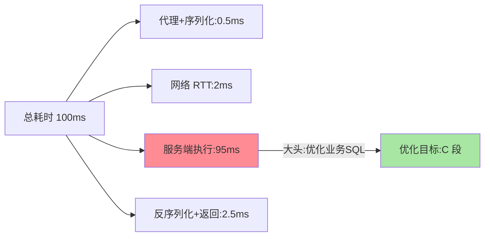

# 一个 RPC 调用的一生：从 send 到 response 的完整旅程

> 调用方写下 `userService.getUser(42)` 一行代码——背后是代理拦截、序列化、寻址、网络传输、反序列化、方法执行、结果回传的完整链路。这篇按时间顺序走完一个 RPC 调用的每一步。

> **本文核心**：RPC 调用分**调用方三步**（代理拦截→序列化→发送）+ **网络传输** + **被调方三步**（反序列化→执行→序列化返回）+ **调用方收尾**（反序列化结果→返回给业务）。**机制链**：`userService.getUser(42)` → 代理拦截（动态代理）→ 序列化请求（Protobuf）→ 服务发现取地址 → 负载均衡选实例 → 网络传输 → 服务端反序列化 → 执行 getUser → 序列化结果 → 回传 → 调用方反序列化 → 返回。

## 一句话摘要

RPC 调用的端到端旅程分**七个阶段**：① 代理拦截（动态代理捕获方法调用）→ ② 组装请求（方法名+参数序列化）→ ③ 服务发现（从注册中心/本地缓存取地址列表）→ ④ 负载均衡（按策略从列表选一个实例）→ ⑤ 网络传输（建立连接、发送编码数据）→ ⑥ 服务端执行（反序列化 → 反射调用 → 结果序列化）→ ⑦ 结果回传（调用方反序列化返回）。**每一阶段都可观测可定制**——RPC 框架的扩展点就分布在这七段上。

## 5W 速记卡

| 维度 | 一句话 |
|---|---|
| What | 一次 RPC 调用从 send 到 response 的完整链路 |
| Why | 理解链路才能定位延迟/失败/序列化异常等问题 |
| When | RPC 框架学习、RPC 排障、性能调优 |
| Where | 调用方进程 + 网络 + 被调方进程 |
| How | 七阶段依次执行，扩展点分布在各阶段 |

## 二、七阶段旅程与耗时分布

**耗时分布的规律**：网络传输与服务端业务执行占 90%+ 的延迟——代理/序列化/负载均衡的框架开销通常在微秒到百微秒级——**性能调优的靶子在「业务耗时」和「网络」，不在框架本身**（框架开销已经是常量级）。

### 阶段③④的细节：地址列表从哪来、实例怎么选

服务发现阶段框架并非每次都访问注册中心——**地址列表缓存在调用方内存**，注册中心变更时推送更新（推拉结合）；一次调用的「发现」实际是查本地缓存，开销近似于零，这就是注册中心短暂不可用时调用仍能继续的原因（互指服务发现篇）。负载均衡在缓存的地址列表上执行：随机、轮询、一致性哈希或基于 P99 时延的自适应策略（互指负载均衡篇）。**理解这一点，才能理解「注册中心挂了为什么不影响存量调用」与「新实例上线为什么要等地址推送才进列表」这两个高频现象**。

## 三、与 HTTP 请求的对照

| 阶段 | RPC 调用 | HTTP 请求（互指 gateway 篇 1） |
|---|---|---|
| 路由 | 服务名 → 注册中心 → 实例 | URL → DNS/LB → 网关 → 路由 |
| 参数 | IDL 强类型序列化 | Query/Body JSON |
| 连接 | 长连接复用（TCP） | 通常短连接或 keep-alive |
| 治理 | 框架内置 | 网关/应用层 |

HTTP 每次请求都要走 DNS→TCP→HTTP 协议解析；RPC 的长连接复用消除了连接建立开销（仅首次建连）——**内部高频调用 RPC 的性能优势主要来自连接复用 + 二进制序列化**。

**量级演进视角**：千级 QPS 的 RPC 调用，框架开销（代理/序列化）占比不到 1%，性能在业务耗时；万级 QPS 序列化开销开始显现（CPU 占比上升）；十万级 QPS 序列化协议选择直接决定吞吐天花板（Protobuf vs JSON 的差距被放大）——**量级越大，底层优化越重要**。

## 与 HTTP 的区别

HTTP 请求（URL+JSON）与 RPC（服务名+二进制）在路由、序列化、治理上的模块边界截然不同。

## 三·五、请求 ID：一次调用的身份标识

框架为每次调用生成唯一 **requestId/消息 ID**——它承担两个职责：① **异步关联**：底层 NIO 非阻塞发送后，请求与响应可能交叉到达，协议层靠消息 ID 把响应帧匹配回等待中的 Future；② **链路追踪锚点**：traceId/spanId 透传在扩展头里，APM 才能串起 A→B→C 的完整调用链（互指可观测篇）。**排障时用消息 ID 在两端日志中检索，是 RPC 排障的第一手段**——先定位「请求到了没有」，再区分「没发出去/对端没收到/对端处理失败」三段。

## 三·六、超时预算：一次调用的时间账本

调用方设置的 timeout 不是「服务端要在这个时间处理完」，而是**覆盖全链路的时间预算**：序列化+编码 → 网络去程 → 排队 → 业务执行 → 网络回程 → 反序列化，每一段都从预算里扣。**超时预算的工程拆法**：总预算 = 网络 RTT × 2 + 下游 P99 × 安全系数（常用 1.5~2）+ 框架开销余量；在 A→B→C 链路中，上游超时必须大于下游超时之和，否则下游还没返回上游先放弃（超时倒挂，白耗资源）。更进一步，traceId 携带 **deadline（剩余预算）** 向下游透传——下游看到预算只剩 20ms 就不再执行重查询，直接返回降级结果——这是分布式系统「预算传递」的入门形态（互指分布式系统设计系列）。

## 四、典型场景与误区

**典型场景**：同步查询（订单服务查用户信息）、链式调用（A→B→C→D 多级依赖）、双向调用（B 处理完后回调 A 的 callback 接口）。场景判断的关键是**预期延迟分布**：查询类（毫秒级、可缓存）适合设置激进超时+failover；写入类（涉及状态变更、必须防重）超时要保守+配幂等；报表类大请求应另开独立线程池与端口隔离，防止大请求占满连接拖垮普通查询——**同一框架里不同流量的治理参数本就该不同**。

**误区与不适用**：① RPC 调用嵌套过深——A→B→C→D 四级链路的 P99 是四级 P99 之和，任何一级慢全链慢——架构上应控制调用链深度（≤3 级为宜）；② 在 RPC 序列化中传大对象——序列化开销与对象大小正相关，大对象应按引用传递（传 ID 而非传全量数据）；③ RPC 异常当业务异常处理——框架层异常（超时/连接失败）与业务异常（余额不足）的语义完全不同，须分类处理；④ 超时值拍脑袋设 3 秒——超时过长大故障扩散（线程被拖住），过短误杀慢请求（P99 之外的正常请求被裁），正确口径是按下游 P99 推导；⑤ 忽略 GC 停顿对 RTT 的影响——服务端 Young GC 50ms 在低峰无害、高峰叠加排队直接击穿 P99，压测必须开 GC 日志对照分析。

### 端到端耗时分解的可观测视图

## 五、💡 实战提示

- 💡 RPC 调用链深度控制在 3 层以内——超过考虑异步化或服务合并
- 💡 传递 ID 而非全量对象——序列化开销与对象大小成正比
- 💡 框架异常与业务异常必须类型分离——混用会导致重试/降级策略误判

## 六、你们可能会问

**Q1：RPC 是同步的还是异步的？**
语义上同步（调用方等结果），实现上可异步（底层 NIO 非阻塞发送，回调通知结果）——「同步语义 + 异步实现」是 RPC 框架的标准设计。

**Q2：一次 RPC 调用会经过几次序列化/反序列化？**
调用方一次序列化（请求）+ 一次反序列化（响应），服务端一次反序列化 + 一次序列化（响应）——共四次编解码操作（可优化的点在于选择高效的序列化协议）。

**Q3：RPC 框架怎么做「透明」？**
动态代理——调用方持有的是接口的代理对象（而非远程服务的直接引用），代理拦截方法调用后转发到网络——这是代理模式在 RPC 中的核心应用（互指 IoC 系列的动态代理机制）。

## 追问思考

**质疑者视角**：RPC 框架把调用封装得如此透明——开发者甚至不知道自己发了一次网络请求。**透明是双刃剑**：好处是学习成本低，坏处是开发者忽略了网络调用的代价（超时/重试/幂等/降级），把 RPC 当本地调用写出了 O(N²) 的循环远程调用（N+1 问题的 RPC 版本）。框架的透明性不应成为开发者忽视分布式约束的理由。

**实践视角**：某团队发现批量查询接口 P99 飙到 3 秒——排查发现是一个循环里逐条调远程 RPC（循环 100 次 = 100 次 RPC 调用 = 100 次网络 RTT）。修复：改为批量接口（一次传 100 个 ID，服务端批量查询返回）——**把 N 次网络往返压为 1 次**，P99 降到 50ms。追问：为什么不改异步并发调用？——异步并发（100 个请求同时发出）总耗时 ≈ 最慢一次的 RTT，也是可行解；但并发度受下游承载约束，批量化才是把「请求数」降下来的根治方案，两者配合使用。

**质疑者视角·追问链**：耗时分解说「业务占大头，框架开销可忽略」——那是不是永远不用管框架？拆开看：单次调用框架开销微秒级可忽略，但**百万 QPS 下框架开销 = 开销 × QPS**，序列化 CPU 直接吃掉整机核数的可观份额——量级不同，结论翻转。追问：服务端线程模型对「执行」阶段影响多大？——传统 BIO 一连接一线程在千级连接即触顶；NIO 事件驱动少量线程扛万级并发，但 handler 里写阻塞调用（同步 DB 查询）会拖死整个事件循环——**理解线程模型，才能解释「调用量没涨但延迟突然飙升」的排障谜题**（深入见篇 5 IO 模型）。

## 八、自测三问

1. 七阶段各自的大致耗时量级？哪个是性能大头？（答：框架段微秒级、网络与业务毫秒级；业务执行通常占 90%+）
2. RPC 长连接复用消除了什么开销？（答：TCP 建连三次握手+TLS 握手+端口资源开销，仅首次建连支付）
3. 框架异常与业务异常为什么要分类？（答：框架异常可重试/可熔断/可换实例，业务异常重试无意义还可能放大写风险——策略必须分开）

## 开放问题

- Service Mesh（Sidecar 代理）把 RPC 的序列化/传输从 SDK 下沉到独立进程——「框架透明」从编译期代理演进到运行时代理，调用链的观测粒度在变化。
- 跨语言序列化 schema 演进问题——接口字段变更时新旧版本并存窗口的兼容性治理（Protobuf 的 tag 机制 why），是链路治理向接口治理延伸的方向。
- RPC 与 HTTP/3(QUIC) 的融合——QUIC 的 0-RTT 建连可能改变「长连接复用」的性能优势格局。

## 📎 核心带走

- **核心一句话**：RPC 调用 = 七阶段流水线（代理→序列化→发现→均衡→传输→执行→回传），网络+业务占 90% 延迟
- **机制链**：代理拦截 → 序列化 → 发现 → 均衡 → 传输 → 反序列化 → 执行 → 序列化结果 → 回传
- **失效点/边界**：链深 ≤3；大对象不传；框架异常与业务异常分离

## 💡 实战提示

- 💡 RPC 链路耗时打点进 APM（互指 stability 追踪篇）——每一阶段的耗时可视化是排障的地基
- 💡 超时设置 = 下游 P99 × 2 + 网络余量——不用框架默认值
- 💡 决策口径：接口设计按「传递最小必要数据」——参数列表就是你的 API 契约

## 📌 数据与事实声明

- 写于 2026-09-10，七阶段模型为 Dubbo/gRPC 源码的共识归纳；耗时量级为经验口径
- 免责：具体耗时按环境实测

## 📚 参考资料

| 类型 | 标题 | 来源 |
|---|---|---|
| 官方文档 | Dubbo 调用流程 / gRPC 架构 | dubbo.apache.org、grpc.io |
| 关联系列 | 本仓库治理域各系列（发现/均衡/容错/限流互指） | docs/architecture/service-governance/ |
| 原理书 | 《数据密集型应用系统设计》DDIA | 公开出版 |
