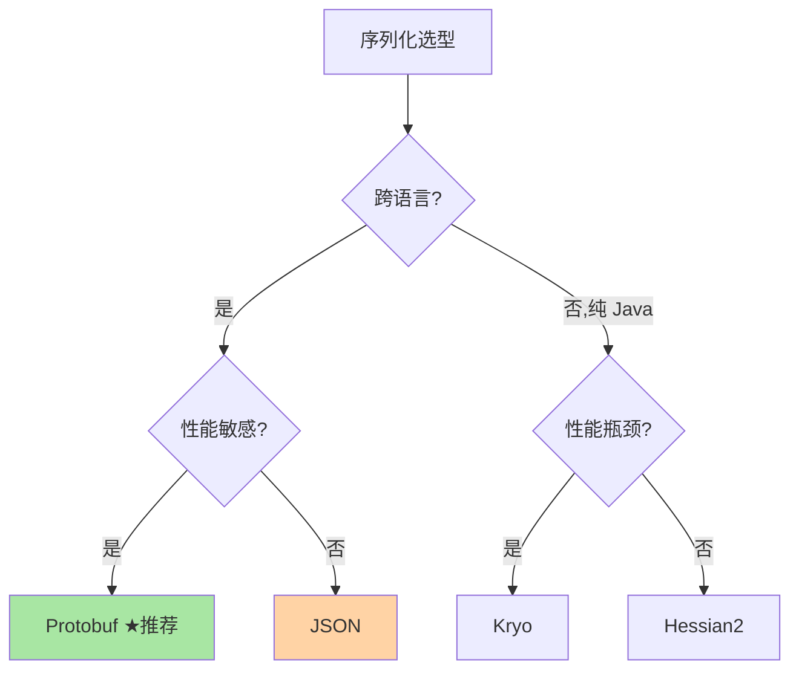
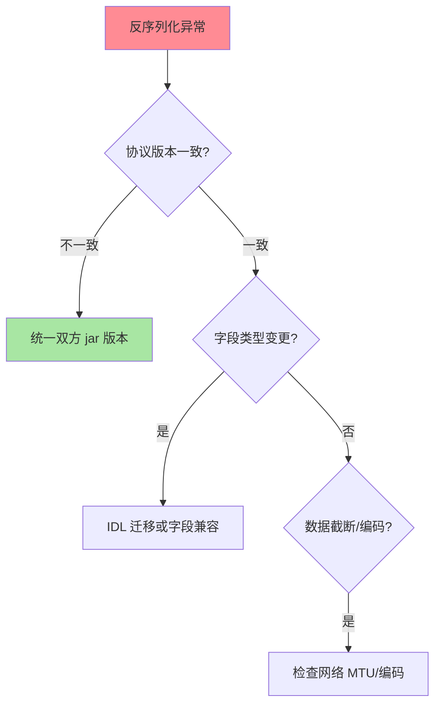

# 序列化协议全景：JSON、Hessian、Protobuf 的取舍

> 序列化是 RPC 中「对象 ↔ 字节流」的翻译官——选对协议直接影响吞吐、延迟与跨语言能力。这篇讲主流序列化协议的设计取舍与选型决策，并把「协议选型」放进量级演进的框架里看：什么时候 JSON 无所谓、什么时候 Protobuf 是架构约束。

> **本文核心**：序列化协议的四个维度——**性能**（编解码速度+序列化后体积）、**跨语言**（Java/Go/Python/C++ 能否互通）、**可读性**（人能否直接阅读调试）、**兼容性**（字段增删后新老版本能否互通）。**机制链**：对象 → 编码（二进制/文本） → 传输 → 解码 → 对象。**核心结论：没有万能协议，按场景选型**——内部高性能选 Protobuf、调试友好选 JSON、跨语言老系统选 Hessian。

## 一句话摘要

主流协议一览：**JSON**——文本可读、生态最广、但体积大+解析慢；**Protobuf**——二进制紧凑+高效+强类型 IDL，但需编译生成代码、人类不可读；**Hessian2**——Java 生态友好、性能好于 JSON、跨语言支持一般；**Kryo**——Java 专属、极致性能、不支持跨语言。**选型四问**：需要跨语言吗（是→Protobuf/JSON）？性能是瓶颈吗（是→Protobuf/Kryo）？需要人读吗（是→JSON）？已有生态约束吗（是→跟随现有选型）？

## 5W 速记卡

| 维度 | 一句话 |
|---|---|
| What | 对象 ↔ 字节流的编码解码协议 |
| Why | RPC 通信的基础，性能与兼容性的关键变量 |
| When | 接口设计、序列化异常排查、性能调优 |
| Where | RPC 框架序列化层 + 消息体 + 缓存存储 |
| How | 编码 → 传输 → 解码 → 对象还原 |

## 二、主流协议对比矩阵

| 协议 | 性能 | 体积 | 跨语言 | 可读性 | 兼容性 | 安全 |
|---|---|---|---|---|---|---|
| JSON | 低 | 大 | ✅ 天然 | ✅ 高 | 字段增删友好 | 需注意反序列化漏洞 |
| Protobuf | ★高 | ★小 | ✅ IDL 驱动 | ❌ 二进制 | IDL 版本管理 | 需注意字段校验 |
| Hessian2 | 高 | 小 | 部分 | ❌ | 字段增删较好 | 历史有反序列化漏洞 |
| Kryo | ★最高 | ★小 | ❌ Java only | ❌ | 弱 | 需注册类白名单 |

## 三、Protobuf 为什么是当前最优解

**三项优势**：① **体积**——varint 编码 + 字段编号替代字段名，JSON 的 1/5~1/10；② **速度**——二进制直接映射内存结构，比 JSON 文本解析快 5~10 倍（公开基准方向）；③ **强类型 IDL**——编译期类型检查 + 多语言代码生成（`.proto` 文件一次定义，多语言生成桩代码）。**代价**：需要编译步骤（.proto → .java/.go/.py）、人类不可读（需工具转 JSON 调试）、生态门槛（团队需学习 proto 语法）。

### 兼容性的机制根源：字段编号（field tag）

Protobuf 的向前/向后兼容不是约定出来的，是**编码格式**保证的——wire format 里存的是「字段编号 + 类型 + 值」，不含字段名。**向后兼容**（新读旧）：新代码读到未知编号就跳过（长度自描述）；**向前兼容**（旧读新）：旧代码同样跳过不认识的编号。工程纪律随之而来：**编号一旦使用不可更改、不可复用**（改 reserved 标记），删除字段必须标记 reserved 防止编号被复用后新旧数据错乱——IDL 是接口契约，字段编号就是契约的二进制基因。这就是篇 2 开放问题里「新旧版本并存窗口」的机制答案。

## 四、与数据库存储格式的区别：对照

| 维度 | RPC 序列化 | 数据库存储格式 |
|---|---|---|
| 目标 | 网络传输效率 | 磁盘存储效率 |
| 生命周期 | 请求-响应（毫秒级） | 持久化（月年级） |
| 演进 | 接口版本管理 | 表结构迁移 |
| 同构参照 | Protobuf/JSON | 行存储/列存储 |

RPC 序列化优化「编解码速度」，存储格式优化「磁盘空间与扫描效率」——两者是不同层的优化问题（互指 ES 存储篇的 doc_values 列存设计）。

**设计思想**：主流框架都把序列化做成 **SPI 扩展点**而非硬编码——Dubbo 的 Serialization 接口、gRPC 的 Codec 均可替换。为什么？序列化协议的演进速度快于框架本体（Protobuf→FlatBuffers→新协议），把「选协议」从框架决策降为配置决策，框架才能长寿。**框架设计的通用规律：把变化最快、场景差异最大的维度做成扩展点**——序列化正是 RPC 里变化最快的那个维度。这也回答了「为什么 Dubbo 3 能平滑引入新序列化而业务无感」：扩展点隔离了变化。

### 序列化异常的排查定位

**量级演进视角**：千级 QPS 的 JSON 序列化 CPU 占比可忽略；万级 QPS JSON 的序列化开销开始影响吞吐（CPU 时间片被 Jackson 占用）；十万级 QPS Protobuf 的体积与速度优势决定性地降低网络与 CPU 成本——**序列化协议的选型随流量量级从「不重要」变为「关键决策」**。

## 五、典型场景与误区

**典型场景**：内部微服务 RPC（Protobuf/Dubbo Hessian2）、对外 REST API（JSON——可读+生态）、缓存序列化（Kryo/JSON——Kryo 快但不可跨语言，互指 Redis 系列）、消息队列（JSON/Avro/Protobuf——互指 MQ 系列 Schema Registry）。同一系统**分场景混用是常态而非妥协**：RPC 内部走 Protobuf 追性能、网关对外转 JSON 保生态、MQ 用 Schema Registry 管演进——每种边界按其约束选协议，统一只在同一边界内成立。

**事故视角**：某团队升级接口把 Hessian 序列化的字段类型从 `int` 改为 `long`——发布后部分实例未重启（新旧版本并存），新版本调用旧版本时报反序列化异常。教训：**类型变更 = 破坏性变更**，必须走字段废弃+新增字段的兼容路径，并在灰度期验证新老实例互通。

**误区与不适用**：① 全站统一一种协议——内部高性能 Protobuf + 对外 JSON 是合理的分层共存；② Java 原生序列化（ObjectOutputStream）——安全漏洞重灾区（反序列化攻击），生产禁用；③ 序列化只看速度不看体积——网络带宽与 GC 压力都是体积的代价。

## 五·五、序列化与安全：反序列化漏洞为什么频发

反序列化攻击的本质：**序列化数据里携带了「重建对象」的完整指令**——反序列化器按指令实例化类、恢复字段，若攻击者能控制这段数据，就能让服务端实例化任意类（构造 gadget chain 触发命令执行）。Java 原生序列化与 Hessian2 历史漏洞都源于此。**防御三板斧**：① 类白名单（Kryo register / Hessian allowList）——只反序列化预期类；② 不序列化不可信输入——序列化边界等同于信任边界；③ 关注框架安全公告——Dubbo 等框架的反序列化漏洞修复要跟进升级。**把「反序列化端点」当攻击面管理，是 RPC 安全的必修课**（互指治理域鉴权篇：边界信任模型）。

## 六、💡 实战提示

- 💡 新项目默认 Protobuf——IDL 先行 + 跨语言 + 高性能，一次到位
- 💡 已有 JSON 体系不必急迁——JSON 的性能瓶颈在流量大了之后才显现
- 💡 序列化异常排查：先看协议版本是否一致（双方用的 jar/协议版本）

## 追问思考

**质疑者视角**：Protobuf 性能好但需要 IDL 编译——开发流程多了一步，跨团队协作多了一个编译依赖。JSON 虽然慢但「打开就能看」——调试效率高、动态语言（Python/Node.js）无需编译即可消费。**性能优化是有代价的**：从 JSON 迁移到 Protobuf 的改造成本（IDL 编写、代码生成、存量数据迁移、双跑验证）可能远超性能收益——只有在性能确实是瓶颈时才值得迁移。

**实践视角**：某团队把缓存序列化从 JSON 改为 Kryo，吞吐提升 40%——但一周后缓存数据不可读（Kryo 序列化的对象不可跨语言调试），运维排查时无法用 redis-cli 直接查看缓存内容。最终折中：热点缓存用 Kryo（性能），调试场景用 JSON（可读），双写并存——**性能优化牺牲了可运维性，需要显式补位**。

**追问链**：为什么 JSON 解析慢？——文本协议要「逐字符 tokenize → 构建语法树 → 反射/构造对象」三步，二进制协议「读编号查类型 → 直接内存赋值」两步且无 tokenize。追问：那 JSON 的优化空间在哪？——Jackson 的 afterburner/StringReplace 系列用字节码生成压缩反射开销，可缩小 2~3 倍差距，但天花板仍是二进制——**优化能缩小差距，改变不了文本 vs 二进制的量级差**。

## 八、你们可能会问

**Q1：Protobuf 的 varint 编码是什么？**
变长整数编码——小数值用 1 字节、大数值用多字节（每字节最高位标记是否继续）——「常用值是小值」的统计假设下大幅缩小体积。

**Q2：Kryo 为什么快但不安全？**
反序列化时直接实例化任意类（不校验类白名单）→ 攻击者构造恶意序列化数据触发任意代码执行——Kryo 4.x+ 要求注册类白名单，但默认未强制。

**Q3：gRPC 一定要用 Protobuf 吗？**
不是——gRPC 支持自定义序列化（如 JSON/Thrift），但 Protobuf 是原生推荐且性能最优——IDL 强类型 + 代码生成 + gRPC 传输是三位一体的设计。

**Q4：为什么体积小这么重要？内网带宽不是够用吗？**
体积影响的不只是带宽：① 网卡收包中断与内核协议栈 CPU 随字节数线性增长——十万 QPS 下报文减半，网络中断处理 CPU 直接减半；② RPC 响应要在调用方堆内存重建对象，小报文=更少 GC 压力；③ 跨机房/公网场景带宽即成本。**内网带宽够用，但处理带宽的 CPU 不一定够用**。

## 八、自测三问

1. 序列化协议的四维度（性能/跨语言/可读性/兼容性）？（答：四者互斥常两两冲突——性能与可读性、跨语言与极致性能，选型=按场景排优先级）
2. Protobuf 的三项优势与代价？（答：体积小/速度快/强类型 IDL；代价=编译步骤+不可读+学习门槛）
3. Java 原生序列化为什么生产禁用？（答：任意类实例化=反序列化攻击面，且性能差+跨语言为零）
4. Protobuf 删字段为什么要 reserved？（答：防止编号被新字段复用后，新旧数据按同一编号解析出错误类型）

## 开放问题

- 新序列化协议（Cap'n Proto/FlatBuffers——零拷贝反序列化）在特定场景有性能优势，但生态普及度低——是否值得为极端性能切换值得评估。
- Schema Registry 与接口治理平台化——序列化兼容性检查从「人工评审 IDL 变更」演进到「流水线自动校验新旧消费者兼容」，协议演进治理的平台化方向。
- 多模序列化（同一服务按调用方能力协商协议）——HTTP/2 的内容协商机制移植到 RPC，header 协商序列化类型已在部分框架（Dubbo 3 Triple）落地。
- JSON Schema 的演进（JSON Schema 2020-12）让 JSON 的契约能力增强——JSON 在轻量场景的地位不会轻易被替代。

## 📎 核心带走

- **核心一句话**：序列化选型 = 性能 × 跨语言 × 可读性 × 兼容性的四维权衡——Protobuf 是当前内部 RPC 的最优解
- **机制链**：对象 → 编码（varint/文本） → 传输 → 解码 → 对象还原；IDL 驱动类型安全
- **失效点/边界**：Java 原生序列化生产禁用；Kryo 需类白名单；JSON payload 非加密

## 💡 实战提示

- 💡 新服务接口 IDL 先行（.proto 文件进 Git），不要代码先行再补协议
- 💡 序列化协议选型进团队规范——混用协议（同服务不同接口用不同协议）增加心智负担
- 💡 决策口径：内部 RPC 用 Protobuf、缓存用 Kryo 或 JSON、对外 API 用 JSON——按场景分层选择
- 💡 监控序列化 CPU 占比（async-profiler 火焰图看编解码函数）——占比超 10% 说明协议选型或数据结构需要重审

## 📌 数据与事实声明

- 写于 2026-09-10，性能对比为公开基准（GitHub 各序列化库 benchmark）的量级方向
- 免责：具体性能按业务数据结构实测

## 📚 参考资料

| 类型 | 标题 | 来源 |
|---|---|---|
| 官方文档 | Protobuf / Kryo / Hessian | protobuf.dev、github.com/EsotericSoftware/kryo |
| 官方文档 | Dubbo 序列化 | dubbo.apache.org |
| 公开基准 | github.com/eishay/jvm-serializers | 公开基准仓库 |
