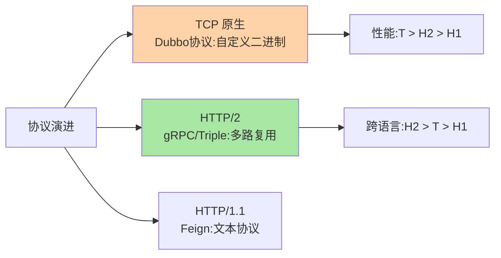
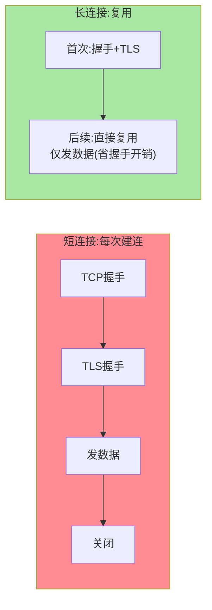

# 通信协议与传输：TCP、HTTP/2 与长连接

> RPC 框架用什么协议传输数据？TCP 原生（Dubbo 协议）、HTTP/2（gRPC/Triple）、还是 HTTP/1.1（Feign）？不同协议的性能与语义差异直接决定了 RPC 的吞吐天花板与延迟下限。

> **本文核心**：RPC 通信协议的三代演进——**① TCP 原生协议**（Dubbo 协议：自定义二进制头 + 长连接复用，性能极致但跨语言弱）；**② HTTP/2 协议**（gRPC/Triple：多路复用 + 流控 + 头压缩，跨语言好性能也强）；**③ HTTP/1.1**（Feign/REST：通用性最强，性能最低）。**机制链**：TCP 粘包拆包（自定义协议需处理消息边界）→ 协议头（魔数/序列化类型/请求 ID） → 请求体（序列化数据） → 长连接复用（省去每次建连的 TCP 三次握手 + TLS 握手）。

## 一句话摘要

**粘包拆包**是 TCP 自定义协议绕不开的底层问题——TCP 是字节流协议（无消息边界），应用层必须自行拆分消息边界（定长/分隔符/长度前缀三种方案）。**HTTP/2 的多路复用**解决了 HTTP/1.1 的队头阻塞（一个连接上并行多个请求互不阻塞）——gRPC 选择 HTTP/2 正是看中了多路复用 + 头压缩 + 流式传输三大能力。**长连接复用**是 RPC 性能的关键（省去每次调用的 TCP 三次握手 + TLS 握手，连接建立开销从毫秒级变为零）。

## 5W 速记卡

| 维度 | 一句话 |
|---|---|
| What | RPC 的传输协议选型与消息边界处理 |
| Why | 协议决定吞吐天花板与跨语言能力 |
| When | RPC 框架选型、自定义协议设计、粘包排查 |
| Where | 传输层（TCP/HTTP2）+ 协议编解码层 |
| How | 长连接复用 + 协议头标识 + 消息边界处理 |

## 二、协议演进与消息边界

| 维度 | TCP 原生（Dubbo） | HTTP/2（gRPC） | HTTP/1.1（Feign） |
|---|---|---|---|
| 性能 | ★★★（自定义二进制） | ★★☆（HTTP/2 多路复用） | ★（文本解析开销） |
| 跨语言 | 需各方实现协议 | ✅ HTTP/2 标准化 | ✅ HTTP 天然通用 |
| 流式传输 | 需自行实现 | ✅ 原生支持 | ❌ |
| 消息边界 | 自行处理粘包拆包 | HTTP/2 帧机制自动处理 | Content-Length/Chunked |
| 生态 | Dubbo 体系 | gRPC 体系/CNCF | 通用 |

**粘包拆包三种方案**：① 定长（每条消息固定字节，浪费空间）；② 分隔符（\r\n 分隔，内容不能含分隔符）；③ **长度前缀**（消息头存 body 长度，最通用——Dubbo/gRPC 均用此方案）。

**量级演进视角**：千级 QPS HTTP/1.1 短连接也能跑（连接建立开销占比可忽略）；万级 QPS 长连接复用成为刚需（连接建立的开销在总耗时中占比显升）；十万级+ QPS 必须 HTTP/2 多路复用或 TCP 原生（连接数上限与端口耗尽是硬瓶颈）——传输协议的选型随流量量级从「不重要」变为「架构约束」。

## 三、与 TCP 直连的区别：协议层与传输层对照

| 维度 | 应用层协议（RPC 自定义） | 传输层（裸 TCP） |
|---|---|---|
| 消息边界 | 协议头定义长度 | 字节流无边界 |
| 语义 | 请求-响应模型 | 双向字节流 |
| 可扩展性 | 协议头携带元数据（序列化类型/请求 ID） | 无语义 |

RPC 协议头的关键字段：**魔数**（识别协议类型）+ **序列化类型**（Protobuf/Hessian 标识）+ **请求 ID**（异步关联请求与响应）+ **数据长度**（消息边界）——协议头设计决定了 RPC 的扩展能力。

长连接与短连接的性能对比：

## 四、典型场景与误区

**典型场景**：内部高频调用（Dubbo TCP 长连接，微秒级 RTT）、跨语言微服务（gRPC HTTP/2，Protobuf IDL 统一契约）、对外 REST（HTTP/1.1 Feign，生态兼容）。

**误区与不适用**：① 每次 RPC 调用都新建 TCP 连接——连接建立（三次握手+TLS）耗时远大于数据传输，**长连接复用是 RPC 性能的基石**；② TCP 粘包当 Bug——TCP 是字节流协议，粘包是正常行为，应用层必须处理消息边界；③ HTTP/2 一定比 HTTP/1.1 快——在低并发场景 HTTP/2 的头压缩与多路复用优势不明显，甚至可能因流控反而更慢。

## 五、💡 实战提示

- 💡 内部高频 RPC 选 TCP 原生或 HTTP/2 长连接——不要每次调用建新连接
- 💡 自定义协议必配长度前缀——粘包拆包的行业标准解
- 💡 决策口径：极致性能选 TCP 原生，跨语言选 HTTP/2 gRPC，通用兼容选 HTTP/1.1

## 六、你们可能会问

**Q1：什么是 TCP 粘包？为什么 UDP 没有这个问题？**
TCP 是字节流协议（无消息边界）——发送方写了 3 条消息，接收方可能一次读到 1 条/2 条/3 条混合的数据（"粘"在一起）或一条消息被拆成两次读取（"拆"开）。UDP 是数据报协议（有天然消息边界），每条 datagram 就是独立消息——**TCP 需应用层定义边界，UDP 天然有边界但不可靠**。

**Q2：HTTP/2 的多路复用解决了什么问题？**
HTTP/1.1 的队头阻塞（同一 TCP 连接上前一个请求未完成则后续请求阻塞）——HTTP/2 将请求/响应拆为帧（frame），多个请求的帧在同一连接上交错传输——**消除应用层队头阻塞**（但 TCP 层的队头阻塞仍存在，QUIC 才彻底解决）。

**Q3：RPC 的请求 ID 有什么用？**
异步非阻塞模型下，同一个 TCP 连接上可能同时有多个未完成的请求——请求 ID 用于将响应与请求关联（拿到响应后按 ID 找到对应的等待线程并唤醒）——没有请求 ID 就无法复用连接。

## 七、反思与追问

**质疑者视角**：自定义 TCP 协议的性能极致——但每换一种语言都要重新实现协议编解码，跨语言成本是私有协议的阿喀琉斯之踵。HTTP/2 虽然性能略低但标准化程度高——**极致性能与标准化程度的取舍**是 RPC 协议选型的核心矛盾，gRPC 的出现正是为了在两者间找平衡。

**事故视角**：某团队自定义 RPC 协议未设计心跳机制——长连接在 NAT/防火墙后超时断开，客户端感知不到（半打开连接）——请求持续发往死连接并超时。修复：应用层心跳 + 连接活性检测 + 自动重连。

## 八、自测三问

1. 粘包拆包三种方案与长度前缀的原理？
2. HTTP/2 多路复用解决了什么？QUIC 才彻底解决的是什么？
3. 协议头的关键字段（魔数/序列化类型/请求 ID/长度）各有什么用？

## 开放问题

- QUIC（HTTP/3）将传输层从 TCP 换为 UDP——消除 TCP 层队头阻塞 + 0-RTT 建连 + 连接迁移——可能改变 RPC 传输协议的选型格局。
- Remote Direct Memory Access (RDMA) 在超低延迟场景（< 10μs RTT）的 RPC 传输探索，是高性能计算领域的方向。

## 📎 核心带走

- **核心一句话**：RPC 通信协议 = 长连接复用（性能基石）+ 消息边界处理（长度前缀）+ 协议头元数据（扩展能力）——性能与跨语言的权衡决定选型
- **机制链**：TCP 字节流 → 协议头（魔数+类型+ID+长度） → 消息拆分 → 序列化体 → 长连接复用 → HTTP/2 多路复用演进
- **失效点/边界**：粘包是 TCP 特性非 Bug；HTTP/2 仍有 TCP 层队头阻塞；私有协议跨语言成本高

## 💡 实战提示

- 💡 长连接必配心跳（防半打开连接）——连接活性检测是基础运维能力
- 💡 协议设计预留版本字段——协议升级时兼容性靠版本协商
- 💡 决策口径：性能极致选 TCP 原生、跨语言选 gRPC HTTP/2、通用兼容选 HTTP/1.1 Feign——按团队语言栈与性能需求定

## 📌 数据与事实声明

- 写于 2026-09-10，协议机制以 Dubbo/gRPC/TCP 标准的公开口径归纳
- 「连接建立开销毫秒级」为公网 + TLS 的量级口径，内网裸 TCP 更低
- 免责：以 RFC 与各框架官方文档为准

## 📚 参考资料

| 类型 | 标题 | 来源 |
|---|---|---|
| 公开标准 | RFC 9113 (HTTP/2) / RFC 9000 (QUIC) | ietf.org |
| 官方文档 | Dubbo 协议 / gRPC over HTTP/2 | dubbo.apache.org、grpc.io |
| 原理书 | 《TCP/IP 详解 卷 1》协议 | 公开出版 |
