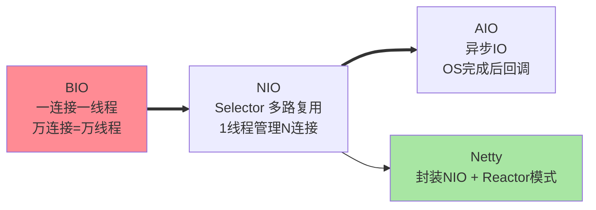
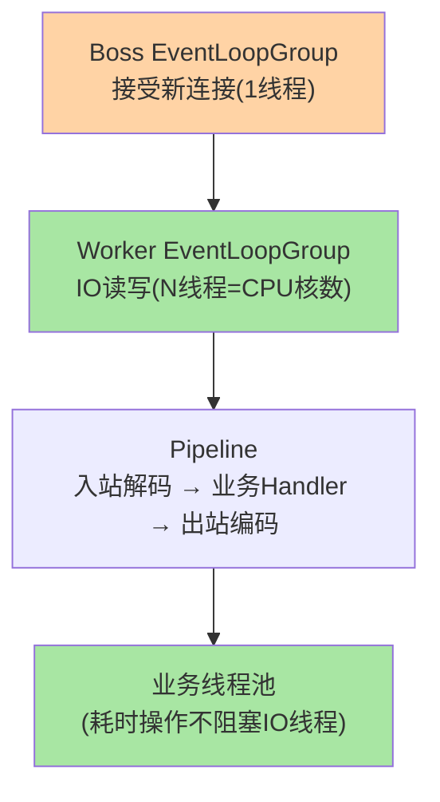

# IO 模型与 Netty：RPC 通信的引擎

> RPC 框架为什么都基于 Netty？因为 Netty 封装了 Java NIO 的复杂 API，提供了**事件驱动 + 非阻塞 IO** 的高性能通信能力——一个线程可以管理成千上万个连接。这篇从 BIO/NIO/Epoll 讲到 Netty 的线程模型。

> **本文核心**：IO 模型三代演进——**BIO**（一连接一线程，线程数 = 连接数，万级连接即线程爆炸）→ **NIO**（多路复用 Selector，一个线程管理多个 Channel，事件驱动）→ **AIO**（异步 IO，OS 完成后回调，Linux 实现不完善用得少）。**Netty 的线程模型**：Boss 线程组（接受连接）+ Worker 线程组（IO 读写）+ 业务线程池（自定义 Handler 执行）——三者分离避免 IO 阻塞业务。**机制链**：Selector 监听多 Channel 事件 → 就绪事件分发给 Handler → Handler 在 Worker 线程执行 → 重操作转发业务线程池。

## 一句话摘要

RPC 的通信引擎选 Netty 的原因：**NIO 的多路复用**让一个线程管理成千上万个连接（系统调用 epoll/kqueue 由内核通知就绪事件——不需要为每个连接创建线程）；**Netty 封装了 NIO 的复杂 API**（Selector/Channel/Buffer 三件套的编排逻辑复杂且易出错——Netty 抽象为 EventLoop/Channel/Pipeline 的清晰模型）。**Reactor 模式**是事件驱动的核心模式：单线程或少量线程的事件循环（EventLoop）分发事件给处理器（Handler）——Redis/Nginx/Netty/MongoDB 全部基于此模式。

## 5W 速记卡

| 维度 | 一句话 |
|---|---|
| What | BIO→NIO→AIO 的 IO 模型演进 + Netty 的线程模型 |
| Why | RPC 框架的通信引擎需要高并发低延迟的网络 IO |
| When | RPC 框架原理学习、网络性能调优 |
| Where | Netty/Redis/Nginx 等高性能网络组件 |
| How | Boss 接受连接 → Worker IO 读写 → 业务线程池执行 Handler |

## 二、与 BIO 的区别：IO 模型演进全景

| 模型 | 线程数 | 并发能力 | 复杂度 | 适用 |
|---|---|---|---|---|
| BIO | = 连接数 | 低（千级） | 低 | 低并发 |
| NIO | 少量（CPU 核数） | 高（十万级） | 高（Selector 编排） | 高并发 |
| AIO | 极少 | 高 | 最高 | 理论最优但 Linux 实现不完善 |

## 三、Netty 线程模型

**EventLoop 的核心纪律**：一个 Channel 的所有 IO 事件始终由同一个 EventLoop 线程处理（无锁并发设计）——**Handler 中不能阻塞**（阻塞 = 该 EventLoop 上的所有 Channel 都被阻塞）——耗时操作必须转发到业务线程池。

## 四、典型场景与误区

**典型场景**：RPC 框架通信层（Dubbo/gRPC 底层均为 Netty）、消息推送长连接（Netty + WebSocket）、API 网关（Netty 作为反向代理的事件驱动引擎）。

**误区与不适用**：① Netty Handler 中做同步数据库查询——阻塞 EventLoop → 所有连接延迟飙升（最常见性能事故）；② Boss 和 Worker 共用同一个线程组——新连接接受被 IO 读写阻塞；③ 虚拟线程时代还需要 Netty 吗——虚拟线程让「一连接一线程」的 BIO 模型重新可行（线程成本极低），但 Netty 的零拷贝与内存管理优势仍不可替代。

## 五、💡 实战提示

- 💡 Netty Handler 中禁止阻塞操作（DB/RPC/sleep）——耗时操作转发到业务线程池
- 💡 Boss 线程组 1 个线程够用（只管 accept），Worker 线程组 = CPU 核数
- 💡 决策口径：Netty 用于网络通信层，业务逻辑走独立线程池——IO 与业务分离是铁律

## 六、你们可能会问

见上方反思与追问——合并呈现。

## 追问思考

**质疑者视角**：虚拟线程（Java 21+）让「一连接一线程」的 BIO 模型重新可行——百万虚拟线程的成本极低——**Netty 的 NIO 复杂性还有必要吗？** 答案：虚拟线程解决了「线程成本」问题，但 Netty 的零拷贝（CompositeByteBuf）、内存池（PooledByteBufAllocator）、背压（写缓冲水位控制）等能力仍然不可替代——两者是不同层面的优化。

**实践视角**：某团队把 RPC 框架从 Netty 迁移到基于虚拟线程的简化模型——吞吐从 10 万 QPS 降到 6 万 QPS（丢失了 Netty 的零拷贝与内存池优化），但代码复杂度降低 70%——**性能与简洁的取舍需要按实际负载评估**。

## 七、自测三问

1. BIO/NIO/AIO 三代模型的核心差异与线程数关系？
2. Netty 的 Boss/Worker/业务线程池三层各自负责什么？
3. Handler 中阻塞 EventLoop 的后果是什么？

## 开放问题

- 虚拟线程 + 块 IO 的「简化 NIO」路线 vs Netty 的「复杂但极致」路线——两条路线的竞争结果取决于虚拟线程的调度器成熟度。
- io_uring（Linux 5.1+ 的异步 IO 接口）在 Netty 中的支持可能让 AIO 模型在 Linux 上变得可行——Netty 的 IO 模型可能再次演进。

## 📎 核心带走

- **核心一句话**：Netty = NIO 多路复用的工程化封装 + Reactor 线程模型（Boss/Worker/业务分离）——RPC 通信的引擎，IO 与业务必须分离
- **机制链**：Boss 接受连接 → Worker EventLoop IO 读写 → Pipeline 编解码 → Handler → 业务线程池（耗时操作） → EventLoop 继续服务其他 Channel
- **失效点/边界**：Handler 阻塞 = 全 Channel 阻塞；虚拟线程不替代 Netty 的零拷贝与内存池

## 📌 数据与事实声明

- 写于 2026-09-10，IO 模型分类为操作系统与 Java NIO 的公开口径；Netty 4.x 线程模型为官方文档口径
- 免责：以 Netty 官方文档为准

## 📚 参考资料

| 类型 | 标题 | 来源 |
|---|---|---|
| 官方文档 | Netty 4.x User Guide | netty.io |
| 实践书 | 《Netty 实战》(Netty in Action) Norman Maurer | 公开出版 |
| 关联系列 | 本仓库 Dubbo 系列（传输层互指） | docs/backend/java/ecosystem/dubbo/ |
