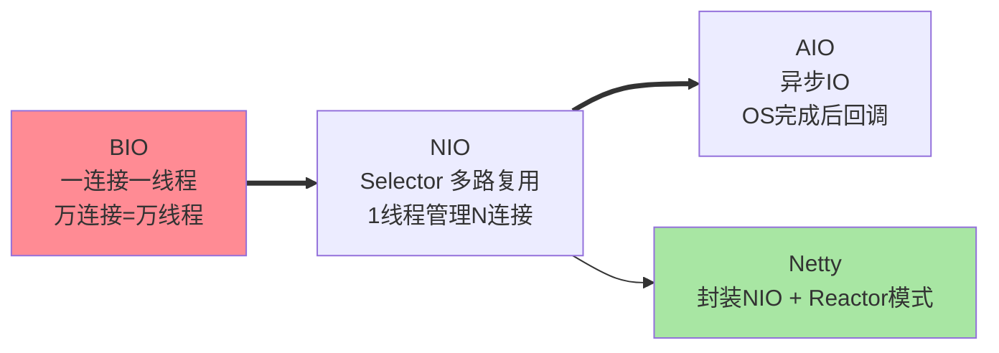
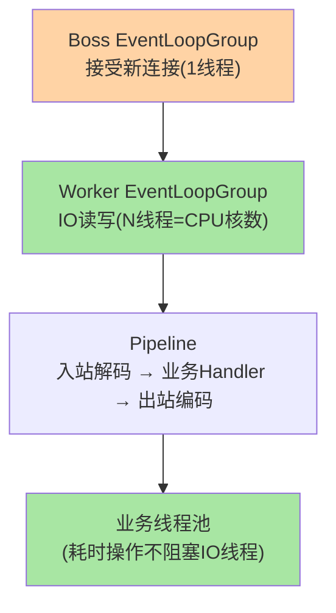

# IO 模型与 Netty：RPC 通信的引擎

> RPC 框架为什么都基于 Netty？因为 Netty 封装了 Java NIO 的复杂 API，提供了**事件驱动 + 非阻塞 IO** 的高性能通信能力——一个线程可以管理成千上万个连接。这篇从 BIO/NIO/Epoll 的模型演进与系统调用内核，讲到 Netty 的线程模型与 Pipeline 机制，并解释「Handler 阻塞」为什么是最常见的高并发事故根源。

> **本文核心**：IO 模型三代演进——**BIO**（一连接一线程，线程数 = 连接数，万级连接即线程爆炸）→ **NIO**（多路复用 Selector，一个线程管理多个 Channel，事件驱动）→ **AIO**（异步 IO，OS 完成后回调，Linux 实现不完善用得少）。**Netty 的线程模型**：Boss 线程组（接受连接）+ Worker 线程组（IO 读写）+ 业务线程池（自定义 Handler 执行）——三者分离避免 IO 阻塞业务。**机制链**：Selector 监听多 Channel 事件 → 就绪事件分发给 Handler → Handler 在 Worker 线程执行 → 重操作转发业务线程池。

## 一句话摘要

RPC 的通信引擎选 Netty 的原因：**NIO 的多路复用**让一个线程管理成千上万个连接（系统调用 epoll/kqueue 由内核通知就绪事件——不需要为每个连接创建线程）；**Netty 封装了 NIO 的复杂 API**（Selector/Channel/Buffer 三件套的编排逻辑复杂且易出错——Netty 抽象为 EventLoop/Channel/Pipeline 的清晰模型）。**Reactor 模式**是事件驱动的核心模式：单线程或少量线程的事件循环（EventLoop）分发事件给处理器（Handler）——Redis/Nginx/Netty/MongoDB 全部基于此模式。

## 5W 速记卡

| 维度 | 一句话 |
|---|---|
| What | BIO→NIO→AIO 的 IO 模型演进 + Netty 的线程模型 |
| Why | RPC 框架的通信引擎需要高并发低延迟的网络 IO |
| When | RPC 框架原理学习、网络性能调优 |
| Where | Netty/Redis/Nginx 等高性能网络组件 |
| How | Boss 接受连接 → Worker IO 读写 → 业务线程池执行 Handler |

## 二、与 BIO 的区别：IO 模型演进全景

| 模型 | 线程数 | 并发能力 | 复杂度 | 适用 |
|---|---|---|---|---|
| BIO | = 连接数 | 低（千级） | 低 | 低并发内部工具 |
| NIO | 少量（CPU 核数） | 高（十万级） | 高（Selector 编排） | RPC/网关/推送 |
| AIO | 极少 | 高 | 最高 | 理论最优但 Linux 实现不完善 |

三者差异一句话：BIO「一个连接养一个线程」（阻塞在 read 直到数据来）；NIO「一个线程轮询接管所有连接」（阻塞在 Selector，哪个就绪处理哪个）；AIO「内核干完活回调你」（连等待都不用）。**线程成本与连接规模的矛盾是三代演进的唯一主线**。

## 二·五、多路复用的机制内核：select → poll → epoll

「多路复用」不是天上掉下来的能力——三代系统调用的演进决定了并发上限：**select**（fd 集合用位图，上限 1024，每次调用全量拷贝进内核再全量扫描——连接多时扫描成本线性涨）；**poll**（链表打破 1024 上限，但仍全量拷贝+全量扫描）；**epoll**（内核维护红黑树注册 fd + 就绪链表回调填充——注册一次、返回时只给就绪列表，扫描成本从 O(n) 降到 O(1) 量级）。**这就是「万级连接下 NIO 可行」的机制答案**：不是 Selector 有魔法，是 epoll 把「每次都问所有连接」变成「内核记住注册、只报就绪」。Windows 的 IOCP 是真异步（AIO），Linux 的 epoll 仍是就绪通知模型（NIO）——这也是 Linux 上 AIO 长期不完善的历史根源。

## 三、Netty 线程模型

**EventLoop 的核心纪律**：一个 Channel 的所有 IO 事件始终由同一个 EventLoop 线程处理（无锁并发设计）——**Handler 中不能阻塞**（阻塞 = 该 EventLoop 上的所有 Channel 都被阻塞）——耗时操作必须转发到业务线程池。

**设计思想：用「串行化」换「无锁」**——多线程共享数据需要锁，而 EventLoop 把同一连接的所有事件串行到同一线程，共享状态不需要锁——**Netty 用线程绑定换掉了锁开销**，这是它吞吐高的底层原因之一。代价是纪律：一旦 Handler 阻塞，串行的队列全体排队——所以「Handler 不阻塞」不是风格建议而是架构约束。这也是 Reactor 模式的通用取舍：Redis 单线程事件循环、Nginx worker 进程模型，都是同款思路——**少量执行单元 + 事件驱动 + 串行纪律**，换极致吞吐。

**量级演进视角**：千级连接 BIO 一连接一线程也扛得住（JVM 默认线程栈 1MB，千线程内存可接受）；万级连接必须 NIO（万级 BIO 线程仅栈内存就 10GB+，且上下文切换耗尽 CPU）；十万级连接 Netty + epoll 是标配（每连接内存压缩到 KB 级）——**连接量级每上一个台阶，IO 模型就必须换一代**。

### Pipeline 与编解码：入站出站两条流水线

Netty 的 ChannelPipeline 是**责任链模式**的网络版：入站事件（读/连接激活/异常）从头流到尾（解码器 → 业务 Handler），出站操作（写/连接/关闭）从尾流到头（业务 Handler → 编码器）。**编解码器成对出现的纪律**：长度前缀解码器（FrameDecoder）在入站把字节流截成消息帧，编码器在出站把消息加长度头写回——粘包拆包的工程实现就落在这对编解码器上（承接篇 4 的协议设计）。**Pipeline 的编排顺序即协议层次**——放错顺序（比如日志 Handler 放在解码器之前）会拿到原始字节流而不知所云。

## 四、典型场景与误区

**典型场景**：RPC 框架通信层（Dubbo/gRPC 底层均为 Netty）、消息推送长连接（Netty + WebSocket）、API 网关（Netty 作为反向代理的事件驱动引擎）。场景共性：**海量连接 + 高频小消息 + 低延迟要求**——这正是事件驱动模型的甜区；反过来，单连接大文件传输（CDN 回源、数据同步）用阻塞 IO + 直接缓冲反而简单高效——**模型没有绝对优劣，负载形态决定选择**。给出一把实用标尺：预估连接数过万或单机消息速率过十万每秒，直接上 Netty 系事件驱动；连接百级以内，常规线程模型足够，别为不存在的规模买单。

**误区与不适用**：① Netty Handler 中做同步数据库查询——阻塞 EventLoop → 所有连接延迟飙升（最常见性能事故）；② Boss 和 Worker 共用同一个线程组——新连接接受被 IO 读写阻塞；③ 虚拟线程时代还需要 Netty 吗——虚拟线程让「一连接一线程」的 BIO 模型重新可行（线程成本极低），但 Netty 的零拷贝与内存管理优势仍不可替代；④ 认为「NIO 一定比 BIO 快」——单连接吞吐场景（长轮询客户端、大报文传输）阻塞模型缓存友好、代码简单，反而不慢——NIO 的优势是并发连接规模，不是单连接速度。

## 五、💡 实战提示

- 💡 Netty Handler 中禁止阻塞操作（DB/RPC/sleep）——耗时操作转发到业务线程池
- 💡 Boss 线程组 1 个线程够用（只管 accept），Worker 线程组 = CPU 核数
- 💡 决策口径：Netty 用于网络通信层，业务逻辑走独立线程池——IO 与业务分离是铁律
- 💡 对 EventLoop 做「单次任务耗时」监控告警（超 10ms 级即排查）——阻塞事故的提前发现手段
- 💡 压测 IO 层要看 P99 而非均值——EventLoop 阻塞的毛刺被均值掩盖，分位数才暴露真相

## 六、你们可能会问

**Q1：epoll 的水平触发（LT）和边缘触发（ET）什么区别？Netty 用哪个？**
LT——只要缓冲区还有数据，每次 epoll_wait 都会通知；ET——只在状态变化时通知一次，必须一次性读完。Java NIO 的 Selector 默认 LT（编程简单、不怕漏读）；Netty 底层可切 epoll transport 用 ET（减少唤醒次数，性能更高但要求循环读到 EAGAIN）。**LT 是「有活就叫你」，ET 是「有活叫一声，剩下自己看着办」**。

**Q2：为什么 Worker 线程数建议 = CPU 核数（而不是 2×核数）？**
Worker 线程做的是 IO 密集操作（收发包/编解码），几乎不阻塞——线程多了反而增加上下文切换与锁竞争；Netty 的无锁串行设计（同 Channel 绑定同线程）也依赖「线程少而专」。若 Handler 里有阻塞操作，正解是转发业务线程池，而不是加 Worker 线程——**加线程掩盖问题，分离职责解决问题**。

**Q3：服务端怎么防止慢消费者把自己写炸？**
写缓冲水位（watermark）——Netty 的 Channel 写缓冲区有高低水位线：超过高水位 `isWritable()` 返回 false，框架据此暂停读（背压）或拒绝写；不处理水位的 RPC 实现在对端消费慢时会把响应堆在内存里直接 OOM。**背压是传输层的自保机制，本质是「消费不过来就少接」**。

## 追问思考

**质疑者视角**：虚拟线程（Java 21+）让「一连接一线程」的 BIO 模型重新可行——百万虚拟线程的成本极低——**Netty 的 NIO 复杂性还有必要吗？** 答案：虚拟线程解决了「线程成本」问题，但 Netty 的零拷贝（CompositeByteBuf）、内存池（PooledByteBufAllocator）、背压（写缓冲水位控制）等能力仍然不可替代——两者是不同层面的优化。

**追问链**：事件驱动模型把复杂度转移到哪里了？——从「操作系统线程调度」转移到「应用层事件编排」：回调嵌套、线程切换点（IO 线程 ↔ 业务线程池）的上下文传递（traceId 别丢）、异常跨线程传播——这些复杂性不会消失只会转移，Netty 的 Pipeline 与 Future 机制就是驯服这些复杂度的工具。追问：什么时候该果断放弃 NIO 用 BIO？——连接数个位数到百级、逻辑简单的内部工具服务——**为不存在的并发付复杂度成本，是过度设计最常见的样子**。

**实践视角**：某团队把 RPC 框架从 Netty 迁移到基于虚拟线程的简化模型——吞吐从 10 万 QPS 降到 6 万 QPS（丢失了 Netty 的零拷贝与内存池优化），但代码复杂度降低 70%——**性能与简洁的取舍需要按实际负载评估**。

**事故视角**：某服务高峰期接口批量超时——线程栈显示 Worker 线程全部 WAITING 在一个日志 Appender 的同步锁上（日志框架磁盘 IO 抖动）；该团队把日志写入直接写在 Netty 的编码 Handler 里，EventLoop 被同步锁拖住，单机数十万连接全部延迟飙升。修复：日志异步化 + 编解码与日志解耦——**一个同步锁就把十万连接掀翻，是 EventLoop 阻塞纪律的教科书反面案例**。追问：怎么提前发现？——对 EventLoop 线程做定时 task 执行耗时监控（执行超阈值告警），Netty 官方的 `IoEventGroup` 监控思路同理——**把「Handler 不阻塞」变成可观测指标，而不是口头纪律**。

## 七、自测三问

1. BIO/NIO/AIO 三代模型的核心差异与线程数关系？（答：BIO 线程=连接数、NIO 线程=CPU 核数管理全部连接、AIO 由 OS 完成后回调）
2. Netty 的 Boss/Worker/业务线程池三层各自负责什么？（答：accept 新连接 / IO 读写编解码 / 耗时业务逻辑——三层隔离）
3. Handler 中阻塞 EventLoop 的后果是什么？（答：该 EventLoop 上所有 Channel 的全部事件排队——数十万连接一起延迟飙升）
4. epoll LT 与 ET 的差异与 Netty 的选择？（答：LT 就绪即通知可分次读，ET 仅变化通知一次须读到 EAGAIN；JDK NIO 默认 LT，Netty 可切 epoll transport 用 ET）

## 开放问题

- 虚拟线程 + 块 IO 的「简化 NIO」路线 vs Netty 的「复杂但极致」路线——两条路线的竞争结果取决于虚拟线程的调度器成熟度。
- Netty 对 io_uring 的 transport 支持进度——Linux 异步 IO 接口若成熟，Reactor「就绪通知」模型可能向「完成通知」模型再演进一次。
- io_uring（Linux 5.1+ 的异步 IO 接口）在 Netty 中的支持可能让 AIO 模型在 Linux 上变得可行——Netty 的 IO 模型可能再次演进。

## 📎 核心带走

- **核心一句话**：Netty = NIO 多路复用的工程化封装 + Reactor 线程模型（Boss/Worker/业务分离）——RPC 通信的引擎，IO 与业务必须分离
- **机制链**：Boss 接受连接 → Worker EventLoop IO 读写 → Pipeline 编解码 → Handler → 业务线程池（耗时操作） → EventLoop 继续服务其他 Channel
- **失效点/边界**：Handler 阻塞 = 全 Channel 阻塞；虚拟线程不替代 Netty 的零拷贝与内存池

## 📌 数据与事实声明

- 写于 2026-09-10，IO 模型分类为操作系统与 Java NIO 的公开口径；Netty 4.x 线程模型为官方文档口径
- 免责：以 Netty 官方文档为准

## 📚 参考资料

| 类型 | 标题 | 来源 |
|---|---|---|
| 官方文档 | Netty 4.x User Guide | netty.io |
| 实践书 | 《Netty 实战》(Netty in Action) Norman Maurer | 公开出版 |
| 关联系列 | 本仓库 Dubbo 系列（传输层互指） | docs/backend/java/ecosystem/dubbo/ |
