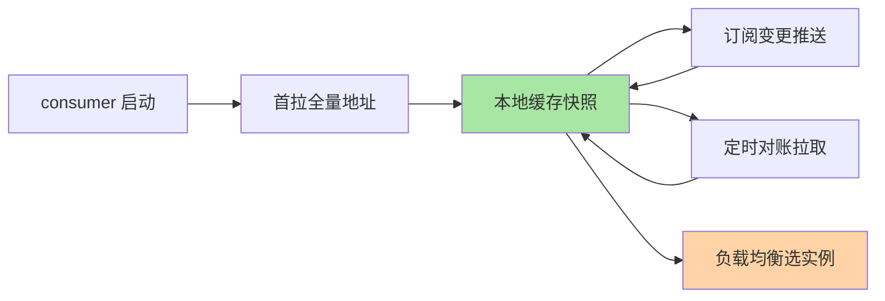

# RPC 的服务发现：调用方视角的地址解析

> **本文核心**：RPC 调用方视角的服务发现——「我要调 order-service，地址列表从哪来、变了怎么感知、挂了怎么办」。**机制链**：启动订阅 → 首拉全量 → 本地缓存 → 推送更新 → 摘除自动感知。治理机制深挖互指 service-discovery 系列。

> **本文核心**：RPC 客户端的服务发现链路——**① 启动时**从注册中心拉取服务提供者全量地址列表，存入本地缓存；**② 订阅变更**（注册中心推送地址变更事件——新实例上线/旧实例下线）；**③ 定时对账**（兜底推送丢失——定时全量拉取比对）。**机制链**：启动 → 首拉列表 → 订阅推送 → 定时对账 → 本地缓存供负载均衡消费。**调用方视角的独特关注**：地址列表的「新鲜度」（新实例何时接流量、下线实例何时摘除——与注册中心的推送延迟直接相关）与「可用性」（注册中心挂了客户端能否继续调用——本地快照兜底）。

## 一句话摘要

RPC 客户端的服务发现不是每次调用都查注册中心——**本地缓存 + 订阅推送 + 定时对账**三层机制保证地址列表「够新且高可用」：推送秒级感知变更、对账兜底推送丢失、快照抗注册中心故障。治理机制（注册/摘除/健康检查/AP-CP）深挖互指 service-discovery 系列。

## 5W 速记卡

| 维度 | 一句话 |
|---|---|
| What | RPC 客户端获取并维护服务提供者地址列表的机制 |
| Why | 调用方需要「够新且高可用」的地址列表 |
| When | 服务启动、实例上下线、注册中心故障 |
| Where | RPC 框架客户端 + 注册中心 |
| How | 首拉 + 订阅推送 + 定时对账 + 本地缓存 |

## 二、三层发现机制

## 三、与治理域发现的区别：视角对照

| 维度 | RPC 调用视角（本篇） | 注册中心治理视角（互指 service-discovery） |
|---|---|---|
| 关注点 | 客户端怎么拿到地址、怎么更新 | 注册中心怎么存储/推送/健康检查 |
| 排障 | 列表过期/缓存不一致 | 注册/摘除/推送延迟 |

## 四、💡 实战提示

- 💡 本地缓存必带 TTL + 定时对账——防推送丢失后列表静默过期
- 💡 注册中心挂了业务不应受影响——快照兜底是可用性的底线
- 💡 决策口径：订阅模式选 push（秒级新鲜度）+ pull 对账（可靠性）——两者不可互替

## 五、反思与追问

**质疑者视角**：客户端缓存 + 订阅推送的设计增加了客户端复杂度——为什么不能像 DNS 那样每次请求查一次？因为 DNS 的 TTL 粒度太粗（秒到分钟），微服务的实例变更频率要求秒级感知——**订阅模式是为微服务的变更频率设计的**。

**实践视角**：某团队遇到「下游扩容了新实例但流量不均匀」——排查发现客户端缓存的地址列表不包含新实例（推送延迟或对账间隔过长）——修复：缩短对账间隔 + 推送失败后立即触发对账。

## 六、自测三问

1. 三层发现机制（首拉/推送/对账）各解决什么问题？
2. 注册中心挂了为什么业务不受影响？
3. 「列表过期」的排查路径是什么？

## 开放问题

- Service Mesh 把服务发现从 SDK 下沉到 Sidecar（应用零改造获得发现能力）——RPC SDK 的发现职责在 Mesh 形态下如何演进而非消亡。

## 📎 核心带走

- **核心一句话**：RPC 服务发现 = 首拉全量 + 推送保新鲜 + 对账保可靠 + 本地缓存保可用
- **机制链**：启动首拉 → 订阅推送 → 定时对账 → 本地缓存 → 负载均衡消费
- **失效点/边界**：无 TTL 无对账 = 静默过期；注册中心全灭靠快照兜底

## 📌 数据与事实声明

- 写于 2026-09-10，机制为 Dubbo/Spring Cloud/gRPC 客户端的共识归纳
- 免责：以各框架官方文档为准

## 📚 参考资料

| 类型 | 标题 | 来源 |
|---|---|---|
| 关联系列 | 本仓库 service-discovery 系列（治理视角互指） | docs/architecture/service-governance/ |
| 官方文档 | Dubbo 服务发现 | dubbo.apache.org |
