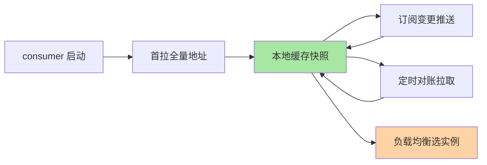
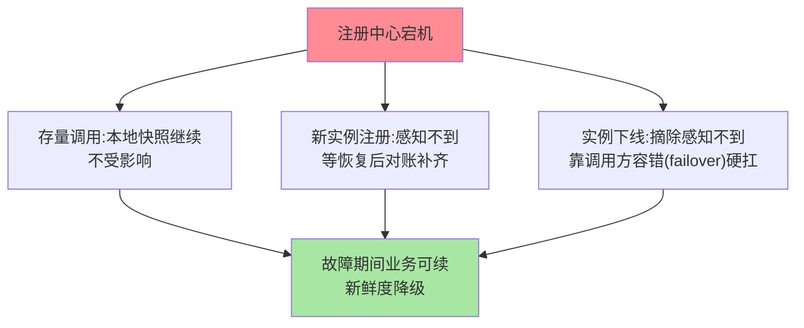

# RPC 的服务发现：调用方视角的地址解析

> 调用方发起调用之前，框架必须先回答「目标服务现在有哪些实例在线」——这个答案不是每次调用时现查的，而是被一套三层机制维护在调用方本地。这篇拆解这条链路。

> **本文核心**：RPC 调用方视角的服务发现——「我要调 order-service，地址列表从哪来、变了怎么感知、挂了怎么办」。答案是一套三层机制：**① 启动时**从注册中心拉取服务提供者全量地址列表，存入本地缓存；**② 订阅变更**（注册中心推送地址变更事件——新实例上线/旧实例下线）；**③ 定时对账**（兜底推送丢失——定时全量拉取比对）。**机制链**：启动 → 首拉列表 → 订阅推送 → 定时对账 → 本地缓存供负载均衡消费。**调用方视角的独特关注**：地址列表的「新鲜度」（新实例何时接流量、下线实例何时摘除——与注册中心的推送延迟直接相关）与「可用性」（注册中心挂了客户端能否继续调用——本地快照兜底）。

## 一句话摘要

RPC 客户端的服务发现不是每次调用都查注册中心——**本地缓存 + 订阅推送 + 定时对账**三层机制保证地址列表「够新且高可用」：推送秒级感知变更、对账兜底推送丢失、快照抗注册中心故障。这背后是一个关键的频率解耦：调用频率（每秒十万次）与实例变更频率（每天几十次）差好几个数量级，把两者绑定在任何中心化组件上都是灾难。治理机制（注册/摘除/健康检查/AP-CP）深挖互指 service-discovery 系列。

## 5W 速记卡

| 维度 | 一句话 |
|---|---|
| What | RPC 客户端获取并维护服务提供者地址列表的机制 |
| Why | 调用方需要「够新且高可用」的地址列表 |
| When | 服务启动、实例上下线、注册中心故障 |
| Where | RPC 框架客户端 + 注册中心 |
| How | 首拉 + 订阅推送 + 定时对账 + 本地缓存 |

## 二、三层发现机制

三层的职责边界值得逐一说透：**首拉**解决「冷启动视图」（没有首拉，启动后第一批调用无处路由）；**推送**解决「变更新鲜度」（新实例上线、坏实例摘除靠它秒级传播）；**对账**解决「推送不可靠」（网络丢事件、注册中心推送逻辑异常、客户端监听器消费失败——任何一环出问题，定时全量比对都能在下一个周期自我修复）。**三层缺一不可**：只有首拉+推送，一次丢事件就是长期路由错误；只有轮询拉取，变更感知延迟等于轮询间隔。

另一个常被忽略的机制是**订阅的过滤器**：调用方通常只订阅「自己要调的服务」，注册中心按服务名过滤推送范围——否则数千服务全量推送会淹死每个客户端。分组/版本/元数据过滤（只订阅 env=prod 的实例）都在这一层实现——发现层的过滤能力直接决定多环境治理的可行性（互指治理域元数据篇）。

## 三、与治理域发现的区别：视角对照

| 维度 | RPC 调用视角（本篇） | 注册中心治理视角（互指 service-discovery） |
|---|---|---|
| 关注点 | 客户端怎么拿到地址、怎么更新 | 注册中心怎么存储/推送/健康检查 |
| 排障 | 列表过期/缓存不一致 | 注册/摘除/推送延迟 |
| 关键指标 | 列表新鲜度/重建耗时 | 推送成功率/注册 QPS |
| 一致性诉求 | 最终一致够用（对账兜底） | CP 还是 AP 按业务选 |

两个视角是同一机制的两面——调用方关心「我看到的列表对不对」，注册中心关心「我怎么把变更可靠传播出去」；**排障时先分清问题在哪一面**（客户端没收到 vs 注册中心没发出），能省一半时间。

## 三·五、典型场景、量级意识与误区

**典型场景**：服务扩容（新实例注册后推送进调用方列表，秒级接流量）；滚动发布（新旧实例交替，调用方列表随推送平滑切换）；故障摘除（健康检查失败 → 注册中心摘除 → 推送下线事件 → 调用方停止路由到坏实例）；跨机房调用（地址列表带机房标签，调用方就近路由——标签路由的前提是发现层携带元数据）。四个场景的共同判断题是「列表变更到流量切换之间延迟多久」——这个延迟 = 注册中心处理 + 推送传播 + 客户端重建，是发现链路 SLO 的核心指标。

**量级演进视角**：千级 QPS、实例个位数——服务发现用 DNS 都够（变更频率低）；万级 QPS、实例数百——需要注册中心 + 秒级推送（变更频率上来后 DNS 的 TTL 缓存成为灾难）；十万级 QPS、跨机房、实例数千——发现层的推送风暴本身要治理（增量推送/聚合通知/分机房隔离）——**实例规模与变更频率，决定发现机制的档位**。

**Trade-off 视角**：新鲜度与稳定性的取舍——推送越激进（变更即推），调用方列表越新鲜，但变更风暴时推送洪水反噬调用方（频繁重建连接池）；推送越保守（聚合延迟推送），系统越稳但新实例接流量越慢。生产口径：**变更聚合窗口（如 1~2 秒）+ 摘除快、上线缓**——摘除慢了流量打进坏实例，上线慢了只损失一点容量，两者代价不对称。

**误区与不适用**：① 调用方每次调用都查注册中心——注册中心 QPS 扛不住调用频率，本地缓存是铁律；② 注册中心当存储用——它管「谁在线」，不管「业务参数」，混用会让注册中心变成耦合所有服务的单点；③ 忽略优雅下线——进程直接 kill 不等推送，流量还会打进已死实例几秒——主动注销 + 摘除确认才是完整闭环。

### 注册中心故障时的行为推演

## 四、💡 实战提示

- 💡 本地缓存必带 TTL + 定时对账——防推送丢失后列表静默过期
- 💡 注册中心挂了业务不应受影响——快照兜底是可用性的底线
- 💡 决策口径：订阅模式选 push（秒级新鲜度）+ pull 对账（可靠性）——两者不可互替
- 💡 监控三指标：列表重建耗时、推送延迟（注册→客户端 P99）、对账命中率——发现层健康度就看这三个
- 💡 发布节奏与推送风暴联动治理：批量重启（如全量发布）务必错峰或分批——数千实例同时上下线的推送洪水会冲击所有调用方

## 五、反思与追问

**质疑者视角**：客户端缓存 + 订阅推送的设计增加了客户端复杂度——为什么不能像 DNS 那样每次请求查一次？因为 DNS 的 TTL 粒度太粗（秒到分钟），微服务的实例变更频率要求秒级感知——**订阅模式是为微服务的变更频率设计的**。

**追问链**：地址列表里同一个服务为什么常有多个版本并存？——滚动发布窗口内新旧实例共存，调用方列表天然多版本；此时客户端按协议兼容性选择实例（或按路由规则分流），发现层提供数据、路由层做决策——**发现与路由的职责分界在多版本场景下最清晰**。追问：推送风暴怎么量化预警？——监控「每客户端每秒推送事件数」与「列表重建耗时」，超过阈值（如重建超过 100ms）即说明实例变更频率超出客户端处理能力，需要聚合窗口或分片订阅。

**实践视角**：某团队遇到「下游扩容了新实例但流量不均匀」——排查发现客户端缓存的地址列表不包含新实例（推送延迟或对账间隔过长）——修复：缩短对账间隔 + 推送失败后立即触发对账。

**设计思想**：服务发现把「寻址」这个高频操作从「每次调用查中心」改为「变更时才传播」——**把高频路径本地化、低频路径中心化**，是分布式系统控制中心负载的通用手法（配置中心/路由规则下发同理）。理解这个手法，就理解了为什么注册中心只有百级 QPS 却能支撑十万级调用 QPS：**调用频率与变更频率的解耦，是整个发现机制存在的意义**。

## 六、你们可能会问

**Q1：推送和拉取怎么选？**
推送保新鲜（变更秒级到达）、拉取保可靠（不丢事件、可对账）——生产实现几乎都是推拉结合：注册中心推送为主，客户端定时全量对账兜底。纯推送怕丢事件，纯拉取怕延迟，两者不可互替。

**Q2：本地快照持久化到磁盘有必要吗？**
有必要——极端场景（调用方重启 + 注册中心恰好不可用）下，磁盘快照是最后的生产资料。Nacos/Dubbo 客户端均支持快照文件——**注册中心全灭 + 客户端重启是最坏组合，快照决定业务是降级还是中断**。

**Q3：优雅下线的完整动作是什么？**
① 调用方视角：框架主动注销（从注册中心反注册）→ 摘除推送 → 存量请求处理完 → 关闭；② 兜底视角：即便主动注销失败，健康检查超时也会被动摘除（慢几秒）——主动注销管优雅，健康检查管兜底，两道防线。

## 七、自测三问

1. 三层发现机制（首拉/推送/对账）各解决什么问题？（答：首拉建立初始视图、推送保秒级新鲜、对账兜底推送丢失）
2. 注册中心挂了为什么业务不受影响？（答：调用走本地缓存地址列表，注册中心只在变更时参与——存量调用零依赖）
3. 「列表过期」的排查路径是什么？（答：先查推送是否到达（客户端日志）→ 再查对账间隔配置 → 最后查注册中心推送延迟——三段定位）

## 开放问题

- Service Mesh 把服务发现从 SDK 下沉到 Sidecar（应用零改造获得发现能力）——RPC SDK 的发现职责在 Mesh 形态下如何演进而非消亡。
- 大规模场景的发现分层（区域级聚合发现/站点级 Endpoint 分发）——百万实例规模下全量推送的带宽与内存成本推动发现架构向分层聚合演进。
- 发现数据与路由数据的边界模糊化——地址列表携带越来越丰富的元数据（权重/标签/灰度标记），发现层正在变成「路由数据分发层」，与配置中心的边界值得持续审视。

## 📎 核心带走

- **核心一句话**：RPC 服务发现 = 首拉全量 + 推送保新鲜 + 对账保可靠 + 本地缓存保可用
- **机制链**：启动首拉 → 订阅推送 → 定时对账 → 本地缓存 → 负载均衡消费
- **失效点/边界**：无 TTL 无对账 = 静默过期；注册中心全灭靠快照兜底

## 📌 数据与事实声明

- 写于 2026-09-10，机制为 Dubbo/Spring Cloud/gRPC 客户端的共识归纳
- 免责：以各框架官方文档为准

## 📚 参考资料

| 类型 | 标题 | 来源 |
|---|---|---|
| 关联系列 | 本仓库 service-discovery 系列（治理视角互指） | docs/architecture/service-governance/ |
| 官方文档 | Dubbo 服务发现 | dubbo.apache.org |
