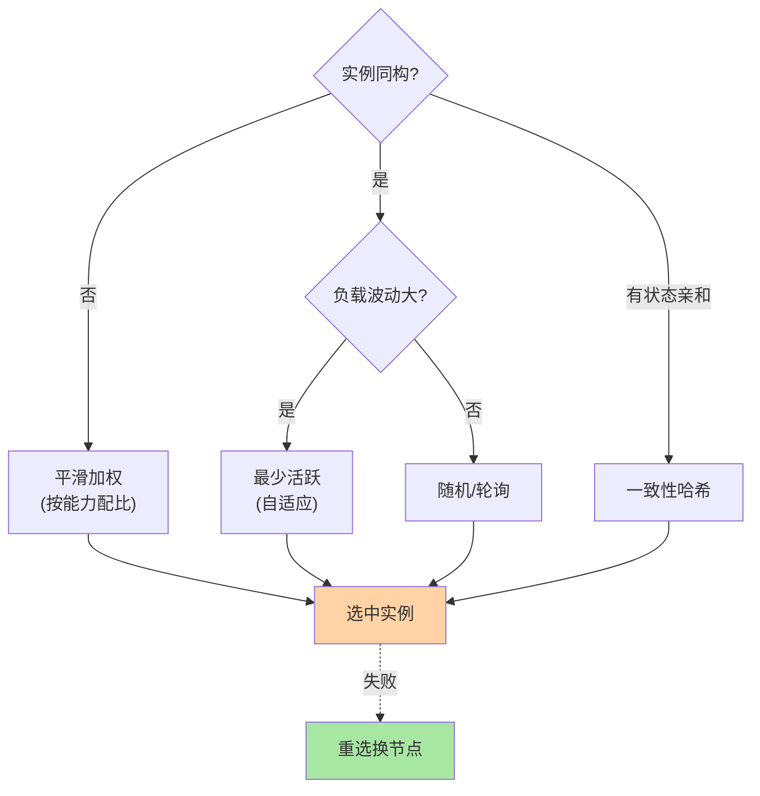

# RPC 的负载均衡策略：调用方视角的选择算法

> **本文核心**：RPC 客户端负载均衡——进程内从地址列表按策略选一个实例发起调用。**机制链**：地址列表（服务发现产出）→ 负载均衡策略选实例 → 失败重选 → 发起调用。策略机制深度互指 load-balancing 系列。

## 一句话摘要

RPC 客户端负载均衡 = **进程内选实例**（无需 LB 设备的网络跳转）——五种策略：随机（无状态最简）、轮询（顺序绝对均匀）、加权轮询（异构按能力配比）、一致性哈希（同 key 同实例的亲和）、最少活跃（按并发数自适应选最闲）。选型三问：实例同构吗、需要状态亲和吗、负载波动大吗。

## 5W 速记卡

| 维度 | 一句话 |
|---|---|
| What | RPC 客户端从地址列表按策略选实例的机制 |
| Why | 多实例的流量分配需要策略治理 |
| When | 每次远程调用的实例选择环节 |
| Where | RPC 框架客户端负载均衡层 |
| How | 地址列表 → 策略选择 → 失败重选 → 发起调用 |

## 一、为什么需要负载均衡策略

裸 RPC 调用的分发困境：客户端写死一个地址（其余实例吃灰）或 DNS 轮询（缓存延迟+无健康感知）——**负载均衡把「分发」从偶然变成治理**：按策略分发、按健康剔除、按容量加权。RPC 客户端模式的优势在于**进程内直连**（少一跳网络）+ **可感知服务状态**（活跃数/响应时间/健康状态）。一句话锚定概念：负载均衡解决的是「多个实例都健康时，流量该往哪打」——实例不健康时的绕开是容错的职责（健康检查摘除+failover），两者经常被混为一谈但边界清晰。

**量级演进视角**：千级 QPS 随机轮询够用；万级需要加权（异构机器差异显现）；十万级需要最少活跃（自适应感知慢实例）——**策略复杂度随流量与实例异构度增长**。

## 5W 速记卡（第二张：策略对比）

| 策略 | 均匀性 | 状态依赖 | 突发容忍 | 适用 |
|---|---|---|---|---|
| 随机 | 统计均匀 | 无 | 差 | 同构默认 |
| 轮询 | 顺序均匀 | 计数器 | 差 | 同构实例 |
| 平滑加权 | 按权重精确 | 当前权重表 | 中 | 异构实例 |
| 一致性哈希 | 键级均匀 | 哈希环 | 中 | 有状态亲和 |
| 最少活跃 | 自适应 | 活跃计数 | 好 | 混合负载 |

表中「突发容忍」一列值得单独解释：流量突刺来临时，随机/轮询照常把压力均分给所有实例（包括正在处理慢请求的）；最少活跃会自动绕开活跃数高的实例——**突发场景下自适应策略的尾部延迟优势最大**，这正是生产 RPC 框架默认策略逐渐从轮询迁向最少活跃/自适应的原因。

## 二、策略选择与 Trade-off

**Trade-off 分析**：随机/轮询简单但不适配异构实例——加权解决能力差异但增加配置成本；最少活跃自适应但引入状态管理开销——**精确度与复杂度的权衡是策略选型的永恒主线**。**与一致性哈希的区别**：普通策略每次调用独立选实例，一致性哈希按请求 key 定向——需要状态亲和时才选哈希族（互指 LB 篇 4）。

### 平滑加权轮询：权重是怎么「平滑」的

朴素加权轮询（8:2:2 配比连续打 8 次同一实例）会产生瞬时压力尖峰——平滑加权的解法：每轮所有实例「当前权重 += 静态权重」，选当前权重最大者，选中者当前权重再减去总权重。演算一遍（A:B = 5:1，总 6）：第一轮 A(5+5=10 选 A 后 10-6=4)、B(1+1=2)；第二轮 A(4+5=9 选 A 后 3)、B(2+1=3)；……长期看 A:B 严格 5:1，但选中序列被打散成 AAB 式交错——**统计比例精确、时间分布平滑**，这一手「先加后减」是 Nginx 与 Dubbo 共用的实现。**理解它才能解释「为什么调高某实例权重后流量不是瞬间到位而是几个周期内渐变」**。

**架构层面**：策略选择器是负载均衡模块的核心接口（`LoadBalance.select(List<Instance>, ...)`），上下游模块边界清晰——上游是服务发现（产出地址列表），下游是网络传输（发起调用）——**策略可热切换**不影响上下游。

## 三、典型场景与与 HTTP 负载均衡的区别

**典型使用场景**：内部微服务间高频调用（随机/轮询 + failover）、数据库读写代理（读写分离 + 权重）、API 网关上游（一致性哈希 + 会话粘滞）。场景选择的判断锚是「状态在哪」：无状态服务均衡可纯策略化；有状态（会话/缓存/连接）必须哈希亲和——先分类状态，再选策略。

| 维度 | RPC 客户端负载均衡 | HTTP/LB（互指 LB 系列） |
|---|---|---|
| 位置 | 进程内（客户端） | 独立设备/网关 |
| 网络 | 直连（少一跳） | 多一跳转发 |
| 策略 | 进程内可感知实例状态 | LB 设备集中策略 |
| 适用 | 内部服务间调用 | 外部流量入口 |

RPC 客户端负载均衡的优势在于**直连**——省去 LB 转发的网络跳转，且可感知实例的活跃数与响应时间（LB 设备看不到这些应用层指标）。

## 四、事故推演

**事故剧本**：某服务未配失败重选——选中实例刚好 OOM，请求直接报错返回用户——负载均衡策略本身不管「实例是否活着」（那是健康检查和容错的活），但**策略必须与 failover 联动**（互指 cluster-fault-tolerance 系列）。修复：启用 failover + 负载均衡重选。**失败重选是策略的最后一块拼图**。

**追问链**：failover 重选会不会放大故障？——会：下游整体变慢时，重试流量叠加正常流量形成重试风暴（重试放大系数 = 1 + 失败率 × 重试次数）——所以重选必须配重试预算（如重试不超过 20% 流量）与退避——**容错与限流的边界就在这里**（互指限流熔断篇）。追问：策略的「负载感知」数据从哪来？——活跃数是客户端自己维护的计数器（发出未返回即活跃）；响应时间来自调用统计窗口；实例侧 CPU/IO 指标需要心跳上报——**感知数据越丰富，误判面越大，自适应策略的工程难度不在算法在数据质量**。

## 四·五、常见误区

- **「策略选得越智能越好」**——最少活跃/自适应策略依赖状态数据质量，数据不准时误判放大不均；健康实例集上随机轮询已接近最优，策略升级要有数据支撑。
- **「权重一劳永逸」**——实例能力随部署规格/负载变化，静态权重漂移失效；权重必须跟容量评估与压测联动复审。
- **「负载均衡保证均匀」**——保证的是「分发均匀」不是「负载均匀」：请求耗时不均（有的接口重有的轻）时，分发均匀照样负载倾斜——这是最少活跃类策略存在的理由。
- **「与路由混为一谈」**——路由按标签缩小候选集（定向），均衡在候选集内摊匀（去拥塞）；顺序反了全盘皆错。

## 五、💡 实战提示

- 💡 默认随机/轮询起步，异构加权重，慢实例最少活跃——递进适配
- 💡 策略必配失败重选——选中实例挂了换下一个
- 💡 决策口径：同构随机、异构加权、有状态哈希、混合负载最少活跃——三问定位
- 💡 策略切换后观察三个分位数（P50/P99/实例间流量占比）——切换效果用数据验证，不靠感觉

## 设计思想：为什么放在客户端做

负载均衡有两个可选位置：集中式 LB 设备（Nginx/LVS）或客户端进程内。RPC 生态选了后者，核心逻辑有三：① **内部调用是东西向流量**——服务对服务多对多互调，集中式 LB 会成为全量流量的汇聚瓶颈与单点；② **客户端可感知应用层状态**——活跃数/响应时长/熔断状态都在调用方进程里，LB 设备只能看到连接与报文；③ **决策点离执行点越近，策略越精细**——按调用方法、按标签、按机房的路由决策需要业务上下文。集中式设备更适合南北向流量（外部用户→入口）——**两种形态不是竞争，是流量方向决定的分工**。

## 六、反思与追问

**质疑者视角**：负载均衡策略真的影响吞吐吗？——实测在健康实例集上各策略差异 < 5%——**策略的价值在异常场景**（慢实例/故障实例的快速排除），正常场景下选哪种差异微乎其微。但异常场景的代价是资损级别的——策略的价值不在均值在尾部。

## 七、你们可能会问

**Q1**：一致性哈希和普通哈希的区别？普通取模扩缩容时全量重映射，一致性哈希只影响相邻区段——扩缩容频繁才有一致性哈希的必要性。
**Q2**：策略能动态切换吗？Dubbo 支持运行时切换（治理中心下发）——但切换瞬间的行为需要验证。
**Q3**：负载均衡和服务路由什么关系？路由先缩小候选集，负载均衡再在子集内选实例——路由管定向、均衡管摊匀。
**Q4**：权重和实例数怎么配合容量规划？——总容量 = Σ(实例数 × 单实例容量 × 权重)，权重本质是「单实例相对容量声明」；异构扩容（新机器是旧机器 2 倍规格）时权重按规格比设置，否则流量按实例数均摊导致新机器吃不饱旧机器被打满。

## 八、开放问题

- 自适应负载均衡（按实时负载动态调整策略权重）在框架中演进——静态策略配置向动态自适应方向演进。
- 机器学习驱动的智能路由（按历史延迟预测最优实例）在头部厂探索，通用化尚远。
- 单机故障的「自动降权」机制（失败率超阈值临时压权重、恢复后自动回升）——把「摘除坏实例」从二值开关（在/不在列表）演进为连续降权，减少故障切换的流量抖动。

## 九、自测三问

1. 五种策略各适合什么场景？（答：同构随机/轮询、异构平滑加权、有状态一致性哈希、混合波动最少活跃——按三问递进）
2. 策略失败重选为什么不可缺？（答：策略只管选不管活——选中实例故障时，重选是流量绕开坏实例的最后机制；须配重试预算防风暴）
3. 路由与负载均衡的串联关系？（答：路由按标签/规则缩小候选集（定向），均衡在候选集内选实例（摊匀）——先路由后均衡）

## 📎 核心带走

- **核心一句话**：RPC 负载均衡 = 进程内按策略从地址列表选实例——随机/轮询/加权/哈希/最少活跃按场景递进
- **机制链**：地址列表 → 策略选择 → 失败重选 → 发起调用 → 指标监控
- **失效点/边界**：策略异常场景价值大于正常场景；失败重选不可缺；路由与均衡串联

## 📌 数据与事实声明

- 写于 2026-09-10，机制为 Dubbo/Spring Cloud LB 的共识口径
- 免责：以各框架官方文档为准

## 📚 参考资料

| 类型 | 标题 | 来源 |
|---|---|---|
| 关联系列 | 本仓库 load-balancing 系列（策略深度互指） | docs/architecture/service-governance/ |
| 官方文档 | Dubbo LoadBalance | dubbo.apache.org |
