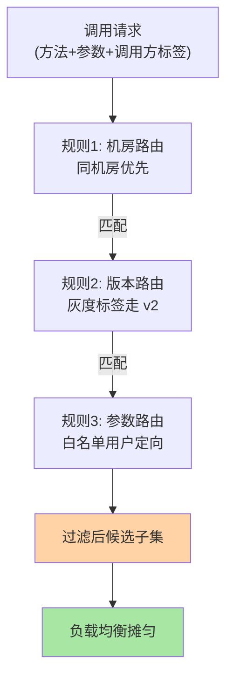
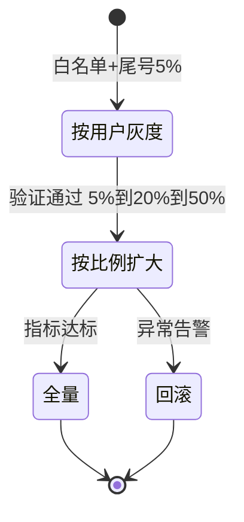
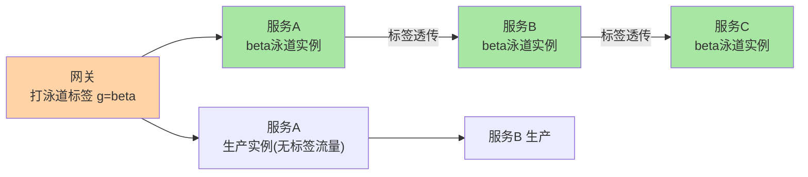

# RPC 的服务路由与灰度：流量去哪里的定向决策

> **本文核心**：负载均衡管「摊匀」，服务路由管「定向」——在均衡选实例之前，先按规则把候选集缩小到目标子集。**机制链**：调用请求携带标签（接口/参数/调用方/环境标记） → 路由链逐条匹配规则（机房路由/版本路由/灰度路由/参数路由） → 输出过滤后的实例子集 → 交给负载均衡选最终实例。灰度发布是路由规则最常见的应用：让指定比例或指定标签的流量先走新版本。

## 一句话摘要

服务路由 = **在地址列表上按规则做子集过滤**，规则按匹配维度分四类：**机房路由**（同机房优先，跨机房容灾）、**版本路由**（新旧版本分流）、**参数路由**（按请求参数定向，如白名单用户走灰度）、**标签路由**（按实例/调用方元数据匹配）。灰度发布 = 版本路由 + 流量比例控制——**按用户维度灰度**（uid 尾号/白名单）比按比例灰度更可控，因为同一用户始终命中同一版本。与负载均衡的分工：路由缩小候选集（定向），均衡在子集内摊匀（去拥塞）——**先路由后均衡，顺序不可颠倒**。

## 5W 速记卡

| 维度 | 一句话 |
|---|---|
| What | 按规则把候选实例列表过滤成目标子集的机制 |
| Why | 灰度/多机房/多版本/流量隔离都需要定向能力 |
| When | 灰度发布、多机房调度、故障隔离、流量演练 |
| Where | RPC 客户端路由链（负载均衡之前） |
| How | 请求带标签 → 规则链匹配 → 输出子集 → 均衡选实例 |

## 二、路由链的工作机制

路由规则通常组织为**责任链**：请求依次过每条规则，命中即过滤（或放行），全部通过后的实例集交给负载均衡。规则本身存放在配置中心/治理平台，动态下发到客户端即时生效——**规则与代码分离**，改路由不用改代码不用重启，这是路由能力工程化的关键（互指治理域配置中心篇）。规则必须带**默认兜底**（无匹配规则时放行全量）——防「规则打空」导致服务不可用。

**量级演进视角**：实例个位数、单机房——路由规则是摆设，均衡就够；实例数百、双机房——机房路由成为刚需（跨机房 RTT 是同机房数倍，乱打跨机房流量延迟翻倍）；万级 QPS、多环境并存——标签路由 + 灰度体系是基础设施（开发/测试/预发/生产流量必须隔离）——**路由复杂度随机房数与环境数增长，与 QPS 无关**。

## 三、灰度发布：路由规则的头号应用

**按用户维度灰度**的核心设计：同一 uid 始终计算出同一哈希值，永远命中同一版本——**用户体验一致性**（用户不会一会儿新版一会儿旧版）。按比例盲灰（随机 5%）做不到这一点。灰度期间的观测配对：新版本的错误率/延迟/业务指标与旧版本同窗口对比——**灰度的本质是把「全量爆炸」变成「小范围可控验证」**。

**Trade-off 视角**：灰度粒度与验证置信度的取舍——灰 1% 风险最小但流量太少指标不显著（长尾问题暴露不了）；灰 50% 置信度高但爆炸半径大。生产口径：**按指标显著性倒推灰度比例**（如需要至少 1000 次调用才有统计意义，QPS 2 万的服务灰 5% 即可），再按风险递增加码。灰度数据隔离（新版本写新表/新字段）是另一维取舍——全量共享存储灰度快但回滚难，隔离存储回滚干净但改造大。

## 四、与负载均衡的区别：分工对照

| 维度 | 服务路由 | 负载均衡 |
|---|---|---|
| 目标 | 定向（缩小候选集） | 摊匀（子集内选点） |
| 依据 | 标签/规则/参数 | 策略与状态数据 |
| 典型规则 | 机房/版本/灰度/白名单 | 随机/轮询/加权/哈希 |
| 配置来源 | 治理平台动态下发 | 框架配置+策略类 |

**为什么顺序不可颠倒**：先均衡后路由 = 在全量实例上选了一个点再判断它不属于目标子集——要么白选要么二次过滤，浪费且语义混乱；先路由后均衡的语义是「先确定可选范围，再在范围内择优」——**子集选择问题分解为过滤+择优两步，是搜索类问题的通用分解**。

## 五、典型场景与误区

**典型场景**：灰度发布新版本（版本路由+比例控制）；同城双机房（机房路由，同机房优先、故障跨机房）；泳道隔离（全链路灰度：测试标签贯穿 A→B→C 所有服务，测试流量不污染生产）；故障演练（把特定实例标记为不可路由，观察容错行为）。

**常见误区**：① **全链路灰度只灰一个服务**——A 服务灰了新版本，调用的 B 还是旧版，接口契约不兼容直接报错——全链路灰度要求标签透传（trace 上带泳道标记，每个下游服务按标签路由）；② 灰度比例配置在代码里——改比例要发版，灰度的「动态调节」价值归零；③ 灰度不看对照组——新版本指标变差 10%，但同期大盘也在波动 8%，没有对照组等于没验证；④ 回滚只回滚代码不回滚数据——新版本写入了新格式数据，旧版本读不懂——**灰度方案必须包含数据兼容性设计**。

### 全链路泳道的标签透传

泳道机制的关键在 **「标签跟着请求走，不跟着实例走」**——实例打标签决定它属于哪条泳道，请求携带标签决定它路由到哪条泳道；泳道里没有的下游服务自动回落生产实例（兜底放行）——这条「回落规则」是泳道能落地的关键设计，否则每个泳道都要复制全量服务。

## 设计思想：路由是流量治理的「策略层」

负载均衡、容错、限流都是「对既定流量做反应」，路由是唯一「在流量进来之前改变其走向」的机制——**它是流量治理体系里唯一的先验手段**。灰度、多机房、隔离、演练，本质上都是在回答同一个问题：「特定流量的爆炸半径如何控制」——路由规则就是爆炸半径的编程接口。这也是为什么治理平台把路由规则做成一等公民（独立的管理界面/审计/回滚）：**一条错误的路由规则可以在 10 秒内把全量流量导向空集合**——路由变更的权限管控与变更审计，与数据库变更同级。

## 追问思考

**质疑者视角**：路由规则动态下发即时生效——听起来敏捷，但「一条规则全网秒级生效」同时也是最大的风险面：规则写错（正则贪婪匹配/标签拼错）= 流量瞬间错配。**治理能力越动态，越需要变更安全网**：规则灰度（先推 10% 客户端）、规则回滚按钮、规则模拟器（新规则在影子流量上先跑一遍）。质疑的结论不是「别做动态路由」，而是「动态路由必须配动态安全网」。

**事故视角**：某团队灰度规则把「uid 尾号 0」写成「uid 包含 0」——uid 里任何位置有 0 的用户全走新版本，灰度比例从设计的 10% 漂移到 64%——新版本的内存泄漏被放大成半站用户卡顿。修复与沉淀：① 灰度规则上线先在预发验证实际命中比例（规则平台增加「模拟计算」功能）；② 灰度比例实时监控与阈值告警（实际命中比例偏离配置 20% 即告警）——**规则的实际效果必须被观测，不能假设配置即生效**。

**追问链**：为什么路由规则不做成代码（if-else 在业务逻辑里）？——代码路由的变更需要发版（分钟到小时级），且散落在各服务的代码里无法全局审计；规则化路由的变更是配置（秒级），且收敛在治理平台可审计可回滚——**把「流量决策」从代码提升为数据，是治理平台化的核心一步**。追问：什么场景必须用代码路由？——需要复杂计算的路由（按实时成本/按模型打分）超出规则表达能力，只能下沉到代码——规则管 90% 的场景，代码兜底长尾，边界清晰。

## 💡 实战提示

- 💡 灰度一定按用户维度（uid 哈希）而非随机比例——体验一致性是灰度的隐性需求
- 💡 路由规则变更三件套：模拟计算、比例监控、一键回滚——缺一个都别上生产
- 💡 全链路灰度先设计标签透传（网关打标+RPC 隐式传参）——中途丢标签的流量会意外混入生产
- 💡 决策口径：路由管定向、均衡管摊匀、容错管绕开——三层各司其职，配置前先想清楚问题属于哪层

## 你们可能会问

**Q1：路由规则冲突了怎么办？**
规则按优先级链式执行（机房 > 版本 > 参数是常见排序），每条规则在链上声明「命中即过滤」或「命中即返回」语义。设计原则：**规则链保持短**（超过 5 条规则时排障成本陡增），能合并的合并——规则数量是复杂度，不是能力。

**Q2：泳道里的服务怎么连数据库？**
两条路：泳道专用存储（隔离彻底、成本高）或共用生产存储+数据打标（row 里带泳道字段，查询按标签过滤）。多数团队折中：读共用、写隔离，或只在「写路径不冲突」的业务上做共用——**存储是泳道方案成本的大头，先算存储再上泳道**。

**Q3：灰度期间新旧版本的接口契约怎么兼容？**
向后兼容优先（新版本不改已有字段语义、只增不改删）；破坏性变更走双版本并存（旧版本继续服务存量流量直到全量切换）——**契约兼容是灰度的前提，不是灰度的目标**，IDL 演进规范（互指序列化篇的 field tag 机制）是地基。

## 八、自测三问

1. 路由和负载均衡的分工与执行顺序？（答：先路由缩小候选集（定向），后均衡在子集内选实例（摊匀））
2. 全链路灰度的两个关键机制？（答：标签透传（网关打标+RPC 隐式传参）+ 泳道回落（缺失服务兜底生产实例））
3. 灰度为什么按用户维度而不是随机比例？（答：同一用户固定命中同一版本，体验一致；随机比例会造成单用户新旧版漂移）

## 开放问题

- 基于意图的路由声明（「新版本先接 5% 低风险流量」由平台自动翻译为规则组合）——路由配置从手工规则向意图驱动演进的探索。
- 路由与自适应限流的联动（路由规则动态避让高负载机房）——定向与摊匀的边界在智能化方向上重新协商。

## 📎 核心带走

- **核心一句话**：服务路由 = 负载均衡之前的定向过滤——机房/版本/参数/标签四类规则 + 灰度发布是头号应用
- **机制链**：请求带标签 → 规则链匹配 → 候选子集 → 负载均衡择优 → 灰度比例动态调节
- **失效点/边界**：先路由后均衡不可颠倒；全链路灰度必须标签透传；规则动态生效必须配变更安全网

## 📌 数据与事实声明

- 写于 2026-09-10，机制为 Dubbo 路由/Service Mesh 流量治理的共识归纳；灰度比例为方法论口径非统计数据
- 免责：以各框架官方文档为准

## 📚 参考资料

| 类型 | 标题 | 来源 |
|---|---|---|
| 官方文档 | Dubbo 条件路由/标签路由 | dubbo.apache.org |
| 官方文档 | Istio 流量管理（路由规则模型参照） | istio.io |
| 关联系列 | 本仓库 load-balancing / service-discovery 系列（上下游互指） | docs/architecture/service-governance/ |
