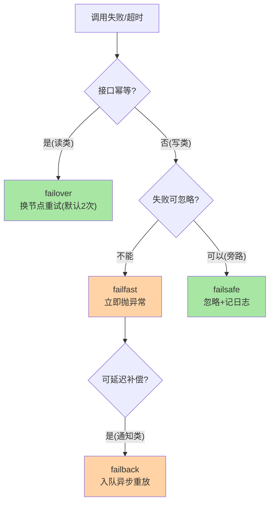

# RPC 的集群容错与重试：失败后的调用方语义

> **本文核心**：调用失败之后怎么办，是调用方必须回答的问题——RPC 框架把答案做成四种**集群容错策略**：**failover**（失败换节点重试：幂等读场景）、**failfast**（快速失败不重试：写场景防重复）、**failsafe**（失败忽略：旁路场景）、**failback**（失败后异步重放：可延迟成功）。**机制链**：调用失败 → 策略分派 → 重试(换节点)/报错/忽略/入队重放 → 结果。**策略选择与业务语义绑定**——能重试吗（幂等性）× 能忽略吗（业务容忍度）两问定策略，重试与幂等的绑定是工程核心。

## 一句话摘要

RPC 客户端容错 = 调用失败后的**策略化处置**：failover 换节点（读场景默认）、failfast 快速失败（写场景安全）、failsafe 忽略记日志（旁路容忍）、failback 入队延迟重放（通知类可延迟成功）。**为什么读可以自动重试、写不能**——「不丢必伴重复」：调用超时后调用方不知道请求是否已执行，重试就有重复执行风险，读操作重复无副作用所以安全，写操作重复=双扣双写所以必须先问幂等。容错策略全景与四层联动深挖互指 cluster-fault-tolerance 系列。

## 5W 速记卡

| 维度 | 一句话 |
|---|---|
| What | 调用失败后的四种策略化处置语义 |
| Why | 分布式调用失败是常态，处置方式决定故障扩散半径 |
| When | 每次调用失败的分派环节（策略按接口预配置） |
| Where | RPC 框架客户端集群层（负载均衡之外包一层） |
| How | 失败捕获 → 策略分派 → 换节点/报错/忽略/重放 |

## 二、四种策略的语义与适用

四种策略一句话记忆：**failover「再试一次（换个人）」、failfast「错了就报」、failsafe「错了就算了」、failback「错了回头再补」**。工程细节比语义更关键：failover 的重试要**换节点**（原节点故障重试原节点等于白试——重试必须先从候选集剔除刚失败的实例）；failback 的重放队列在进程重启即丢（不扛宕机，可靠补偿要用消息队列或任务表）。

**量级演进视角**：千级 QPS 单链路——默认 failover 2 次够用；万级 QPS 多级链路——重试预算必须全链路统一治理（每层都重试 2 次，三级链路末端放大到 8 倍流量）；十万级 QPS——重试风暴防护是基础设施（预算熔断/退避抖动/重试降级）——**重试策略的正确性在全链路视角下才成立，单接口视角的「多试几次更稳」是万级流量的反模式**。

## 三、重试的三条工程纪律

**纪律一：重试必须配幂等**。超时重试的隐患在「未知态」——请求可能已到达并执行（响应丢失），重试造成重复执行。写接口要重试，先实现幂等（唯一键/去重表/状态机，互指 RPC 篇 1 的三态结果）；读接口天然幂等可放心 failover——**「先问幂等再配重试」是接口设计的固定动作**。

**纪律二：重试次数联动超时预算**。总耗时上限 = 单次超时 × (retries + 1)——上游超时 3 秒、下游单次超时 1.5 秒、重试 2 次 = 4.5 秒 > 3 秒，最后一次重试注定「成功也来不及返回」——**重试预算必须从上游倒推**（互指 RPC 篇 2 的超时预算）。

**纪律三：重试要防风暴**。下游故障时重试放大流量（放大系数 = 1 + 失败率 × retries），故障服务被重试流量压死，恢复无望——防护组合：**重试预算**（重试流量不超过总流量 20%）、**退避抖动**（重试间隔加随机量防同步重试）、**熔断联动**（熔断打开后停止重试，互指限流熔断篇）。

## 四、与限流熔断的区别：三层防线对照

| 维度 | 集群容错（本篇） | 熔断（互指限流熔断篇） | 限流（互指限流熔断篇） |
|---|---|---|---|
| 视角 | 单次失败的处置 | 连续失败的止损 | 总量超载的自保 |
| 触发 | 单次调用异常 | 失败率/慢调用比例超阈值 | QPS/并发超阈值 |
| 动作 | 换节点/报错/忽略/重放 | 打开断路器走降级 | 快速拒绝多余请求 |
| 代价 | 延迟增加（重试耗时） | 功能降级 | 请求被拒 |

三层防线的触发条件与动作各不相同，却经常被混为一谈。**判断题**：偶发超时该找谁？——容错（failover 换节点）；下游持续报错该找谁？——熔断（别再打了）；流量突增打不动该找谁？——限流——**问题属于哪一层，看触发条件而不是看动作**（三者都可能表现为「请求失败了」）。

## 五、典型场景与误区

**典型场景**：商品详情页聚合查询（读多级下游，failover + 并行调用）；订单支付（写操作，failfast + 上游人工/异步补偿）；积分/消息通知（旁路，failsafe 失败不阻塞主流程）；站外推送（可延迟，failback 或落消息队列重投）。

**常见误区**：① **写操作配了 failover**——超时重试导致重复扣款/重复下单，这是 RPC 类资损事故的头号来源；② 重试次数拍脑袋配 3 次——每次重试都吃一份超时预算，3 次重试 = 4 倍延迟，上游等不起；③ failsafe 用于核心链路——「忽略失败」的容错只配旁路场景，核心链路忽略失败等于埋雷；④ failback 当可靠补偿用——内存队列扛不住宕机，可靠补偿用 MQ/任务表；⑤ 忽略重试的监控——重试率/重试成功率是下游健康度的先行指标，重试率抬升 = 下游快出事了。

### 超时与重试的预算分解

**图中的陷阱**：单次超时 1.2 秒 × 3 次 = 3.6 秒 > 上游预算 3 秒——最后一次重试即便成功也来不及返回。正确设计：单次超时 0.9 秒 × 3 = 2.7 秒，留 0.3 秒网络与框架余量——**重试次数、单次超时、上游预算三个数必须联合设计**，这就是「四类数字自洽」在容错场景的具体化。

## 设计思想：容错是「失败语义」的框架化

本地调用的失败语义简单：异常往上抛。远程调用的失败语义有四种处置选择——框架把这四种选择做成**接口级配置**而非业务代码，本质是把「失败怎么办」从「每个开发者的临场决定」提升为「团队统一的治理口径」。这与路由的「决策数据化」同构：**把高频、易错、需要全局一致性的决策从代码里抽出来做成配置**，是治理框架的通用设计范式。failfast 是默认值的设计也值得注意——不重试是最安全的缺省，自动重试必须显式开启——**危险能力的默认值永远是最保守的那档**。

## 追问思考

**质疑者视角**：failover 换节点重试听起来无懈可击——但「换节点」重试真的安全吗？拆开看三个坑：① 幂等陷阱（写操作重复执行，前文已述）；② **雪崩陷阱**——上游集体 failover 时，故障实例虽被绕开，但其余实例流量翻倍，故障从单实例扩散到全集群；③ **延迟陷阱**——重试 2 次的 P99 = 3 倍单次延迟，容量规划若按无重试设计，重试高峰直接击穿容量。质疑的结论：failover 是「健康集群对偶发故障」的容错，不是「故障集群的自救」——**下游真故障时，止损靠熔断，不靠重试**。

**事故视角**：某平台大促压测时商品服务偶发超时，团队把接口超时从 200ms 调到 2s、重试从 1 次加到 3 次——高峰期延迟毛刺消失，但下游数据库连接池被 6 倍长请求占满，次日凌晨数据库雪崩。复盘：超时调大掩盖了慢查询问题（该治本：优化 SQL），重试加码把偶发故障放大成容量灾难——**「调大超时+加重试」是掩盖问题不是解决问题，容错参数调优必须与容量评估联动**。

**追问链**：为什么 failover 默认只重试 2 次、不是更多？——重试的边际收益递减（第一次重试成功率约 60-90%，第三次已 <95% 净增甚微），而代价线性增长（延迟×次数、下游压力×放大系数）——**容错参数是「收益递减曲线」与「代价直线」的交点问题**， Dubbo 默认 2、gRPC 默认不重试（需显式配置重试策略）都体现了「保守缺省」。追问：读接口也未必能重试吧？——非幂等读（计数器自增读后写）确实存在；但占比极小，按「读默认幂等」约定+例外标注，比按「读默认不幂等」逐一标注的沟通成本低一个数量级——**约定覆盖大多数，例外显式声明**。

## 💡 实战提示

- 💡 写操作默认 failfast——自动重试写操作必须先确认幂等，这是资损防线
- 💡 重试次数联动超时预算：总耗时 = 单次超时 × (retries+1) ≤ 上游可等待，三个数联合设计
- 💡 监控重试率作为下游健康度先行指标——重试率抬升先于失败率爆炸
- 💡 决策口径：读 failover、写 failfast、旁路 failsafe、可延迟 failback——按接口业务语义定策略

## 你们可能会问

**Q1：超时算失败吗？重试超时的请求安全吗？**
算——超时是「未知态」失败（不知道对端执行没有），恰恰是最需要幂等保护的失败类型；连接拒绝是「确定未执行」失败，重试安全。**框架成熟实现会区分失败类型**：连接级失败放心重试，超时级失败看幂等声明。

**Q2：failback 的重放失败一直失败怎么办？**
设重放上限+死信处理——超过 N 次重放仍失败的请求进死信队列/告警人工处理，无限重放会拖垮重放线程。要「可靠最终成功」就别用内存 failback，用 MQ 重投 + 死信队列的完整方案。

**Q3：容错策略能按方法粒度配吗？**
能也必须——同一服务里读接口要 failover、写接口要 failfast，服务级配置粒度太粗。**策略配置的粒度 = 接口方法级**，这是治理平台的基本能力（Dubbo 方法级重试配置同理）。

## 八、自测三问

1. 四种容错策略各自的语义与典型场景？（答：failover 换节点重试（读）、failfast 立即报错（写）、failsafe 忽略（旁路）、failback 异步重放（可延迟）；「先问幂等再配重试」）
2. 为什么「不丢必伴重复」？（答：超时后调用方不知道对端是否执行——保证不丢就得重试，重试就可能重复——幂等是重试安全的前提）
3. 重试风暴怎么防？（答：重试预算（≤20% 流量）+ 退避抖动 + 熔断联动停止重试）

## 开放问题

- 失败类型感知的重试策略（按错误码/失败类型自动决定可否重试）在框架层标准化——幂等声明进 IDL 让框架自动判断是演进方向。
- 跨语言重试语义统一（gRPC 的 retryPolicy vs Dubbo cluster 配置）——多框架并存团队的策略口径统一靠治理平台翻译。

## 📎 核心带走

- **核心一句话**：RPC 容错 = 失败后的策略化处置，「能重试吗 × 能忽略吗」两问定策略；幂等是重试的安全带
- **机制链**：失败捕获 → 失败类型判定（连接拒绝/超时未知态） → 策略分派 → failover 换节点 / failfast 抛异常 / failsafe 忽略 / failback 重放
- **失效点/边界**：failover 需幂等且防风暴；failback 不扛宕机；重试预算与超时预算联合设计

## 📌 数据与事实声明

- 写于 2026-09-10，机制为 Dubbo 集群容错/gRPC 重试策略的共识口径；重试成功率为方法论量级非实测数据
- 免责：以各框架官方文档为准

## 📚 参考资料

| 类型 | 标题 | 来源 |
|---|---|---|
| 官方文档 | Dubbo 集群容错 / gRPC Retry | dubbo.apache.org、grpc.io |
| 关联系列 | 本仓库 cluster-fault-tolerance 系列（深度互指）、限流熔断篇（三层防线对照） | docs/architecture/service-governance/ |
| 原理书 | 《Release It!》容错设计模式 | 公开出版 |
