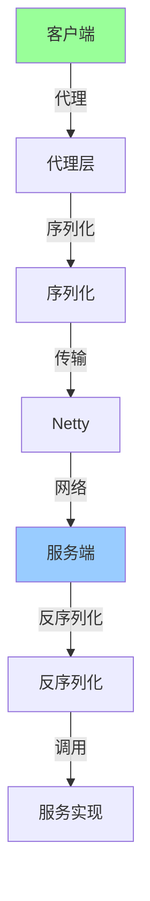

# 从零实现一个 RPC

> **一句话摘要**：用代码实现最小化 RPC 框架——动态代理 + Netty + 序列化 + 注册发现 + 负载均衡。
> **本文核心**：**实现 = 代理 + 传输 + 序列化 + 注册 + LB**。

前置阅读：[RPC 框架选型决策](./专题层/RPC框架选型决策/1_RPC框架选型决策-专题.md)。本篇将选型理论转化为可运行代码。

## 1. 背景：为什么要实现

看懂 RPC 不等于会用——实现过程才能理解：

- 动态代理如何工作
- Netty 如何传输
- 序列化如何编码

通过实现，掌握 RPC 的核心机制。

## 2. 核心机制：架构设计

### 2.1 整体架构



**五层架构**：
- **代理层**：动态代理，生成请求
- **序列化层**：对象↔字节流
- **传输层**：Netty 网络通信
- **注册发现层**：服务地址发现
- **负载均衡层**：选择实例

### 2.2 核心接口

```java
// RPC 服务接口（客户端定义）
public interface OrderService {
    Order getOrder(String orderId);
    void createOrder(Order order);
}

// 服务实现（服务端）
public class OrderServiceImpl implements OrderService {
    @Override
    public Order getOrder(String orderId) {
        return doGetOrder(orderId);
    }
}
```

## 3. 落地实践：客户端代理

### 3.1 动态代理

```java
// RPC 客户端代理
public class RpcClientProxy<T> implements InvocationHandler {
    private Class<T> interfaceClass;
    private List<ServiceInstance> instances;
    
    @Override
    public Object invoke(Object proxy, Method method, Object[] args) throws Throwable {
        // 1. 构建请求
        RpcRequest request = new RpcRequest();
        request.setInterfaceName(interfaceClass.getName());
        request.setMethodName(method.getName());
        request.setParameterTypes(method.getParameterTypes());
        request.setParameters(args);
        request.setRequestId(generateId());
        
        // 2. 序列化
        byte[] data = serializer.serialize(request);
        
        // 3. 选择实例
        ServiceInstance instance = loadBalancer.select(instances);
        
        // 4. 发送请求
        byte[] response = sendRequest(instance, data);
        
        // 5. 反序列化
        RpcResponse rpcResponse = serializer.deserialize(response);
        return rpcResponse.getResult();
    }
}
```

### 3.2 代理创建

```java
// 创建代理
public <T> T createProxy(Class<T> interfaceClass, List<ServiceInstance> instances) {
    return (T) Proxy.newProxyInstance(
        interfaceClass.getClassLoader(),
        new Class[]{interfaceClass},
        new RpcClientProxy<>(interfaceClass, instances)
    );
}

// 使用
OrderService orderService = createProxy(OrderService.class, instances);
Order order = orderService.getOrder("1000"); // 像本地调用一样
```

## 4. 落地实践：服务端实现

### 4.1 Netty 服务端

```java
// Netty RPC 服务端
public class RpcServer {
    private Map<String, Object> serviceMap = new ConcurrentHashMap<>();
    
    public void start(int port) {
        EventLoopGroup bossGroup = new NioEventLoopGroup(1);
        EventLoopGroup workerGroup = new NioEventLoopGroup();
        
        try {
            ServerBootstrap bootstrap = new ServerBootstrap();
            bootstrap.group(bossGroup, workerGroup)
                .channel(NioServerSocketChannel.class)
                .childHandler(new ChannelInitializer<SocketChannel>() {
                    @Override
                    protected void initChannel(SocketChannel ch) {
                        ChannelPipeline pipeline = ch.pipeline();
                        // 编解码器
                        pipeline.addLast(new RpcDecoder());
                        pipeline.addLast(new RpcEncoder());
                        // 业务处理器
                        pipeline.addLast(new RpcServerHandler(serviceMap));
                    }
                });
            
            ChannelFuture future = bootstrap.bind(port).sync();
            future.channel().closeFuture().sync();
        }
    }
}
```

### 4.2 业务处理器

```java
// RPC 业务处理器
public class RpcServerHandler extends SimpleChannelInboundHandler<RpcRequest> {
    private Map<String, Object> serviceMap;
    
    @Override
    protected void channelRead0(ChannelHandlerContext ctx, RpcRequest request) {
        // 1. 根据接口名和方法名找到实现
        String key = request.getInterfaceName() + "." + request.getMethodName();
        Object service = serviceMap.get(key);
        
        // 2. 反射调用
        Method method = findMethod(service, request);
        Object result = method.invoke(service, request.getParameters());
        
        // 3. 构建响应
        RpcResponse response = new RpcResponse();
        response.setRequestId(request.getRequestId());
        response.setResult(result);
        
        // 4. 发送响应
        ctx.writeAndFlush(response);
    }
}
```

## 5. 落地实践：完整调用流程

```mermaid
sequenceDiagram
    Client[客户端] -->|代理调用| Proxy[代理层]
    Proxy -->|构建请求| Req[RpcRequest]
    Req -->|序列化| Bytes[字节流]
    Bytes -->|Netty| Netty[网络传输]
    Netty -->|接收| Server[服务端]
    Server -->|反序列化| Req2[RpcRequest]
    Req2 -->|反射调用| Service[服务实现]
    Service -->|返回结果| Resp[RpcResponse]
    Resp -->|序列化| Bytes2[字节流]
    Bytes2 -->|Netty| Netty2[网络传输]
    Netty2 -->|接收| Client2[客户端]
    Client2 -->|反序列化| Result[结果对象]
```

## 6. 落地实践：注册发现集成

```java
// RPC 客户端启动
public class RpcApplication {
    public static void main(String[] args) {
        // 1. 启动 Netty 客户端
        RpcClient client = new RpcClient();
        client.start();
        
        // 2. 注册到注册中心
        DiscoveryClient discovery = new NacosDiscoveryClient();
        List<ServiceInstance> instances = discovery.discover("order-service");
        
        // 3. 创建代理
        OrderService orderService = client.createProxy(OrderService.class, instances);
        
        // 4. 使用
        Order order = orderService.getOrder("1000");
    }
}
```

## 7. 生产视角：实现踩坑

- **踩坑 1**：Netty 粘包/拆包——需要自定义编解码
- **踩坑 2**：序列化版本不兼容——需要版本号
- **踩坑 3**：服务发现失败——需要本地缓存
- **踩坑 4**：线程池配置不当——需要调优

**生产最佳实践**：

1. 自定义编解码器处理粘包
2. 序列化协议版本管理
3. 客户端本地缓存 + 定时刷新
4. 线程池合理配置
5. 超时和重试机制

## 8. 典型场景

| 场景 | 实现要点 |
|---|---|
| 学习 | 最小化 RPC 实现 |
| 小规模 | 单注册中心 + 客户端 |
| 生产 | 用成熟框架（Nacos + Dubbo） |
| 高性能 | 优化序列化 + 线程池 |

## 9. 你们可能会问

- **实现 RPC 难吗？** 中等——核心是代理 + Netty + 序列化
- **需要自己实现吗？** 学习用实现；生产用 Dubbo/gRPC
- **Netty 难吗？** 需要学习，但 RPC 中只需要基础
- **性能如何？** 自己实现比 Dubbo 差很多

## 10. 一句话总结 + 5W 速记卡 + 自测三问

**一句话总结**：实现 = 动态代理 + Netty + 序列化 + 注册发现 + 负载均衡。

**5W 速记卡**：

| 维度 | 内容 |
|---|---|
| What | 最小化 RPC 框架 |
| Why | 理解 RPC 核心机制 |
| When | 实现阶段 |
| Where | 所有 RPC 系统 |
| How | 代理 + Netty + 序列化 + 注册 + LB |

**自测三问**：

1. 你的代理层怎么工作的？
2. 你的 Netty 编解码器处理粘包了吗？
3. 你的服务发现失败有降级吗？

---

**整合层完结**：从零实现 RPC 的完整实践已建立。

**🎯 核心带走**：

- **核心一句话**：RPC 实现 = 动态代理 + Netty + 序列化 + 注册发现 + LB
- **链条复述**：代理 → 序列化 → Netty → 反序列化 → 反射调用
- **失效点与边界**：粘包/拆包；服务发现失败

💡 **实战提示**：学习用实现理解原理；生产用 Dubbo/gRPC——不要重复造轮子。

**开放问题**：RPC 能和 HTTP/2 结合吗？答案是：能——gRPC 就是基于 HTTP/2 的 RPC。

**决策（何时用）**：学习实现理解原理；生产用成熟框架。
