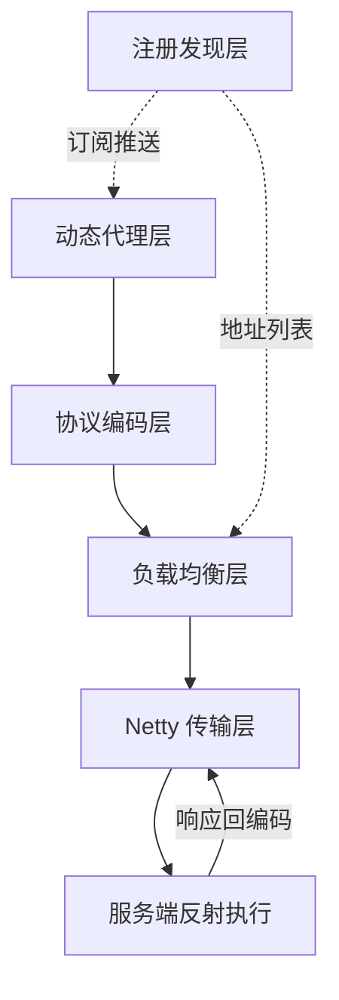
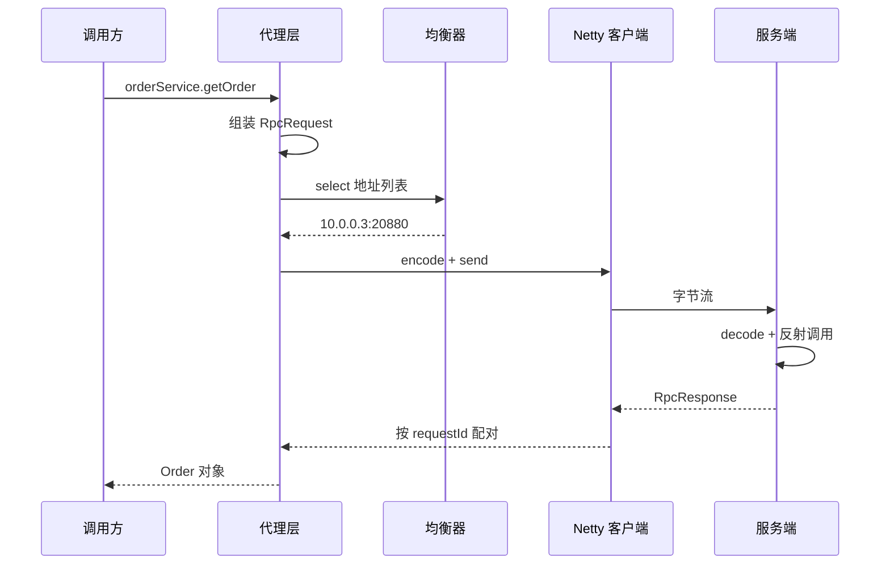
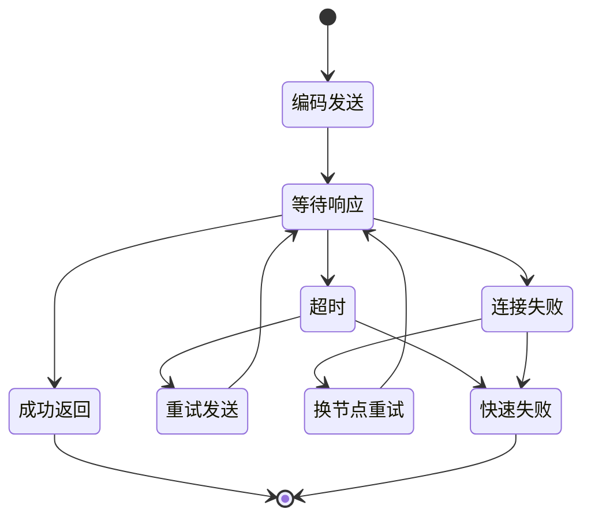
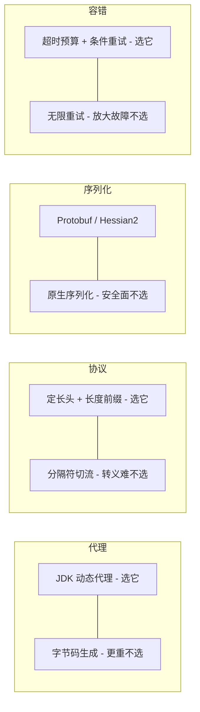
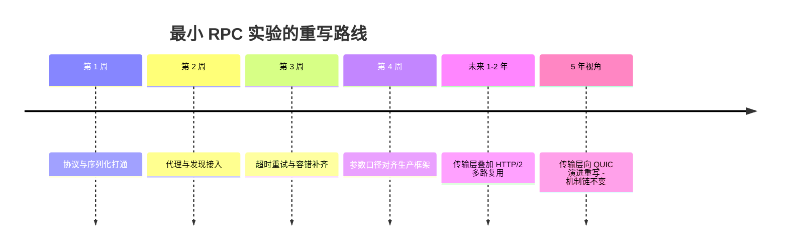
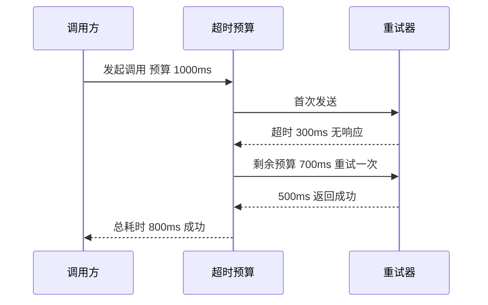

# 从零实现一个最小 RPC

> **一句话摘要**：亲手把 RPC 拆成六个组件各写一个最小版——代理、协议、序列化、发现、均衡、容错，串成一次可运行的调用，把「看懂了」变成「写得出」。
> **本文核心**：最小 RPC = **代理拦截 → 协议编码 → 寻址选点 → 网络传输 → 反射执行 → 回编码** 这条机制链；六个组件各自的最小实现都不是终点，而是生产框架里每个配置项、每个扩展点的「出处」。实现一遍之后，`timeout=1000`、`retries=2`、粘包处理器、本地地址表这些配置不再是黑盒参数，而是你亲手踩过的取舍点。

前置阅读：[一个 RPC 调用的一生](../../入门层/从零开始认识RPC系列/2_一个RPC调用的一生-入门.md)建立调用主线，[RPC 框架选型决策](../../专题层/RPC框架选型决策/1_RPC框架选型决策-专题.md)给出框架级结论。本篇是整合层收束：把入门层的心智模型、特性层的机制拆解、专题层的选型结论，落到一次能跑通、能报错、能修好的动手实验里。

## 一、为什么要亲手实现：机制链 vs 手感

看懂 RPC 的调用主线，和写出一个能跑的 RPC，中间隔着三层动手成本：

- **组件边界**：读书时代理、序列化、传输是三个章节；写代码时它们是一条调用栈上的三层函数，边界要自己划。
- **失败路径**：文档讲成功路径，代码一跑先遇到粘包、超时、地址列表为空——失败路径占实现工作量的一半以上。
- **参数出处**：生产框架的每个默认值背后都是一个取舍，亲手选过一次才记得住为什么。

这就是整合层的方法论：**实现不是为了造轮子，是为了给机制链装上手感**。写完这个最小版，再去读 Dubbo/gRPC 的配置手册，每一个参数都能对上你写过的那段代码。

## 二、全局架构：六组件与一次调用的机制链

### 2.1 六组件架构



六个组件的职责一句话说清：**代理**负责「让远程调用长得像本地调用」；**协议**负责「字节流里认得出一条完整请求」；**序列化**负责「对象和字节的互转」；**发现**负责「服务名到 IP 列表」；**均衡**负责「列表里挑一个」；**容错**负责「失败之后怎么办」。任何 RPC 框架都是这六件事的工程化放大。

### 2.2 一次调用的完整时序



这张时序图里有三个容易忽略的细节，每一个都是实现时的真实坑：

1. **requestId 配对**：Netty 的 IO 线程和业务调用线程是异步的，响应回来时原调用线程还在阻塞等待——靠 requestId 把响应送回正确的 `Future`。漏掉这一步，并发一上来响应就会「串门」。
2. **地址列表是快照**：均衡器拿到的是订阅时刻的列表副本，服务端缩容后旧列表还能用一段时间——这是发现机制的设计余量，不是 bug。
3. **反射执行在业务线程池**：服务端如果在 IO 线程里直接反射调用业务逻辑，一个慢查询就能卡死所有 IO 事件——线程模型必须分层。

**质疑者追问一：为什么不直接用 HTTP + JSON，要自建协议和序列化？** 答案是性能与治理的取舍。HTTP/1.1 文本协议头部开销大、解析慢；自建二进制协议 + Protobuf 能把单次编码压到微秒级。代价是失去通用性——浏览器不能直连。所以对内服务间通信选自建协议，对外开放边界选 HTTP，这是边界选择而不是优劣选择。

## 三、六步实现：每一步的机制与取舍

### 第 1 步：协议设计——魔数 + 版本 + 长度前缀

```java
// 协议头：定长 16 字节 + 变长体
// | magic 2B | version 1B | serializer 1B | type 1B | reserved 3B | bodyLength 4B | requestId 8B |
public class RpcProtocol {
    public static final short MAGIC = (short) 0xF1F1;
    public static final int HEADER_LENGTH = 20;

    public byte[] encode(RpcRequest req, byte[] body) {
        ByteBuffer buf = ByteBuffer.allocate(HEADER_LENGTH + body.length);
        buf.putShort(MAGIC);                 // 魔数：错连/脏数据第一道筛
        buf.put(VERSION);                    // 版本：协议演进留后路
        buf.put(serializerType);             // 逐请求指定序列化器
        buf.put(reqType);                    // REQUEST / RESPONSE / HEARTBEAT
        buf.putInt(body.length);             // 长度前缀：定长头才切得开流
        buf.putLong(req.getRequestId());     // 异步配对的锚点
        buf.put(body);
        return buf.array();
    }
}
```

**追问二：长度前缀为什么必须是定长头的一部分？** 因为 TCP 是字节流没有消息边界。解码器读到前 20 字节才知道后面还有多少字节属于这一帧——这就是拆包的锚。**反方案分析：为什么不用分隔符（如 `\r\n`）切包？** 分隔符要求对 body 做转义扫描，二进制序列化后的字节流里出现任何值，转义成本高且有漏洞风险；长度前缀 O(1) 切帧，是二进制协议的标配解。

**设计思想**：这 20 字节的定长头是整个协议的「宪法」——魔数管安全、版本管演进、长度管拆包、requestId 管并发。生产框架的协议头字段比这多，但骨干就是这四件事。

**踩坑实录（实践叙事一）**：第一次跑通时，两条日志打了同一个请求体。排查半小时才定位到解码器没处理半包——Netty 一次回调给的字节可能只有半条消息，`bodyLength` 还没读全就往下解析，直接 `IndexOutOfBounds`。修复是在 pipeline 最前面加 `LengthFieldBasedFrameDecoder`，按长度前缀切好帧再交给业务解码器。复盘结论：**粘包半包不是「可能遇到」，是必遇到**，编解码器的第一行代码就该是切帧。

### 第 2 步：序列化——Protobuf 与 Hessian2 二选一

```java
// 序列化器接口 + Protobuf 最小实现（教学简化）
public interface Serializer {
    byte[] serialize(Object obj);
    <T> T deserialize(byte[] bytes, Class<T> clazz);
}

public class ProtobufSerializer implements Serializer {
    @Override
    public byte[] serialize(Object obj) {
        // 真实实现需 schema 管理：每个消息注册 ProtoMessage 模板
        return ProtoMessage.of(obj).toByteArray();
    }
}
```

选型对比一句话版：**Protobuf** 压缩率高、跨语言强，代价是要维护 schema（idl 文件）；**Hessian2** 免 schema、Java 对象直转，代价是体积大且有反序列化安全面的历史包袱。最小实现选谁都能跑，取舍在生产。

**反方案分析：为什么不用 Java 原生序列化？** 三个理由：字节流大（带类元信息）、性能差、并且 `ObjectInputStream` 反序列化任意类是公开报道多年的 RCE 攻击面——史上多起大规模安全事件都源于对不可信字节流直接反序列化。**实践叙事二**：业内多个框架因此把原生序列化标记为不推荐甚至默认禁用，我们实验里也直接不实现它——安全默认值应该在框架层就锁死，而不是留给使用者选择。

**追问三：序列化换版本怎么办？** 加协议头里那个 `serializer` 字节——每个请求自带序列化器标识，服务端按字节路由到对应解码器。没有这个字段，滚动升级时新旧节点互发消息直接解码失败；有了它，双端可以各自先升级，这就是「协议管演进」的具体形态。

### 第 3 步：动态代理——调用即拦截

```java
public class RpcClientProxy<T> implements InvocationHandler, Serializable {
    @Override
    public Object invoke(Object proxy, Method method, Object[] args) throws Throwable {
        RpcRequest req = new RpcRequest();
        req.setInterfaceName(method.getDeclaringClass().getName());
        req.setMethodName(method.getName());
        req.setParameterTypes(method.getParameterTypes());
        req.setParameters(args);
        req.setRequestId(IdGenerator.next());
        // 组链：编码 → 均衡选点 → 发送 → 同步等响应
        byte[] resp = clusterInvoker.invoke(req);
        return serializer.deserialize(resp, method.getReturnType());
    }
}
```

**反方案分析：为什么不用字节码生成（如 ASM/ByteBuddy）而用 JDK 动态代理？** JDK 代理只能代理接口，但 RPC 天然面向接口编程——这个限制刚好不疼。字节码生成性能略高、能代理类，代价是依赖更重、调试更难。最小实现选 JDK 代理：**约束贴合场景时，最简单的方案就是最优解**——这也是 Dubbo 早期以接口代理为骨干的同款选择。

**设计思想**：代理层的 OrbitPoint 是「透明」——调用方拿到的就是 `OrderService` 接口，完全感知不到网络存在。这个设计目标决定了后面所有组件的形态：序列化、寻址、容错全部藏在 `invoke` 一个函数后面。

### 第 4 步：注册发现——订阅 + 本地快照

```java
public class ServiceDiscovery {
    private final Map<String, List<Instance>> localCache = new ConcurrentHashMap<>();

    public List<Instance> discover(String serviceName) {
        List<Instance> cached = localCache.get(serviceName);
        if (cached != null && !cached.isEmpty()) return cached;   // 先走快照
        List<Instance> fresh = registry.lookup(serviceName);      // 回源注册中心
        localCache.put(serviceName, fresh);
        registry.subscribe(serviceName, list ->                   // 订阅推送更新快照
            localCache.put(serviceName, list));
        return fresh;
    }
}
```

**为什么本地快照是必须的而不是优化？** 注册中心抖动时，如果每次调用都实时查注册中心，抖动会放大成全站调用失败；有本地快照，推送延迟几秒内调用照常。**实践叙事三**：公开资料里多次出现注册中心网络分区期间、依赖实时查询的应用大面积报错而靠本地快照扛过去的案例——「注册中心挂了调用还能不能继续」是发现机制的第一个设计目标，快照就是答案。

机制细节见特性层拆解：[注册中心一致性协议 Distro 与 Raft](../../特性层/深入理解服务发现系列/1_注册中心一致性协议-Distro与Raft-深度.md)。本篇只取结论：**发现要的是可用性优先、最终一致**，强一致注册中心在分区时宁可拒绝写入也不拒绝读。

### 第 5 步：负载均衡——从随机起步

```java
public class LoadBalancer {
    public Instance select(List<Instance> instances) {
        if (instances.size() == 1) return instances.get(0);
        int idx = ThreadLocalRandom.current().nextInt(instances.size());
        return instances.get(idx);
    }
}
```

随机在实例数多、配置相近时已经够用；加权轮询解决配置不齐；一致性哈希解决有状态路由。**追问四：加权轮询为什么不是默认？** 权重需要运维输入，而错误的权重比无权重更糟——权重写错等于把流量导给弱机器。默认值的第一原则是「错了也无害」，这也是参数清单里绝大多数默认值偏保守的原因。

### 第 6 步：超时、重试与容错——最小可用闭环

```java
public byte[] invokeWithTimeout(RpcRequest req) {
    Future<byte[]> future = sendAsync(req);
    try {
        return future.get(timeoutMs, TimeUnit.MILLISECONDS);  // 调用方预算兜底
    } catch (TimeoutException e) {
        future.cancel(true);                                  // 取消占位的槽位
        if (req.isIdempotent() && retriesLeft() > 0) return retry(req);
        throw new RpcTimeoutException(req, timeoutMs);
    }
}
```

**踩坑（实践叙事四）**：实验第一版没有 `future.cancel`，压测时连接数只涨不跌。排查发现超时的请求虽然调用方放弃了，Netty 侧的 pending 响应和槽位还挂着——超时清理不彻底，资源泄漏是时间问题。修复后复盘出一条纪律：**超时不是一个数字，是「放弃 + 清理 + 重试 + 上抛」一套动作**，只做放弃不做清理的超时是半成品。

一次调用从发起到终结的状态机：



状态机里藏着容错的全部关键决策：**哪些状态允许重试**（只有「请求未到达对端」的失败才幂等安全）、**重试换不换节点**（不换节点重试等于把失败放大给同一个故障点）、**重试几次后放弃**（预算制，见下节参数表）。

### 六组件取舍全景



## 四、参数配置清单：把默认值当作品读

实验里每个参数都对应生产框架的一个配置项，默认值口径参照主流框架公开文档（以官方文档为准）：

| 参数名 | 默认值 | 分档推荐 | 为什么 |
|---|---|---|---|
| timeout | 1000ms | 内网查询 500ms；写操作 2s | 覆盖 99 分位即可，过长拖死调用方线程 |
| retries | 2 | 读接口 2；写接口 0 | 写接口重试必须配幂等，否则资损 |
| 心跳间隔 | 30s | 秒级探活场景 5-10s | 过短放大心跳流量，过长拖慢摘除 |
| 连接超时 connectTimeout | 3000ms | 内网 1000ms | 建连失败要快速暴露 |
| IO 线程数 | CPU 核数 + 1 | 网关型可 2 倍 | IO 密集，阻塞业务会拖垮 |
| 业务线程池 | 200 | 按 RT 分档压测定 | 队列无界=慢性雪崩 |
| 序列化缓冲区 | 8KB 起步动态扩 | 大报文场景预分配 | 频繁扩容增加 GC 压力 |

读这张表的正确方式：每个默认值背后都是一次「错了也无害」的保守选择。**质疑者追问五：为什么超时默认 1 秒而不是 10 秒？** 因为超时过长的危害（线程堆积、故障传导）是系统性的，超时过短只是偶发误报——两害相权，默认值必须站在系统安全一边。

## 五、验证：预期输出与常见报错

### 验证步骤

1. **第 1 步**：启动嵌入版注册中心（单机 map 模拟），启动服务端，预期输出 `Server started on 20880`。
2. **第 2 步**：启动客户端并创建代理，预期输出 `discovered 1 instance: 127.0.0.1:20880`。
3. **第 3 步**：调用 `orderService.getOrder("1000")`，预期输出返回 Order 对象且 `requestId` 配对成功。
4. **第 4 步**：杀掉服务端再调用，预期输出 `RpcTimeoutException after 1000ms`，且连接池无残留槽位。

### 常见报错对照

| 报错现象 | 根因 | 修法 |
|---|---|---|
| IndexOutOfBounds in decoder | 半包未处理 | 加 LengthFieldBasedFrameDecoder |
| 响应串台/返回错对象 | requestId 未配对 | 响应回调按 id 查 Future |
| 连接数只涨不跌 | 超时未清理槽位 | future.cancel + 槽位释放 |
| 调用偶发 NoSuchMethod | 双端接口版本不一致 | 协议头带版本并校验 |

## 六、不同量级的思考：架构约束驱动解法

同一个最小实现，在不同量级下瓶颈完全不同——量级决定架构，不是功能决定架构：

- **十万级 QPS（单集群 10 万请求每秒）**：约束来源是单机的物理上限——网卡带宽、序列化 CPU、上下文切换。这一档的核心问题是「单机网络栈与序列化 CPU 打满」，而不是「功能全不全」。思考方式是**路径驱动**：把单次调用的执行路径压到最短，20 字节定长头 + Protobuf 编码路径进微秒级，零拷贝与缓冲区复用优先于任何功能扩展。
- **百万级 QPS**：约束来源从单机转移到集群拓扑——连接数、地址列表规模、推送风暴。这一档的核心问题是「地址列表规模与连接数爆炸」，而不是「单机再快一点」。思考方式是**复用驱动**：连接合并与快照分批推送，地址条目上升后均衡器的选择开销进入视野，本地快照的更新按服务分批。
- **千万级 QPS**：约束来源是机房级物理边界——机架电力、机房容量、故障半径。这一档的核心问题是「单机房容量天花板与容灾半径」，而不是「参数怎么调」。思考方式是**容灾驱动**：单元化部署、就近路由、机房级容错进入架构约束，发现机制从「可用性优先」升级为「分区自洽」。
- **亿级 QPS**：约束来源是全球部署的业务与法律边界——跨地域时延、数据合规、局部自治。这一档的核心问题是「全局的一致性与局部自治的边界」，而不是「再加机器」。思考方式是**自治驱动**：跨地域复制、边缘接入、协议层向 QUIC/HTTP-3 演进，每一层都要重新回答「这个组件还成立吗」。

四档串起来看有个自下而上的规律：每一档的最优解都是被上一档的瓶颈逼出来的——先有单机路径压缩，才有余量谈连接复用；先有复用撑住拓扑，才有资格谈容灾。触发升级的信号也很明确：当这一档的思考方式开始失灵（路径压到头还打满、复用到头还爆炸），就是量级升级、架构重审的时刻。这也是为什么生产框架全是「配置项 + 扩展点」：**框架不替你做量级决策，它把决策点暴露给你**。

## 七、横向对比：手写最小版 vs 生产框架

| 维度 | 本篇最小实现 | 生产级框架 |
|---|---|---|
| 代理 | JDK 动态代理 | 代理 + 字节码增强双模 |
| 协议演进 | 单版本 | 多版本协商 + 兼容层 |
| 寻址容错 | 快照 + 随机 | 目录服务 + 感知均衡 + 自适应 |
| 可观测 | 日志 | Tracing/Metrics 全链路 |
| 安全 | 反序列化白名单意识 | 认证鉴权 + 全链路加密 |

选型结论（何时用哪个）：**学习与验证机制**用最小实现——它把机制链暴露得最清楚；**任何真实业务流量**用生产框架——上表右边每一行都是真实事故换来的工程沉淀。怎么选的判断口径就一句话：**代码的生命周期超过一周，就用框架**。

## 八、生产化差距：从能跑到能上生产

最小实现与生产框架之间的差距，按「缺了会出什么事」排序：

1. **无认证鉴权**——内网 anyone 可调用，安全边界为零。
2. **无优雅上下线**——杀进程即断流量，发布必然报错毛刺。优雅上下线的机制本质是「摘流量先于停进程」：服务端先向注册中心注销，等在途请求跑完再退出；毛刺的真正来源是客户端快照的同步延迟——注销消息到达各客户端有时间差，所以发布要配合权重递减或摘流缓冲，把「瞬间摘除」拉长为「梯度摘除」。
3. **有限流熔断**——依赖方故障直接传导成自身线程池打满。线上复盘里大量「一个下游慢、全站跟着慢」的连锁故障，根因都是调用方没有熔断：熔断器的机制位置在均衡器之前，故障实例直接出局不参与选点，失败不再消耗重试预算。机制详见 [限流熔断降级](../../入门层/从零开始认识RPC系列/10_限流熔断降级-入门.md)。
4. **无可观测**——没有 RT 分位与错误率指标，故障定位靠翻日志。可观测的接入点与机制链同构：代理层记调用与 RT，容错层记重试与熔断事件，发现层记地址变更——三个埋点位覆盖一次调用的全部决策路径。
5. **协议无压缩与多路复用**——大报文场景带宽成本高，HTTP/2 流复用能解决队头阻塞之外的连接开销。

**设计思想总结**：这份差距清单反过来读，就是 RPC 框架十多年的演进史——先解决「通」，再解决「稳」（容错/限流），再解决「快」（复用/压缩），最后解决「看得见」（可观测）。每个特性被发明的那一年，都对应一类当时频发的故障。理解演进顺序，比记住特性清单更重要。

## 九、跨周期演进：这个实验 5 年后还成立吗

跨周期视角下，六组件的寿命并不相同：

- **5 年内稳定成立的**：代理的透明性原则、定长头协议设计、快照式发现、超时预算制——这些是分布式调用的物理约束决定的，与技术潮流无关。
- **正在演进的**：序列化向 schema 演进型（Protobuf）收敛；传输层 HTTP/2 多路复用成为默认，HTTP/3/QUIC 在弱网与跨域场景渗透。
- **5 年视角下会重写的**：传输层最可能被替换——如果 QUIC 成为主流，Netty 之上的自建协议会先被 HTTP/3 流量穿透，再被逐步收编。



timeline 的结论值得单独说：**会被重写的是组件实现，不变的是机制链**。代理-编码-寻址-传输-执行-回编码这条链，从 CORBA 到 gRPC 二十年没有变过——变化的只是每个环节的实现载体。这就是整合层实验的长期价值：练的是链，不是某一版的代码。



## 十、你们可能会问

- **问：实现一遍要多久？** 答：专注做的话两三天能跑通主干，一周补齐容错与参数。卡点通常在第 1 步协议（粘包）和第 6 步超时清理——恰好也是生产框架花最多代码的地方。
- **问：最小实现能直接用于公司内部小项目吗？** 答：不建议。哪怕两人小团队，认证、发布毛刺、可观测三个缺口都会在第一个月内爆。学习产物和服役代码要严格分开。
- **问：先学框架源码还是先手写？** 答：先手写再读源码。带着自己踩过的粘包、超时、串台问题去读，源码里每个看似冗余的防御代码都能对上你的伤疤，阅读速度差一个量级。
- **问：gRPC 这类框架还要自建协议吗？** 答：gRPC 把协议固化在 HTTP/2 上，自建空间只剩序列化与治理插件——这正是「框架收敛协议、开放扩展点」趋势的体现。

## 十一、自测三问

1. **问：为什么 requestId 是异步配对的锚点？** 答：Netty IO 线程与业务线程异步，响应到达时原调用线程阻塞在 Future 上；IO 线程按 requestId 找到 Future 完成 `promise`——没有它，并发下响应无法路由回正确调用方，表现为响应串台。
2. **问：写接口为什么默认不重试？** 答：写操作不保证幂等，超时重试可能造成重复写入（资损）；读操作天然幂等才默认重试。写接口要重试必须先做幂等键。
3. **问：注册中心全挂，调用还能继续吗？** 答：能——本地快照继续提供地址列表，只是无法感知上下线变化；这正是发现机制「可用性优先」设计的兑现，也是快照必须存在的理由。

## 💡 实战提示

- **决策口径一（何时手写）**：目的必须是「理解机制」或「验证某个特定取舍」；一旦代码要承载真实流量，立即切换到生产框架——这个决策不摇摆。
- **决策口径二（参数怎么定）**：先用框架默认值跑，压测出问题再逐个调；一次性把所有参数改成「自以为的最优」是故障的常见起点。
- **提示三**：手写实验里故意保留的「坑」（粘包、串台、泄漏）不要提前修——先让它们爆出来再修，手感就是这么来的。

## 开放问题

**RPC 的边界正在被什么重画？** Service Mesh 把代理从进程内挪到 sidecar，HTTP/3 把传输从自建协议收编到标准栈——当传输与治理都下沉到基础设施，「框架」还剩什么？我的判断：序列化契约与业务语义编码会留得最久，但这个问题值得每两年重新回答一次。

## 🎯 核心带走

- **核心一句话**：最小 RPC = 代理 + 协议 + 序列化 + 发现 + 均衡 + 容错六个组件的最小实现，串成「代理拦截 → 编码 → 寻址 → 传输 → 反射执行 → 回编码」机制链。
- **链条复述**：调用先被代理拦截组包，定长头协议切帧防粘包，序列化按头字段路由版本，发现层用本地快照抗注册中心抖动，均衡从随机起步，超时是「放弃 + 清理 + 条件重试」整套动作。
- **失效点与边界**：写接口重试不幂等即资损；超时不清理槽位即泄漏；注册中心分区期间快照过期即误路由——每个失效点都对应生产框架的一个防护机制。

## 📌 数据与事实声明

- 写于 2026-09-23，为整合层动手实验的教学简化代码，不能直接用于生产。
- 参数默认值（timeout 1000ms、retries 2 等）参照主流框架公开文档口径整理，以官方文档为准。
- 文中性能量级与故障案例为行业认知与公开报道归纳，非本仓库实测；序列化安全事件为公开报道多年的行业事实。

## 📚 参考资料

| 类型 | 标题 | 来源 |
|---|---|---|
| 系列内 | 入门层「从零开始认识 RPC」全系列 | 本仓库 service-governance/rpc/ |
| 系列内 | 特性层传输与 IO / 序列化与协议 / 服务发现三系列 | 本仓库 service-governance/rpc/ |
| 系列内 | RPC 框架选型决策（专题层） | 本仓库 service-governance/rpc/ |
| 官方文档 | Dubbo/gRPC 协议与参数默认值说明 | 各项目官方站（以官方文档为准） |
