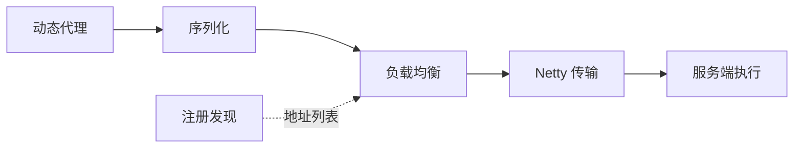
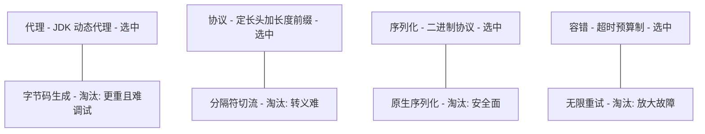
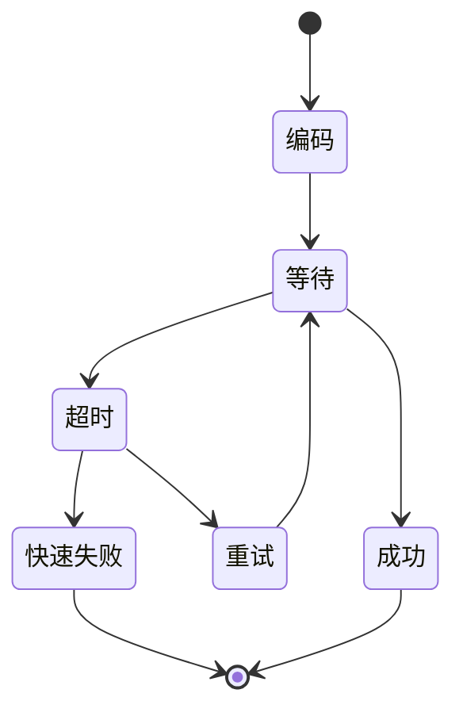
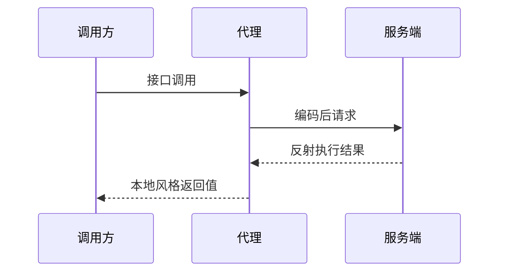
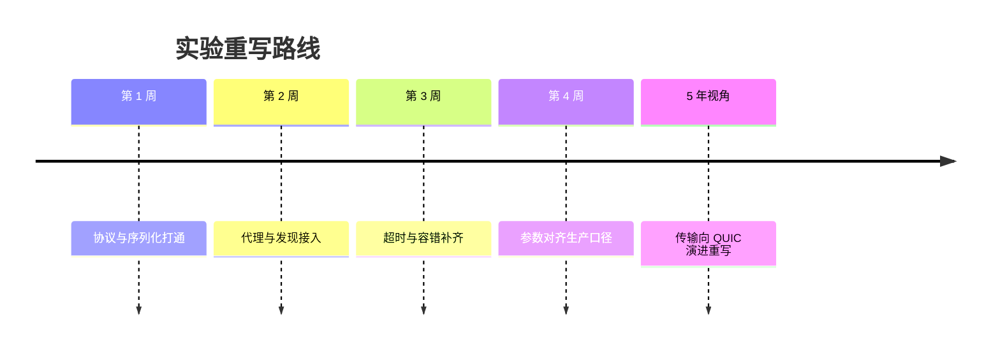

# 自定义实现一个 RPC：机制收束的整合实验

> **本文核心**：入门层建心智模型、特性层拆机制、专题层做选型——整合层用一次「从零实现最小 RPC」把全链路机制亲手串起来：动态代理拦截调用、序列化编码、注册发现寻址、负载均衡选点、Netty 传输、超时与容错。实现不是为造轮子，是把「机制链」变成「手感」——每个扩展点的取舍亲手做一遍，生产框架的每个配置项从此有出处。

## 一句话摘要

最小 RPC = 六个组件的最小实现组合：代理（JDK 动态代理）、协议（魔数+长度前缀）、序列化（Protobuf/Hessian2 二选一）、传输（Netty 双端）、发现（注册中心订阅+本地列表）、均衡（随机/轮询起步）——**六段各取最简实现，串起来就是一次可运行的调用**。

## 篇目

1. [从零实现一个最小 RPC](1_从零实现一个最小RPC-深度.md)——六组件实现、参数清单、验证与踩坑、跨周期演进

## 组件取舍全景

每个组件都有一组备选方案，实验的原则是「最简且错不了」优先：

## 调用状态与验证

验证口径：跑通一次调用后，人为制造三类失败——粘包、超时、地址列表为空，预期输出与修复动作见正文第五节。

## 实验重写路线与跨周期演进

跨周期视角：机制链（代理-编码-寻址-传输-执行-回编码）十年未变，变的只是每段实现载体——从自建协议到 HTTP/2 多路复用，未来 5 年传输层可能向 QUIC 演进。Trade-off 的取舍结构同样稳定：每档量级下「性能、通用性、安全」三者必舍其一，这一取舍规律不随框架更替失效。

## 📌 数据与事实声明

- 写于 2026-09-23，实现参照 Dubbo/gRPC 机制结构（公开口径），代码为教学简化版，以官方文档为准

## 📚 参考资料

| 类型 | 标题 | 来源 |
|---|---|---|
| 关联文章 | 入门层全系列 + 特性层三系列 + 专题层选型 | 本仓库 service-governance/rpc/ |
