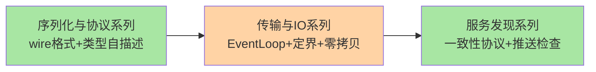
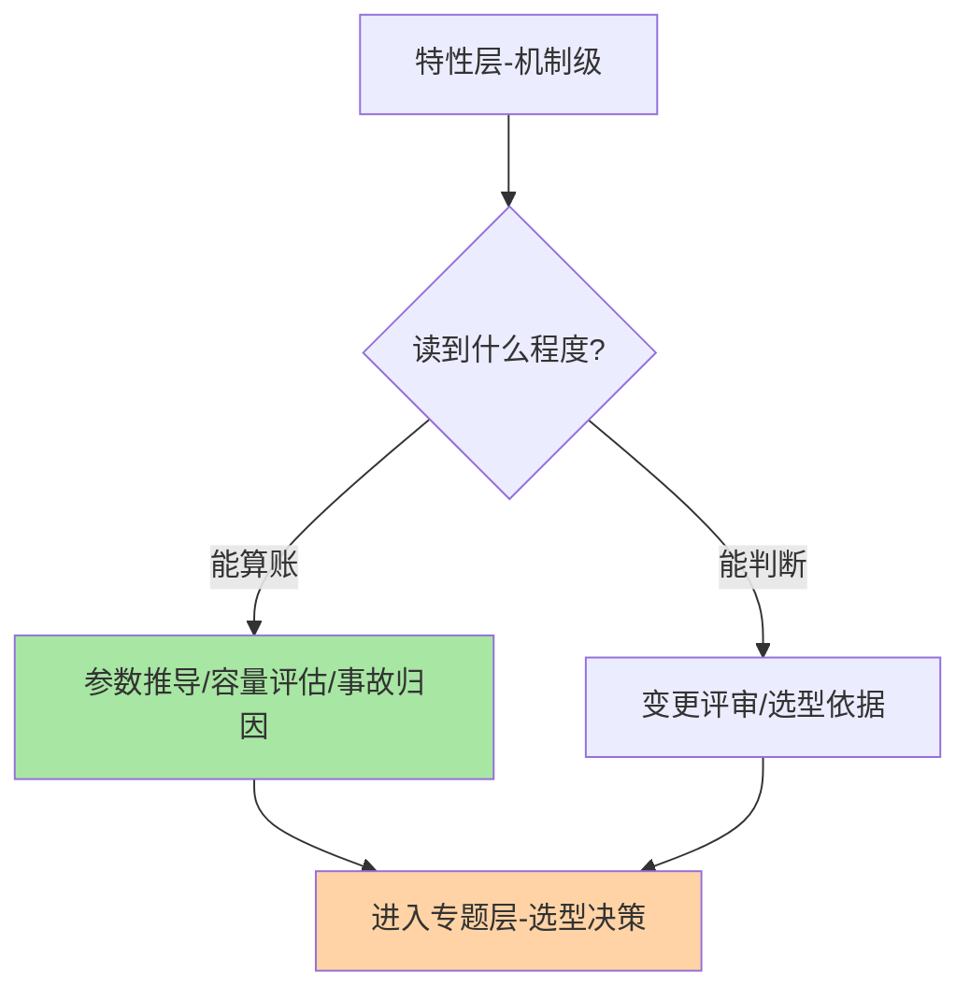
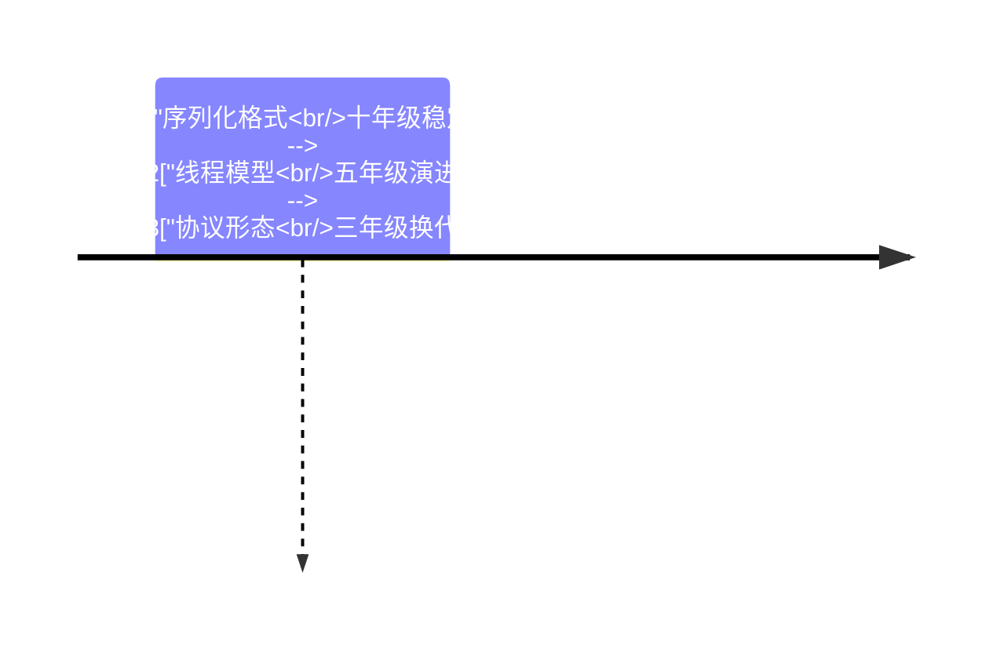

# RPC 特性层总览：三系列机制深读

> **本文核心**：RPC 特性层沿机制链三段展开——**序列化与协议**（Protobuf wire 格式与 Hessian2 类型自描述两种设计路线的机制级对照）、**传输与 IO**（Netty 线程模型的串行化哲学、粘包拆包与零拷贝的实现账本）、**服务发现**（一致性协议按数据定价、推送与健康检查的双引擎咬合）。每个系列 2 篇 deep-dive，机制为主线、事故为钉子。

## 一句话摘要

入门层建立「一次调用的一生」心智模型，特性层把其中四段机制拆到实现级：编码格式怎么省字节、线程模型怎么免锁、字节流怎么定界、变更怎么触达——**四段机制共同的底层思想是「自描述边界+串行化+责任分配」**。

## 系列导航

| 系列 | 深挖点 | 篇目 |
|---|---|---|
| 深入理解序列化与协议系列 | 编码格式与安全边界 | 1_Protobuf 编码原理 2_Hessian2 实现与安全 |
| 深入理解传输与IO系列 | 线程模型与数据搬运 | 1_EventLoop 关键路径 2_粘包拆包与零拷贝 |
| 深入理解服务发现系列 | 一致性与新鲜度 | 1_Distro 与 Raft 2_订阅推送与健康检查 |

## 与相邻层的关系

入门层（concept）给全景与直觉，本层（deep-dive）给机制与事故；专题层做选型决策，整合层从零实现收束——机制细节的争议在特性层找到源头，选型争议在专题层收口。

## 层内的取舍与演进

三系列的机制都有跨周期的稳定性：编码格式的演进以十年计（wire format 十年未变），线程模型的串行化哲学十年未动摇，一致性协议的取舍框架五年一迭代的只是实现形态。读特性的投入产出比因此极高——**机制内核的生命周期远长于框架版本的生命周期**。代价面也如实说：深读 consumes 时间，特性层的每篇都以事故与参数账为准绳，读到能算账即为够用，不必陷入源码细节的完形填空。

## 📌 数据与事实声明

- 写于 2026-09-15，机制口径以各官方文档为基准（公开口径）
- 免责：以各篇参考资料为准

## 📚 参考资料

| 类型 | 标题 | 来源 |
|---|---|---|
| 系列入口 | RPC 入门层系列 | 本仓库 service-governance/rpc/入门层 |
