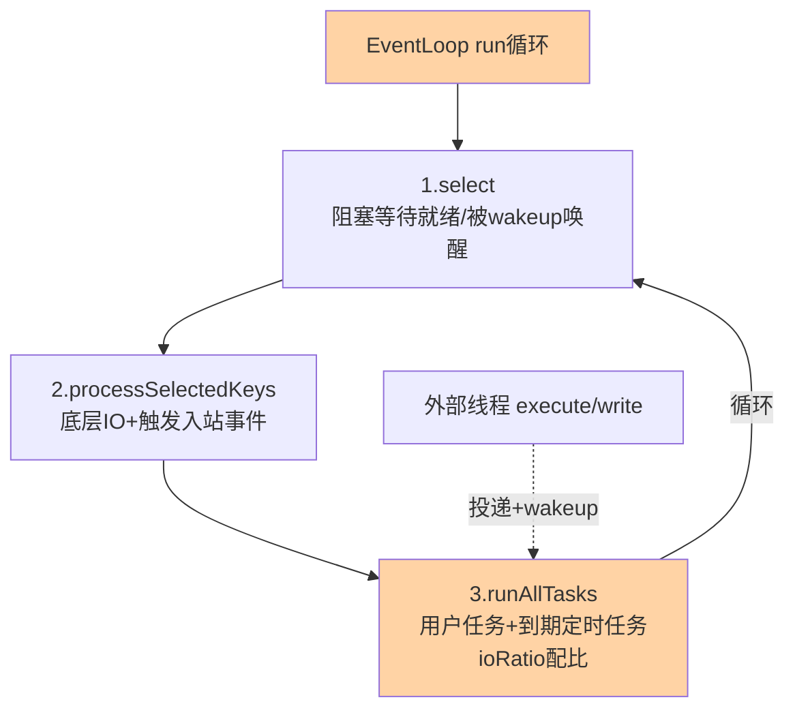
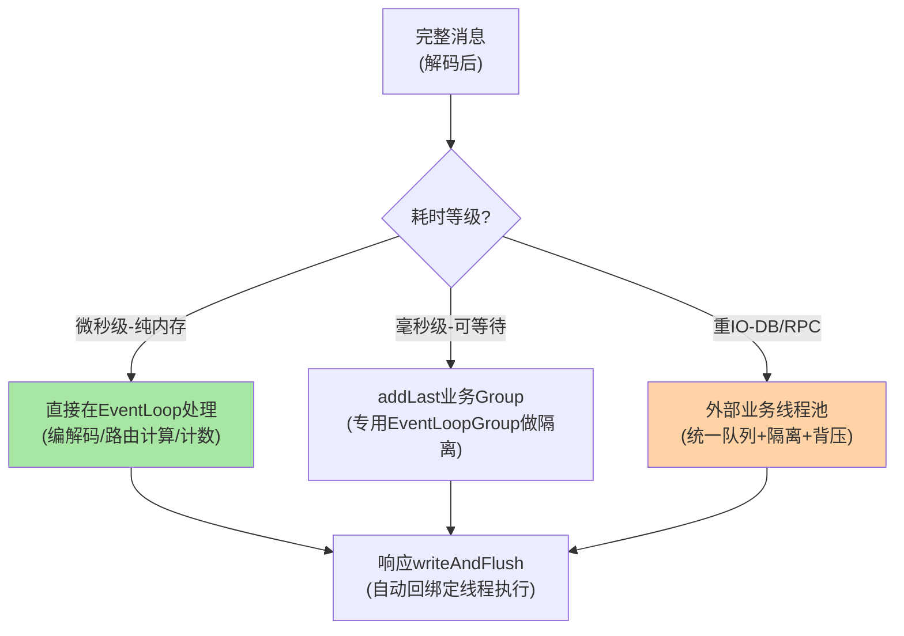
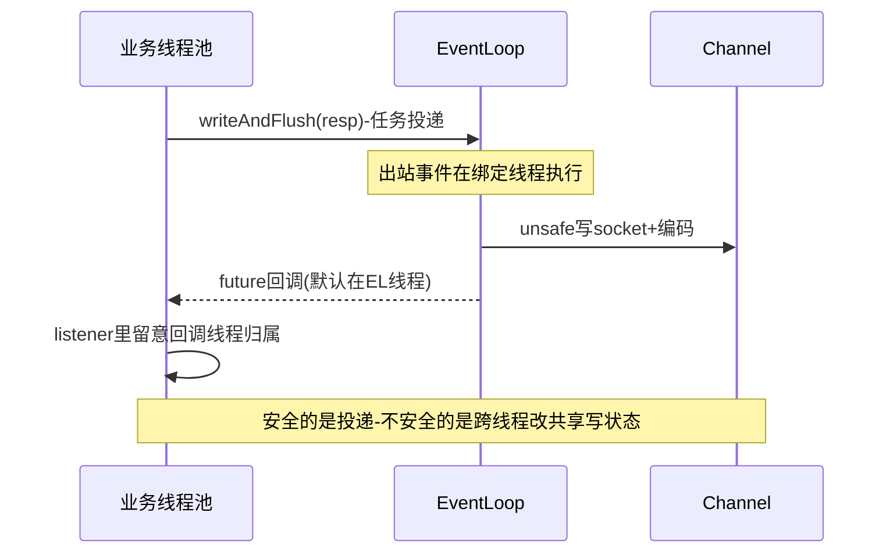

# Netty 线程模型与 EventLoop 关键路径深读：串行化的性能哲学

> **本文核心**：Netty 吞吐优势的机制核心是「**一个 Channel 终身绑定一个 EventLoop 线程**」——同一连接的全部 IO 事件串行执行，共享状态免锁；线程模型三层（Boss 接受连接、Worker 做 IO、业务线程池跑耗时逻辑）的纪律本质是「保护 EventLoop 的执行时间预算」。本文从 NioEventLoop 的运行骨架（selector 轮询、任务队列融合、ioRatio 时间配比）拆到关键路径（channelRead 事件的 pipeline 传播、unsafe 的底层读写），再用三个生产事故（Handler 阻塞掀翻全连接、Boss 配置错位、定时任务饿死 IO）钉死纪律的代价。**机制链**：selector 就绪 → EventLoop 循环取事件 → pipeline 头到尾传播 → handler 处理（禁止阻塞）→ 出站事件尾到头回流 → 业务重活转业务线程池。

## 一句话摘要

Netty 的线程模型回答一个问题：「**怎么用极少的线程服务海量连接且不加锁**」——答案是串行化绑定：Channel 的读写事件、用户自定义任务、定时任务全部进入所属 EventLoop 的单一队列，由同一线程依次消费。串行化消灭了锁，也制造了致命约束：**EventLoop 上的任何一次慢执行，都是这条线程上全部连接的集体等待**。理解「队列融合与串行消费」这一个机制，Boss/Worker 分层、ioRatio 配比、任务转义（业务线程池）、水位背压这些工程细节就全部有了坐标系。

## 前置阅读

- 入门层篇 5《IO 模型与 Netty》（Reactor 模式与线程模型入门）
- 入门层篇 2《一个 RPC 调用的一生》（传输在链路的位置）

## 目标导向

本文是什么：Netty 线程模型到关键路径的机制级深读。功能：读懂 EventLoop 运行骨架、预判阻塞事故、设计 IO 与业务的线程边界。收益：高并发网络层的排障能力与调优依据。必看场景：RPC 传输层调优、网关性能排查、延迟毛刺归因。

## 一、从「要不要锁」看懂整个线程模型

多线程网络编程的传统困境：连接对象的状态（读缓冲、协议解析中间态、待写队列）被读写事件并发触碰——要么加锁（锁竞争吃掉吞吐），要么每连接一线程（线程爆炸）。Netty 的解法第三条路：**让每个连接的全部事件天然单线程化**——Channel 注册时绑定 EventLoop，此后所有相关事件与任务都路由到这一个线程。单线程串行执行，状态不需要锁，缓存不需要同步，代码按「事件间无并发」的假设写。

这个选择的收益与代价同样极端：收益是接近零同步开销的事件处理（业内高性能网络组件的共同选择——Redis 单线程、Nginx worker、Netty EventLoop 同源思想）；代价是「串行纪律」成为全局红线——**任何一个 Handler 里的一次阻塞调用，都是同一 EventLoop 上成千上万连接的集体人质**。本文后面的事故叙事里，这条红线会反复出现。

## 5W 速记卡

| 维度 | 一句话 |
|---|---|
| What | Channel-EventLoop 终身绑定、单线程串行消费事件与任务的线程模型 |
| Why | 用串行化换无锁化，用纪律换吞吐 |
| When | 传输层调优、延迟毛刺归因、线程边界设计 |
| Where | Boss/Worker EventLoopGroup + Pipeline + 业务线程池 |
| How | selector 就绪 → 单队列事件 → pipeline 传播 → 阻塞操作转义 |

## 二、EventLoop 运行骨架：一次循环里做三件事

NioEventLoop 的 `run()` 是理解一切行为的起点，骨架可以概括为「选择-处理-任务」的三段循环：

```text
NioEventLoop.run() 关键路径（以 4.1 为参照）:
  loop forever:
    1. selectNow/select():
       无任务且无就绪事件 → 阻塞在 selector.select()
       有任务 → selectNow() 非阻塞探测 + 任务队列扫描
       （wakeup 机制: 提交任务时唤醒阻塞中的 select）
    2. processSelectedKeys():
       就绪事件 → unsafe.read()/write() 底层IO
       → 触发 pipeline fireChannelRead 等入站事件
    3. runAllTasks(timeoutNanos):
       消费任务队列(用户任务+定时任务到期项)
       ioRatio 控制IO与任务的时间配比(默认50)
```

**任务队列与 select 的融合**是骨架里最精妙的一处：EventLoop 不仅有 IO 事件，还要执行用户从外部线程提交的任务（`channel.eventLoop().execute(...)`）与定时任务（`schedule`）。外部线程提交任务时若 EventLoop 正阻塞在 select，`wakeup` 唤醒它——**IO 事件与用户任务在同一线程的同一循环里被统一串行消费**。这解释了一个高频现象：从业务线程调用 `ctx.writeAndFlush()`，写操作实际发生在 EventLoop 线程（出站事件必须回到绑定线程执行）——跨线程调用被框架自动转成「投递任务到 EventLoop 队列」。

**ioRatio 的时间经济学**：循环里 IO 处理与任务消费共享线程时间，ioRatio=50 表示任务消费的时间预算是 IO 处理时间的一倍。**任务队列积压的信号**就是延迟毛刺——大量定时任务/用户任务涌入时，任务消费挤占 IO 时间，所有连接的事件处理变慢。业内调优里「把无关定时任务挪出 EventLoop」的原则，机制依据就在这个配比。



## 三、关键路径：一个入站事件的一生

以一次读取为例走完整关键路径：selector 就绪（OP_READ）→ `AbstractNioByteChannel` 的 unsafe 执行底层 `read()`，把字节读进分配的 ByteBuf → 触发 `pipeline.fireChannelRead(buf)` → 事件从 HeadContext 开始沿 pipeline 逐个 handler 传播 → 解码器把字节流切帧（互指系列篇 2 的粘包拆包）→ 业务 handler 收到完整消息 → 处理完触发 `fireChannelReadComplete` → 出站响应从业务 handler `writeAndFlush` 从尾向头回流，经编码器加协议头，最终由 unsafe 写入 socket。

**三个值得内化的细节**：① **传播是方法调用不是消息队列**——pipeline 的 fire 系列是同步方法调用链，一个 handler 抛异常不接，就断传播链（异常沿 `exceptionCaught` 兜底）；② **ByteBuf 的生命周期责任随传播转移**——谁消费谁负责 release，泄漏检测（ResourceLeakDetector）就是给这条纪律兜底的，观测到 LEAK 日志说明有人拿了不还；③ **readPooled 内存分配**——默认 PooledByteBufAllocator 从池化内存借缓冲，读完毕归还，高频收发的 GC 压力因此可控——这也是「裸 JDK Socket 打不过 Netty」的微观来源之一。

**串行绑定的排障含义**：日志里看到某连接的事件处理慢，先看它绑定的 EventLoop 线程在忙什么——`jstack` 里 EventLoop 线程的栈就是全连接的公共瓶颈现场。业内排障惯例：EventLoop 线程命名规范化（nioEventLoopGroup-x-y），让线程栈一眼可归因——这个命名纪律在事故叙事里救过急。

## 四、线程边界设计：业务重活的三种转义方式



**方式一：直接在 EventLoop 处理**——适合纯内存微操作（协议编解码、内存路由表查询、原子计数），收益是零线程切换；纪律是绝对不碰任何可能阻塞的调用（DB/远端/锁竞争激烈的资源/同步日志）。

**方式二：pipeline 挂业务 EventLoopGroup**——`addLast(businessGroup, handler)` 让该 handler 在另一个 EventLoopGroup 的线程里执行，Netty 自动做线程切换。适合「耗时但可控、量大」的逻辑（如压缩、轻量序列化），好处是与框架生命周期统一、天然隔离；注意切换点在 handler 边界，同 pipeline 前后段的线程归属不同。

**方式三：外部业务线程池**——handler 收到消息后提交到自建线程池（通常按业务域拆多个池）。适合真正的重 IO（DB 查询、下游 RPC），好处是线程池参数完全自主（队列长度、拒绝策略、隔离粒度），坏处是上下文传递要自己管（traceId/连接对象跨线程——`ctx` 的调用要切回 EventLoop 或使用线程安全的 writeAndFlush）。**业内惯例**：RPC 框架的传输层普遍采用「编解码在 EventLoop、业务执行在框架统一线程池」的两段式（Dubbo 的 Dispatcher 线程派发器就是这层的策略化：all/message/receiver/none 各选切分点）。

**量级演进视角**：千级连接的小服务——三种转义随便选，性能差异不可感；万级连接、QPS 十万级——线程切换次数进入成本视野，「能不切就不切」变成硬优化（编解码尽量轻、微操作留在 EventLoop）；十万级连接的长连接网关——连接数与消息吞吐双高，EventLoop 数量（默认 CPU 核数×2）、每 Loop 承载连接数的均衡、任务队列水位监控全套要配——**线程边界的精细度随吞吐量级上升**。

### 跨线程写与回调的时序约定



时序里的两处「线程归属」标注就是跨线程协作的全部纪律——写操作放心投递、回调默认在 EventLoop，业务线程在 listener 里只做轻处理或再转义。

## 五、与 BIO 线程模型的区别：责任分配的哲学差异

| 维度 | Netty EventLoop 模型 | 传统 BIO 一连接一线程 |
|---|---|---|
| 线程数 | CPU 核数量级 | 连接数量级 |
| 状态同步 | 串行免锁 | 需要锁或线程封闭 |
| 阻塞代价 | 全 Loop 连接集体等待 | 只阻塞自己线程 |
| 编程心智 | 事件驱动+纪律重 | 顺序思维+简单 |
| 容量上限 | 十万级连接 | 千级连接 |

表里最容易被误读的是「阻塞代价」一行：BIO 里一个连接慢只拖死自己的线程，故障是局部的；EventLoop 里一次阻塞是全局的——**BIO 的浪费换来了故障隔离，NIO 的效率换来了纪律依赖**。这不是「谁更先进」，是故障域形状的取舍：要求故障隔离的小规模场景，BIO/虚拟线程路线依然是合理选择（互指入门层篇 5 的虚拟线程讨论）。

## 六、典型场景与误区

**典型场景**：RPC 传输层（Dubbo/gRPC 底层的 Netty 线程模型即本文模型的生产级实现）；长连接推送网关（海量连接+低频消息，EventLoop 数量与连接均衡是核心参数）；API 网关（进出两侧 pipeline，解码在 IO 线程、转发在业务线程池）；监控采集端（大量 agent 长连接上报，编解码轻量化+直接 EventLoop 消费）。

**常见误区**：① **在 Handler 里同步写日志**——同步 Appender 的磁盘 IO 抖动直接阻塞 EventLoop（本系列事故一的原型），异步日志是底线配置；② **Boss 与 Worker 共用线程组**——accept 被海量 IO 事件饿死，新连接建立延迟飙升，Boss 独立线程组（哪怕 1 线程）是标配；③ **定时任务全堆 Netty 的 schedule**——定时任务与 IO 共享队列与时间配比，无关任务用独立调度器，EventLoop 的 schedule 只留「与连接强相关」的任务（如空闲检测）；④ **跨线程直接操作 Channel 状态**——把 Channel 的业务状态对象在业务线程池里改、EventLoop 里读，无同步就是数据竞争——状态要么封闭在 EventLoop 内（推荐），要么显式并发容器；⑤ **监控只看 QPS 不看 EventLoop 水位**——任务队列长度、单次任务执行耗时、ioRatio 实际占比这些线程级指标才是毛刺的先行信号。

## 七、事故与实践叙事

**事故一：同步日志锁掀翻十万连接**。某 IM 网关高峰期消息延迟从 5ms 飙到 3 秒——线程栈显示全部 EventLoop 线程 WAITING 在日志框架的同步 Appender 锁上：磁盘 IO 抖动让每条日志的写入变慢，EventLoop 里「打点日志」的同步锁把整条线程挂住，线程上的全部连接集体排队。修复分三步：日志全量异步化（AsyncAppender+丢弃策略）→ pipeline 里的调试日志降级为采样打点 → EventLoop 单次任务耗时监控（超 10ms 告警）。**教训的抽象**：EventLoop 上没有「小事」——任何调用的最坏执行时间都乘以这条线程上的连接数。

**事故二：Boss 配置错位导致发布期连接风暴失败**。某服务发布后瞬时重建上万连接，部分连接建立超时——排查发现 Boss 与 Worker 共用一个 8 线程组，IO 消费正忙时 accept 事件排队，三次握手完成但应用层 accept 延迟数百毫秒，客户端超时重连加剧风暴。修复：Boss 独立线程组+服务端 listen backlog 调大+客户端重连退避。**追问链**：为什么「握手成功但应用不 accept」能持续几百毫秒？——内核 accept 队列已在，应用层的事件处理被 IO 挤占——这个现象的归因必须懂「accept 也是 EventLoop 上的一种事件」，否则会误判为网络问题。

**实践叙事：EventLoop 水位监控的落地**。某支付网关把线程模型可观测化做成常规项：① 每个 EventLoop 注册「任务执行耗时」直方图（P99 超 5ms 告警）；② 任务队列长度周期采样（积压即容量预警）；③ pipeline 各 handler 的执行耗时埋点（定位是哪个 handler 在拖）。这套水位上线后，两次潜在事故（一个新增 handler 的隐式 DNS 解析、一个定时任务的集中到期）在告警阶段就被拦下。**把「Handler 不阻塞」从口头纪律变成可观测指标**，是这篇深读最想留下的工程动作。

## 八、设计思想：串行化是无锁化的实现路径

Netty 线程模型的设计哲学可以浓缩成一个等式：**串行化 = 用单线程的纪律换掉多线程的锁**。它与数据库单线程处理、Redis 事件循环、LMAX Disruptor 单写者原则共享同一思想谱系——「消灭共享可变状态的并发访问」有三条路：加锁（保守、有开销）、不可变（受场景限制）、单线程化（需要架构纪律）。Netty 选第三条并把纪律固化成框架约束（事件自动路由到绑定线程），让业务代码「无意识安全」——**框架的最高境界是让正确的事成为唯一顺手的事**。代价是纪律的脆弱性：框架没法阻止你在 Handler 里写阻塞调用，只能靠事故与监控事后教育——这也是本文存在的意义。

## 九、追问链

**质疑者第一层**：既然串行化这么好，为什么不让业务逻辑也在 EventLoop 里跑，彻底消灭线程切换？——因为业务逻辑的执行时间不可控（DB 查询可能 500ms），EventLoop 的时间预算（毫秒级轮转）装不下不可控的执行体；串行化的适用前提是「每个执行单元耗时小且可预期」——业务逻辑天然违反这个前提，转义是必然。「能不切就不切」的正确理解是「把轻的留在 IO 线程」，不是「全留」。

**质疑者第二层**：EventLoop 线程数为什么默认 CPU 核数×2？能不能更多？——Worker 是 IO 密集（收发/编解码），核数×2 留了超线程余量；更多线程不增加事件处理吞吐（selector 就绪事件就那么多），只增加上下文切换与队列竞争。**线程数调优的第一性原理：吞吐瓶颈在事件量不在线程量时，加线程是负优化**。真正要扩的是「每个 Loop 的处理效率」（更轻的编解码、更少的任务投递），不是 Loop 数量。

**质疑者第三层**：虚拟线程（Java 21+）能让「一连接一线程」重新可行，Netty 的复杂度还有必要吗？——虚拟线程解决「线程成本」，但不提供 EventLoop 的另外两样东西：池化内存与缓冲管理（PooledByteBuf、零拷贝组合）、以及有序事件语义（pipeline 的编解码编排）。小规模服务虚拟线程路线更简单；十万级连接+高吞吐场景，Netty 的内存管理与事件编排仍是性能天花板——两条路线长期共存，分界线在连接规模与吞吐密度。

## 十、你们可能会问

**Q1：怎么确认某个 Handler 在哪个线程执行？**
看 addLast 时是否传了独立 EventLoopGroup——没传则在分配给 Channel 的 Worker Group 线程执行；传了则在指定 Group。运行期可打日志输出 `Thread.currentThread()` 验证，排障时先搞清每个 handler 的线程归属再谈优化。

**Q2：writeAndFlush 从业务线程调用安全吗？**
安全——Netty 把写操作封装成任务投递到绑定 EventLoop 执行（跨线程调用自动转义）；返回的 ChannelFuture 默认在 EventLoop 线程回调，需要业务线程感知结果要加 listener 并留意回调线程。**安全的是「投递」，不安全的是「业务线程直接改共享写状态」**。

**Q3：EventLoop 的任务队列会无限涨吗？**
会——外部任务提交速率长期高于消费速率时队列积压，内存与延迟双恶化。防御：监控队列水位（反射或 metrics 钩子）、外部提交侧限流、把批量任务合并（一次提交处理一批）。「投递」不背压是 EventLoop 模型的固有风险，责任在调用方。

**Q4：怎么量化一次线程切换的成本？**
微基准（JMH）测 contest 场景的 ping-pong 延迟，一般量级在微秒到十微秒级——但真实系统的成本不止切换本身：切换后缓存局部性丢失（冷缓存重新预热）常是主导项。**用「切换次数×单次成本+缓存效应」的账评估转义设计**，别背「线程切换很贵」的教条——万级 QPS 下每请求两次切换的成本依然可忽略，十万级才需要认真算。

## 💡 实战提示

- 💡 EventLoop 线程命名规范化（业务前缀+nioEventLoopGroup）——线程栈一眼归因，事故排查的第一现场
- 💡 监控三水位：任务队列长度、单次任务执行耗时 P99、handler 级耗时——毛刺的先行信号全在这
- 💡 同步日志、隐式 DNS、集中定时任务是 EventLoop 阻塞三大惯犯——上线前逐项排查
- 💡 决策口径：纯内存微操作留 IO 线程、中耗时挂业务 Group、重 IO 进按业务域隔离的线程池；Boss 永远独立线程组

## 选型与何时用：线程转义的决策表

| 场景特征 | 推荐方案 | 明确理由 |
|---|---|---|
| 纯内存、微秒级（编解码/计数/路由查表） | 留在 EventLoop | 零切换收益最大 |
| 毫秒级 CPU 型（压缩/校验/轻序列化） | 独立业务 EventLoopGroup | 框架托管切换+生命周期统一 |
| 毫秒到百毫秒重 IO（DB/下游 RPC） | 按业务域隔离的线程池 | 队列/拒绝策略/隔离粒度自主 |
| 万级连接长连接网关 | 两段式（轻编解码+重转发外置） | 连接规模与吞吐双高的标准形态 |
| 小规模服务（百级连接） | 可评估虚拟线程简化路线 | 线程成本低时纪律负担不值 |

## 十一、自测三问

1. EventLoop 一次循环做哪三件事？ioRatio 管什么？（答：select 就绪等待、处理就绪 IO 事件、消费任务队列；ioRatio 配比 IO 与任务消费的时间预算）
2. 为什么 Channel 的状态在 Netty 里不需要锁？（答：Channel 终身绑定一个 EventLoop，全部事件与相关任务单线程串行消费——并发访问被架构消灭）
3. 业务重活的三种转义方式与各自适用？（答：轻操作留 EventLoop、中耗时挂业务 EventLoopGroup、重 IO 进自建线程池——按耗时等级与隔离需求选）

## 十二、开放问题

- 虚拟线程与 EventLoop 模型的融合形态——「虚拟线程化的 pipeline」是否会出现，事件编排与线程模型的重构值得跟踪。
- EventLoop 级背压标准化——任务队列水位的监控与反压钩子目前靠各框架自建，Netty 层面的原语尚缺。

## 📎 核心带走

- **核心一句话**：Netty 线程模型 = Channel-EventLoop 终身绑定 + 事件与任务单队列串行消费——串行化换无锁化，纪律（Handler 不阻塞、Boss 独立、重活转义）是性能的前提
- **机制链**：select 就绪/wakeup 唤醒 → unsafe 底层 IO → pipeline 入站传播（Head→业务）→ 业务线程池转义 → 出站尾到头回流（自动回绑定线程）→ ioRatio 时间配比
- **失效点/边界**：一次阻塞=全 Loop 集体等待；跨线程写安全但状态竞争不安全；任务队列无背压；线程数加不出现有吞吐——优化方向是每 Loop 效率

## 📌 数据与事实声明

- 写于 2026-09-15，机制以 Netty 4.1 官方文档与源码结构为基准（公开口径）；线程切换成本为公开基准量级
- 免责：以 Netty 官方文档与所用版本源码为准

## 📚 参考资料

| 类型 | 标题 | 来源 |
|---|---|---|
| 实践书 | 《Netty 实战》Norman Maurer | 公开出版 |
| 官方源码 | netty/netty（NioEventLoop/AbstractChannel） | github.com/netty/netty |
| 关联文章 | 本系列篇 2（粘包拆包与零拷贝实现）、入门层篇 5（IO 模型） | 本仓库 |
