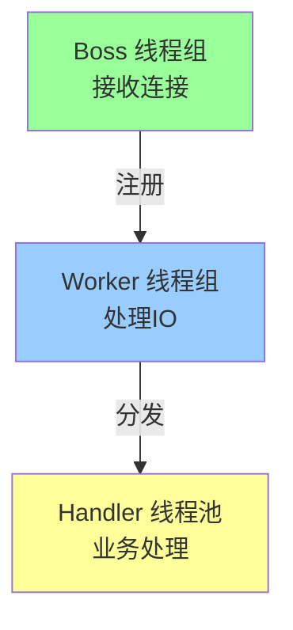

# Netty 线程模型深度解析

> **一句话摘要**：Netty 线程模型 = Boss/Worker/EventLoop/Reactor——理解线程模型是理解 RPC 性能的关键。
> **本文核心**：**Netty = 主从 Reactor + 多线程池**。

前置阅读：[IO 模型与 Netty](../入门层/从零开始认识RPC系列/5_IO模型与Netty-入门.md)。本篇深入 Netty 线程模型的源码级理解。

## 1. 背景：为什么需要深入线程模型

入门层讲了「IO 模型是什么」，本篇回答「Netty 内部线程怎么协作」：

- 为什么 Reactor 模式性能高？
- Boss 和 Worker 分别干什么？
- EventLoop 怎么处理事件？

理解线程模型是理解 RPC 性能瓶颈的关键。

## 2. 核心机制：主从 Reactor

### 2.1 三层线程模型



**三层职责**：
- **Boss 线程组**：接收客户端连接
- **Worker 线程组**：处理 IO 读写
- **Handler 线程池**：处理业务逻辑

### 2.2 EventLoop 工作原理

```mermaid
sequenceDiagram
    EventLoop[EventLoop 线程] -->|循环| Select[Selector.select()]
    Select -->|就绪事件| Process[处理事件]
    Process -->|注册| Register[注册到Selector]
    Process -->|执行| Task[执行任务队列]
    
    Note over EventLoop: 无限循环: select → 处理 → 调度
```

**EventLoop 核心**：
- 每个 EventLoop 绑定一个线程
- 一个线程处理多个 Channel 的事件
- 任务队列缓存待执行任务

### 2.3 Boss vs Worker

```mermaid
flowchart TD
    Client[客户端连接] -->|SYN| Boss[Boss 线程]
    Boss -->|accept| Worker[Worker 线程]
    Worker -->|注册| Channel[Channel 注册到Worker]
    
    Note over Boss,Worker: Boss 只负责accept，不处理IO
```

**Boss 和 Worker 的区别**：
| 维度 | Boss | Worker |
|---|---|---|
| 职责 | 接受连接 | 处理 IO |
| 数量 | 通常 1 个 | 多个 |
| 绑定 | Acceptor | Channel |
| 事件 | OP_ACCEPT | OP_READ/OP_WRITE |

## 3. 落地实践：Netty 配置

### 3.1 线程池配置

```java
// Netty 服务端配置
EventLoopGroup bossGroup = new NioEventLoopGroup(1);      // 1个Boss线程
EventLoopGroup workerGroup = new NioEventLoopGroup(Runtime.getRuntime().availableProcessors() * 2);

// 线程数选择
// Boss: 通常 1 个足够
// Worker: CPU 核心数 × 2
// Handler: 业务线程池（独立）
```

### 3.2 RPC 中的线程模型

```java
// RPC 服务端线程模型配置
public class RpcServer {
    public void start() {
        EventLoopGroup bossGroup = new NioEventLoopGroup(1);
        EventLoopGroup workerGroup = new NioEventLoopGroup(4);
        EventExecutorGroup handlerGroup = new DefaultEventExecutorGroup(16);
        
        // Boss: 接收连接
        // Worker: IO 读写
        // Handler: 业务处理（脱离 IO 线程）
    }
}
```

**关键决策**：业务逻辑不能跑在 IO 线程上——否则阻塞 IO 导致性能下降。

## 4. 落地实践：粘包拆包

### 4.1 粘包原因

TCP 是流式协议——多个请求可能合并成一个数据包：

```mermaid
flowchart TD
    Req1[请求1] --> TCP[TCP 发送]
    Req2[请求2] --> TCP
    Req3[请求3] --> TCP
    TCP -->|合并| Packet[数据包: [Req1+Req2+Req3]]
    Packet -->|接收| Server[服务端]
    Server -->|拆包| Req1_2[请求1 + 请求2]
    Server -->|拆包| Req3_2[请求3]
```

### 4.2 编解码器

```java
// 定长帧解码器
pipeline.addLast(new FixedLengthFrameDecoder(1024));

// 长度字段解码器
pipeline.addLast(new LengthFieldBasedFrameDecoder(
    1024 * 1024,  // 最大长度
    0,            // 长度字段偏移
    4,            // 长度字段长度
    0,            // 长度调整
    4             // 跳过字节数
));

// 自定义 RPC 编解码器
pipeline.addLast(new RpcDecoder(RpcRequest.class));
pipeline.addLast(new RpcEncoder(RpcResponse.class));
```

## 5. 生产视角：线程模型踩坑

- **踩坑 1**：业务逻辑跑在 IO 线程——阻塞导致性能下降
- **踩坑 2**：线程数配置不当——过多线程上下文切换
- **踩坑 3**：EventLoop 阻塞——一个阻塞影响所有 Channel
- **踩坑 4**：CPU 密集型任务和 IO 任务混用——互相影响

**生产最佳实践**：

1. 业务逻辑跑在独立线程池
2. Worker 线程数 = CPU × 2
3. CPU 密集型和 IO 密集型分开
4. EventLoop 绝不阻塞
5. 监控线程池状态

## 6. 典型场景

| 场景 | 线程模型 | 理由 |
|---|---|---|
| RPC 服务 | Boss/Worker 分离 | IO 不被业务阻塞 |
| 大并发 | 多 Worker | 充分利用 CPU |
| CPU 密集 | 独立线程池 | 不影响 IO |
| 低并发 | 单 EventLoop | 简化 |
| 高吞吐 | 零拷贝 + 线程池 | 最优性能 |

## 7. 与相邻概念的区别

- **Netty vs BIO**：Netty 是异步非阻塞，BIO 是同步阻塞
- **Netty vs Tomcat**：Netty 是通信框架，Tomcat 是 Web 容器
- **Reactor vs Proactor**：Reactor 同步，Proactor 异步
- **Boss/Worker vs 单线程**：多线程 vs 单线程处理

## 8. 你们可能会问

- **Worker 线程数怎么设？** CPU × 2，IO 密集可更多
- **EventLoop 阻塞会怎样？** 所有 Channel 阻塞
- **Netty 能处理多少并发？** 取决于线程数和配置
- **和业务线程池怎么配合？** IO 线程只处理编解码，业务逻辑提交到线程池

## 9. 一句话总结 + 5W 速记卡 + 自测三问

**一句话总结**：Netty = 主从 Reactor + 多线程池——Boss 接收，Worker IO，Handler 业务。

**5W 速记卡**：

| 维度 | 内容 |
|---|---|
| What | Boss/Worker/EventLoop |
| Why | 高并发 IO 处理 |
| When | RPC 服务端 |
| Where | Netty 服务端 |
| How | 主从 Reactor + 线程池 |

**自测三问**：

1. Boss 和 Worker 分别负责什么？
2. 业务逻辑应该跑在哪个线程？
3. EventLoop 阻塞会怎样？

---

**特性层完结**：Netty 线程模型深度解析已建立。

**🎯 核心带走**：

- **核心一句话**：Netty = Boss 接收 + Worker IO + Handler 业务——三层线程模型
- **链条复述**：连接 → Boss accept → Worker 注册 → EventLoop 处理 → 业务线程池
- **失效点与边界**：业务逻辑阻塞 IO 线程

💡 **实战提示**：业务逻辑绝不跑在 IO 线程上——这是 Netty 使用的第一原则。

**开放问题**：Netty 能替代 Tomcat 吗？答案是：能——Spring 5 的 WebFlux 就用 Netty，但传统 Spring MVC 仍依赖 Tomcat。

**决策（何时用）**：RPC/高并发用 Netty；传统 Web 用 Tomcat。
