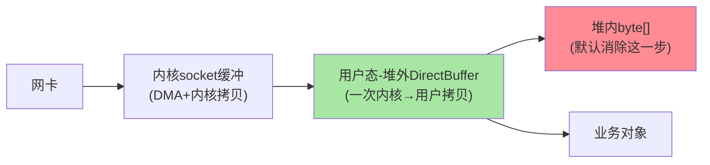
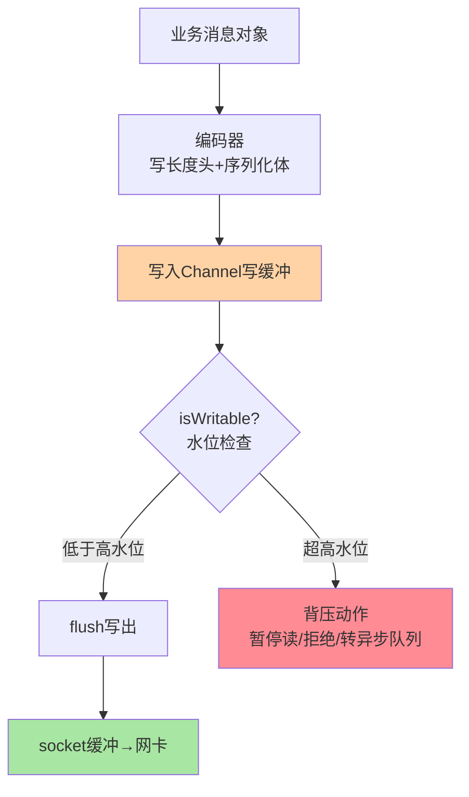
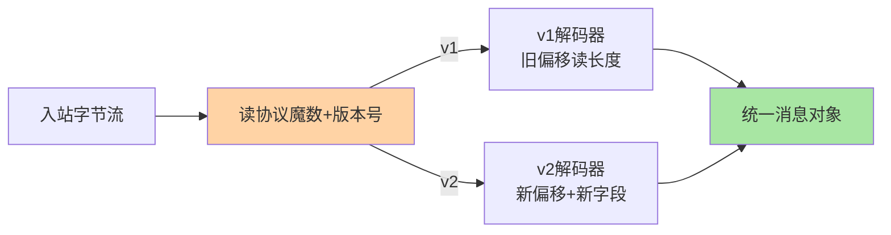

# 粘包拆包与零拷贝实现深读：字节流的秩序与搬运的成本

> **本文核心**：传输层优化的两大主题各有一个机制内核——**消息边界**：TCP 是无边界的字节流，「粘包拆包」不是异常而是本质，应用层协议必须自带定界机制（长度前缀是行业标准解，解码器在入站 pipeline 把字节流截成消息帧）；**数据搬运**：从网卡到业务对象默认要多次内核↔用户态拷贝，Netty 的堆外内存、CompositeByteBuf 组合缓冲、池化分配器把拷贝次数与分配成本逐级压掉。**机制链**：字节流入站 → 帧解码器按长度前缀截帧 → 完整消息（零多余拷贝的切片视图）→ 业务处理 → 编码器加长度头 → 池化缓冲写出。两大主题共同回答一个问题：**怎么让网络字节流以最小成本变成结构化消息**。

## 一句话摘要

粘包拆包三方案（定长/分隔符/长度前缀）里，长度前缀「一次读头知边界、无内容约束」碾压其余两者——RPC 协议几乎清一色它；Netty 的 `LengthFieldBasedFrameDecoder` 用五个参数（最大长度、长度字段偏移、长度字段字节数、长度调整、剥离字节）覆盖一切变体，参数推导是唯一要练的手艺。零拷贝不是「一次拷贝都没有」，是**消除可消除的那几次**：堆外 DirectBuffer 省堆内↔堆外来回、CompositeByteBuf 合并多段缓冲不做物理拼接、FileRegion 封装 sendfile 让文件直通网卡、池化分配器把高频分配的 GC 压力收走——**每一招消除一次特定类型的拷贝，组合起来就是「框架级吞吐护城河」**。

## 前置阅读

- 本系列篇 1《Netty 线程模型与 EventLoop 关键路径》（解码器在 pipeline 的位置）
- 入门层篇 4《通信协议与传输》（协议设计与长连接）

## 目标导向

本文是什么：消息定界与数据搬运的实现级深读。功能：配置与推导帧解码器参数、定位缓冲泄漏、设计协议编解码组合。收益：传输层异常的归因能力 + 吞吐优化的字节级手段。必看场景：自定义协议实现、大报文调优、DirectMemory 泄漏排查。

## 一、为什么 TCP 必然「粘包」：字节流的本质

TCP 承诺的是「字节流按序可靠到达」，**不承诺「你写几次我就给几次」**——发送端的 N 次写可能被合并成一次段（Nagle、缓冲策略），也可能一次大写被拆成多个段（MSS 上限）。接收端从 socket 读出的字节块与发送端的写边界完全无关。「粘包拆包」这个流传甚广的词其实有误导性——**字节流没有「包」可粘，是应用层把语义边界强加给了无边界流**。理解这一层，「解决粘包」的正确表述是「应用层协议自带定界机制」：定长、分隔符、长度前缀三种，分别用「固定位置」「哨兵字符」「自述长度」表达边界。

**业内惯例的第一课**：自定义二进制协议一律长度前缀——定长浪费空间、分隔符要求内容转义，只有长度前缀「读一次头部就确定载荷边界、对内容零假设」。Redis 的行协议用分隔符是文本协议的特例；HTTP/2 用帧长度字段与 RPC 同构。**协议设计评审的第一问：边界机制是什么**。

## 5W 速记卡

| 维度 | 一句话 |
|---|---|
| What | 字节流定界（长度前缀帧解码）与拷贝消除（堆外/组合/池化）的实现机制 |
| Why | TCP 无边界 + 多级内存拷贝是传输效率的两大原始约束 |
| When | 自定义协议实现、大报文调优、DirectMemory 泄漏排查 |
| Where | pipeline 入站解码器 / 出站编码器 + ByteBuf 分配体系 |
| How | LengthField 解码五参数截帧 + Composite/池化/sendfile 消拷贝 |

## 二、LengthFieldBasedFrameDecoder：五参数推导术

Netty 的长度前缀解码器用一个五参数构造覆盖了几乎所有协议变体，参数含义与推导逻辑：

```text
构造参数（按声明顺序）:
  maxFrameLength      帧最大长度(安全上限-防恶意长度声明)
  lengthFieldOffset   长度字段的偏移(前面有几字节其他头)
  lengthFieldLength   长度字段本身的字节数(1/2/4/8)
  lengthAdjustment    长度调整(长度字段值到帧尾的修正)
  initialBytesToStrip 解码后剥离的头字节(通常剥离到载荷前)

推导口诀: 长度字段指向哪里?
  指向载荷长度   → adjustment = 头长 - 长度字段偏移 - 长度字段字节数
  指向整帧长度   → adjustment = -长度字段偏移 - 长度字段字节数
```

**推导的核心问题只有一个：长度字段声明的值从哪个字节算起**。Dubbo 协议的长度字段声明的是「整帧长度」（含固定 16 字节头），所以 adjustment 为负修正；自研协议常声明「载荷长度」，adjustment 为正补齐头与长度字段自身。**业内事故高发点**：协议头中间插一个新字段后忘了同步调整偏移与 adjustment——解码器把长度读错位，报文「随机」截断。协议变更评审必须连带检查解码器参数——参数与协议定义是同一份契约的两半。

**maxFrameLength 不是可有可无的防御参数**：恶意或错乱的长度声明（比如把数据位当长度解析出 2GB）会让解码器尝试累积超长缓冲直到 OOM——上限之外还要配合「超限快速断连」（TooLongFrameException 后关闭连接），把异常流隔离掉。

## 三、零拷贝的账本：拷贝发生在哪、消的是哪次



完整账本：数据从网卡到业务对象，默认路径是「网卡 DMA 到内核缓冲 → 内核拷到用户态缓冲 → 用户态复制到 JVM 堆 → 解析成对象」。Netty 的消解清单按环节对号：**堆外 DirectBuffer** 让「用户态缓冲」直接就是 Netty 的操作对象，省掉堆内↔堆外来回（JDK NIO 的 ByteBuffer 已有此能力，Netty 封装得更顺手）；**CompositeByteBuf** 把「多段缓冲逻辑合并」做成零物理拷贝的视图（协议头+消息体两段缓冲合成一个逻辑 buf，传统做法要 System.arraycopy 拼接）；**slice/duplicate** 让消息转发场景（网关把请求原样转后端）只建视图不复制数据；**FileRegion→sendfile** 把文件传输压缩为「内核内直通」（文件页缓存直接到网卡，零用户态参与）；**池化分配器**（PooledByteBufAllocator）用 jemalloc 式的分级内存池吸收高频分配释放，GC 压力与分配延迟一起消。

**清醒版「零拷贝」**：网卡→内核、内核→用户态这两次拷贝是特权指令的边界，Java 应用层消不掉（内核绕过技术如 io_uring/DPDK 是另一个量级的工程）；**应用层零拷贝消的是「用户态内部的搬运」**——这个定位摆正了，才能识别「宣传材料里的零拷贝」哪些是真优化哪些是话术。

**量级演进视角**：千级 QPS——拷贝次数的差别不可感知，简洁优先；万级 QPS——堆内↔堆外来回与 GC 压力进入视野，堆外+池化是标配；十万级 QPS 或网关型转发——每一字节的搬运都在容量账上，Composite/slice 的零拷贝视图直接决定转发吞吐（网关每请求少拷两次，整机吞吐差出 20-30% 的方向）；大文件传输场景 sendfile 是数量级差异——**搬运优化的收益随吞吐量级非线性放大**。

## 四、关键路径：一次带长度头的收发全程

```text
入站关键帧:
  unsafe.read()
    → PooledByteBufAllocator.ioBuffer() 借池化缓冲
    → socket读入 DirectBuffer
    → fireChannelRead(byteBuf)
    → LengthFieldBasedFrameDecoder:
        累积缓冲 → 读长度字段(偏移+字节数) → 校验maxFrameLength
        → 截帧(切片视图-不复制载荷) → 剥离头字节 → 传下游
    → 业务Decoder: 切片视图反序列化为消息对象
    → buf.release() (引用计数归还池)
出站关键帧:
  业务 write(msg)
    → 回绑定EventLoop(见本系列篇1) → 编码器: 预估长度+写头
    → CompositeByteBuf(头+体) 或 单缓冲顺序写
    → unsafe写出 → 水位检查(isWritable) → flush
```

**引用计数的责任链**是关键路径上最容易出事故的一环：池化缓冲的生命周期由引用计数管理（retain/release），「谁消费谁 release」——解码器切出的切片与原 buf 共享底层内存，业务侧用完必须 release；**泄漏（拿了不还）表现为 DirectMemory 指标爬升与分配变慢，提前释放（还了再用）表现为 ille*galReferenceCountException**——两类事故的根因都是责任归属不清。

## 五、与「消息队列批量搬运」的区别：两个层面的零拷贝

| 维度 | Netty 应用层零拷贝 | MQ 页缓存/sendfile |
|---|---|---|
| 消除对象 | 用户态内部搬运 | 内核态文件→网卡 |
| 机制 | 视图/组合/池化 | sendfile+mmap 页缓存 |
| 典型场景 | RPC 报文/网关转发 | 日志分段文件消费（Kafka 类） |
| 消费方 | 应用进程 | 消费者经内核直读 |

Kafka 靠 sendfile+页缓存拿到「磁盘速度的网络吞吐」（互指 MQ 系列），与 Netty 在用户态省拷贝是两个层面——**搬运优化的通用思维是「让数据少换一次地址空间、少过一次手」**，具体招式按数据所在层选。

### 出站编码与水位背压



写路径的水位检查是入站定界之外的另一半秩序：读侧防「无边界流」，写侧防「无边界积压」——对端消费慢时写缓冲无限堆积会把进程内存拖爆，水位与背压动作（isWritable 返回 false 后暂停读、或把请求转入应用层队列）是慢消费者场景的保命机制。

### 协议版本共存的解码分派



版本共存的标准形态：魔数分派+按版本挂不同解码器、下游统一消息对象——协议演进的「双向兼容」在传输层落成这样一条分派链，事故一里「新旧偏移互相读错」的根因就是缺了这条链。

## 六、典型场景与误区

**典型场景**：自定义 RPC 协议（长度前缀+编解码器成对实现）；网关转发（slice 视图透传、请求响应零复制转发）；文件下发服务（FileRegion 直通）；大报文接口（分帧+流式处理，避免整包入堆）；灰度期新旧协议并存（解码器链按协议头魔数分派）。

**常见误区**：① **长度字段用变长编码**——长度本身用 varint 省下的字节，换来「读长度要先读多字节再判断」的复杂度，长度字段就该定长（4 字节是主流）；② **累积缓冲无上限**——不设 maxFrameLength 的解码器等于把 OOM 阀门交给对端；③ **忘了 ByteBuf release**——尤其 try 分支外的提前 return 路径，泄漏检测（ResourceLeakDetector 调到 PARANOID 压测）是发布前必做项；④ **DirectMemory 只设不监控**——`-XX:MaxDirectMemorySize` 配了不代表安全，泄漏时要靠指标爬升定位（比特位：堆外内存监控+池化分配器统计）；⑤ **协议头演进不评审解码参数**——头加字段、长度字段位移，都是解码器五参数的变更事件，协议定义与解码器配置必须同评审同上线。

## 七、事故与实践叙事

**事故一：协议头加字段引发的随机截断**。某团队在自研协议头尾追加了一个 8 字节的 trace 标记，编码侧正常上线；解码侧（另一服务，发版节奏不同）还按旧偏移读长度——trace 标记的前 4 字节被当成长度字段，解析出一个巨大的「长度」，累积缓冲触发 maxFrameLength 断连。灰度期两服务互调批量失败，表现为「随机断连」——因为 trace 标记值不固定，「长度」值每次都不同，有的大到超限断连、有的恰好合法但截错。修复：协议头版本号+按版本分派的解码器链。**教训**：协议头是双方契约，任何一侧单方面变更都是故障——协议演进必须「版本号先行、双方评审、灰度验证」。

**事故二：DirectMemory 泄漏的慢刀子**。某转发服务运行一周后 DirectMemory 用量爬到上限，新分配阻塞，QPS 缓降、延迟抬升，重启即恢复——典型的泄漏指纹。排查：ResourceLeakDetector 调 PARANOID 后压测复现，日志定位到一个异常分支里 `readSlice()` 之后直接 return（跳过了 release）。修复+预防：异常路径统一 try-finally 释放 + 池化统计指标进监控（活跃缓冲数、分配速率）。**追问链**：为什么泄漏表现为「慢降」而不是「突死」？——池化内存的分配在压力下退化为「等回收」，吞吐随可用内存收缩而降，直到分配阻塞——泄漏类故障的时间形态是渐进的，与突发的流量故障形态不同，排障时要看指标的历史曲线而不是瞬时值。

**实践叙事：网关零拷贝转发的收益实测**。某 API 网关把「读全量→合并→写出」改为「slice 视图透传+Composite 组装」，大报文（百 KB 级）转发路径的用户态拷贝从 4 次降到 1 次，单核转发吞吐提升约 35%（公开量级方向，具体随报文大小浮动），GC 频次同步下降。**优化的决策依据来自拷贝账本**：先数清楚数据从进到出被复制几次，再逐次问「这次能不能变成视图」。

## 八、设计思想：视图优于复制，协议即契约

本文两大主题背后是同一个思想的两面。消息定界的一面：**「自描述边界」让不可靠的字节流获得结构**——长度前缀本质是「数据自己声明自己的范围」，这个自描述性（与 Protobuf 的长度前缀嵌套、HTTP/2 的帧机制同构）是所有可靠协议设计的基石。数据搬运的一面：**「视图优于复制」是内存管理的通用法则**——能引用就不拷贝、能切片就不合并、能复用就不新分配；这条法则与操作系统的写时复制、数据库的 MVCC 版本引用共享同一谱系。两条法则合起来回答了传输层的元问题：**效率来自「少做决定不了的事、少搬不需要搬的数据」**——定界把「不确定边界」变确定，零拷贝把「确定多余的搬运」消掉。

## 九、追问链

**质疑者第一层**：既然长度前缀这么好，为什么 HTTP/1.1 用 Content-Length 之外还有 chunked 分块？——因为流式生成的响应（边生成边发）写不出总长度；chunked 用「分块各自的长度+终止块」表达「现在还不知道总长」——**长度前缀表达的是已知总长的边界，流式场景需要更弱的自描述（逐块定界）**。gRPC 的 length-prefixed message 也沿用逐消息长度头——长连接多路复用下逐消息定界比总长更合适。

**质疑者第二层**：零拷贝消了用户态搬运，那解析成业务对象那一步（反序列化）的拷贝能消吗？——部分能：零拷贝反序列化的思路（FlatBuffers/Cap'n Proto 类）是「报文布局即内存布局」，解析变成「按偏移读取视图」，不构造新对象；代价是字段访问经由偏移间接、对象生命周期与缓冲绑定。**通用 RPC 仍用「解析构造」路线（易用性优先），极限延迟场景才有零拷贝解析的一席**——易用与极致之间，格式设计者替你做了选择。

**质疑者第三层**：池化分配器在低流量下还有意义吗？——低流量下池化的收益消失（分配不频繁），管理复杂度仍在；Netty 的默认池化是「高吞吐默认值」——**性能默认值按主流场景（高吞吐服务）优化**，嵌入式/低频场景可以切非池化（Unpooled）简化心智。默认值的选择永远反映框架对主流负载的判断，读默认值就是读设计立场。

## 十、你们可能会问

**Q1：怎么快速推导一段新协议的解码器五参数？**
四步：画出协议头字节布局 → 标出长度字段的偏移与宽度 → 回答「长度值从哪算到哪」→ 按口诀算 adjustment、按需求定 strip。推导完用真实报文 hex 验证一次再上环境——五参数的正确性不值得靠线上验证。

**Q2：粘包问题在线上怎么确认？**
指纹：报文解析异常且「每次截断位置不同」、日志里消息长度与预期不符、多请求内容混进单次解析。确认手段：在解码器前打 hexdump 采样，肉眼对照协议头——「边界机制错位」一眼可见。

**Q3：DirectMemory 泄漏和堆内泄漏怎么区分排查？**
堆内看 GC 与堆直方图（MAT 分析支配树）；堆外看 DirectMemory 指标与 ResourceLeakDetector 日志，定位靠「泄漏报告里的最近访问栈」。两类泄漏的指标指纹不同：堆内泄漏伴随 GC 频率上升，堆外泄漏堆指标正常而 DirectMemory 爬升。

**Q4：大报文（10MB 级）该整包处理还是分帧流式？**
内存水位决定：整包处理简单但峰值内存=并发数×报文大小，百并发就上 GB；流式分帧（按协议分块或按业务字段流式读）内存恒定、复杂度高一档。万级 QPS 或大并发场景流式是必选项，内部低并发工具整包无妨。

## 💡 实战提示

- 💡 协议头带版本号/魔数，解码器按版本分派——协议演进的第一契约，先于任何字段
- 💡 maxFrameLength+超限断连是 OOM 阀门标准组合——把恶意长度声明的杀伤半径锁死
- 💡 压测前把 ResourceLeakDetector 调 PARANOID——泄漏在压测期暴露的成本远低于线上
- 💡 决策口径：长度字段一律定长 4 字节；读写两向的边界都要管（入站定界+出站水位）；大报文按内存水位决定整包或流式
- 💡 选型推荐：自研 RPC 协议首选「魔数+版本+定长长度字段+长度前缀载荷」骨架，变体越少越好

## 十一、自测三问

1. 长度前缀为什么碾压定长与分隔符？（答：读一次头部即知边界、对内容零假设无转义、变长载荷无空间浪费）
2. `LengthFieldBasedFrameDecoder` 的 adjustment 什么时候为负？（答：长度字段声明的是整帧长度时——要减去长度字段之前的头字节）
3. Netty 消的是哪些拷贝、消不掉哪些？（答：消用户态内部搬运（堆外/组合/切片/池化）；网卡→内核→用户态的两次过特权边界拷贝消不掉，那是内核旁路技术的领域）

## 十二、开放问题

- 零拷贝解析（报文即内存布局）与通用易用性的格式权衡——FlatBuffers 类方案的工程化普及仍受制于调试与演进成本。
- 内核旁路（io_uring/DPDK）在通用 RPC 框架的下沉——用户态零拷贝之后的下一层搬运消除，边界在运维复杂度。

## 📎 核心带走

- **核心一句话**：传输层两大机制 = 长度前缀自描述定界（协议的秩序）+ 用户态搬运消除（内存的经济学）——前者让字节流可解析，后者让解析便宜
- **机制链**：字节流 → 帧解码器（五参数推导）→ 切片视图传下游 → 业务处理 → release 归池 → 编码器加长度头 → 水位检查写出；零拷贝清单=堆外+组合+切片+池化+sendfile
- **失效点/边界**：协议头变更必须连评审解码参数；maxFrameLength 是 OOM 阀门；引用计数责任链断一环即泄漏；特权边界的两次拷贝消不掉

## 📌 数据与事实声明

- 写于 2026-09-15，机制以 Netty 4.1 官方文档与源码为基准（公开口径）；吞吐提升为公开基准量级方向
- 免责：以 Netty 官方 API 文档为准

## 📚 参考资料

| 类型 | 标题 | 来源 |
|---|---|---|
| 官方文档 | Netty LengthFieldBasedFrameDecoder / ByteBuf | netty.io |
| 实践书 | 《Netty 实战》Norman Maurer | 公开出版 |
| 关联文章 | 本系列篇 1（EventLoop）、本序列化系列篇 1（Protobuf 长度前缀嵌套） | 本仓库 |
