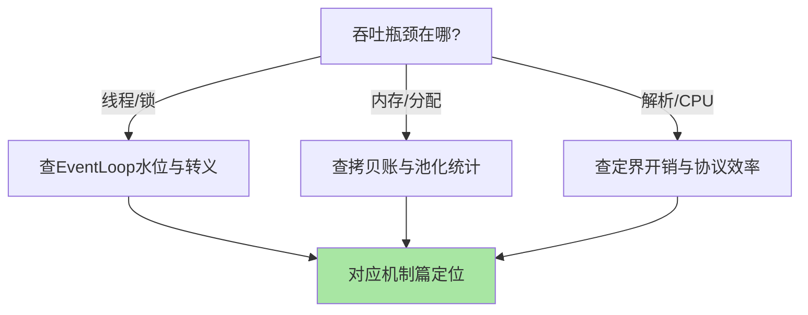
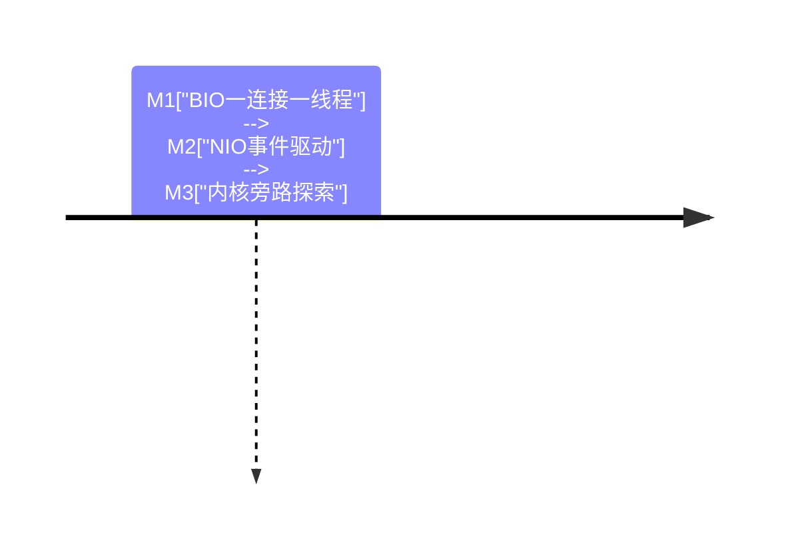

# 深入理解传输与IO系列：串行化与搬运成本

> **本文核心**：传输层的两大主题各有一个机制内核——线程模型的「串行化换无锁化」（Channel-EventLoop 终身绑定+单队列消费）与数据搬运的「视图优于复制」（堆外/组合/切片/池化四招消用户态拷贝），外加把两者接起来的消息定界（长度前缀帧解码）。本系列两篇深读，把 EventLoop 运行骨架、解码器五参数推导、零拷贝账本拆到可操作。

## 一句话摘要

Netty 的性能不是魔法，是三笔账：线程账（串行化省锁）、内存账（零拷贝省搬运）、协议账（长度前缀省解析）——**读懂账本，调优才有靶**。

## 篇目

1. [Netty 线程模型与 EventLoop 关键路径](1_Netty线程模型与EventLoop关键路径-深度.md)——运行骨架、线程转义、水位监控
2. [粘包拆包与零拷贝实现](2_粘包拆包与零拷贝实现-深度.md)——定界三方案、解码器推导术、拷贝账本

## 传输机制的演进账

传输层的跨周期稳定性极高：EventLoop 串行化自 Netty 诞生未变，长度前缀定界自 TCP 应用协议诞生未变，零拷贝清单只随内核能力扩条目（io_uring 是最近一次）——**读传输层的投入回报周期以五年计**。代价是纪律依赖：串行化的性能红利以「Handler 不阻塞」为前提，这个前提的守护成本（监控+演练）要计入采用决策。

## 📌 数据与事实声明

- 写于 2026-09-15，以 Netty 4.1 官方文档为基准（公开口径）

## 📚 参考资料

| 类型 | 标题 | 来源 |
|---|---|---|
| 官方文档 | Netty User Guide | netty.io |
