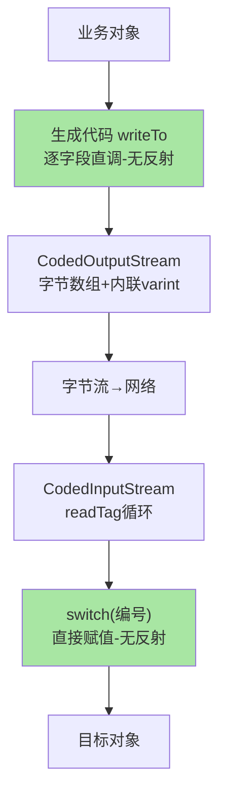
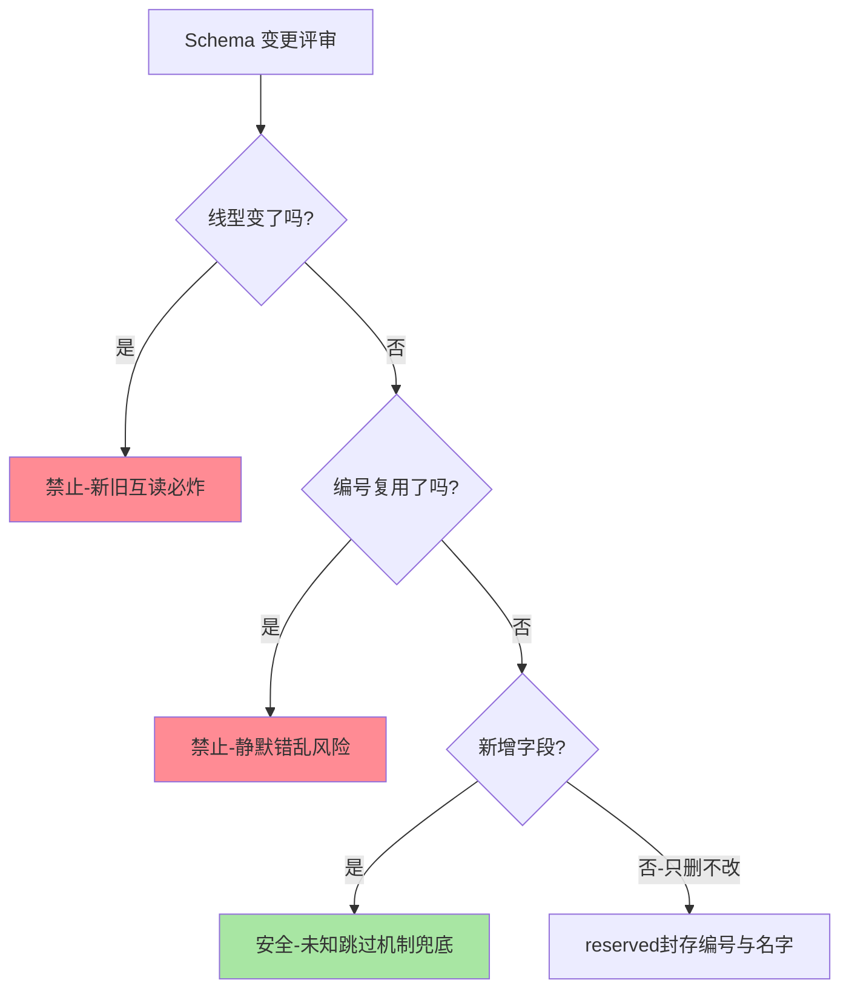

# Protobuf 编码原理与 wire 格式深读：字段编号的基因工程

> **本文核心**：Protobuf 的性能与兼容性都来自 wire format 的一个根本决定——**报文里只存「字段编号+类型+值」，不存字段名**。本文从 varint 变长编码、tag 结构（编号左移三位拼线型）、zigzag 符号数处理、长度前缀嵌套四个机制拆解编码格式，再从「编号即契约」推出字段管理纪律（编号不复用、reserved 防坑、packed 兼容），最后用编解码关键路径（CodedStream 与生成代码）解释性能量级的来源。**机制链**：对象 → 生成代码的 write 逐字段序列化 → varint/tag/长度前缀编码 → 字节流 → 读侧按 tag 分派解析 → 对象还原；任何一环的编号错位都会把「兼容」变成「静默错乱」。

## 一句话摘要

Protobuf 报文是一串「字段编号 + 线型 + 值」的三元组流：tag 字节高 5 位是字段编号、低 3 位是线型（varint/64 位定长/长度前缀/32 位定长），数值走 varint 变长编码（每字节 7 个有效位，最高位是续传标志），负数走 zigzag 映射（避免补码前导全 1 吃掉四个字节），字符串与嵌套消息走长度前缀。**读懂 wire 格式就能徒手解释三件事**：为什么字段编号 1-15 最省字节（tag 单字节）、为什么 int 写了 0 默认不占空间（proto3 的默认值省略）、为什么新旧版本能互通（未知编号按长度跳过）。

## 前置阅读

- 入门层篇 3《序列化协议全景》（四维权衡与选型）
- 入门层篇 2《一个 RPC 调用的一生》（序列化在链路中的位置）

## 目标导向

本文是什么：Protobuf wire format 的机制级深读。功能：徒手解码报文、预判 schema 变更的兼容性后果、定位序列化性能问题。收益：接口演进决策的机制依据 + 编解码异常的归因能力。必看场景：IDL 演进规范制定、报文体积优化、跨语言解析异常排查。

## 一、为什么值得深读一个编码格式

业内大多数团队对 Protobuf 的认知停留在「写 proto 文件、生成代码、性能好」三句话上——直到事故发生：字段编号被复用导致新旧服务互相解析出错误数据、一个 int32 改 int64 引发线上解析异常、packed 属性变更让灰度期报文不可读。这类事故的共同根源是**把 wire format 当黑盒**：不知道编号的机制含义，就预判不了变更的后果。

Protobuf 的设计目标是「**一个格式同时服务三个甲方**」——传输效率（报文小）、解析速度（解码快）、演进安全（新老互通）。这三个目标在编码格式层面互相牵制：报文要小就得压缩字段名（引入编号表）；解析要快就得有类型自描述（引入线型位）；演进要安全就得容忍未知字段（引入长度自描述）。wire format 的每个设计点都是这三个目标的平衡产物——读完本文你会发现，**它几乎每个字节都有存在理由**。

## 5W 速记卡

| 维度 | 一句话 |
|---|---|
| What | 「字段编号+线型+值」三元组流的二进制编码格式 |
| Why | 编号即契约：性能、体积、兼容三大特性的机制根源 |
| When | schema 变更评审、报文排障、体积与性能优化 |
| Where | RPC 序列化层、存储（部分系统）、配置传输 |
| How | varint 变长 + tag 分派 + 长度前缀嵌套 + 未知字段跳过 |

## 二、varint：变长整数的空间经济学

整数编码是 wire format 的地基。定长 int32 无论值是 1 还是 21 亿都占 4 字节——但真实业务数据里**小数值的出现频率远高于大数值**（状态位、计数、ID 前缀），按出现频率分配空间就是 varint 的全部思想。

**编码规则**：把整数的二进制按 7 位一组从低位到高位切分，低位组在前；每组放入一个字节的低 7 位，最高位（MSB）作为「后续还有数据」的标志——1 表示继续读下一字节，0 表示结束。值 300 的编码过程：二进制 `100101100` 切成 `10` 与 `0101100` 两组，低组在前得两个字节 `10101100 00000010`（即 0xAC 0x02）。解码时读到 MSB=0 的字节即止，拼装 7 位组还原数值。

**空间收益**：0-127 占 1 字节、128-16383 占 2 字节、再往上每 7 位加一字节——int32 最坏 5 字节（比定长还多 1 字节，这是小值收益的对价）、int64 最坏 10 字节。**分布决定盈亏**：如果业务字段值集中在小值区间，平均体积远小于定长；如果业务值是均匀分布的大数值（比如完整的 64 位雪花 ID），varint 反而比定长多占字节——雪花 ID 类字段的体积优化要用固定 64 值评估，别被「varint 一定省」的直觉误导。

### zigzag：负数的前导灾难与符号映射

varint 对负数是灾难：int32 的 -1 在补码表示下是 32 个 1，按 7 位切分要 5 个字节——「最常用的小负数」吃掉最大空间。zigzag 的解法是**符号重映射**：0→0、-1→1、1→2、-2→3、2→4……公式为 `(n << 1) ^ (n >> 31)`（32 位），把符号位从最高位移到最低位，绝对值小的负数映射为绝对值小的正数。proto 里的 `sint32/sint64` 类型走 zigzag+varint，而 `int32/int64` 的负数直走 varint 补码——**这是两个类型在 wire 层面的真实差异**，IDL 里负数频繁的字段选 sint 是实打实的体积优化。业内常见的疏忽是把两者当「宽度差异」理解，实际它们是编码策略差异。

## 三、tag 与线型：字段的自描述结构

每个字段编码前先写一个 tag：**字段编号左移 3 位，低 3 位拼上线型（wire type）**。线型只有四种在用——0（varint）、1（64 位定长）、2（长度前缀）、5（32 位定长）——线型的存在让解析器不依赖 schema 就知道「这个值怎么读多长」。

**编号 1-15 的特权**：字段编号 1-15 编码后 tag 的编号部分只占 4 位，加上 3 位线型恰好 1 字节；编号 16-2047 的 tag 要 2 字节。这就是「高频小字段放 1-15 号」这条业内惯例的机制来源——**不是风格建议，是每条消息每个字段 1 字节的固定税**。对于 QPS 十万级、单报文几十个字段的场景，高频字段错放编号的体积税可以到传输量的几个百分点。

**长度前缀（线型 2）**：string、bytes、嵌套消息、packed 数组共用这一线型——tag 之后紧跟值的字节长度（varint 编码），然后是定长的载荷。**嵌套消息因此天然自描述**：解析器遇到未知编号的嵌套字段，读长度、跳过长度字节，就完成了对未知结构的容错——这就是「向前兼容」的机制本体，不需要 schema 参与。map 类型也是语法糖：底层是「key 字段 1 + value 字段 2」的嵌套消息 repeated——理解这一点，就能解释为什么 map 的 key 不能是 repeated/浮点（entry 消息的字段类型约束）。

### 徒手解码一段报文

对应 schema `message Sample { int32 a = 1; string b = 2; }` 值 `{a:150, b:"test"}`。这个 9 字节的报文用 JSON 表达是 `{"a":150,"b":"test"}` 20 字节——**体积差 2 倍多的来源就在编码格式本身**：无字段名、无分隔符、无引号。把这段解码逻辑亲手推一遍，wire format 就从黑盒变成了白盒——这也是本文最值得做的一次练习。

## 四、编解码关键路径：性能从哪里来

以 Java 生成代码为参照（不同语言的实现结构一致），关键路径分两层：

**写路径**：业务代码调用生成类的 `writeTo(output)`——生成代码为每个字段直接调用 `output.writeInt32(FIELD_NUMBER, value)` 这类具体方法，**没有字段遍历、没有反射查找**；CodedOutputStream 内部维护直接操作字节数组的游标，varint 编码是内联的位运算循环。热路径上没有一次哈希查找与一次虚方法分派之外的开销。

**读路径**：解析循环 `while ((tag = input.readTag()) != 0)` 按 tag 的编号部分 switch 分派到对应字段的读取分支——同样是生成代码的直接赋值，无反射。**两个可选档位**：`Lite runtime`（裁掉 descriptor 反射能力，体积与速度更优）与标准运行时（保留 schema 内省，便于通用工具处理）。业内生产实践的默认选择是标准运行时起步、对延迟极敏感的个别服务切 lite——切换前先确认没有依赖 descriptor 的通用序列化框架（某些 RPC 框架的通用 codec 依赖内省）。

**与 JSON 解析的量级对比**：JSON 要先 tokenize（逐字符词法分析）、建语法树、再反射构造对象——三段式；Protobuf 读侧是「读 tag 查分支、直接内存赋值」——一段式。这就是入门层篇 3 说的「量级差」的微观机制。业内基准的普遍量级结论是编解码速度差 5-10 倍、体积差 3-10 倍（按数据结构形态浮动）——具体数字按自己业务数据实测，量级方向稳定。**十万 QPS 服务的序列化 CPU 占比**用火焰图实测通常在个位数百分比到 10% 之间——这个占比就是「要不要为 Protobuf 投入」的量化依据。

## 五、兼容性的机制与纪律：编号即契约

**向后兼容（新代码读旧数据）**：新 schema 里新增字段的编号在旧数据里不存在——生成代码读到流结尾自然跳过，字段保持默认值。**向前兼容（旧代码读新数据）**：旧 schema 不认识新字段编号——读 tag、按线型算长度、跳过载荷，继续解析后续字段。两个方向都不需要任何运行时协商，全靠格式自描述。

**然后是纪律的地雷区**：

- **编号绝不可复用**。字段废弃后若编号被新字段复用，持旧数据的一方会把新字段的值按旧字段的类型解析——**静默错乱**（类型碰巧相容时）或解析异常（类型冲突时）。前者比后者危险十倍：金额字段错位可能直接资损。正确动作是废弃字段标 `reserved`，编号与字段名同时封存，protoc 会对复用直接报编译错。
- **int32/int64/bool 在 wire 层是同一线型**，互相变更天然兼容；而 string 与 bytes 同为长度前缀也兼容；**唯一要警惕的是线型跨界变更**（varint 字段改成 string）——新旧互读必然异常。变更评审的第一问就是「线型变了吗」。
- **packed 属性的双向兼容**：repeated 数值字段默认 packed（连续存储省 tag），解析器同时接受 packed 与展开两种形态——所以 packed 开关不是兼容性风险，但会产生两种合法报文形态，跨实现对接时要验证双方解析器都处理两种形态。
- **proto3 的默认值省略**：标量字段值为默认值（0/空串/false）时不编码——报文更小，代价是「字段缺失」与「字段值为默认」不可区分。需要区分「没传」与「传了 0」的语义（例如更新接口的部分语义），用 `optional` 显式声明 presence 或用包装类型——这是接口语义设计问题，不是编码问题，但机制根源在省略规则。

**业内惯例的工程化**：成熟团队把兼容性检查做成流水线卡点——buf breaking 之类工具对 proto 变更做静态兼容性分析（编号复用/线型变更/required 引入），不合规的 IDL 提交直接拦在 CI；IDL 变更评审与代码评审同级。**把「编号纪律」从口头约定升级为机器卡点**，是 Protobuf 治理成熟度的分水岭。

## 六、与 JSON 的机制对照：两套世界的分界

| 维度 | Protobuf wire | JSON |
|---|---|---|
| 字段标识 | 编号（tag 内嵌） | 字段名字符串 |
| 类型信息 | 线型自描述+schema 强类型 | 值猜测（文本推断） |
| 未知字段 | 按长度跳过 | 解析器自行决定（多数保留对象树） |
| 数值 | varint/zigzag 二进制 | 文本十进制（长整型精度丢失坑） |
| 嵌套 | 长度前缀定界 | 括号配对 |

对照表里最值得展开的是**数值精度**：JSON 的长整型（超过 2^53）在 JavaScript 端被 Number 静默截断——雪花 ID 转 JSON 给前端就是经典事故；Protobuf 的 int64 是二进制精确的，但前端要拿到字符串形式仍需 proto3 的 JSON 映射规则（int64 序列化为字符串）——**跨端边界上的数值类型从来不是小事**，两种格式各有各的坑，共同点是都要在接口契约层显式声明。

## 七、典型场景与误区

**典型场景**：内部 RPC 全链路 Protobuf（体积与 CPU 双收益）；MQ 消息体 Avro/Protobuf + Schema Registry（互指 MQ 系列）；存储引擎的部分场景（行格式内嵌 proto，借它的 schema 演进能力）；对外网关层的 protobuf→JSON 转换（透传给前端，注意 int64 字符串化与默认值省略导致的字段消失）。

**常见误区**：① **「字段编号随便写反正能通」**——1-15 的字节税与编号复用的静默错乱前面都拆过；② **「proto3 required 没了所以字段都可选」**——省略规则让「缺字段」语义膨胀，更新类接口的部分更新语义要显式 presence 设计；③ **「性能好所以不用压测序列化」**——大对象深嵌套（十几层消息套消息）的编码成本照样显著，深度与体积一起治理；④ **「 reserved 麻烦先不标」**——编号封存是防复用的唯一机制屏障，省这一行就是给未来埋雷；⑤ **「只测正常路径」**——解析异常的报文（截断/伪造 tag）要有防御测试，恶意报文的资源消耗（超长长度前缀声明）要在框架层设防。

## 八、事故与实践叙事

**事故一：编号复用的静默错乱**。某交易团队的订单接口早期有个废弃字段 `coupon_id = 7`（string 类型），废弃时没标 reserved；半年后新需求复用 7 号放了 `coupon_version`（int32）。灰度期新旧服务并存——旧服务读新数据，把 int32 的值按 string 线型（长度前缀）解析，多数时候恰好读出乱码字符串（业务校验拦住），但某类特定值让长度读出越界，解析直接抛异常，订单创建接口错误率抬升 2%。**排查了三天才发现是编号复用**——解析异常的报文肉眼看着「字段都对」。修复后团队把 buf breaking 检查挂进 CI，IDL 变更评审强制留档。教训：**线型不兼容的编号复用是「解析异常」，还算是「好」的失败模式；类型相容的复用是「静默错乱」，那才是资损通道**。

**事故二：int64 跨端精度截断**。某内容平台的视频 ID 是 64 位雪花数，早期对外 JSON 网关直接透传数值——前端 JavaScript 环境里超过 2^53 的 ID 被截断，用户举报「收藏的视频打开是别人的」。排查链路从缓存查到网关才发现是跨端数值表示问题。修复：对外契约层把 int64 统一字符串化（proto3 JSON 映射本就如此），并加契约测试卡住「数值直传」。教训：**网关层的类型映射契约与内部 IDL 同等重要，格式转换层是事故高发的接缝**。

**实践叙事：报文体积优化的量化路径**。某推荐服务单次响应报文 800KB（千级字段的大对象树），带宽与序列化 CPU 双高。优化三板斧按收益排序：① 高频字段迁到 1-15 号（tag 字节税，实测省 3%）；② repeated 数值字段确认 packed（省 15%——原来有字段漏开）；③ 大而全的响应对象拆按需字段（业务侧裁剪，省 40%）。序列化 CPU 占比从 12% 降到 5%。**机制知识的价值在于把「优化方向」从玄学变成可计算的字节账**。

## 九、设计思想：schema-first 的架构含义

Protobuf 的「先 IDL 后代码」不只是工程习惯——它把**接口契约从代码里剥离成了独立资产**：契约可以被不同语言消费（代码生成）、被工具静态分析（兼容性检查）、被治理平台索引（接口目录）。对比 code-first（接口定义埋在实现语言里），schema-first 的本质是**给「跨团队协作的约定」找到了一个中立的、机器可校验的载体**。代价是多一道编译工序与学习成本——这笔账在单团队时不划算，在跨团队、跨语言、接口数量上百的组织里稳赚。这也是为什么云原生时代的接口标准（gRPC/HTTP2 生态、OpenAPI 之外的治理标准）纷纷收敛到 schema-first——**契约先行的本质是把协作成本从运行期移到编译期**。

## 十、追问链

**质疑者第一层**：既然编号有复用风险，为什么 Protobuf 不设计成「字段名哈希」自动分配编号、彻底消灭人为失误？——因为自动分配在 schema 演进时不可控：字段改名（哪怕只是拼写修正）都会导致编号漂移，**显式编号把「改名安全」与「编号稳定」解耦**；显式性换来的是人为失误面——用机器卡点（buf breaking）补这个面，比改格式设计更合理。这是「显式优于隐式」原则在数据格式上的体现。

**质疑者第二层**：那为什么不用「字段名直接进报文」（保留可读性）+ 压缩字典（保留体积）？——HTTP/2 的 HPACK 头压缩正是这个思路，但它需要双方维护压缩状态（有状态协议），而 Protobuf 报文要**无状态可解析**（单报文自描述，任何一帧丢失不影响其他帧解析）——无状态性是 RPC 报文在不可靠传输上的刚性需求。有状态压缩在流式长连接里可行（gRPC 头压缩），在消息体上仍是净负担。

**质疑者第三层**：varint 的逐字节位运算在 CPU 缓存友好的今天还划算吗？——现代实现（varint 处理已被 SIMD 化的变体如 varint-GB、Stream VByte）证明变长编码仍有吞吐优势；但方向值得记录：**列式存储场景出现了「分桶定长」等对 SIMD 更友好的编码**——编码格式的演进跟着 CPU 微架构走，varint 不是终点。通用 RPC 报文里它仍是性价比之选，极端吞吐场景（存储引擎、列式分析）另有专门解。

## 十一、你们可能会问

**Q1：proto2 和 proto3 怎么选？**
新项目直接 proto3（生态与工具链的重心）；存量 proto2 不必强迁——两者 wire 层互通（线型体系相同），差异在语义层（required、字段 presence、枚举首值约束）。迁移的真实成本在语义评审不在格式转换。

**Q2：生成代码应该进版本库吗？**
两派并存：进库（消费方零工具链依赖、变更可评审 diff）vs 不进库（防手改、构建期生成保证一致）。成熟实践是不进库+构建期生成+生成产物的兼容性由 buf 卡点保证；小团队起步进库更务实——先跑起来，规范跟着规模演进。

**Q3：怎么排查「解析出错误数据但没报错」？**
按编号复用的事故剧本排查：取出双方 schema 版本、逐字段比对编号与线型；用 wire 解码工具（protoc --decode_raw）徒手看报文结构——`decode_raw` 不需要 schema 就能把报文拆成编号+原始值，是这类排障的第一工具。

**Q4：性能敏感场景要不要手写序列化替代生成代码？**
先测再说——生成代码的热路径已经接近手写（直调+内联），手写的收益通常在特定形态（超大定长结构体）才显现；收益方向优先考虑 lite 运行时、字段精简、嵌套深度削减这些「结构优化」，它们的收益比换序列化方式高一档。

## 💡 实战提示

- 💡 高频字段固定放 1-15 号——tag 单字节税，十万 QPS 下这是可计算的传输成本
- 💡 IDL 变更评审三问：线型变了吗、编号复用了吗、删字段标 reserved 了吗——buf breaking 挂 CI 机器卡点
- 💡 int64 出网关必走字符串映射——前端 JavaScript 的 2^53 截断是静默资损通道
- 💡 决策口径：标准运行时起步、延迟敏感服务切 lite；报文体积优化的收益排序是「字段裁剪>packed>编号迁移」

## 十二、自测三问

1. 徒手解码 `08 AC 02 12 03 61 62 63`（答：编号 1 varint 值 300、编号 2 长度前缀字符串 "abc"——tag 低 3 位定线型，长度前缀自定界）
2. 为什么字段编号 1-15 有特权？废弃字段为什么要 reserved？（答：tag 单字节 vs 双字节的体积税；reserved 是编译期防编号复用的唯一屏障——复用即静默错乱）
3. 哪些 schema 变更是安全的？（答：新增字段（未知跳过兜底）、同线型内类型互换（int32/int64/bool、string/bytes）、packed 开关——线型跨界与编号复用绝对禁止）

## 十三、开放问题

- proto3 缺失 optional 之后重新引入的 presence 语义——「缺失」与「默认值」的区分在 API 演进语义上的最佳实践仍在社区沉淀。
- 编码格式与硬件演进的再平衡——SIMD 友好编码、zero-copy 解析（flatbuffers 类）与通用性的取舍，能否收敛出「下一代 wire format」的行业共识仍是开放题。

## 📎 核心带走

- **核心一句话**：Protobuf wire format = 「编号+线型+值」三元组流——性能来自无反射直调、体积来自 varint+编号省名、兼容来自长度前缀自描述的未知字段跳过
- **机制链**：对象 → 生成代码逐字段 write → varint/zigzag/长度前缀编码 → readTag 循环按编号分派 → 直接赋值还原；编号即契约，reserved 防复用
- **失效点/边界**：编号复用=静默错乱；线型跨界变更=解析必炸；int64 跨端要走字符串；默认值省略让「缺失」语义膨胀

## 📌 数据与事实声明

- 写于 2026-09-15，机制以 Protobuf 官方 encoding 文档与主流语言运行时实现为基准（公开口径）
- 性能倍数为业内公开基准的量级方向，具体数字按业务数据实测
- 免责：以 protobuf.dev 官方文档为准

## 📚 参考资料

| 类型 | 标题 | 来源 |
|---|---|---|
| 官方文档 | Protocol Buffers Encoding | protobuf.dev/programming-guides/encoding |
| 官方文档 | proto3 语言指南（presence/packed 语义） | protobuf.dev |
| 工程工具 | buf breaking（IDL 兼容性静态检查） | buf.build |
| 关联文章 | 本系列篇 2（Hessian2 实现）、入门层篇 3（选型四维） | 本仓库 |
