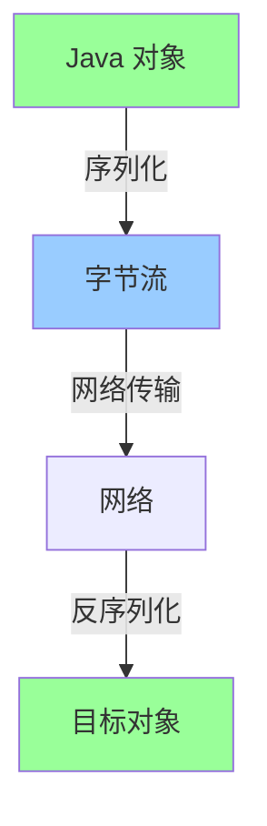
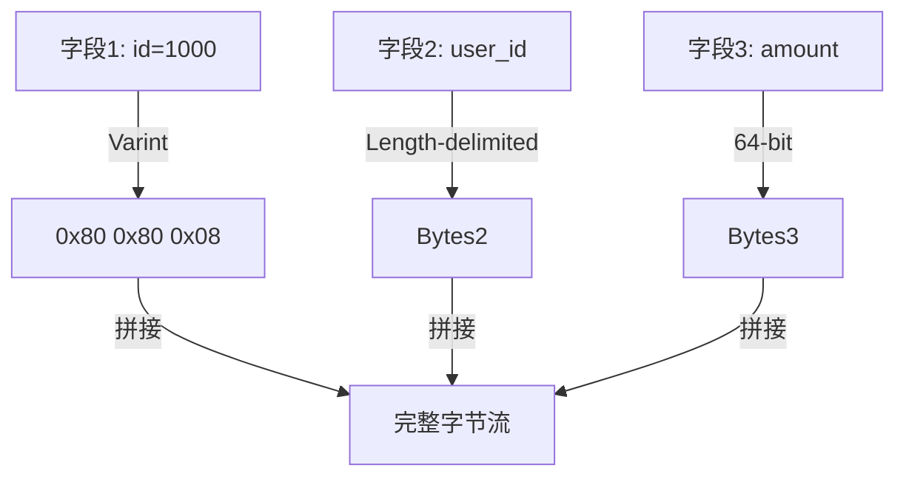
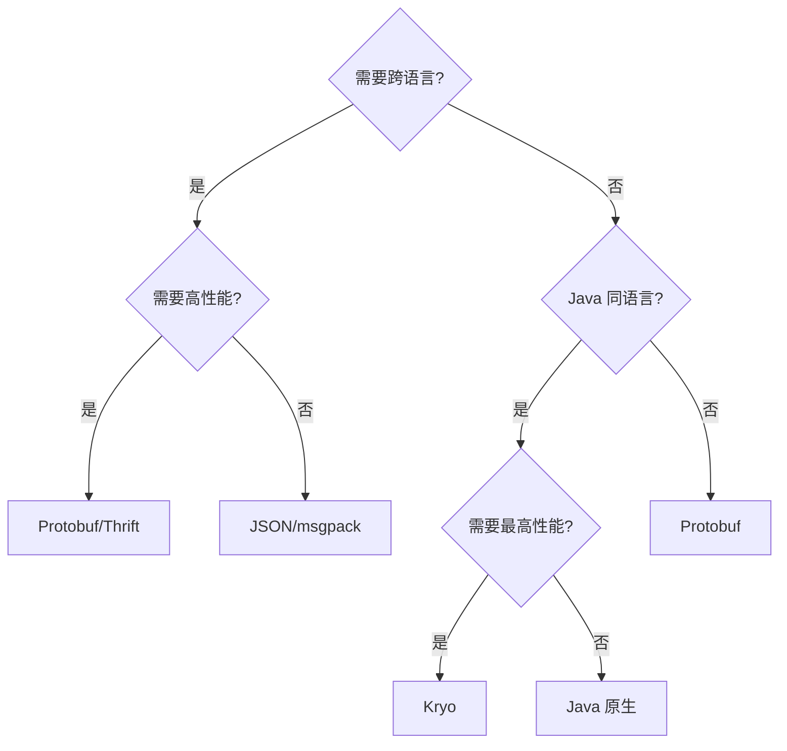

# 序列化协议深度解析

> **一句话摘要**：序列化 = 对象 → 字节 → 对象——选择正确的序列化协议，决定 RPC 的性能和兼容性。
> **本文核心**：**序列化 = 性能 + 兼容性 + 语言支持**。

前置阅读：[RPC 是什么与为什么需要](../入门层/从零开始认识RPC系列/1_序列化协议全景-入门.md)。本篇深入序列化协议的原理和选型。

## 1. 背景：为什么需要深入序列化

入门层讲了「有哪些序列化协议」，本篇回答「怎么选」：

- JSON 可读但性能差，Protobuf 性能好但不可读
- 不同语言怎么互通？
- 性能差多少？

序列化是 RPC 的核心瓶颈之一——选错协议直接影响吞吐量和延迟。

## 2. 核心机制：序列化原理

### 2.1 序列化过程



### 2.2 序列化协议对比

| 协议 | 性能 | 可读性 | 跨语言 | 扩展性 | 适用场景 |
|---|---|---|---|---|---|
| JSON | 低 | 高 | ✅ | 中 | 调试/配置 |
| Hessian2 | 中 | 低 | ✅ | 中 | Java 生态 |
| Protobuf | 高 | 低 | ✅ | 强 | 生产/微服务 |
| Thrift | 高 | 低 | ✅ | 强 | 多语言 |
| Java 原生 | 中 | 低 | ❌ | 中 | Java 同语言 |
| Kryo | 高 | 低 | ❌ | 中 | Java 高性能 |
| MsgPack | 高 | 低 | ✅ | 中 | 轻量级 |

### 2.3 Protobuf 核心原理

```protobuf
// Protobuf IDL 定义
message Order {
    int64 id = 1;
    string user_id = 2;
    double amount = 3;
    repeated string items = 4;
}
```

**Protobuf 编码**：
- 字段编号 + 类型 + 值
- Varint 编码（变长整数）
- 标签 = (字段编号 << 3) | 类型



## 3. 落地实践：Protobuf 使用

### 3.1 Java 集成

```java
// Protobuf 序列化
Order order = Order.newBuilder()
    .setId(1000)
    .setUserId("user-001")
    .setAmount(99.9)
    .addItems("item1")
    .build();

// 序列化
byte[] bytes = order.toByteArray();

// 反序列化
Order parsed = Order.parseFrom(bytes);
```

### 3.2 RPC 中的序列化配置

```java
// Dubbo Protobuf 配置
@dubboService(interfaceClass = OrderService.class)
public class OrderServiceImpl implements OrderService {
    // 使用 Protobuf 序列化
}
```

```yaml
# Dubbo 配置
dubbo:
  protocol:
    name: dubbo
    serialization: protobuf  # 序列化协议
```

## 4. 落地实践：序列化选型

### 4.1 选型决策树



### 4.2 实际选择

| 场景 | 序列化 | 理由 |
|---|---|---|
| 微服务内部 | Protobuf | 高性能 + 跨语言 |
| 对外 API | JSON | 可读 + 兼容 |
| Java 同语言 | Kryo | 最高性能 |
| 配置传输 | JSON | 可读 |
| 大数据 | Protobuf | 压缩率高 |
| 实时通信 | Protobuf | 低延迟 |

## 5. 落地实践：性能对比

```mermaid
flowchart TD
    Seq[序列化性能对比]
    Seq --> JSON[JSON: 100%]
    Seq --> MsgPack[MsgPack: 60%]
    Seq --> Hessian[Hessian2: 50%]
    Seq --> Proto[Protobuf: 20%]
    Seq --> Kryo[Kryo: 15%]
    
    Note over Seq: 越小越快
```

## 6. 生产视角：序列化踩坑

- **踩坑 1**：序列化版本不兼容——升级协议导致旧数据解析失败
- **踩坑 2**：字段编号变更——新增字段必须用新编号
- **踩坑 3**：大对象序列化——序列化耗时影响性能
- **踩坑 4**：不同语言不兼容——IDL 定义不一致

**生产最佳实践**：

1. 字段编号固定不变更
2. 新字段用可选（optional）
3. 序列化版本号管理
4. 性能测试选择协议
5. 文档化 IDL 定义

## 7. 典型场景

| 场景 | 协议 | 理由 |
|---|---|---|
| 内部微服务 | Protobuf | 高性能 |
| 对外 API | JSON | 兼容 |
| Java 内部 | Kryo | 极致性能 |
| 跨语言服务 | Thrift/Protobuf | 多语言 |
| 大数据传输 | Protobuf | 压缩率高 |

## 8. 与相邻概念的区别

- **序列化 vs 编码**：序列化是对象→字节，编码是格式转换
- **序列化 vs 压缩**：序列化是编码，压缩是减小体积
- **Protobuf vs Thrift**：Protobuf 更流行，Thrift 更成熟
- **序列化 vs JSON**：序列化是二进制，JSON 是文本

## 9. 你们可能会问

- **Protobuf 和 JSON 能同时用吗？** 能——内部用 Protobuf，对外用 JSON
- **序列化协议升级怎么办？** 向后兼容——新协议能解析旧数据
- **性能差异有多大？** Protobuf 比 JSON 快 3-5 倍
- **Thrift 和 Protobuf 选哪个？** Thrift 更成熟，Protobuf 更流行

## 10. 一句话总结 + 5W 速记卡 + 自测三问

**一句话总结**：序列化 = 对象→字节→对象——Protobuf/Thrift 性能最优，JSON 可读性最好。

**5W 速记卡**：

| 维度 | 内容 |
|---|---|
| What | 对象序列化为字节流 |
| Why | 网络传输需要 |
| When | RPC 调用时 |
| Where | 所有 RPC 系统 |
| How | Protobuf/Thrift/JSON/Kryo |

**自测三问**：

1. 你的 RPC 用什么序列化协议？为什么？
2. 序列化升级怎么保证兼容？
3. 性能测试过吗？

---

**下篇预告**：Netty IO 模型——[IO 模型与 Netty](../入门层/从零开始认识RPC系列/5_IO模型与Netty-入门.md)。

**🎯 核心带走**：

- **核心一句话**：Protobuf 性能最优，JSON 可读性最好——根据场景选
- **链条复述**：对象 → 序列化 → 字节流 → 网络 → 反序列化 → 对象
- **失效点与边界**：版本不兼容；字段编号变更

💡 **实战提示**：内部微服务用 Protobuf，对外 API 用 JSON——混合使用是常态。

**开放问题**：Protobuf 能用于数据库存储吗？答案是：能——压缩率高，但可读性差。

**决策（何时用）**：高性能需求用 Protobuf/Thrift；调试可读用 JSON；Java 内部用 Kryo。
