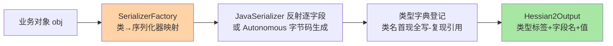
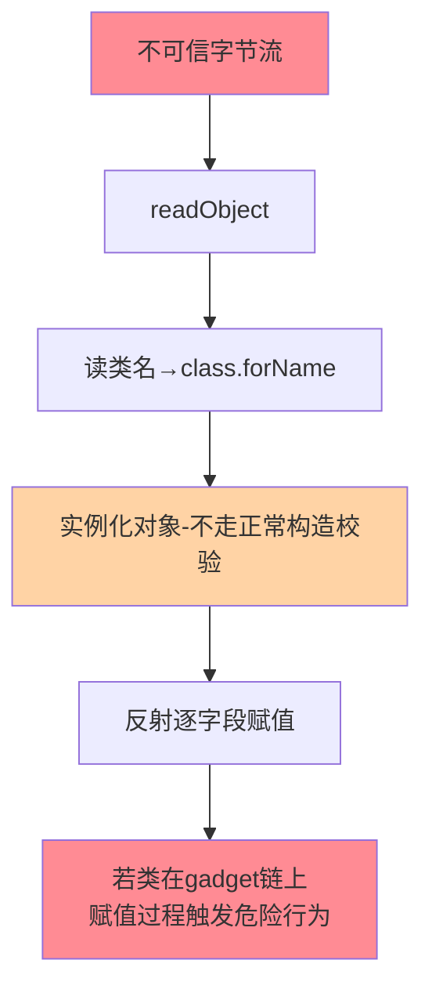
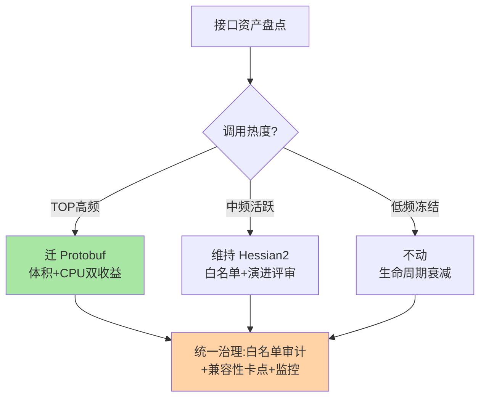

# Hessian2 实现机制与序列化安全深读：类型自描述的代价

> **本文核心**：Hessian2 与 Protobuf 走了相反的设计路线——**报文内嵌类型信息**（类名、字段名写进字节流），换来「零 IDL、Java 对象直接进出」的开发体验，代价是报文更大、跨语言弱、以及**反序列化面暴露在类型系统上**（历史反序列化漏洞的重灾区）。本文拆解它的编码结构（类型字典、引用机制、字段按名匹配）、关键路径（SerializerFactory 的类注册与自定义序列化器）、安全模型（类白名单为什么是生死线），并回答一个工程问题：**为什么大量 Java 团队仍离不开它，以及继续用它的正确姿势**。**机制链**：对象 → 类型映射登记 → 按字段名序列化（类型标签+值） → 字节流 → 读侧按类型标签还原 → 反射构造对象——类型信息既是它的便利之源，也是它的风险之源。

## 一句话摘要

Hessian2 的报文是一串「类型标签 + 字段名 + 值」的结构：对象编码时先写类名（重复类型走类型字典压缩），字段按名字匹配而非编号——所以增删字段天然兼容（老代码读不到新字段名就跳过）、无需编译产物同步。**但字段名进报文意味着体积膨胀、反射意味着构造控制权在数据手里**——反序列化漏洞的本质是「数据里带了完整的对象构造指令」。理解「类型自描述」这枚硬币的两面，就理解了 Hessian2 的适用边界：内部 Java 生态的快速迭代接口可用，跨语言边界与不可信数据边界禁用。

## 前置阅读

- 本系列篇 1《Protobuf 编码原理与 wire 格式》（编号制对照）
- 入门层篇 3《序列化协议全景》

## 目标导向

本文是什么：Hessian2 的实现机制与安全模型深读。功能：理解类型自描述编码、定位反序列化异常、设计类白名单防御。收益：Dubbo 生态序列化问题的归因能力 + 序列化安全边界的架构判断。必看场景：Dubbo 服务序列化异常排查、安全加固、跨团队接口演进评审。

## 一、设计立场：为什么「类型进报文」

Protobuf 用「编号+外部 schema」换取紧凑与跨语言，Hessian2 用「类型名+字段名内嵌」换取零契约成本——**两条路线服务两种协作形态**：前者是「契约先行」的跨团队协作，后者是「代码即契约」的同构团队协作。Java 团队内部接口高频演进时，proto 文件同步、代码生成、产物分发都是摩擦；Hessian2 让接口变更「改 Java 类就行」，序列化层自动跟随——这就是它长期占据 Dubbo 默认序列化位置的根本原因：**它把接口演进的成本压到了最低，把代价转移到了报文体积与安全边界上**。

理解这个设计立场，才能平静地回答「Hessian2 落后吗」——它不是落后，是取舍不同。业内要警惕的不是用它，而是**在它的安全边界之外用它**。

## 5W 速记卡

| 维度 | 一句话 |
|---|---|
| What | 类型自描述（类名+字段名内嵌）的二进制序列化协议 |
| Why | 零 IDL 成本服务 Java 生态高频演进，代价在体积与安全 |
| When | Dubbo 内部接口、Java 生态快速迭代场景 |
| Where | RPC 序列化层（Dubbo 默认之一）、缓存值编码 |
| How | 类型字典+字段名匹配序列化 → 类型标签+反射反序列化 |

## 二、编码结构：类型字典与字段名匹配

**类型字典**是 Hessian2 报文体积的救命机制：一个类名第一次出现时完整写入，此后同流内再出现只写字典引用编号——同一个报文里的一千个同类型对象，类名只占一份。字符串同样有字典与 UTF8 复用机制。这让「大对象列表」场景的体积劣势大幅收窄，但单对象小报文场景仍显著大于 Protobuf（字段名是逐对象逐字段都要语义保留的，字典救不了跨报文）。

**字段按名匹配**：对象编码为「类型定义 + 字段名列表 + 逐字段值」——读侧按字段名对号入座。这带来三个兼容性性质，全部与 Protobuf 的编号制对照着看：

- **增字段**：新代码读旧数据，字段名列表里没有新字段——跳过，默认值，安全；旧代码读新数据，多出的字段名不认识——跳过，安全。两个方向天然兼容，且**不需要任何编号纪律**。
- **改字段类型**：字段名相同类型不同——读侧按报文里的类型标签还原成新类型对象、再赋值给类里的字段，类型不符时抛异常或静默转译——**这里是 Hessian2 最危险的地带**：部分类型对（int/long、string/数值）会静默转换，错误数据无声通过。
- **改字段名**：等价于删旧增新，旧数据里的旧字段名被忽略——**数据静默丢失**（Protobuf 改名同样丢数据但编号还在可以救，Hessian2 改名就是真丢）。

**引用机制**：同一对象的重复出现（循环引用、共享对象）在流内只编码一次、后续写引用编号——这解决了 Java 对象图里的循环引用死循环问题（A 引用 B、B 引用 A），是它对 Java 对象模型的深度适配；代价是反序列化要维护引用表，内存与 CPU 都有一份开销。

## 三、关键路径：SerializerFactory 与自定义序列化

Hessian2 的编解码入口是 `SerializerFactory`——它维护「类 → Serializer 实例」的映射，首次遇到某类时反射分析字段并生成（或匹配）对应的序列化器：

```text
写路径关键帧:
  Hessian2Output.writeObject(obj)
    → SerializerFactory.getSerializer(obj.getClass())
      → 反射分析字段/匹配内置Serializer(集合/Map/日期等)
      → JavaSerializer(反射逐字段) 或 AutonomousSerializer(生成字节码)
    → writeObjectDefinition(类名入字典) + 逐字段 write
读路径关键帧:
  Hessian2Input.readObject(expectedClass)
    → 读类型标签 → 查类型字典还原类名
    → class.forName 加载类(白名单检查点!)
    → 实例化(不走构造器的方案/缺省构造)
    → 逐字段按名反射赋值
```



**业内惯例的两条定制线**：① **自定义序列化器**——大对象/敏感对象注册 `CustomSerializer` 手写编解码（绕开反射、剔除敏感字段），`SerializerFactory` 支持按类注册覆盖默认行为；② **黑白名单过滤器**——在读路径的 `class.forName` 之前插入类名检查，这是安全加固的核心动作（下一节展开）。理解关键路径的价值在排障：反序列化异常的报错栈几乎都落在这几帧——「类找不到」「字段类型不匹配」「构造失败」各对应一条修复路径。

## 四、安全模型：反序列化为什么是重灾区



反序列化攻击的通用原理在入门层篇 3 已立骨架，这里落到 Hessian2 的机制位：**`readObject` 的输入是「对象构造指令」而非「数据」**——攻击者构造的流里可以指定任意 classpath 上存在的类，实例化与字段赋值过程绕过所有正常构造校验；若存在「赋值触发危险行为」的类链（gadget chain，历史上 Apache Commons 系列贡献了大批），命令执行就是可达的。Hessian2 历史上的 CVE（如 2021 年前后的若干反序列化问题）都落在这个模型里。

**防御纵深按优先级排**：① **类白名单**（allow-list）——读路径只放行业务包前缀与基础类型，未知类直接拒绝；这是**唯一结构性有效**的防御，Dubbo 的 `serialize allowlist` 配置、自定义 `ClassFactory` 都落在这层；② **网络边界**——序列化端点不暴露公网，管理端口与业务端口分离；③ **依赖治理**——gadget 链的源头是依赖里的危险类，SCA 扫描与升级减少「可用弹药」；④ **升级跟进**——Hessian/Dubbo 的安全公告要进团队的升级节奏。**反向的清醒认知**：白名单配置错一行（放行了 `*` 或过宽前缀）等于没防——白名单本身要被审计与测试。

**量级演进视角**：千级 QPS 内部服务——白名单+网络隔离已够；万级 QPS——序列化 CPU 与报文体积进入容量账（Hessian2 比 Protobuf 的 CPU 开销高一个档），热点接口开始迁 Protobuf；十万级 QPS——混合策略成为标准形态：内部高频走 Protobuf/Triple、存量 Hessian 接口按演进节奏退役——**「全面替代」在真实组织里不现实，「分区治理」才是**。

### 混合序列化体系的分区治理图



分区治理的关键洞察是**按接口生命周期分配治理成本**——全量迁移的成本黑洞与完全不动的风险积累都不是工程解，热度分层才是。

## 五、与 Protobuf 的机制对照：一张表看透取舍

| 维度 | Hessian2 | Protobuf |
|---|---|---|
| 契约载体 | Java 类本身（代码即契约） | IDL 文件（schema 先行） |
| 字段标识 | 字段名字符串内嵌 | 编号 tag 内嵌 |
| 类型信息 | 报文内嵌（类型字典） | 线型自描述+生成代码 |
| 跨语言 | 弱（Java 语义映射复杂） | 一等公民（多语言生成） |
| 循环引用 | 原生支持（引用机制） | 不支持（禁环） |
| 安全面 | 类型系统暴露（白名单必需） | schema 封闭（编号封闭） |
| 体积 | 中（字典压缩后仍大于编号制） | 小 |

表里最值得驻留的是**循环引用**一行：Protobuf 禁环（消息树必须无环）逼着接口设计「数据即树」；Hessian2 用引用机制容纳任意对象图——**它对 Java 对象模型的忠实既是便利也是枷锁**：接口设计者失去了「被迫结构化」的纪律推力，复杂对象图直接上线，跨语言化时才发现对象图无法平移。业内共识的演进方向：新接口一律树形契约（Protobuf 表达），存量 Hessian 接口按生命周期退役。

## 六、典型场景与误区

**典型场景**：Dubbo 存量体系的接口兼容（hessian2 默认的惯性存量）；缓存值的 Java 对象编码（Kryo/Hessian2 之争里 Hessian2 稳妥派胜出的理由是兼容性稳定）；内部管理端的高频迭代接口（改类即生效，无 IDL 工序）；与 Protobuf 混合的分区策略（网关层转 Protobuf、内部纵深保留 Hessian2）。

**常见误区**：① **「加白名单=安全了」**——白名单的宽度管理才是关键，放行 `com.xxx.` 全前缀等交给任意 gadget 类混入的可能；② **「字段改名和删除等价」**——改名即数据丢失，语义等价的「改名」要按增新字段+写兼容逻辑（getter 返回旧字段值）过渡；③ **「报文大就换协议」**——体积问题先查类型字典生效情况（跨流不复用字典的场景字典失效）与字段冗余，再谈换协议；④ **「静默类型转换无所谓」**——int 转 long 无损，long 转 int 截断、数值转 string 有格式假设——接口演进评审对「同名字段改类型」要按破坏性变更对待；⑤ **「序列化异常只看栈顶」**——异常根因常在类型字典错位或版本并存（新旧实例流混读），先对齐双方 jar 版本再看字段匹配。

## 七、事故与实践叙事

**事故一：白名单缺口导致的反序列化告警**。某平台做了 Dubbo 序列化加固，白名单放行业务包 `com.corp.` 与常用基础类型——上线一周后安全扫描告警：某个第三方 SDK 的回调类（`com.thirdparty.sdk.Callback`）不在白名单，跨团队接口调用批量失败。团队紧急扩白名单时误写了 `com.thirdparty.` 全前缀——安全复扫判定「第三方全部类可反序列化」为高危配置。最终按「精确类名逐个加入+白名单变更走安全评审」收敛。教训：**白名单是安全边界的最后闸门，闸门本身的变更流程必须与安全同级**——事故的根因不是白名单机制，是「白名单应急变更没有安全评审位」。

**事故二：字段改名引发的数据静默丢失**。某订单服务的接口字段 `userPhone` 因合规要求改名 `mobileNo`——开发以为「改名只是重构」，发版后订单表新写入的手机号字段为空。排查发现旧客户端仍在发 `userPhone`（客户端发版周期长），服务端已无此字段——数据在序列化层被静默丢弃。修复：服务端保留 `userPhone` 字段 getter 桥接（`getMobileNo()` 与 `getUserPhone()` 返回同一值），双发版周期走完再删旧字段。教训：**接口字段的「改名」在分布式环境里是双版本并存问题，语义等价桥接是标准解**——这与 Protobuf 的「只增不改」纪律殊途同归，但 Hessian2 没有编号帮你记住历史，桥接代码就是你的「reserved」。

**实践叙事：混合策略的落地节奏**。某中台团队序列化治理的三年路线可作参照：第一年「止血」——全站白名单+安全扫描+新接口强制 Protobuf；第二年「分区」——按调用热度排序，TOP50 高 QPS 接口迁 Protobuf（体积与 CPU 双收益，火焰图实测序列化占比从 9% 到 4%）；第三年「退役」——存量 Hessian 接口按生命周期自然衰减，保留长尾接口继续运行。**按热度分区而非一刀切**，让治理成本与收益对齐——这个节奏对多数存量团队可复制。

## 八、设计思想：类型系统的边界就是安全边界

Hessian2 的安全困境给所有「富类型序列化」提了一个一般性命题：**凡是从数据里还原类型与对象的机制，都把执行面暴露给了数据**。Java 原生序列化、Hessian2、某些模板引擎的自动装配、甚至反射配置，都共享这个命题。工程上的通用解法是「**封闭类型集合**」——白名单、schema 封闭（Protobuf 的编号封闭本质也是封闭类型集合）、受控工厂——把「数据能触达的类型空间」从 classpath 全集压缩到白名单有限集。**安全设计的一般化公式：把开放世界问题变成封闭世界问题**。理解到这一层，序列化安全就不再是「记住 CVE 清单」，而是一个可迁移的架构判断：任何新引入的「数据驱动还原」机制，先问类型集合怎么封闭。

## 九、追问链

**质疑者第一层**：既然 Hessian2 安全这么麻烦，为什么 Dubbo 不早早换掉默认实现？——生态惯性是表因，里因是「类型自描述」对 Java 存量资产的兼容价值：数千个存量接口的 Java 类就是它们的契约文档，强制 IDL 化等于要求全量接口重立契约——这个成本只有按接口生命周期分摊（新接口新标准、存量接口渐进）才能消化。协议选型的组织学：**标准的切换速度受制于存量资产的衰减速度**。

**质疑者第二层**：那 Kryo 为什么没有被选为替代品？它也零 IDL 且更快——Kryo 的「不安全」更彻底：默认无白名单、类注册机制形同虚设、跨版本兼容性弱（字段增删的行为在不同版本间有差异）——**性能优势换来了更弱的演进与安全保证**，在需要长期演进的 RPC 场景这是错配；它的主场是「短生命周期数据」（进程内缓存、临时快照）。

**质疑者第三层**：类型字典的跨报文失效（每报文重建字典）为什么不优化成跨报文共享？——共享字典需要连接级有状态协商（字典表双向同步），连接中断要重建——Hessian2 的定位是**无连接状态假设的通用协议**（可用于 HTTP 短连接、MQ 等载体）；要跨报文字典该看的是 HPACK 类有状态压缩或干脆换 Protobuf——「无状态性」的保留是有意的架构选择，不是实现偷懒。

## 十、你们可能会问

**Q1：怎么快速定位一次 Hessian2 反序列化异常？**
三板斧：① 看异常类型——类找不到（白名单/版本缺失）、字段不匹配（类型变更）、构造失败（缺省构造器缺失）各有对应修复路径；② 对齐双方 jar 版本——新旧实例并存的流混读是高发根因；③ 用 hexdump 看报文头——类型标签与字典编号错位一眼可辨（配合协议规范的手册解码）。

**Q2：Dubbo 怎么配置序列化白名单？**
按 Dubbo 版本走 `serialize` 相关配置（allowlist/denylist 文件或系统属性），粒度是类名/包前缀；版本间配置方式有差异，以所用版本官方文档为准——白名单文件本身进版本库+变更走安全评审。

**Q3：新接口直接用 Protobuf，老接口的 Hessian2 依赖要不要清理？**
按生命周期分：活跃演进的接口迁 Protobuf（演进收益大）；已冻结的接口不动（没有演进就没有风险敞口的增长）；已废弃的接口连 Hessian 依赖一起下线——「按生命周期分区」避免无效的全量改造。

**Q4：报文体积怎么量化 Hessian2 的劣势？**
同结构对象分别以 hessian2 与 protobuf 编码，测报文字节数与编解码耗时——业内基准的方向是体积差 1.5-3 倍、速度差 1.5-5 倍（按字段形态浮动）；你自己的接口数据结构决定真实倍数，别拿公开基准直接外推。

## 💡 实战提示

- 💡 白名单精确到类名、变更走安全评审——放行宽前缀等于闸门常开
- 💡 字段改名必须 getter 桥接过渡——Hessian2 没有编号帮你记住历史，桥接代码就是 reserved
- 💡 决策口径：新接口一律树形契约（Protobuf）、存量按热度分区治理、短生命周期数据才考虑 Kryo
- 💡 序列化异常排查三板斧：异常分类→双方 jar 版本对齐→报文 hex 对照协议手册

## 十一、自测三问

1. Hessian2 的字段匹配机制带来哪些兼容性质？（答：按字段名匹配——增字段双向安全、同名字段改类型有静默转换风险、改字段名等于数据丢失需桥接）
2. 反序列化攻击在 Hessian2 上的机制位与第一道防御？（答：readObject 的类加载与实例化指令来自数据本身；第一道防御是读路径类白名单——封闭类型集合）
3. 类型字典解决什么、什么场景失效？（答：同流内重复类型名的体积压缩；跨报文不共享字典——有状态协商与无状态定位冲突）

## 十二、开放问题

- Java 生态序列化的长期收敛——record 类、值类型对序列化模型的重塑，与 Protobuf 树形契约的最终分工仍在演进。
- 白名单治理的自动化——依赖分析自动生成候选白名单、变更的自动安全评估，工具链尚在早期。

## 📎 核心带走

- **核心一句话**：Hessian2 = 类型自描述换零契约成本——字段名匹配带来天然增删兼容，类型内嵌带来体积与反序列化安全代价；安全边界的本质是封闭类型集合
- **机制链**：SerializerFactory 类映射 → 反射字段分析 → 类型字典+字段名编码 → 读侧 class.forName（白名单检查点）→ 实例化+反射赋值（引用机制解环）
- **失效点/边界**：同名字段改类型可静默转译；字段改名即数据丢失；跨报文字典失效；白名单过宽等于没防——分区治理（新接口 Protobuf、存量按生命周期退役）是现实解

## 📌 数据与事实声明

- 写于 2026-09-15，机制以 Hessian2 协议规范与 Dubbo 官方序列化文档为基准（公开口径）；安全模型为公开 CVE 的机制归纳
- 免责：CVE 细节与配置方式以官方安全公告为准

## 📚 参考资料

| 类型 | 标题 | 来源 |
|---|---|---|
| 协议规范 | Hessian 2.0 Serialization Protocol | hessianproto.caucho.com（存档） |
| 官方文档 | Dubbo 序列化与安全 | dubbo.apache.org |
| 关联文章 | 本系列篇 1（Protobuf 对照）、篇 3（性能对比方法） | 本仓库 |
