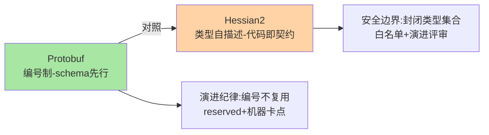
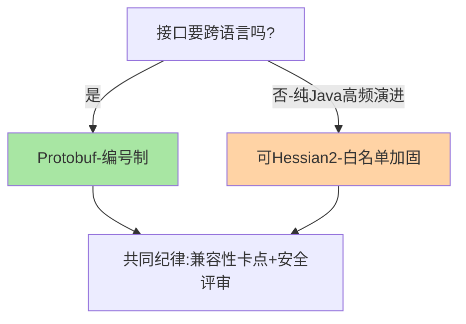
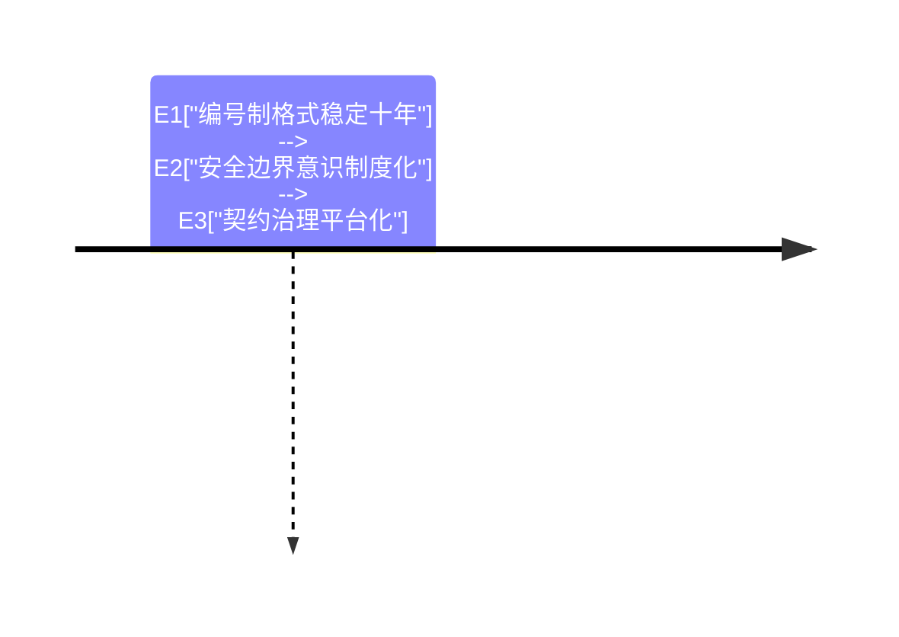

# 深入理解序列化与协议系列：编码格式的两条路线

> **本文核心**：序列化协议的两大设计路线——Protobuf 的「编号+外部 schema」与 Hessian2 的「类型自描述」——本系列各用一篇深读拆透：前者从 varint/tag/长度前缀读到兼容性纪律（编号即契约），后者从类型字典/字段名匹配读到安全边界（封闭类型集合）。两条路线的取舍是「契约成本 vs 体积与安全」。

## 一句话摘要

读 wire format 的价值不在背格式，在预判：schema 变更的兼容性后果、报文体积的字节账、反序列化安全的边界位置——**格式即契约，契约即治理**。

## 篇目

1. [Protobuf 编码原理与 wire 格式](1_Protobuf编码原理与wire格式-深度.md)——varint/zigzag/tag/长度前缀与徒手解码
2. [Hessian2 实现机制与序列化安全](2_Hessian2实现机制与序列化安全-深度.md)——类型字典、字段名匹配与白名单防御

## 两条路线的演进权衡

跨周期看，两条路线在相向而行：Protobuf 补易用性（JSON 映射、optional presence 语义回归），Hessian2 系补安全与收敛（白名单治理、新接口转 Protobuf）——**格式层五年尺度的竞争焦点是「契约治理能力」而非编解码速度**。代价取舍的底线也从未变过：不可信边界禁用类型自描述，契约边界必用 schema 先行。

## 📌 数据与事实声明

- 写于 2026-09-15，以 protobuf.dev 与 Hessian 协议规范为基准（公开口径）

## 📚 参考资料

| 类型 | 标题 | 来源 |
|---|---|---|
| 官方文档 | Protobuf Encoding / Dubbo 序列化 | protobuf.dev、dubbo.apache.org |
