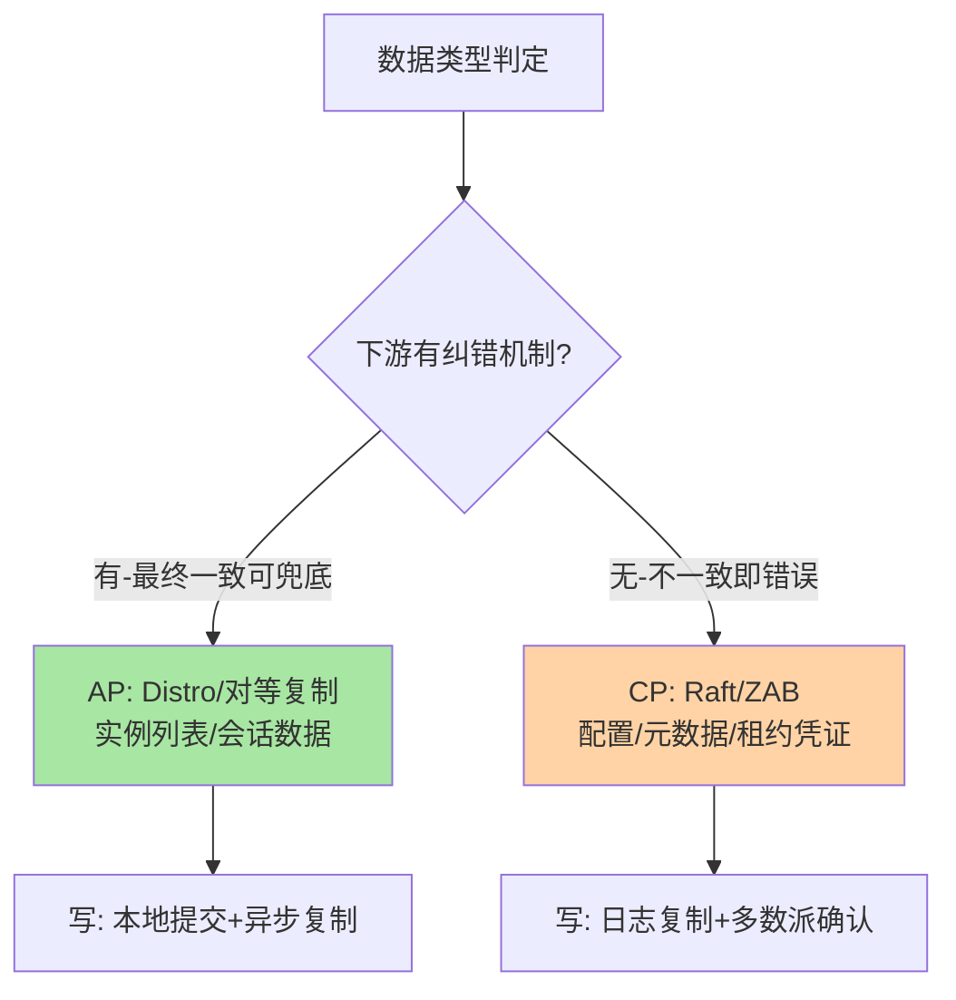
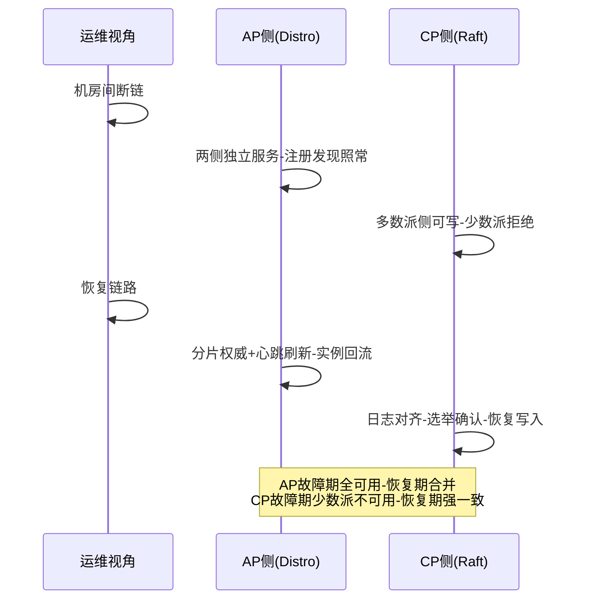
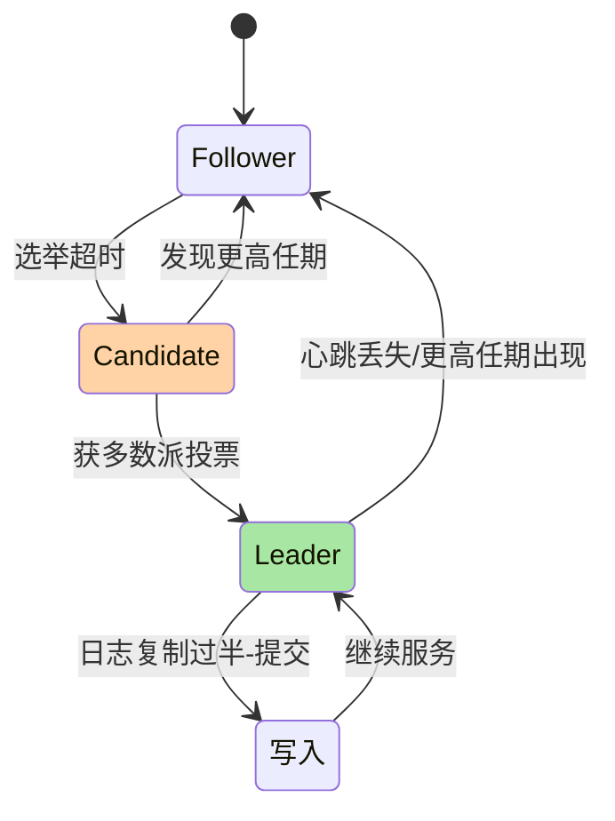

# 注册中心一致性协议深读：Distro、Raft 与可用性的定价

> **本文核心**：注册中心的一致性选型本质是给「可用性」定价——**AP 路线**（Eureka 的对等复制、Nacos 的 Distro 协议）用「节点间短暂不一致」换「任意节点可写可读、无选举中断」，**CP 路线**（ZooKeeper 的 ZAB、Nacos 配置数据的 Raft、Consul 的 Raft）用「写入过半数确认+选举期不可写」换「全局强一致的读写序」。本文拆解 Distro 的分片负责与异步批量复制机制、Raft 在注册场景的代价点（选举窗口与写入延迟），给出「什么数据配什么协议」的判定框架，并用脑裂、选举风暴、分区恢复三个场景把协议行为落到故障时间线。**机制链**：数据性质判定（易变/关键）→ 协议分派（实例数据走 AP、配置数据走 CP）→ 写路径（本地提交/多数派确认）→ 复制路径（异步批量/日志同步）→ 读路径（本地读/一致性读）。

## 一句话摘要

「注册中心选 AP 还是 CP」这个问题问错了对象——**应该按「数据」选而不是按「系统」选**：实例列表是易变数据，短暂不一致的代价是调用方多打一两次失败（有容错兜底），AP 的可用性收益大于一致性收益；配置数据是关键小数据，不一致直接业务错误，CP 的强一致写入是必要的。Nacos 双协议并存（Distro 管实例、Raft 管配置）是这条原则的落地范本；ZooKeeper 全 CP 的「选举不可用窗口」在发现场景是硬伤；Eureka 全 AP 的「自我保护」是 AP 取向的极端化——**把协议选择从「站队」还原为「定价」，是本篇要完成的认知升级**。

## 前置阅读

- 入门层篇 6《服务发现与注册中心》（三层发现机制）
- Nacos 系列篇 2《核心概念与架构心智模型》（双协议分野）
- 本仓库分布式理论系列（CAP 与一致性模型）

## 目标导向

本文是什么：注册中心一致性协议的机制与选型深读。功能：理解 Distro/Raft/ZAB 的行为边界、预判故障时间线、设计双协议数据分派。收益：注册中心选型与故障排障的协议级判断力。必看场景：注册中心选型评审、分区故障复盘、写入延迟排查。

## 一、先把「一致性」落到注册场景的具体问题

抽象谈 CAP 容易变成口号，注册场景的一致性问题具体到三个可观察的行为：**写冲突**（两节点同时注册同名服务的不同实例，合并结果是什么）、**读时效**（节点 A 上的注册，节点 B 的读者多久能看到）、**分区行为**（机房断链时，两侧还能不能注册与发现）。三个问题在 AP 与 CP 下的答案完全不同：AP 对等复制下写冲突按「后到覆盖」或「合并」解决、读时效是异步复制延迟、分区时两侧独立服务可用性；CP 多数派下写冲突被日志序消解、读时效可保证线性一致、分区时少数派拒绝服务。**选型就是给这三个行为定价**：你的业务能接受哪种写冲突语义、多大的读延迟、分区时牺牲哪一侧。

**注册数据的特殊性**让它成为「定价」的最佳教学案例：实例数据**天然自带纠错机制**——过期列表会被下一次心跳/推送修正，调用方还有容错兜底，所以「短暂不一致」的实际伤害被下游机制摊薄；而配置数据没有这层兜底，不一致就是不一致。**「下游有没有纠错机制」是数据定价的第一问**——这个判定框架比背 CAP 表格有用得多。

## 5W 速记卡

| 维度 | 一句话 |
|---|---|
| What | Distro（AP 分片对等复制）与 Raft（CP 多数派日志）的机制与选型 |
| Why | 协议行为决定注册中心的故障时间线与读写语义 |
| When | 注册中心选型、分区故障复盘、写入延迟与选举事件排查 |
| Where | 注册中心的存储与复制层（实例数据/配置数据分派） |
| How | 数据定价 → 协议分派 → 写入提交 → 异步复制/日志同步 → 本地读 |

## 二、Distro：分片负责制的 AP 实现

Nacos 的 Distro 协议设计围绕一个问题：**AP 之下怎么让对等节点间的数据最终收敛，且写入不因复制而变慢**。它的答案是三个机制的组合：

```text
Distro 关键路径:
  写入:
    客户端 → 任意节点
    → 该节点是数据分片负责人吗?
       是 → 本地提交(内存+磁盘) → 返回成功
       非 → 转发给负责节点 → 负责节点本地提交 → 返回
    → 异步批量复制: 负责节点周期性把变更打包推给对等节点
  读取: 本地内存读(每个节点都有全量数据的副本)
  新节点同步/恢复: 全量拉取(数据快照) + 增量追平
```

**「分片负责+异步批量」是 Distro 的精髓**：每份数据（按服务哈希分片）有唯一负责节点，写入永远落在负责节点本地——无多数派协商、写入延迟是本地提交延迟；复制走异步批量（攒一批变更周期性推送），网络效率高，代价是复制延迟窗口内对等节点间数据有差异。**每个节点持有全量副本**让读取完全本地化——读路径零网络开销，这是 AP 系统读吞吐高的机制根源。**新节点的数据同步**用「先全量快照、后增量追平」的两段式，避免冷启动期间对外提供半空数据——这个细节在扩容操作里是行为关键：新节点同步完成前不应接流量（健康检查与负载均衡要感知同步状态）。

**Distro 的故障语义**：节点宕机，它的分片由其余节点重新负责（分片重分配），期间该分片的写入短暂由转发兜底或短暂不可写（AP 取向：可读性优先，写入尽力而为）；**分区时两侧各自继续服务**，恢复后数据按「负责节点权威+时间戳 newer-wins」合并——对注册场景，合并语义容忍（实例列表最终被心跳刷新），这正是「下游纠错机制摊薄伤害」的体现。

## 三、Raft：注册场景里的 CP 代价清单

Raft 的机制骨架（领导者选举、日志复制、多数派提交、安全性约束）在本仓库分布式理论系列有完整拆解，这里只算**注册场景的三笔代价账**：

**代价一：选举窗口**。Leader 宕机到新 Leader 就绪（选举超时+投票+日志补齐），通常数百毫秒到数秒——窗口内整个集群不可写。对配置数据这是可接受的（写入低频），对高频注册场景（万级实例滚动发布）这是体验硬伤——ZooKeeper 的 ZAB 同理，这也是「ZK 当注册中心是借用」论断的机制依据。

**代价二：写入延迟**。每次写要走「Leader 接收 → 日志复制到多数派 → 过半确认 → 提交返回」，网络 RTT 进入关键路径——写入延迟是单节点 AP 方案的一个数量级以上（内网 RTT 0.5-2ms 量级叠加）。批量提交（日志攒批）能摊薄，但突发写入时延迟毛刺显著。

**代价三：多数派在线要求**。五节点集群允许两节点故障，三节点只允许一节点——**CP 的可用性上限被多数派数学锁死**；机房级部署时要考虑「多数派跨机房分布」否则单机房故障即失去多数。这些账算完，Raft 在注册场景的正确定位就清楚了：**配低频写入的关键数据，不配高频写入的易变数据**。



这张分派图是本篇的核心交付：**注册中心内部就该是双协议结构**（Nacos 的实践），对外提供统一接口、内部按数据性质分派协议——「系统级站队」让位于「数据级定价」。

## 四、与 ZAB 的区别：Raft 同门的不同答卷

| 维度 | Raft | ZAB |
|---|---|---|
| 术语体系 | 任期/日志索引 | epoch/zxid（事务 id） |
| 选举触发 | 任期超时随机化 | 恢复模式（崩溃后） |
| 提交语义 | 日志序多数派 | zxid 全序多数派 |
| 工程实现 | 社区多实现（etcd/Nacos/Consul） | 基本绑定 ZooKeeper |

ZAB 与 Raft 在核心机制上同构（多数派日志复制+单领导者），差异在工程细节与生态位：Raft 的可理解性设计（论文即以可教学为目标）催生了大量开源实现，成为 CP 系统的通用底座；ZAB 是 ZooKeeper 的专属协议——**「读 Raft 一遍，看懂一票 CP 系统」**，这是学习投资的性价比所在。行为差异里最值得记的是选举随机化（Raft 的随机选举超时防活锁）与 zxid 的全序设计（ZK 客户端可见的全局写入序）——它们分别解决「选举分票」与「跨客户端观察序」两个工程问题。

### AP 与 CP 的分区时间线对照



时间线对照是选型评审最有说服力的一页：两条协议在「分区期间」与「恢复期间」的行为完全不同，业务方按自己的分区预案（快照/降级/拒绝写）对号入座。

### 选举与写入的状态机



Raft 的状态机把「选举窗口」的含义钉死：Leader→Follower 的每次退化都是一段不可写期——选举频率指标直接对应可用性损耗，这就是它必须进监控大盘的原因。

## 五、脑裂与分区恢复：把协议行为放到时间线

**脑裂场景推演**（三节点跨两机房：A 机房一节点、B 机房两节点，机房间断链）：CP 下 B 机房持有多数派继续写入，A 机房单节点拒绝服务（无法确认多数派）——调用方在 A 机房发现「注册中心不可用」，靠客户端快照兜底（互指 RPC 篇 6）；AP 下两侧独立服务，恢复后按合并规则收敛——期间两侧可能各自摘除对方机房实例（健康检查互相不可达），恢复后实例重新注册回流。**把两条时间线画给业务方看**（分区期间谁能写谁能读、恢复后数据怎么合），是注册中心选型评审最有说服力的一页材料。

**选举风暴场景**：网络抖动导致 Leader 反复易主——CP 系统的写入持续失败，客户端重试进一步放大压力。防御组合：选举超时的随机化抖动（协议内建）、客户端对「不可用」的指数退避、以及运维侧对选举事件的告警分级（偶发选举是常态，频繁选举是故障）。**「选举频率」是 CP 注册中心的第一健康指标**——它同时反映网络质量与集群负载。

**分区恢复场景**：AP 两侧恢复后的合并冲突怎么处理——Nacos Distro 按「分片负责节点的数据为权威」，被合并侧全量拉取对齐；Eureka 按「时间戳 newer-wins」，时钟漂移大的节点可能用过期数据覆盖新数据——**Eureka 的自我保护模式（心跳丢失率过高时冻结摘除）也是时钟与网络异常下的保守防御**，但它同时让「实例真死了也不摘」，调用方容错的压力反而更大。分区恢复的语义差异是 AP 实现之间的主要分野，选型时要读到实现细节这一层。

**业内生产实践的成熟度阶梯**也值得对齐：起步团队用托管注册服务的默认参数；成长团队开始监控复制延迟与选举频率两个协议级指标；成熟团队把「数据定价」制度化——新数据类型接入注册中心前过一遍分派评审（AP 还是 CP、TTL 多少、合并语义是什么）。**指标监控与分派评审，是把协议知识变成组织能力的两个抓手**。

## 六、与「最终一致缓存」的区别：失效机制的有无

| 维度 | 注册中心 AP（Distro/Eureka） | 通用最终一致缓存 |
|---|---|---|
| 数据活性 | 持续变化（心跳维持） | 写后基本不变 |
| 纠错机制 | 心跳/推送持续修正 | 依赖 TTL 过期 |
| 不一致窗口 | 复制延迟+摘除延迟 | TTL 长度 |

注册数据的「活性」（每个实例都在持续续约）让它天然带「主动失效」机制——这与缓存「被动等过期」的最终一致有质的不同：注册中心的窗口上限是心跳超时（秒级），缓存的窗口是 TTL（可到分钟）——**同样是 AP，数据活性决定了不一致窗口的上限**，这也是实例数据敢走 AP 的深层原因。

## 七、典型场景与误区

**典型场景**：微服务实例注册（AP/Distro——变更频率高、下游有容错）；配置与元数据存储（CP/Raft——写入关键）；跨机房容灾部署（CP 多数派跨机房分布 vs AP 双活+合并）；注册中心选型评审（数据定价框架过一遍业务数据清单）。

**常见误区**：① **「我们要强一致所以全 CP」**——把实例数据也塞进 CP，写入延迟与选举窗口在高频变更下反噬可用性——按数据定价，不按系统站队；② **「AP 就是没一致性问题」**——复制延迟窗口内的新实例空白期（注册成功但其他节点还看不到）对「发布后立即调用」的自动化流程是真实故障，敏感流程要加「注册确认轮询」；③ **「多数派=高可用」**——三节点部署在同一机房，机房故障即全灭——多数派的地理分布比节点数量重要；④ **「选举事件不用管」**——频繁选举是网络与负载异常的先行指标，选举告警缺席的 CP 集群是盲飞；⑤ **「脑裂时协议自己会处理」**——协议保证的是数据收敛，业务侧的「分区期间行为」（降级/快照/拒绝写）要应用自己设计——协议不管业务可用性。

## 八、事故与实践叙事

**事故一：选举窗口撞上滚动发布**。某团队用三节点 CP 注册中心承载全部服务发现，一次注册中心自身升级采用「逐节点重启」——重启第一个节点时恰好另一个节点网络抖动，集群瞬间只剩一个健康节点，失去多数派，全集群不可写持续约 20 秒——期间所有服务发布操作挂起、新实例注册失败。复盘把「注册中心自身的可用性预算」纳入升级流程：升级前确认各节点健康、逐节点间隔拉长、避开发布窗口。**教训**：CP 系统的维护操作要与多数派数学对账——「N 节点允许 N/2-1 故障」的预算要扣除计划内维护。

**事故二：Eureka 自我保护放大故障面**。某团队 Eureka 集群因交换机故障心跳批量丢失，自我保护模式触发冻结摘除——期间一批实例真的崩溃了，但列表迟迟不更新，调用方流量持续打向死实例，错误率抬升的时间比网络故障本身长了数分钟。复盘：自我保护的定位是「网络故障时不误摘」，代价是「真故障时不摘」——**两种故障（网络分区 vs 实例崩溃）在 Eureka 里被同一开关保护，需要调用方熔断来补「不摘」的缺口**（互指 RPC 篇 10）。这个案例的抽象：AP 的保守防御把故障处理责任转移给了下游，下游的容错能力必须配得上这份转移。

**实践叙事：双协议分派的落地**。某中台团队把注册中心数据按定价框架重新分派：实例注册走 Distro（变更频率十万级/日）、限流与路由规则等治理配置走 Raft（变更频率十级/日但关键性极高）、会话与租约凭证走 CP（过期语义要求严格）——分派后写入延迟与可用性指标双改善（实例写入 P99 从多数派的 8ms 降到本地提交的 1ms 内），配置类数据获得了严格的读写序。**数据定价框架的第一次实践收益就是「让每个协议干它擅长的活」**。

## 九、设计思想：一致性的价格发现机制

把「AP vs CP」还原为「定价」之后，浮现出一个更一般的架构思维：**一致性等级是一种可交易资源，交易对手是可用性与延迟**。分布式存储的每一层都在做这笔交易：注册中心按数据分笔交易（双协议）、数据库按事务等级交易（隔离级别）、消息队列按投递语义交易（at-least-once/exactly-once）。**架构师的工作不是选「最强」的，而是给每类数据找到「代价可承受」的等级**——而找到的前提是把「不一致的实际伤害」算清楚（下游有没有纠错、不一致窗口多长、最坏场景是什么）。本文的分派图（下游纠错机制→协议选择）就是这套「价格发现」的最小操作版。

## 十、追问链

**质疑者第一层**：既然实例数据下游有纠错，为什么还要异步复制对齐——干脆各节点只管自己的分片不就完了？——因为「调用方订阅的是服务不是分片」：一个服务的实例可能注册在不同节点，只读本节点分片会让实例列表系统性缺失——**全量副本是「统一视图」的代价**，异步复制是这份代价的分期付款。彻底的分片视图（读写都在负责节点）可以省复制，但把读路径变成跨节点 RPC，读吞吐与可用性都受损——视图统一性的定价问题。

**质疑者第二层**：AP 合并用 newer-wins，时钟漂移大时怎么办？——靠时钟的方案都要回答「时钟不可信怎么办」：向量时钟/混合逻辑时钟可以给「先后」一个不依赖物理时钟的判定，但工程复杂度上一个台阶；注册场景的务实解是**让数据自带时效**（心跳续约，过期自动失效），把「新旧判定」交给生命周期而不是时间戳——数据活性再次成为兜底机制。

**质疑者第三层**：云厂商的托管注册服务（如各类托管 Nacos/ZK）在协议层做了什么取舍？——托管化的共性动作是「把多数派的地域分布做成产品参数」（多可用区部署承诺多数派分布）、把选举与备份自动化、把监控指标（选举频率/复制延迟）产品化——协议机制不变，**运维知识的显性化是托管的价值本质**。自建与托管的选型本质是「协议运维能力要不要自持」。

## 十一、你们可能会问

**Q1：怎么观察注册中心的复制延迟？**
AP 系统：写入一个带时间戳的测试实例，轮询对等节点观测其出现时间（或读内置指标：Distro 的同步任务延迟）；CP 系统：看follower 日志追平延迟指标。复制延迟的 P99 要进注册中心的基础监控大盘——它是「不一致窗口」的实时读数。

**Q2：三节点还是五节点？**
写吞吐与故障预算的权衡：三节点容忍一节点故障、写入多数派成本最低，适合中小规模；五节点容忍两节点，适合注册中心自身可用性要求极高或节点跨机房分布的场景——**节点数每加二，写入确认成本上一档**，别用节点数表达安全感。

**Q3：注册中心能承载多少实例？**
账分三层：内存（每实例的注册条目+索引，万级实例在单节点 GB 级以内）、心跳 QPS（实例数/心跳间隔）、推送扇出（变更×订阅方）。2.x 的 gRPC 长连接把心跳与推送成本结构改变后，容量瓶颈更多在连接数——按所用版本实测压测，公开数字仅供参考。

**Q4：要不要为「强一致读」付费？**
多数实现提供「一致性读」选项（CP 系统走 Leader 读或 ReadIndex）——代价是读延迟上一个台阶。注册场景的「强一致读」需求通常出现在自动化编排（发布系统确认实例注册）——**给特定流程开一致性读、常态读走本地**，比全局强一致读划算。

## 💡 实战提示

- 💡 复制延迟与选举频率是协议级两大健康指标——缺了它们就是盲飞
- 💡 CP 集群维护操作与多数派数学对账：逐节点间隔拉长、避开发布窗口、多数派跨机房分布
- 💡 决策口径：实例/会话类数据走 AP（Distro）、配置/租约类数据走 CP（Raft）——按数据定价不按系统站队
- 💡 选型推荐：注册与配置一体的中间件（双协议内建）优于「注册中心+配置中心两套系统」，运维面收敛且协议分派已在内部完成

## 十二、自测三问

1. 「按数据定价」框架的第一问是什么？（答：下游有没有纠错机制——有则 AP 的不一致伤害被摊薄，无则必须 CP）
2. Distro 的三个机制组合？（答：分片负责（写入本地提交）+异步批量复制（对等收敛）+全量副本本地读；新节点全量快照+增量追平）
3. Raft 在注册场景的三笔代价？（答：选举窗口不可写、写入延迟过半数确认、多数派在线约束——所以它配低频关键数据不配高频易变数据）

## 十三、开放问题

- 混合一致性的中间档——会话一致性/单调读在注册中心的标准化提供（读自己写过的实例列表），接口语义仍在演进。
- 时钟无关的合并语义——混合逻辑时钟在 AP 合并中的工程化普及程度。

## 📎 核心带走

- **核心一句话**：注册中心一致性选型 = 按数据定价——实例数据下游有纠错走 AP（Distro 分片负责+异步复制+全量读），配置数据无兜底走 CP（Raft 多数派），系统级站队让位于数据级分派
- **机制链**：数据性质判定 → 协议分派 → 写路径（本地提交 vs 日志多数派）→ 复制路径（异步批量 vs 日志同步）→ 读路径（本地读 vs 一致性读）→ 故障时间线（选举窗口/分区行为/恢复合并）
- **失效点/边界**：AP 复制延迟窗口内有系统性空白期；CP 选举窗口不可写且多数派分布决定可用性上限；AP 合并语义与时钟依赖要读到实现层；协议不管业务可用性——分区行为要应用自己设计

## 📌 数据与事实声明

- 写于 2026-09-15，机制以 Raft 论文、Nacos Distro 公开设计文档、ZooKeeper ZAB 文献为基准（公开口径）；延迟数字为内网量级参考
- 免责：各实现的行为细节以官方文档与所用版本源码为准

## 📚 参考资料

| 类型 | 标题 | 来源 |
|---|---|---|
| 原理论文 | In Search of an Understandable Consensus Algorithm (Raft) | raft.github.io |
| 官方文档 | Nacos Distro 协议说明 / 架构 | nacos.io |
| 原理书 | 《数据密集型应用系统设计》DDIA 第 9 章 | 公开出版 |
| 关联文章 | Nacos 篇 4（AP 与 CP 怎么选）、本仓库分布式理论系列 | 本仓库 |
