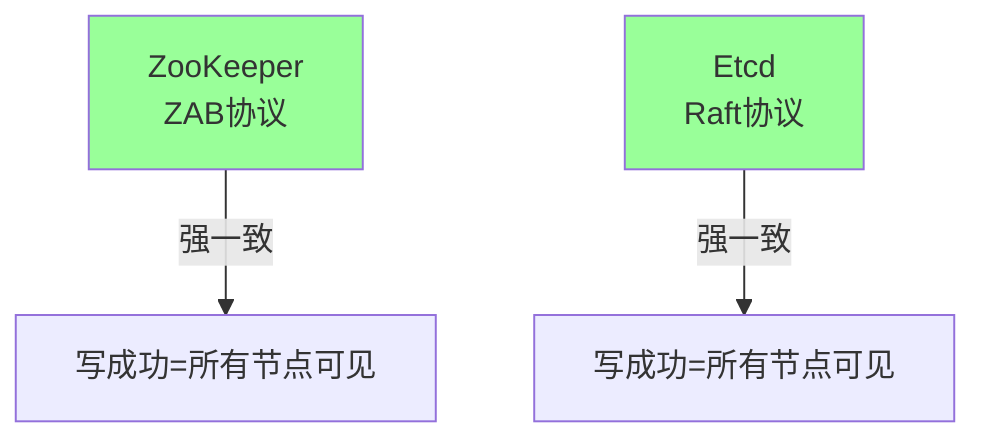
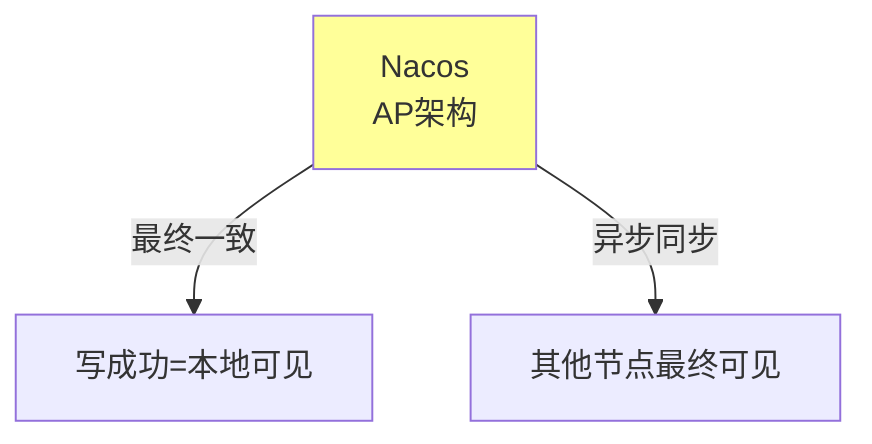
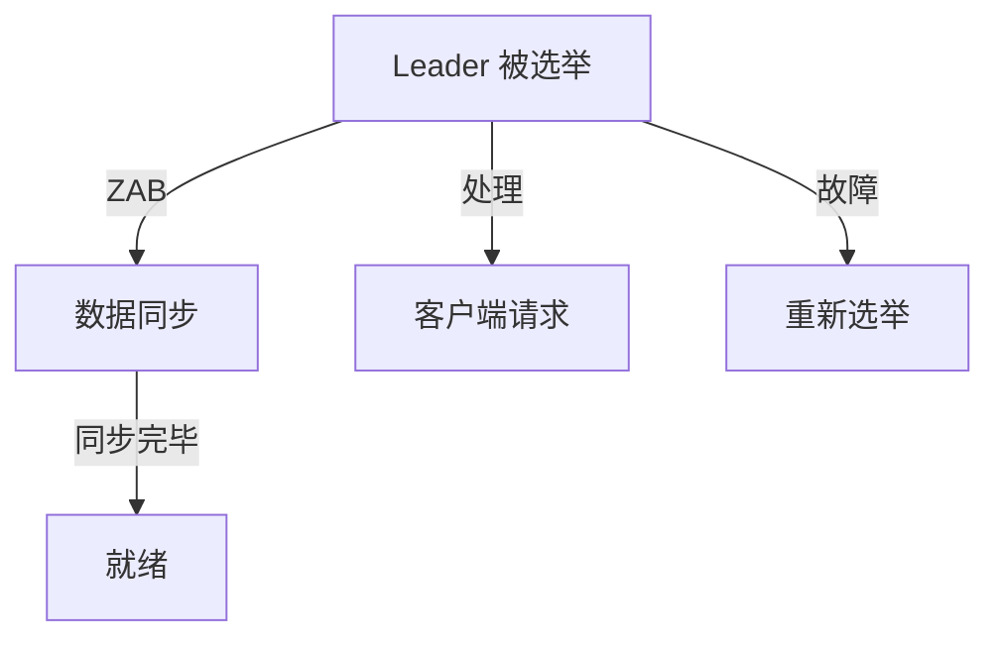

# 注册中心一致性协议深度解析

> **一句话摘要**：注册中心的一致性 = 数据同步的保证——CP 用 Raft/ZAB 强一致，AP 用 Nacos 最终一致。
> **本文核心**：**一致性 = 选主 + 日志复制 + 数据同步**。

前置阅读：[服务发现架构实战](./../../../../system-design/distributed-system-design/专题层/服务发现架构实战/1_服务发现架构实战-专题.md)。本篇深入注册中心的一致性实现。

## 1. 背景：为什么需要一致性

注册中心存储了所有服务实例的地址——如果数据不一致：
- 客户端发现一个已下线实例
- 请求发到错误的地址
- 雪崩效应

一致性是注册中心可靠性的基石。

## 2. 核心机制：两种一致性模型

### 2.1 CP 模型（强一致）



**CP 注册中心特点**：
- 写操作必须多数节点确认
- 读操作从 Leader 读
- 保证数据一致
- 性能略低

### 2.2 AP 模型（最终一致）



**AP 注册中心特点**：
- 写操作只写本地
- 异步同步到其他节点
- 高性能
- 短暂不一致

## 3. 落地实践：ZAB 协议

### 3.1 ZAB 核心流程

```mermaid
sequenceDiagram
    Leader[Leader] -->|发提案| Follower1[Follower 1]
    Leader -->|发提案| Follower2[Follower 2]
    Leader -->|发提案| Follower3[Follower 3]
    
    Follower1 -->|确认| Leader
    Follower2 -->|确认| Leader
    Follower3 -->|确认| Leader
    
    Leader -->|提交| All[所有节点]
```

**ZAB 与 Raft 的区别**：
- ZAB 专为 ZooKeeper 设计
- Raft 通用共识
- 两者都基于 Leader + 多数确认

### 3.2 选主机制



## 4. 落地实践：Nacos AP 实现

### 4.1 Nacos 数据同步

```java
// Nacos 数据同步
public class NacosSync {
    // 客户端注册
    public void register(ServiceInstance instance) {
        // 1. 写入本地
        localStore.save(instance);
        // 2. 异步同步到其他节点
        asyncSyncToPeers(instance);
    }
}
```

### 4.2 Nacos 与 ZooKeeper 对比

| 维度 | Nacos (AP) | ZooKeeper (CP) |
|---|---|---|
| 一致性 | 最终一致 | 强一致 |
| 性能 | 高 | 中 |
| 可用性 | 高（分区时仍可用） | 低（分区时不可用） |
| 适合场景 | 微服务 | 配置管理/锁 |
| 客户端 | 多语言 | Java 为主 |

## 5. 生产视角：一致性踩坑

- **踩坑 1**：以为 AP 就是不一致——短暂不一致不等于不可用
- **踩坑 2**：CP 注册中心性能瓶颈——ZooKeeper 写性能有限
- **踩坑 3**：网络分区时 CP 不可用——ZooKeeper 不可写
- **踩坑 4**：Nacos 集群脑裂——AP 架构下可能数据不一致

**生产最佳实践**：

1. 微服务用 Nacos（AP，高可用）
2. 配置管理用 ZooKeeper（CP，强一致）
3. 监控一致性延迟
4. 网络分区时降级处理
5. 数据同步监控

## 6. 典型场景

| 场景 | 一致性 | 理由 |
|---|---|---|
| 微服务注册 | AP (Nacos) | 高可用优先 |
| 配置管理 | CP (ZK) | 配置不能错 |
| 分布式锁 | CP (ZK/Etcd) | 锁不能冲突 |
| 服务发现 | AP (Nacos) | 短暂不一致可接受 |
| 金融数据 | CP (Etcd) | 数据必须一致 |

## 7. 与相邻概念的区别

- **CP vs AP**：强一致 vs 高可用——CAP 定理的权衡
- **ZAB vs Raft**：ZAB 专为 ZK 设计，Raft 通用
- **Nacos vs Consul**：Nacos AP + 配置中心，Consul CP + 多云
- **一致性 vs 可用性**：CP 牺牲可用性保证一致，AP 牺牲一致保证可用

## 8. 你们可能会问

- **AP 注册中心数据多久一致？** 通常 1-3 秒
- **CP 注册中心性能差多少？** 吞吐量约 AP 的 1/3-1/2
- **Nacos 集群脑裂怎么处理？** 通过选举机制解决
- **ZooKeeper 和 Etcd 选哪个？** Etcd 性能更好，ZooKeeper 生态更成熟

## 9. 一句话总结 + 5W 速记卡 + 自测三问

**一句话总结**：注册中心一致性 = CP（ZAB/Raft 强一致）vs AP（Nacos 最终一致）。

**5W 速记卡**：

| 维度 | 内容 |
|---|---|
| What | CP vs AP 两种一致性模型 |
| Why | CAP 定理的权衡 |
| When | 注册中心设计时 |
| Where | ZooKeeper/Etcd/Nacos |
| How | ZAB/Raft（CP）vs 异步同步（AP） |

**自测三问**：

1. 你的注册中心用 CP 还是 AP？
2. 网络分区时怎么处理？
3. 数据一致性延迟多少？

---

**特性层完结**：注册中心一致性协议深度解析已建立。

**🎯 核心带走**：

- **核心一句话**：CP = 强一致高可用低，AP = 最终一致高可用高
- **链条复述**：写 → CP多数确认 / AP本地写 → 异步同步
- **失效点与边界**：网络分区时 CP 不可用

💡 **实战提示**：微服务用 Nacos（AP），配置管理用 ZK（CP）——根据场景选。

**开放问题**：Nacos 能同时支持 AP 和 CP 吗？答案是：能——Nacos 2.0 支持 CP 模式。

**决策（何时用）**：微服务注册用 AP；配置管理用 CP；金融数据用 CP。
