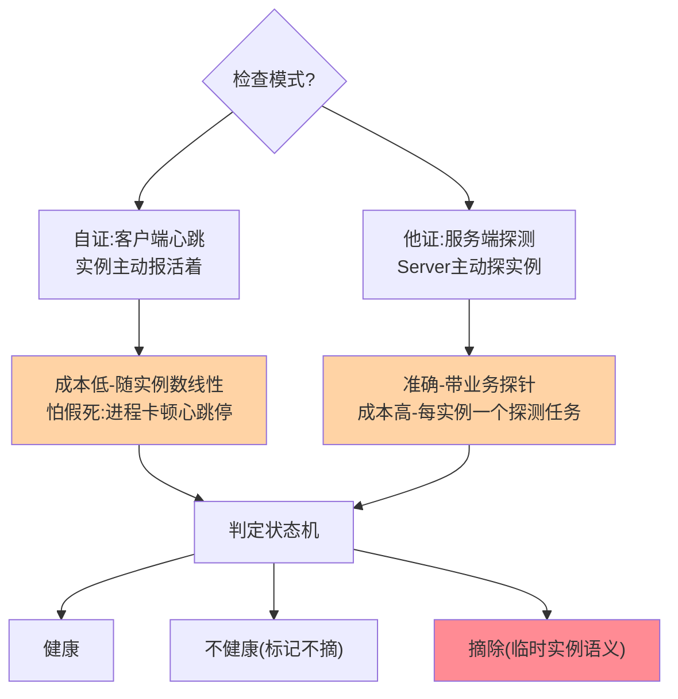
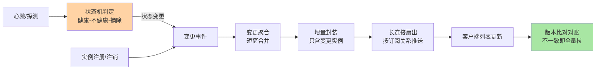
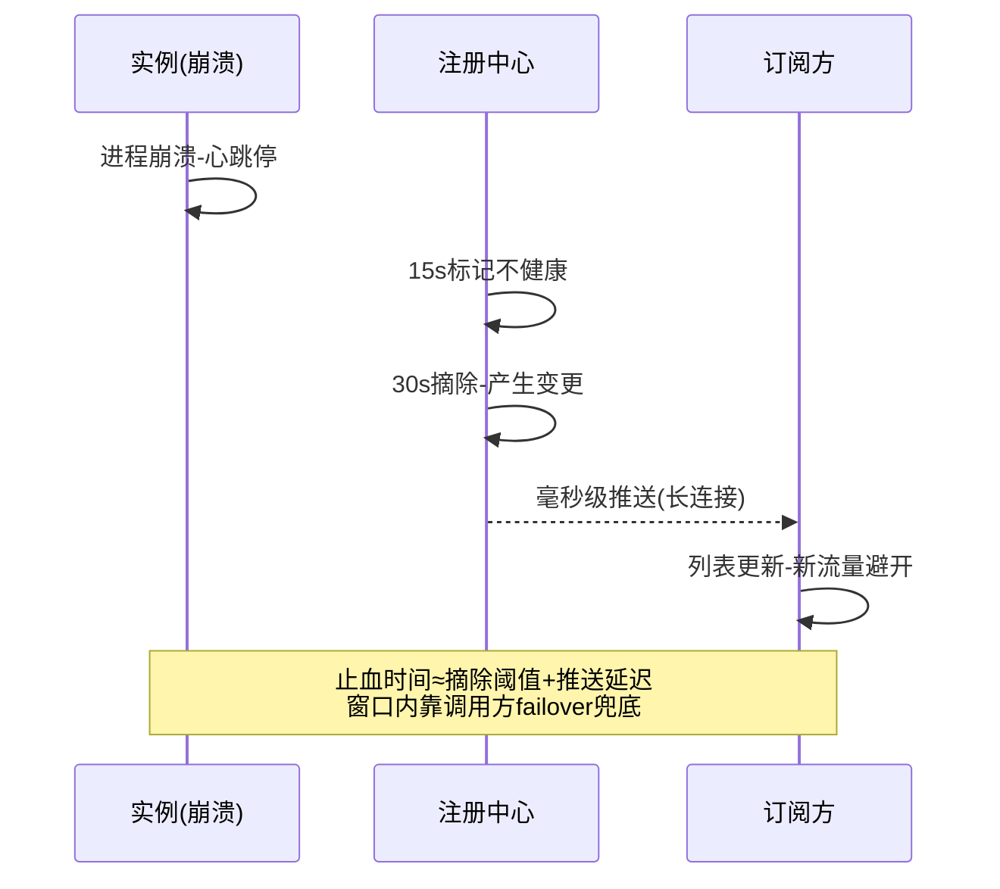

# 订阅推送与健康检查机制深读：变更触达与生死判定的工程真相

> **本文核心**：注册中心的「新鲜度」由两台引擎决定——**订阅推送引擎**（变更从服务端到调用方的触达路径：长轮询→UDP→gRPC 长连接的演进，本质是「触达责任」从客户端向服务端的转移）与**健康检查引擎**（实例生死的判定机制：客户端心跳的「自证模式」与服务端探测的「他证模式」，两种模式的误判方向相反——心跳怕假死漏判、探测怕抖动误杀）。本文拆解两条引擎的关键路径与参数账（心跳间隔×实例数的心跳风暴、推送扇出的放大效应），并用推送丢失、批量误摘、风暴重连三个故障场景钉死工程细节。**机制链**：实例变更 → 变更检测（订阅关系登记）→ 推送扇出（按订阅关系逐客户端触达）→ 客户端列表更新；并行地：心跳续约/服务端探测 → 状态判定（健康/不健康/摘除）→ 触发变更 → 进入推送链路。

## 一句话摘要

推送与检查是一对必须咬合的齿轮：**推送管「把变更送到」，健康检查管「发现变更该送」**——心跳超时判定实例死亡触发摘除事件，摘除事件经推送链路触达全部订阅方，任一环节延迟都直接进入「故障止血时间」。长连接时代（gRPC）把推送延迟压到毫秒级、把心跳并进连接保活，但引入了连接管理这个新的复杂度维度（重连风暴、连接负载均衡）；健康检查的两个模式没有绝对优劣——**自证（心跳）高效但怕假死，他证（探测）准确但成本高**，混合使用（心跳为主、探测兜底关键实例）是生产常态。

## 前置阅读

- 本系列篇 1《注册中心一致性协议》（数据与协议分派）
- Nacos 篇 3《服务注册与发现》（四机制入门层）
- RPC 篇 6《服务发现与注册中心》（调用方视角）

## 目标导向

本文是什么：推送链路与健康检查的实现级深读。功能：计算心跳与推送的容量账、设计检查参数、归因触达类故障。收益：发现链路的容量规划与故障止血能力。必看场景：万级实例规模设计、发布抖动排查、误摘事故复盘。

## 一、推送引擎的三代演进：触达责任的转移

订阅推送的每一代机制都回答同一个问题：「**变更发生后，谁负责让订阅方知道**」：

**第一代：客户端轮询（长轮询）**——客户端定期问「我订阅的数据有变更吗」，服务端把请求挂起直到有变更或超时。触达责任在客户端（要不停问），延迟下限是网络 RTT（变更即刻返回）、上限是轮询间隔；**代价在服务端的挂起连接管理**与客户端的空轮询开销——订阅方数量大时空轮询本身就是流量。

**第二代：UDP 推送+定时拉兜底**——服务端变更时主动 UDP 推送，丢失靠客户端定时全量拉兜底。「推为主拉兜底」的双轨制把延迟压到亚秒，代价是 UDP 不可靠带来的「兜底拉取」长期存在，双轨的容量与代码复杂度都要养。

**第三代：gRPC 长连接（2.x 形态）**——连接常驻、双向流，变更即推（毫秒级）、可靠有序；心跳并入连接保活（应用级心跳消失，连接级心跳接管）。**三代演进的本质是触达责任从客户端逐步转移给服务端**：轮询时代客户端主动问、双轨时代服务端推+客户端兜、长连接时代服务端全责。责任转移的收益是延迟逐代下降与无效开销逐代消失，代价是服务端从「被动应答者」变成「连接管理者」——连接的建立风暴、断线重连、负载均衡成为新的工程面。

**业内生产实践的分界线**可以概括为：万级订阅方以内三代都够用（选型看运维能力）；十万级订阅方基本只剩长连接一条路（轮询与双轨的服务端成本不可行）——**订阅方规模是推送选型的第一变量**。

## 5W 速记卡

| 维度 | 一句话 |
|---|---|
| What | 变更触达（推送三代演进）与生死判定（心跳/探测两模式）的机制与参数账 |
| Why | 两者咬合决定发现链路的「新鲜度」与故障止血时间 |
| When | 容量规划、发布抖动排查、误摘与推送丢失复盘 |
| Where | 注册中心服务端推送/检查模块 + 客户端订阅与保活 |
| How | 变更检测 → 订阅关系扇出 → 长连接推送；心跳续约/主动探测 → 状态机判定 → 摘除事件 |

## 二、健康检查的两模式：自证与他证

**自证模式（心跳）的参数账**：心跳间隔 5 秒、不健康阈值 15 秒（3 次缺失）、摘除阈值 30 秒（6 次缺失）是 Nacos 的默认档——这三个数字构成「死亡确认时间 ≈30 秒」的默认止血上限。**容量账**：心跳 QPS = 实例数 ÷ 心跳间隔，1 万实例 × 每 5 秒 = 每秒 2000 次心跳——间隔减半翻倍负载；**误判方向**：进程假死（Full GC、CPU 饿死心跳线程）时心跳停，实例被误摘——但实例真死了心跳必然停，**不漏判、可能误判**，AP 的取向是宁可错摘（下游容错兜底）。

**他证模式（服务端探测）的代价与精度**：探测有业务语义自由度（TCP 端口连通/HTTP 健康端点/深度探针），判「死」更准（真探到业务层）；成本是每实例一个探测任务的调度与网络开销，万级实例的探测风暴同样要算账。**误判方向与心跳相反**：探测依赖网络路径，网络抖动会误杀健康实例——**他证怕误杀，自证怕漏判假死**。混合策略的落位：弹性微服务用心跳（成本低、配合调用方容错），固定关键成员（数据库代理、网关）用探测（误杀代价高，值得花探测成本），双保险（心跳+低频探测复核）用于核心链路——**检查模式的选型跟着「误判代价」走**。

**状态机的语义分级**常被忽略：「健康/不健康/摘除」是三态不是两态——Nacos 持久实例检查失败只标「不健康」不摘除（列表里保留并带标记，调用方按标记过滤），临时实例三档超时后摘除（列表里消失）——**「标记不摘」与「摘除」是两种给调用方的语义**，前者保留了「实例还在、可能回来」的信息，后者是彻底遗忘。接口消费侧要显式处理这两态，混用语义是过滤 bug 的温床。

## 三、推送扇出与订阅关系：容量账的第二层

变更触达的成本结构是「变更频率 × 订阅扇出」：一次实例变更要推给该服务的全部订阅方——**热点服务（被几百个服务调用）的一次变更就是几百次推送**。扇出账的具体形态：1 万订阅方 × 每日 100 次变更 = 每日百万级推送，峰值期（批量发布）的瞬时扇出是容量设计的核心场景。业内生产实践的两个扇出优化：**增量推送**（只推变更的实例而不是全量列表，报文从 O(N) 降为 O(变更数)）与**变更聚合**（短窗口内的连续变更合并为一次推送，发布风暴下避免推送洪水）——两者把扇出成本压一个量级。

**推送丢失的兜底责任链**：长连接推送理论可靠，但「连接半死」（TCP 缓冲满、对端假死）时推送悄悄丢——客户端的**版本比对对账**是最终防线（定期或按次比对列表版本，不一致即全量拉取），把「可能丢」收敛为「最多延迟」。调用方视角的对称机制是本地快照（互指 RPC 篇 6）——**服务端对账+客户端快照，双端兜底才构成完整的最终一致**。

### 推送与检查的咬合全景

全景图把两台引擎串成一条流水线：左侧的判定引擎产出「变更事件」，右侧的触达引擎把它送到订阅方——任何一段的延迟都进入止血时间，任何一段的丢失都有下一站的兜底。

### 摘除止血的端到端时序

止血时序是健康检查参数调优的靶图：缩短摘除阈值=缩短第一段，长连接已把第二段压到毫秒——剩下的优化空间全在「误摘代价」与「阈值」的约束求解里。

## 四、与消息队列推送的区别：扇出语义与保序要求

| 维度 | 注册中心订阅推送 | MQ 推送消费 |
|---|---|---|
| 扇出语义 | 快照语义（最新状态覆盖） | 事件语义（逐条不丢） |
| 保序要求 | 无（只关心最新） | 按业务要求 |
| 丢失代价 | 可兜底（版本对账补拉） | 语义性丢失（不可补） |
| 积压含义 | 无意义（旧状态过期） | 待处理业务 |

订阅推送传播的是「状态快照」，旧状态被新状态覆盖是正常语义（积压的旧推送可直接丢弃）；MQ 传播的是「事件」，每条都有业务价值——**「状态 vs 事件」的语义差异决定了两者的可靠性设计方向**：注册推送可以激进丢（对账兜底），MQ 必须保守存（持久化+确认）。设计推送系统时先问这个语义问题，避免把 MQ 的可靠性开销错搬到状态推送上。

## 五、典型场景与误区

**典型场景**：滚动发布的触达链路（注销→摘除→推送→订阅方更新，四段延迟构成发布平滑度）；批量发布/扩容的推送风暴（聚合窗口+增量推送扛扇出峰值）；核心服务的心跳调优（缩短摘除阈值加快止血 vs 心跳成本与误摘率的平衡）；混合部署的探测兜底（关键成员双保险检查）。

**常见误区**：① **心跳参数全局一刀切**——核心服务与边缘服务用同一组心跳参数，前者要快摘（止血优先）后者要防误摘（成本优先）——按服务分级配置；② **推送延迟只监控服务端**——「变更提交→客户端生效」的端到端延迟才是业务感知的指标，服务端推送成功≠订阅方列表已更新；③ **忽略连接重连风暴**——注册中心重启时万级客户端同时重连（无退避），连接风暴把刚恢复的服务再次打垮——客户端重连退避与服务端就绪门控（同步完成后才接受连接）是标配；④ **把健康检查当 SLA 监控**——检查结果是一比特生死判定，与 SLO 级监控（错误率/延迟分位）语义不同层，互相不能替代；⑤ **摘除后不做事件审计**——谁在何时被谁摘除（心跳超时/探测失败/手动）没有留痕，误摘事故无从复盘。

## 六、事故与实践叙事

**事故一：注册中心重启引发重连雪崩**。某团队升级注册中心，滚动重启第一个节点——10 万客户端连接瞬间断开，重连逻辑无退避全量涌向第二节点，第二节点 CPU 打满同步失败，客户端判定不可用继续重试——三节点集群在「计划内逐台重启」中雪崩，服务发现中断两分钟。修复三件套：客户端重连指数退避+抖动、服务端就绪门控（数据同步完成前不接入）、重启演练制度化。**追问链**：为什么「逐台重启」的计划反而触发雪崩？——计划假设了「断开的是这一台」，实际断开的是「连在这台上的一切」，重连行为把局部操作放大为全局事件——**容量规划必须把「故障转移的瞬时行为」算进去，静态水位不够**。

**事故二：心跳线程饿死导致的批量误摘**。某服务高峰期 Full GC 频发，GC 停顿 20 秒级别的时段里心跳线程停摆，注册中心按 30 秒阈值批量摘除——摘除推送后调用方流量集中到剩余实例，剩余实例压力增大 GC 更频繁，连锁误摘，服务容量雪崩式缩水。修复与沉淀：心跳线程独立化+高优先级（防业务线程饿死）、摘除事件与 GC 事件关联告警（识别「假死型误摘」的指纹）、容量水位预警（GC 频率抬升先于误摘）。**教训的抽象**：心跳的「自证」前提是客户端有能力按时自证——**把保活线程与业务负载隔离，是自证模式的隐性前提**。

**实践叙事：端到端新鲜度的度量体系**。某平台把「新鲜度」拆成三段可测指标并常态化监控：摘除确认延迟（实例死→服务端判定）、推送延迟（判定→客户端收到）、生效延迟（客户端收到→业务代码使用）——三段分别打点后，一次「发布后流量切换慢」的问题被定位到第三段（客户端回调队列积压），前两段完全正常。**分段度量让「新鲜度」从感觉变成可归因的账**——这是发现链路可观测化的最小完整集。

## 七、设计思想：触达与判定的责任分配

推送与检查两台引擎的责任边界，遵循本系列篇 1 已立的原则的延伸——「**谁的信息谁上报，谁的损失谁兜底**」：实例生死由实例自己上报（自证），因为只有它最清楚自己活着；触达完整性由客户端对账兜底，因为只有订阅方在意自己是否最新；服务端居中做扇出与判定，把「不可替代的交换所」做厚。这个责任分配的稳健性在于：**任何一端失职都有另一端的机制兜住**（心跳停了有探测复核、推送丢了有版本对账）——分布式系统的健壮性从来不靠单点正确，靠的是「互相校验的冗余设计」。把这条原则记进设计直觉，新系统的责任分配就有了出发点。

## 八、追问链

**质疑者第一层**：既然有版本对账兜底，推送还要做这么可靠吗？——可靠推送决定「常态延迟」，对账兜底决定「最坏延迟」：推送可靠时对账是低频巡检（成本可忽略），推送不可靠时对账变成高频补偿（兜底流量成为主要成本）——**兜底机制的定位是保险不是常态**，常态依赖兜底的系统成本结构与延迟表现都会劣化。「推为主、拉为兜」到「推为实、拉为核」的演进就是这条权衡的工程化。

**质疑者第二层**：健康检查为什么不统一用业务深度探针（他证）一劳永逸？——深度探针的成本随实例数线性增长且探测本身有副作用（探测流量挤占业务容量），万级实例的深度探测是可观的常驻开销；心跳的「零服务端探测成本」换来假死误判，这笔交换在弹性实例上划算——**检查深度的选择本质是「实例价值密度」的函数**：实例越多越便宜、单个越关键越要深探。

**质疑者第三层**：推送延迟已经毫秒级，摘除阈值还有必要 30 秒那么保守吗？——摘除阈值的两难在「误摘代价」不在推送速度：阈值缩短到 10 秒，一次 GC 停顿（15 秒级在高峰不算罕见）就是误摘；30 秒的保守是给「进程假死但会自愈」留的自愈窗口——**阈值的下界由最长的良性停顿决定，上界由业务可接受的止血时间决定**，两个约束的交集通常就是二三十秒——这不是保守，是约束求解的结果。

## 九、你们可能会问

**Q1：怎么给核心服务设计心跳参数？**
按止血目标倒推：业务能接受 N 秒止血 → 摘除阈值 ≤ N → 心跳间隔 = 摘除阈值/6（三档参数的经典比例）→ 验证心跳 QPS 在服务端容量内、验证最长良性停顿 < 不健康阈值。参数表按服务分级维护，不搞全站一档。

**Q2：推送风暴（批量发布）怎么扛？**
三招：变更聚合（短窗合并，发布脚本配合错峰）、增量推送（只推变更实例）、扇出削峰（订阅方分组错批推送）。容量设计按「最大单次发布涉及的实例数×其订阅扇出」的峰值场景算，不按日均。

**Q3：连接保活和心跳什么关系？**
长连接形态下连接层保活（TCP keepalive 或 gRPC 层 ping）替代了应用级心跳的「通道保活」职能，但「实例活性自证」的语义仍在——连接活着不代表业务线程健康（假死连接问题依旧），所以连接保活+轻量应用活性信号（可选的应用级心跳或请求成功率旁证）是完整方案。

**Q4：摘除事件要不要通知业务方？**
要——摘除事件流（谁、何时、原因）接入运维事件总线，下游做三件事：调用方熔断联动（提前于流量失败感知）、容量告警（可用实例数骤降）、事后审计（误摘复盘的证据链）。事件化让注册中心从「黑盒判定」变成「可编排的治理信号源」。

## 💡 实战提示

- 💡 心跳线程与业务线程隔离+高优先级——假死型误摘的根因预防（GC 停顿不再停摆保活）
- 💡 客户端重连必配指数退避+抖动，服务端就绪门控——重启演练里见真章
- 💡 新鲜度度量三段拆：摘除确认延迟、推送延迟、生效延迟——分段打点才能归因
- 💡 决策口径：弹性实例用心跳自证、关键成员用探测他证、核心链路双保险；检查参数按服务分级不全站一刀切
- 💡 选型推荐：十万级订阅方直接长连接形态（三代中唯一可持续的选择），小规模可从双轨起步

## 十、自测三问

1. 推送三代演进的责任转移主线？（答：长轮询客户端问→UDP 推拉双轨→gRPC 长连接服务端全责——延迟逐代降，服务端从应答者变连接管理者）
2. 自证与他证的误判方向？（答：心跳自证怕假死漏判偏误摘、探测他证怕网络抖动误杀——按误判代价选模式，关键成员双保险）
3. 扇出成本的两把优化刀？（答：增量推送（O(N)→O(变更数)）+变更聚合（短窗合并）——按「变更频率×订阅扇出」的账决定上不上）

## 十一、开放问题

- 连接时代的服务端容量模型标准化——连接数/重连风暴/扇出的联合容量公式尚无行业共识，各家实现自建。
- 业务活性信号的接入标准——请求成功率等旁证参与生死判定（降低假死误摘）的协议化。

## 📎 核心带走

- **核心一句话**：推送管「送到」、检查管「发现该送」——长连接把触达责任收归服务端，心跳/探测的双模式按误判代价选，端到端新鲜度靠服务端对账+客户端快照双兜底
- **机制链**：实例变更/心跳超时 → 状态机判定（健康/不健康/摘除）→ 订阅关系扇出（增量+聚合）→ 长连接推送 → 客户端版本对账 → 列表更新生效
- **失效点/边界**：心跳前提是保活线程不被业务饿死；重连无退避=雪崩；扇出按峰值发布场景算不按日均；推送成功≠生效——端到端分段度量才算数

## 📌 数据与事实声明

- 写于 2026-09-15，机制以 Nacos 2.x 官方文档与公开设计资料为基准（公开口径）；心跳默认参数与延迟量级为公开口径
- 免责：具体参数与指标名以所用版本官方文档为准

## 📚 参考资料

| 类型 | 标题 | 来源 |
|---|---|---|
| 官方文档 | Nacos 2.x 连接模型与推送 | nacos.io |
| 关联文章 | 本系列篇 1（一致性协议）、Nacos 篇 3（注册发现入门）、RPC 篇 6（调用方视角） | 本仓库 |
| 原理书 | 《数据密集型应用系统设计》DDIA（复制与一致性章节） | 公开出版 |
