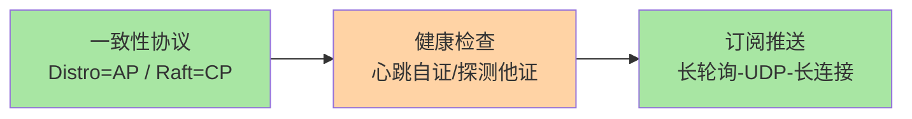
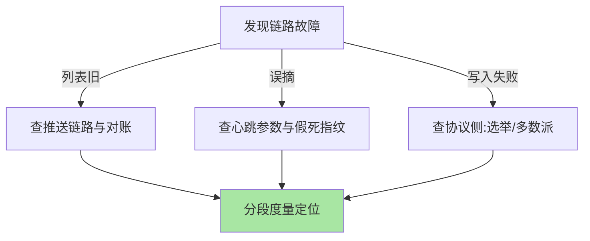
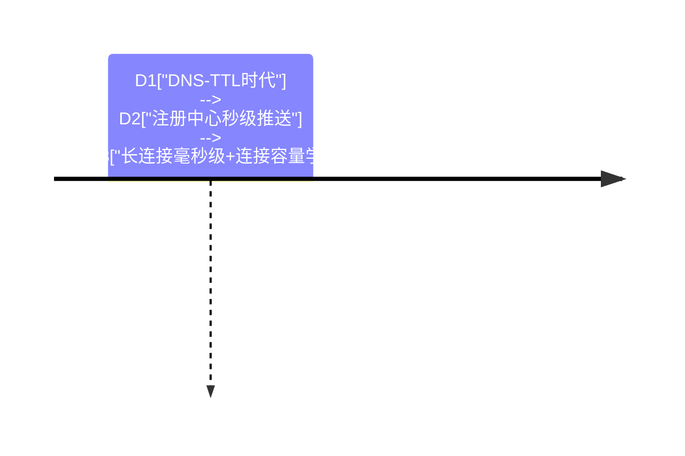

# 深入理解服务发现系列：一致性与新鲜度

> **本文核心**：服务发现的两个核心问题各配一台引擎——「数据一致吗」由一致性协议回答（Distro 与 Raft 按数据定价分派），「数据新鲜吗」由推送与检查双引擎回答（触达责任演进+生死判定两模式）。本系列两篇深读，把协议行为落到故障时间线、把参数账算到实例规模。

## 一句话摘要

AP 与 CP 不是站队是定价，推送与检查不是并列是咬合——**发现链路的每个机制选择都有明确的账可算**。

## 篇目

1. [注册中心一致性协议：Distro 与 Raft](1_注册中心一致性协议-Distro与Raft-深度.md)——数据定价框架、分区时间线、代价清单
2. [订阅推送与健康检查机制](2_订阅推送与健康检查机制-深度.md)——推送三代演进、检查两模式、扇出账

## 发现机制的演进账

发现链路的两个引擎在相向演进：一致性侧「按数据定价」的双协议结构成为主流（Nacos 范式），触达侧长连接形态成为唯一可持续路线——**五年尺度看，发现层的竞争焦点从「功能有无」转向「规模经济学」**（连接数、扇出、对账成本的联合优化）。机制内核（续约-判定-扇出-对账）则跨周期稳定，读完可以迁移到任何一代实现。

## 📌 数据与事实声明

- 写于 2026-09-15，以 Raft 论文与 Nacos 官方文档为基准（公开口径）

## 📚 参考资料

| 类型 | 标题 | 来源 |
|---|---|---|
| 原理论文 | Raft Consensus | raft.github.io |
