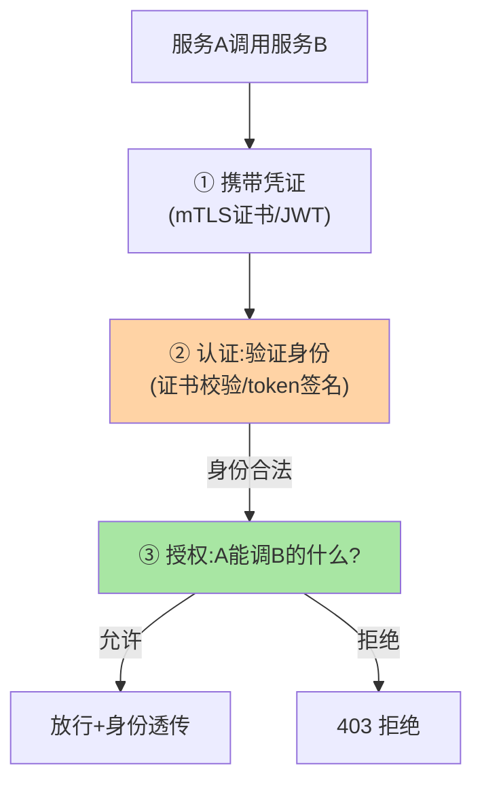
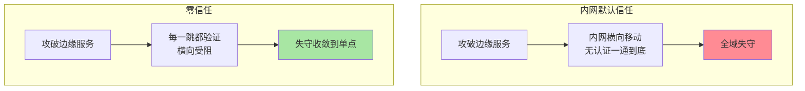

# 服务鉴权是什么：服务间不再默认信任

> 一句话：服务鉴权是**服务间调用的身份验证与访问控制**——「内网 = 可信」的默认假设被零信任取代，每个调用都要回答「你是谁（认证）」与「你被允许吗（授权）」。

> **本文核心**：为什么需要——内网渗透的连锁效应（攻破一个服务 = 横向移动到全部服务，因为内网默认互信）；合规要求（等保/行业审计的服务间访问控制条款）。**机制链**：调用发起 → 身份凭证携带 → 认证校验（你是谁）→ 授权判定（能调吗）→ 放行/拒绝——认证收拢（网关/网格）与授权下沉（业务语义）分层（互指 gateway 篇 6）。

## 一句话摘要

鉴权的两大命题：**认证（Authentication）**——验证调用方身份（mTLS 证书/token 校验），解决「你是谁」；**授权（Authorization）**——判定访问权限（服务级白名单到接口级细粒度），解决「你能干什么」。零信任（Never Trust, Always Verify）的落点：内网调用同样携带凭证、同样验证——**信任从「网络位置」迁移到「身份与凭证」**。实现形态三层：框架层（SDK 拦截器）、网关层（入口统一认证）、网格层（sidecar 透明 mTLS）——形态随架构演进，机制不变。

## 一、为什么「内网可信」的默认假设崩塌

传统内网信任的攻击链：外部攻破边缘服务 → 内网横向移动（无认证，一通到底）→ 拖走核心数据——**内网信任把「单点失守」放大为「全域失守」**。行业公开的多次大型数据泄露事件中，横向移动是共同路径——这是零信任理念兴起的直接动因。服务鉴权 = 把横向移动的每一跳都加上验证：**失守范围从「全域」收敛到「单点」**。

## 5W 速记卡

| 维度 | 一句话 |
|---|---|
| What | 服务间调用的认证（身份）与授权（权限）机制 |
| Why | 内网默认信任使单点失守放大为全域失守 |
| When | 服务间调用、跨部门调用、对外暴露服务的内部段 |
| Where | 网关/SDK/服务网格三层承载 |
| How | 凭证携带 → 认证校验 → 授权判定 → 身份透传 |

## 二、认证授权的分层全景

**授权粒度的取舍**：服务级白名单（A 在 B 的调用方名单里即可——粗、易管理）→ 接口级（A 只能调 B 的读接口——细、维护成本高）→ 数据级（B 内部按 A 的身份过滤数据——通常在服务内实现）。**粗细与成本的权衡**按安全等级定：核心数据服务接口级起步，一般内部服务服务级白名单兜底。

## 三、与用户鉴权的区别：两类鉴权对照

| 维度 | 服务间鉴权（本篇） | 用户鉴权（C 端登录态） |
|---|---|---|
| 身份主体 | 服务/工作负载 | 人（用户账号） |
| 凭证形态 | 证书/服务 token | 登录态 Cookie/JWT |
| 生命周期 | 长期（证书轮换以年月计） | 会话级（小时天级） |
| 授权语义 | 服务调用白名单 | 功能与数据权限 |

两类鉴权在同一请求中叠加：用户身份（端到端透传）+ 服务身份（每一跳验证）——**双重身份、双重验证**是完整链路（互指 gateway 篇 6 的透传原则）。

内网信任与零信任的对比：

## 四、典型场景与误区

**典型场景**：核心数据服务白名单化（只有交易域服务可调用户数据服务）、跨部门调用治理（跨部门的调用必须走申请与凭证发放）、对外暴露服务的内网段加固（边缘服务的内网出向调用同样验证）。

**误区与不适用**：① 鉴权 = 网关加个 token 校验——token 校验只是认证，授权（谁允许调）与凭证管理（发放/轮换/吊销）才是体系的大头；② 一次建设永久有效——凭证轮换、权限变更、服务上下线的鉴权治理是持续运营；③ 内网服务全部上 mTLS——改造有成本，按数据敏感度分级推进（核心数据服务先行）。

## 五、💡 实战提示

- 💡 推进决策口径：何时用什么——核心数据服务 mTLS+白名单先行，一般服务短期 token+服务级授权，公开只读服务可最后覆盖：谁在调谁——没有调用关系台账的鉴权无从做起
- 💡 分级推进：核心数据服务 mTLS + 白名单，一般服务 token 认证 + 服务级授权
- 💡 凭证轮换自动化先行于全面铺开——手工轮换的凭证体系撑不过半年

## 六、你们可能会问

**Q1：服务鉴权和 API Key 什么关系？**
API Key 是最简单的凭证形态（静态字符串）——易用但泄露风险高、无轮换语义；mTLS/短期 token 是演进方向。API Key 适合低敏感场景，核心链路不建议。

**Q2：K8s 环境的服务账号（ServiceAccount）够用吗？**
K8s SA + NetworkPolicy 提供了平台层的身份与网络隔离基座——应用层鉴权在其上按需叠加；「平台基座 + 应用细化」的组合是云原生形态的标准答案（互指 K8s 系列）。

**Q3：鉴权失败的用户体验？**
服务间鉴权失败对终端用户通常是「功能不可用」——拒绝策略（快速失败给明确错误 vs 降级到只读）按业务语义定，且拒绝要有监控（鉴权拒绝率突增 = 配置错误或攻击）。

## 七、开放问题

- SPIFFE/SPIRE 类「服务身份标准」（统一的工作负载身份与证书管理）在推进跨平台的服务身份互认，身份联邦是零信任落地的下一站。

## 八、自测三问

1. 认证与授权的分工？为什么授权要下沉？
2. 「内网信任崩塌」的攻击链逻辑？
3. 两类鉴权（服务间/用户）在同一请求中如何叠加？

## 📎 核心带走

- **核心一句话**：服务鉴权 = 服务间调用的认证（你是谁）+ 授权（你被允许吗），信任从网络位置迁移到身份凭证
- **机制链**：调用 → 凭证携带 → 认证校验 → 授权判定 → 放行透传 / 拒绝
- **失效点/边界**：token 校验只是认证的一角；凭证轮换是持续运营；按敏感度分级推进不搞一刀切

## 📌 数据与事实声明

- 写于 2026-09-08，零信任理念为业界公开共识口径
- 免责：以各框架与安全产品官方文档为准

## 📚 参考资料

| 类型 | 标题 | 来源 |
|---|---|---|
| 关联系列 | 本仓库 gateway 系列 / K8s 系列 | docs/ |
| 公开标准 | SPIFFE/SPIRE、零信任 NIST 口径 | spiffe.io、nist.gov（公开） |
| 社区沉淀 | 服务鉴权公开实践 | 技术社区公开文章 |
