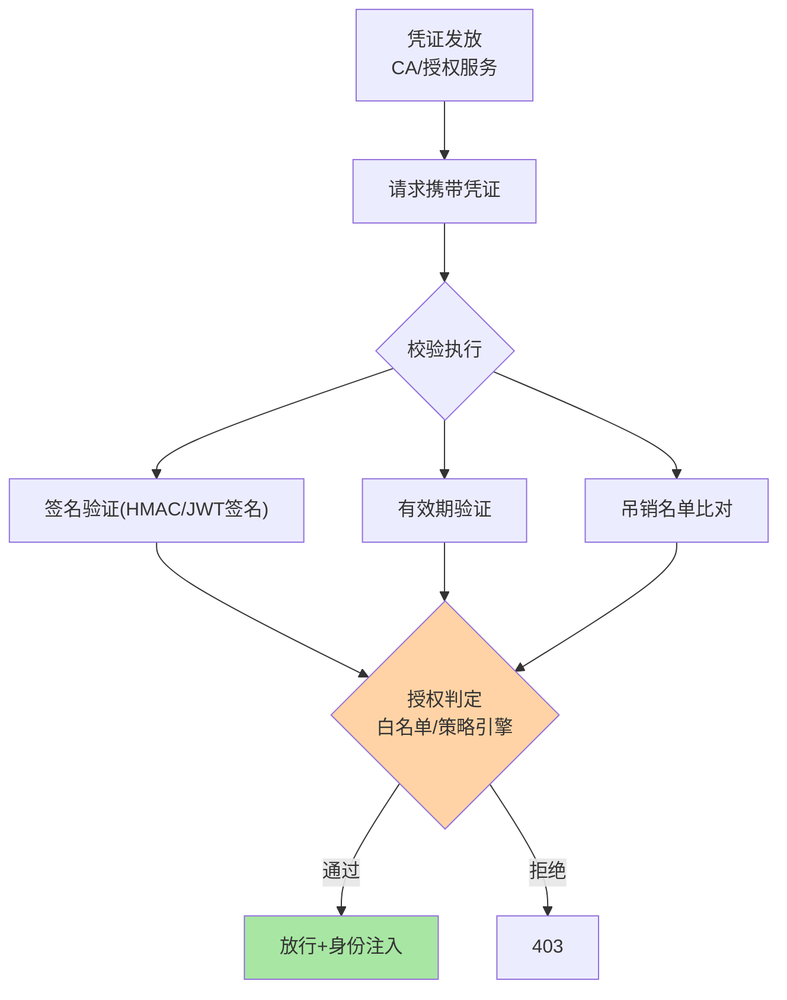
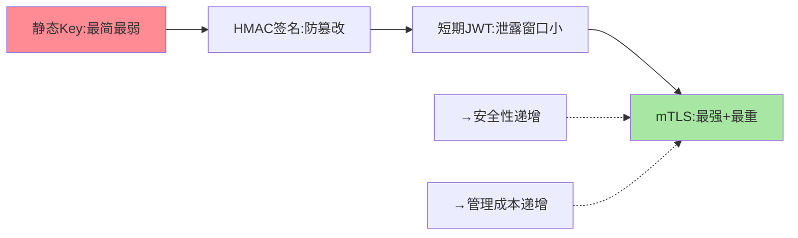

# 认证与授权机制：服务间凭证的发放、校验与判定

> 篇 1 立了认证/授权的分工，这篇深入机制：**凭证的形态与生命周期**（mTLS 证书/静态 token/短期 token）、**校验的执行点**（SDK/网关/网格）、**授权的判定模型**（白名单/策略引擎）。

> **本文核心**：凭证谱系按「安全性 × 管理成本」排布——静态 API Key（最简最弱）→ 签名请求（HMAC，防篡改）→ 短期 token（JWT/OAuth2 client_credentials，泄露窗口小）→ mTLS 证书（双向身份 + 加密，最强）。**机制链**：凭证发放（CA/授权服务） → 请求携带 → 校验执行（签名/有效期/吊销） → 授权判定（策略匹配） → 结果。**吊销与轮换**是凭证体系的成人礼：短期 token 天然缓解吊销难题，长期凭证必须有吊销机制。

## 一句话摘要

三类凭证的取舍：**静态 Key**——发放即长期有效，泄露窗口无限，仅适合低敏感场景；**HMAC 签名**——请求参数 + 密钥计算签名（密钥不传输、防篡改防重放需加时间戳），实现中等；**短期 token（JWT）**——授权服务签发、自带有效期与身份声明（payload），过期自然失效（吊销靠黑名单或短有效期），泄露窗口小；**mTLS**——双向证书认证 + 通道加密一体，安全最强、证书管理（发放/轮换/吊销）最重（篇 3 展开）。授权判定模型：**白名单**（调用方名单内放行，配置化管理）到**策略引擎**（OPA 类，策略即代码，细粒度可编程）——粒度与治理成本同向。

## 一、为什么凭证的「生命周期」是核心

凭证泄露不可避免（代码仓库、日志、内存转储都可能泄），**泄露的损失 = 泄露窗口 × 权限大小**——静态 Key 的窗口无限（除非人工发现轮换），短期 token 窗口是分钟级（过期即废）。凭证体系的设计本质就是压缩泄露窗口：短有效期（token）、自动轮换（证书）、即时吊销（黑名单）——三个手段都是「生命周期管理」的变形。

## 5W 速记卡

| 维度 | 一句话 |
|---|---|
| What | 凭证谱系（Key/签名/JWT/mTLS）+ 校验执行点 + 授权判定模型 |
| Why | 凭证生命周期决定泄露窗口，是安全性的核心变量 |
| When | 鉴权方案设计、凭证泄露应急、授权粒度评审 |
| Where | 授权服务 + SDK/网关校验点 + 策略引擎 |
| How | 发放 → 携带 → 校验（签名/有效期/吊销） → 策略判定 |

## 二、凭证谱系与校验链路

**校验执行点的选择**：SDK 内校验（每服务集成，性能好）vs 网关集中校验（一次校验全站信任，但内部东西向流量绕过网关）vs 网格 sidecar 校验（透明、全流量覆盖）——**覆盖面与侵入性的权衡**；多数组织的路径：网关校验南北向 + 网格/mTLS 补东西向。

## 三、与用户会话鉴权的区别：机制对照

| 维度 | 服务间凭证 | 用户会话（互指篇 1 对照） |
|---|---|---|
| 发放方 | CA/授权服务（机器对机器） | 登录服务（人对机器） |
| 交互性 | 无人工参与（自动续期） | 登录交互 |
| 吊销 | 名单/短有效期（自动化） | 踢出会话（可人工） |

服务间凭证「全自动生命周期」（发放/续期/轮换无人工）是它与用户会话的本质差异——**自动化程度不够的凭证体系注定失修**。

凭证谱系的安全-成本排布：

## 四、典型场景与误区

**典型场景**：跨部门调用接入（申请 → 发放 client_credentials 凭证 → 白名单登记 → 调用审计）、核心服务 mTLS 化（CA 建设 + 证书发放轮换）、细粒度授权平台化（策略引擎 + 服务调用策略声明）。

**误区与不适用**：① JWT 永不吊销——「JWT 无状态」的代价是无法主动作废，高敏场景必须配短有效期 + 黑名单；② 签名密钥硬编码——密钥进代码仓库等于公开；③ 授权粒度一刀切全接口级——维护成本爆炸，接口级仅用于核心数据服务。

## 五、💡 实战提示

- 💡 凭证选型决策口径：何时用什么——低敏内部用静态 Key 过渡，标准场景短期 JWT，核心链路 mTLS；泄露窗口与敏感度对齐
- 💡 授权判定起步用白名单（配置中心管理，热更），粒度需求上来再引策略引擎
- 💡 凭证全生命周期台账（发放/到期/轮换/吊销）——台账缺失的凭证体系必然有过期雷

## 六、你们可能会问

**Q1：JWT 的 payload 能放权限吗？**
能（claims 携带角色/范围声明，授权判定直接读）——但权限变化要等 token 过期才生效（改权限不即时）；敏感权限判断走实时查询，payload 只放稳定声明。

**Q2：OAuth2 的 client_credentials 模式是什么？**
服务间鉴权的标准 OAuth2 流程——服务用 client_id/secret 向授权服务换 access_token（短期），拿 token 调 API——「短期凭证 + 集中发放」的标准实现，服务间鉴权的推荐起点。

**Q3：校验失败的监控看什么？**
鉴权拒绝率突增两含义：配置错误（凭证轮换没同步）或攻击（伪造调用）——拒绝率是安全与配置健康的双信号看板。

## 七、开放问题

- 工作负载身份的标准化（SPIFFE 的 SVID 证书）与各授权服务的融合推进中，「凭证形态」可能收敛为统一的工作负载身份标准。

## 八、自测三问

1. 四类凭证按「泄露窗口」怎么排？各适合什么场景？
2. JWT 吊销难题的两个缓解手段？
3. 校验执行点三选择的权衡？

## 📎 核心带走

- **核心一句话**：认证授权机制 = 凭证生命周期管理（发放/校验/吊销/轮换）+ 分级授权判定，泄露窗口是安全性的核心变量
- **机制链**：发放 → 携带 → 三重校验（签名/有效期/吊销） → 授权判定 → 放行注入
- **失效点/边界**：静态 Key 无吊销语义；JWT 高敏必配黑名单；接口级授权仅核心服务

## 📌 数据与事实声明

- 写于 2026-09-08，凭证机制以 OAuth2.0/JWT/mTLS 公开标准口径归纳
- 免责：以 RFC 与各产品官方文档为准

## 📚 参考资料

| 类型 | 标题 | 来源 |
|---|---|---|
| 公开标准 | RFC 6749 (OAuth2) / RFC 7519 (JWT) | ietf.org |
| 关联系列 | 本系列篇 3 mTLS / gateway 篇 6 | docs/architecture/service-governance/ |
| 社区沉淀 | 服务间鉴权公开实践 | 技术社区公开文章 |
